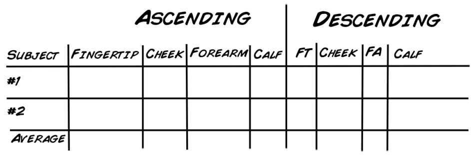

# Experiment: Make your own Homunculus

While you know what you look like, do you know what your nervous system thinks
you look like? Read further and learn how your skin's sensitivity changes how
you will see your body.

Time  1 hour

Difficulty  Intermediate

#### What will you learn?

In this lab you will get to visualize how your somatosensory (touch) cortex
sensitivity varies over certain areas of your body.

##### Prerequisite Labs

  * [Experiment: How Your Skin Senses](skin) \- You should become familiar with how to your skin senses, and how to collect the data required for this lesson.

##### Equipment

* [Results of Skin Experiment](skin)

## Background

If you take a quarter and run its rough edge from your arm to your hand, the
sensation of it changes from smooth to rough. Why is that? Its not like your
arm has no nerves, it can sense things (it knows the quarter is there for
instance), but its much less sensitive than your hand is. If you place the
quarter along your fingertips, for example, you can feel the ridges easily.
This is due to how the somatosensory cortex is laid out. To learn more about
the somatosensory system, take a look at the [How Your Skin Senses](skin)
experiment.

As you can probably sense (pun intended), the somatosensory cortex is
organized into a map that corresponds to locations on the body. This map is
different than a simple picture of your body. For example, a small portion of
cortex is devoted to your arm, while a very large portion is dedicated to your
hand and fingers. You might ask why more area is dedicated to the hand when
your arm is clearly larger? The answer is simply that your hand is more useful
for gathering information than your arm. This is why you can feel such fine
detail with your finger tips, such as the head of the penny, rather than on
your bicep. This odd map, corresponding body part to touch sensitivity, is
called a homunculus, Latin for "little man". This drawing shows that areas of
your body are represented disproportionately in the somatosensory cortex, and
was discovered in 1950 by Canadian neurosurgeon Dr. Penfield of McGill
University. During the 1950's McGill was a very exciting place for
neuroscience, and Dr. Penfield operated on epilepsy patients during open brain
surgery. While these patients were awake, Dr. Penfield would stimulate certain
areas in the somatosensory cortex, and patients would report slight sensations
in different parts of their body. The picture below is of a homunculus, mapped
only for the left cerebral hemisphere.

## Materials

#### For this experiment you need_

  1. The data you collected in the first [Skin Senstivity Experiment](skin)
  2. Access to the Internet 
  3. [This Website](http://www.maxplanckflorida.org/fitzpatricklab/homunculus)

## Procedure

Now that you have taken the measurements from the [Skin Senstivity Experiment](skin)

It's time to see what your Homunculus would look like as a person! The Max
Planck Institute has designed a great website to do just that! Follow the
instructions below, and you will see how your somatosensory system looks like
according to your nervous system.

#### Experiment Steps:

  1. Go to [this website](http://www.maxplanckflorida.org/fitzpatricklab/homunculus/) and choose a model that looks most like you or you like best: 

  2. Add your name, then adjust the settings to be as close to the measurements you wrote down as possible. 

  3. Once you have made your Homunculus, switch with your partner so they can make their own! 

## Questions to Answer and Consider

  1. Why isn't your skin's sensitivity in proportion to the size of the body part? Is it reversed?
  2. How different is your Homunculus from your partner's? Where are they different and where are they the same?
  3. What would happen if your skin sensitivity in your hands stopped working?
