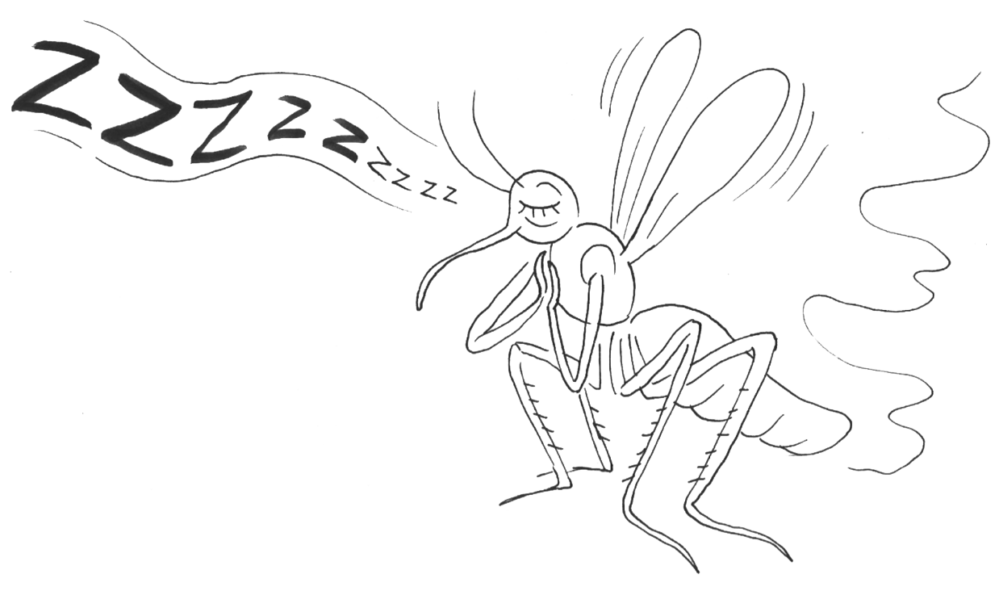
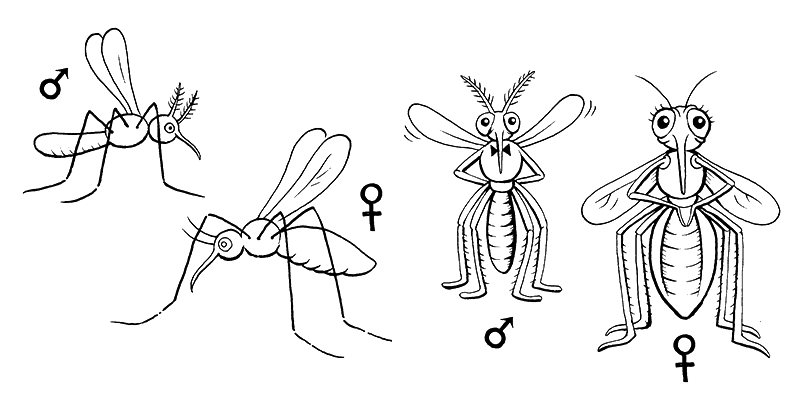
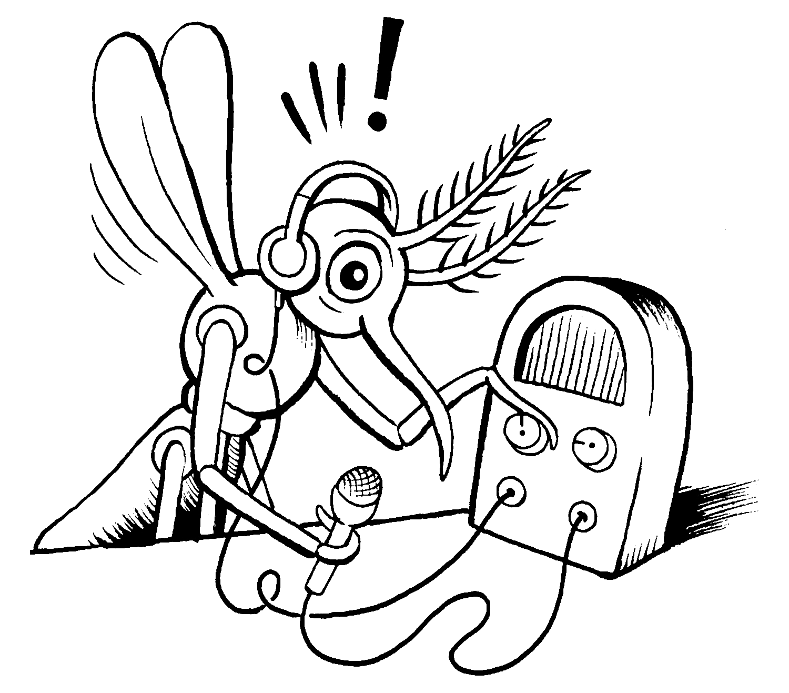
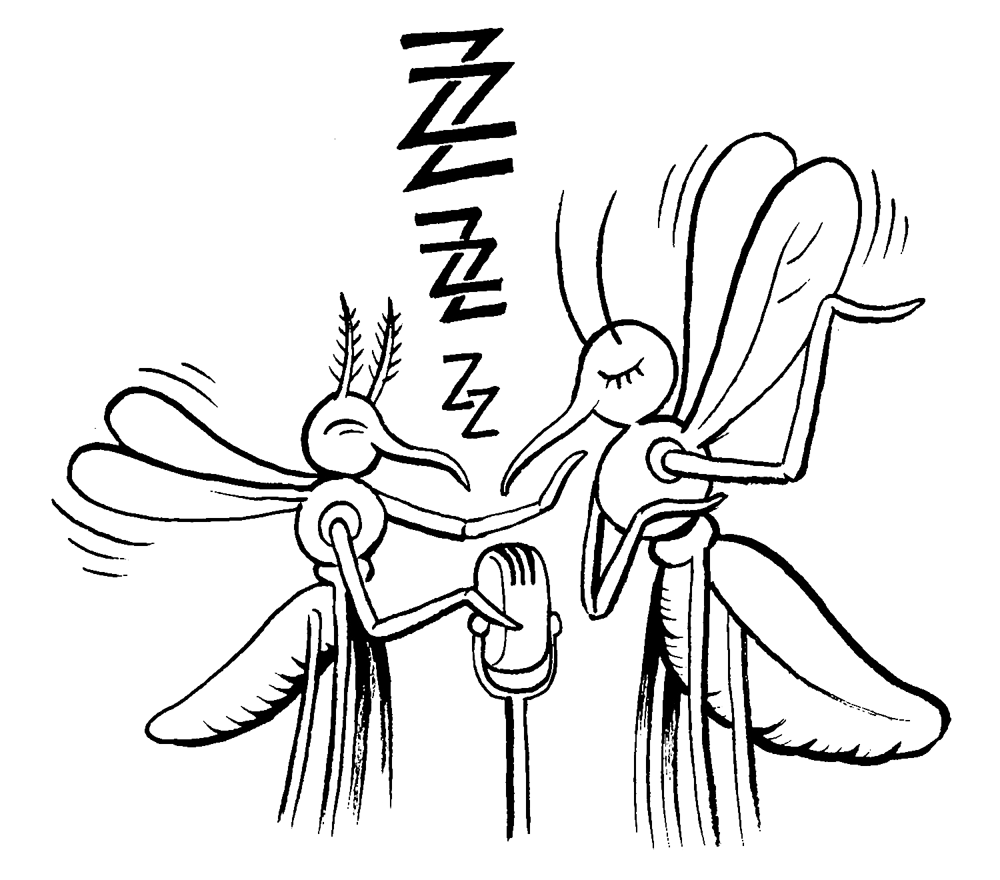
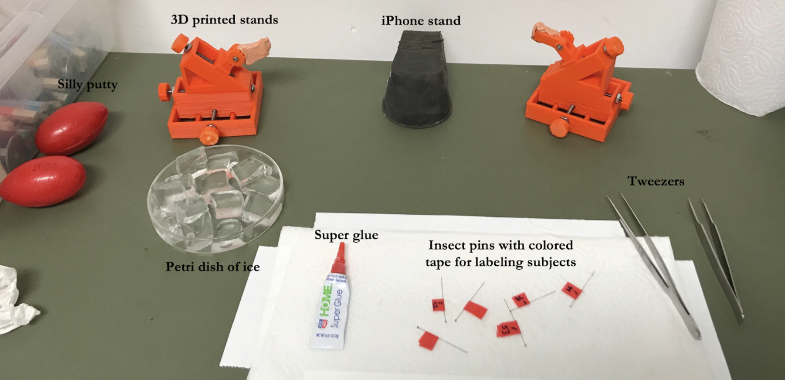
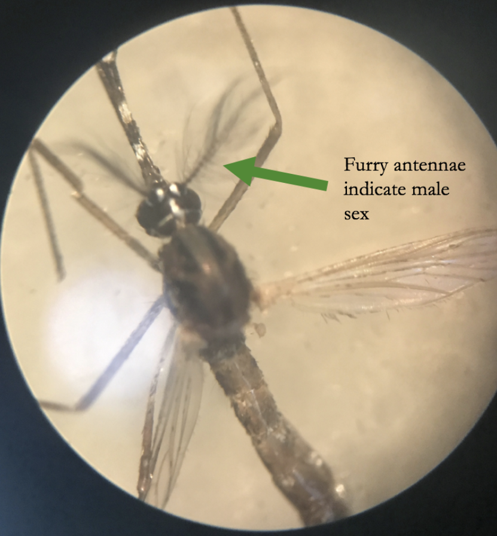
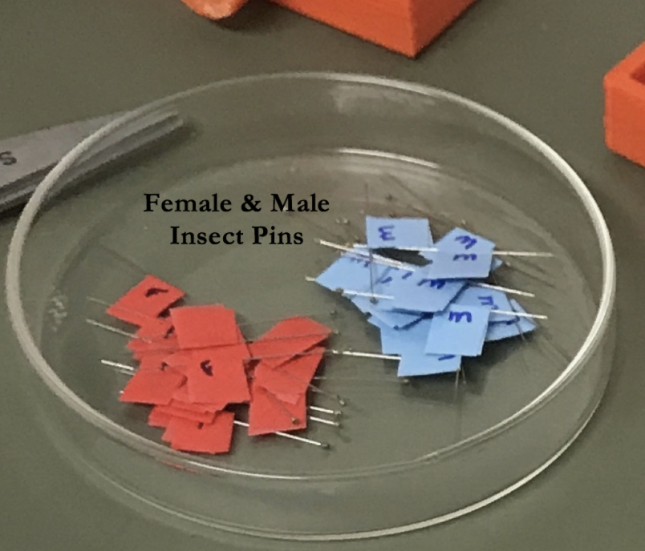
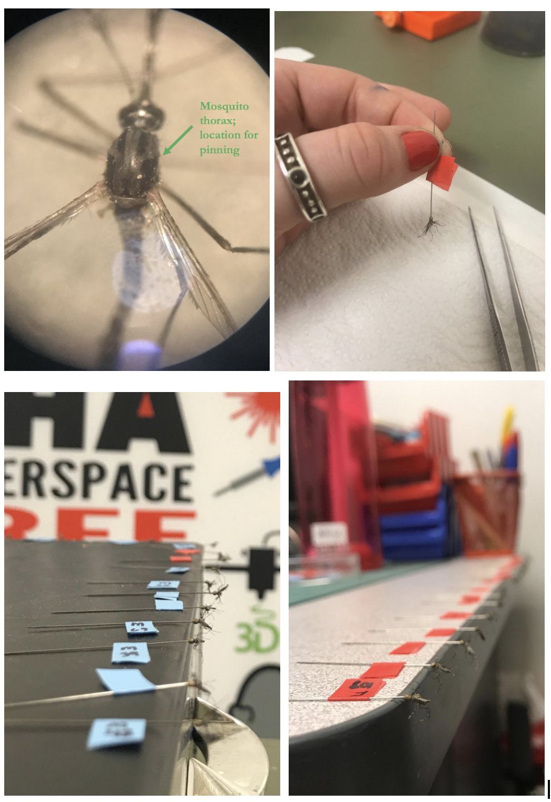
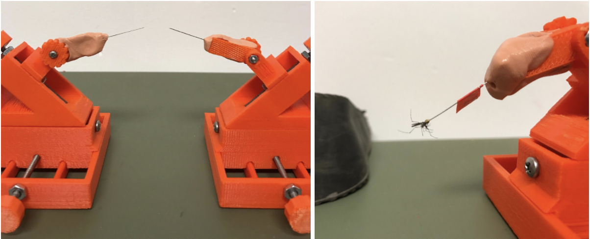
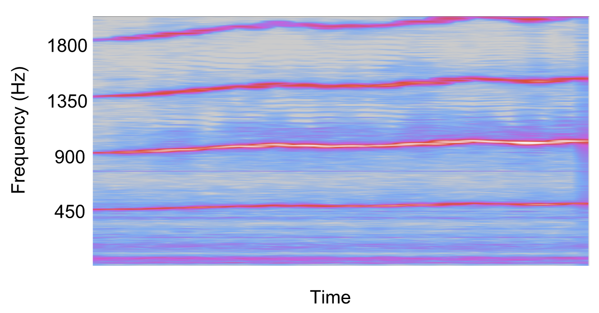

# Experiment_ Mosquito Love Songs

We've all heard the annoying sound of a mosquito buzzing in our ear, and our
first impulse is to slap it away. Did you know that this buzz is actually how
they find their mate? In this mosquito behavioral experiment, we will harness
and study the power of the most ubiquitous sound known to man_ the Mosquito
Love Song. This experiment was prepared by Haley Smith, a senior from Temple
University, during our Summer Fellowship Program.

Time  60 Minutes

Difficulty  Intermediate

#### What will you learn?

In this experiment, you will learn about courtship behaviors, harmonics,
frequency spectrograms and how record the wing beats of the mosquito.

##### Prerequisite Labs

##### Equipment

[BYB Micromanipulators](/products/micromanipulator)

* * *

## Background

The mosquito nervous system has almost as many sensory auditory cells as the
human nervous system. But why would they have so many, in such a small body?
And why would they need to be so sensitive to sounds? The answer, dear reader,
is love!

Mosquitoes produce very specific buzzing sounds, or frequencies, based on the
rate at which they beat their wings. It is a language unique to each species
and their means to communicate. This rate also depends on the sex of the
mosquito, which posed an interesting question for researchers_ do the
different flight tones of the mosquito have anything to do with their mating
behavior?

Male mosquitoes have a fundamental frequency of around 600 Hz, while females
are around 400Hz. The female mosquito is much larger than the male, and the
size means they do not need to beat their wings quite as fast. Both sexes each
have a bulb-shaped organ at the base of their antennae, called the Johnston's
organ, which is made up of thousands of sensory neurons responsible for
detecting air particles displaced by sound vibrations.

The males, however, can hear lower tones very clearly because their antennae
are equipped with hundreds of hair-like structures that house thousands more
sensory neurons. This distinction is also important in sexing mosquitoes.

What does this difference in tones have to do with mosquito mating, you ask?
Mosquitoes can adjust their flight tones to come together to produce a common
tone, resulting in a duet! The buzz produced is a side effect of the rate at
which the mosquitoes beat their wings, and they are able to change their wing
beat speed in order to change the frequency of the sound! Prospective mates
are then able to pick up these changes in their flight tones and signal back
their interest in courting. Much more fundamental than a dating app.

When male and females come together, they attempt to match up their wing beat
frequencies by making minor adjustment to their wing beat patterns to produce
a harmonic that rings in at about 1200 beats per second.

In this experiment, you will record and observe these flight tone modulations
in order to better understand mosquito mating behavior.

## Video

## Experiment

### Preperation for the preperation

Before you begin, make sure you have downloaded
[Audacity](https_//www.audacityteam.org/). You will also needs a few
additional Materials_

  1. Mosquitoes (wild type or lab purchased)
  2. Bowl of ice
  3. Super Glue
  4. Insect pins (0.01 mm)
  5. Colored tape (at least 2 different colors)
  6. iPhone or other audio recording device
  7. Another iPhone or other video recording device
  8. Pro Microphone app (or any phone app that can record and export data)
  9. Another iPhone or other video recording device
  10. Backyard Brains [Micromanipulators](/product/micromanipulator) (2x)
  11. Silly putty 
  12. Tweezers

### Pinning Procedure

Mosquitoes can be found outside (the DIY and more interesting option), or
purchased through a bioassay insect lab. It is important to know the sex of
each mosquito prior to conducting your experiments, so you should either order
already separated mosquitoes, or sex them yourself using these tips_

  * The most obvious and easy to identify trait separating male mosquitoes from females is the presence of very bushy and feathery like antennae on all male mosquitoes. If you spot this on any type of mosquito, you are guaranteed to have a male!
  * Female mosquitoes are also much larger than males, but this is not as easy to identify unless you're lucky enough to catch both sexes and compare them against each other!
  * To identify these traits, we recommend using a compound microscope.
  * If you are out in the wild catching mosquitoes and you happen to get bit, you successfully stumbled upon a female! Female mosquitoes are the ones that do the biting.

Once you have your mosquitoes separated by sex and ready to go, the next step
is to anesthetize them. Simply stick your storage containers in the fridge
(not the freezer) for about 10 minutes, until you're confident they are asleep
and unmoving. Female mosquitoes generally take a bit longer to anesthetize.

While your mosquitoes are chilling in the fridge, use this opportunity to prep
your insect pins. Label each individual pin with a piece of colored tape; pick
one color that you will use for all of your males, and a different color for
all of your females. For our procedure, we labeled the insect pins intended
for females with a piece of red tape, and for males, a piece of blue tape.
Then, assign a number to each pin, making sure that you have no repeats.

When removing mosquitoes, use tweezers and very gently transfer them to a bed
of ice. Mosquitoes recover from the cold very quickly, and you don't want them
to escape when you are pinning them, and that makes for a very noisy lab.

Move your mosquitoes to a paper towel when you are ready to begin pinning.
(Try to pin as many as possible while they are anesthetized.) Using the blunt
end of the insect pin, dab a small amount of superglue onto the pin,
immediately followed by touching the pin to the thorax of the mosquito. They
should be securely fixed to the pin within seconds, but give them a little
extra time to wake up from anesthesia.

Transfer the newly-pinned mosquito to recording stands that have a small
amount of silly putty on their ends to hold the pin in place throughout the
duration of the recording.

Next, get your recording devices in the proper positions for your experiments.
For audio recordings, place your device on the slanted stand right under the
mosquito, assuring the microphone is as close to the mosquito as possible. We
used an iPhone to recorded audio with an app called 'Pro Microphone'. For
video recordings, place your device on a stand or surface that will be able to
capture the interaction with the highest definition as possible. We used an
iPad with an adjustable stand for easy manipulation between each recording.

### Recording Preperation

We are careful scientists, so an essential step in preparing a successful
experiment is to assure that we have an organized way to record all data and
observations associated with each experiment. We can do this by creating a
spreadsheet with all of the variables we anticipated to be important for the
analysis phase of our research. Below is a guide for picking your experimental
variables, and a snapshot of the exact spreadsheet we used for all
experiments.

  1. Give your mosquitoes a shorthand name for their species that you can use to label your files. Our species was _Aedes Aegypti_ so we used AA
  2. Create one column for the mosquito you will fix in front of the microphone for the recording and a separate column for the mosquito you introduce once the recording begins
  3. Obtain an audio recording for each mosquito that will be used for the paired recording in order to quantify their fundamental frequencies
  4. Do not forget to date all of your recordings!
  5. Assign a number to each recording session, making sure to document the device you used for each recording
     * Session definitions are yours to establish_ for example, we may have chosen one session number for recordings taken during one sitting period, another number for recordings obtained in a different room, or an additional session number for the recordings taken on a different day 
  6. Use 1's and 0's to characterize each recording (yes = 1, no = 0), for example_
     * Was a fan used during the recording?
     * Were you able to get a video recording of the experiment?
  7. Could you observe an interaction between pairs after importing the audio files into audacity?

Getting your data sheet set up and organized takes time, but is very worth the
hassle when you attempt to differentiate your data when you're ready to
analyze it! And now for the fun part… Your procedure will be broken up into
three inquiries.

  * Inquiry 1_ record from a male mosquito
  * Inquiry 2_ record from a female mosquito
  * Inquiry 3_ record from a male/female pair

### Individual Recordings

For the first round of inquiries, obtain audio recordings from individual
mosquitoes (male and females) so that you can have a record of their
fundamental frequencies before any interactions. (All audio files will need to
be imported into Audacity to reveal the specific frequencies.)

  1. **Individual Male Mosquito Recording_** This inquiry serves to establish the fundamental frequency of an individual male mosquito so that he can be identified in the male/female pairing experiments. Repeat this process for a couple of different males, so that you can definitively tell what fundamental frequency he should have. What frequency do you observe?
  2. **Individual Female Mosquito Recording_** The second inquiry to establish the fundamental frequency of an individual female mosquito so as to later identify her by frequency in male/female pairing experiments. Repeat this process for a couple of different females, so that you can definitively tell what fundamental frequency she should have. What frequency do you observe?

Now that you have recordings of the male and female, you should be able to
hear the difference in their fundamental frequencies. Record the base
fundamental frequencies of the males and the females, and take note of this
difference.

### Pair Recordings

For the next round of inquiries, you will obtain audio and video recordings of
mosquito pairs. To do this, place one mosquito directly above the microphone
and start recording. After a couple seconds, introduce the other mosquito into
the frame and slowly move him/her within hearing range of the fixed mosquito.
How close do you need to be for them to begin hearing each other? Gradually
move the second mosquito closer to the first until they are as close as
possible without touching, and leave them in that position for about 90
seconds.

The intent for this round of inquiries is to observe, firsthand, the way
mosquitoes interact with one another. Here, you will observe interacting
mosquitoes that can potentially be not interested in mating, or very
interested. You will know you're hearing an interaction when the high pitched
winey buzz you're used hearing morphs into a more dull and leveled sound. When
the mosquitoes change their tones to signal desire for one another, we call
this interaction harmonic convergence.

The most important step within this process is separating the two mosquitoes
prior to the start of your recording so that at the beginning you're only
recording one mosquito who will remain fixed to that position for the duration
of the experiment. Fix the male in front of the microphone, start your
recording, and after a couple seconds, slowly introduce the female within his
hearing range. Keep moving her closer to the male until they're as close as
possible without touching, and leave them both in this position for about 90
seconds. Try to record multiple male/female pairs because not all of the pairs
will reveal harmonic convergence.

Before you look for an interaction, make sure you're able to identify the
fundamental frequencies of both the male and female. What you're looking for
is convergence between the two frequencies until they come together and
overlap for any length of time.

NOTE_ All of the above inquiries can be slightly tricky, as the mosquitoes do
not always cooperate in terms of beating their wings for the entire duration
of the recording. You may need to introduce a method that reminds them to beat
their wings and/or an aid that keeps them in constant motion. What kinds of
methods can you think of? Are there any potential problems incorporating these
methods?

### Analysis

When you're ready, transfer all of your audio files to your computer, and
import them into Audacity. Change the Audacity settings to the following_

  1. Click on the file name, which will give you a drop down list of various options
  2. Navigate to 'spectrogram' and click it
  3. Drop down the list again and navigate to 'spectrogram settings'
  4. A window will then pop up, navigate to where it says 'window size'
  5. Click on the drop down list and choose the option '32768 – most narrowband'
  6. Make sure your 'window type' is 'Hanning'
  7. Click ok

Below is an example of female recording analysis. Note the lowest bright line
is at 450Hz, this is called the “fundamental” frequency. You also see
other lines equally spaced 450Hz apart. These are called the harmonics. Repeat
these for the Male Mosquitos and the Paired Recordings. Do you see any
interactions?

## Science Fair Project Ideas

  * When you bring the male and females together? What frequency do they overlap to sing the duet? Why do you think they choose to sing together that frequency?
  * What do you think would happen if two males came in close proximity? 
  * What about if two females came in close proximity? Do your data match your theories?
  * What would happen if you recorded 2 females of different species? Are their frequencies the same?