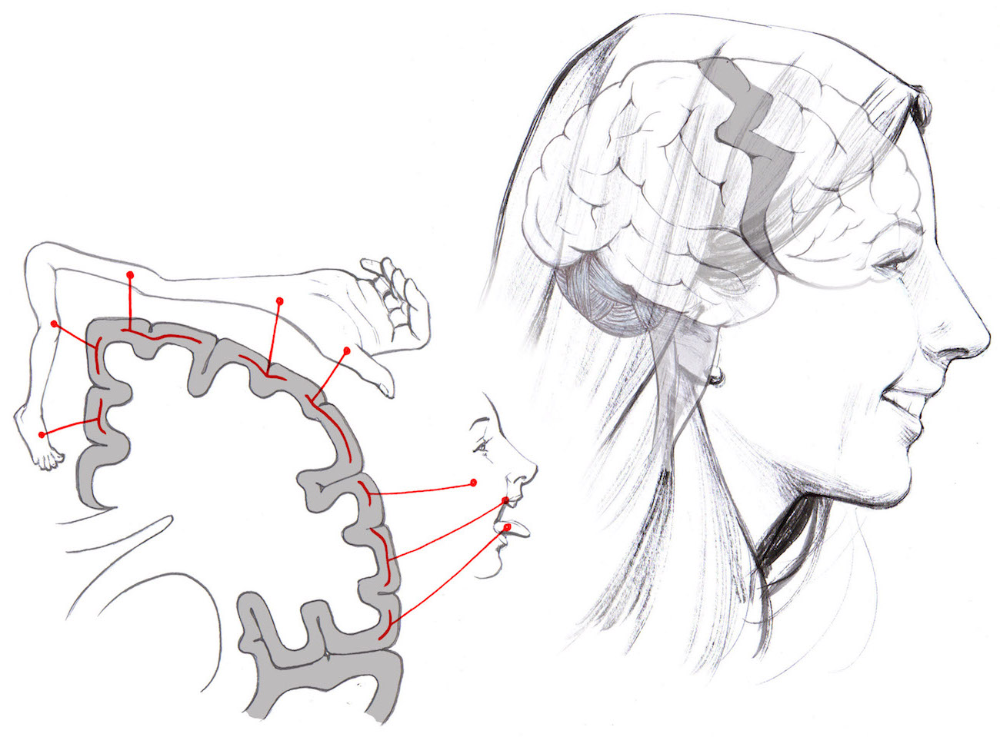
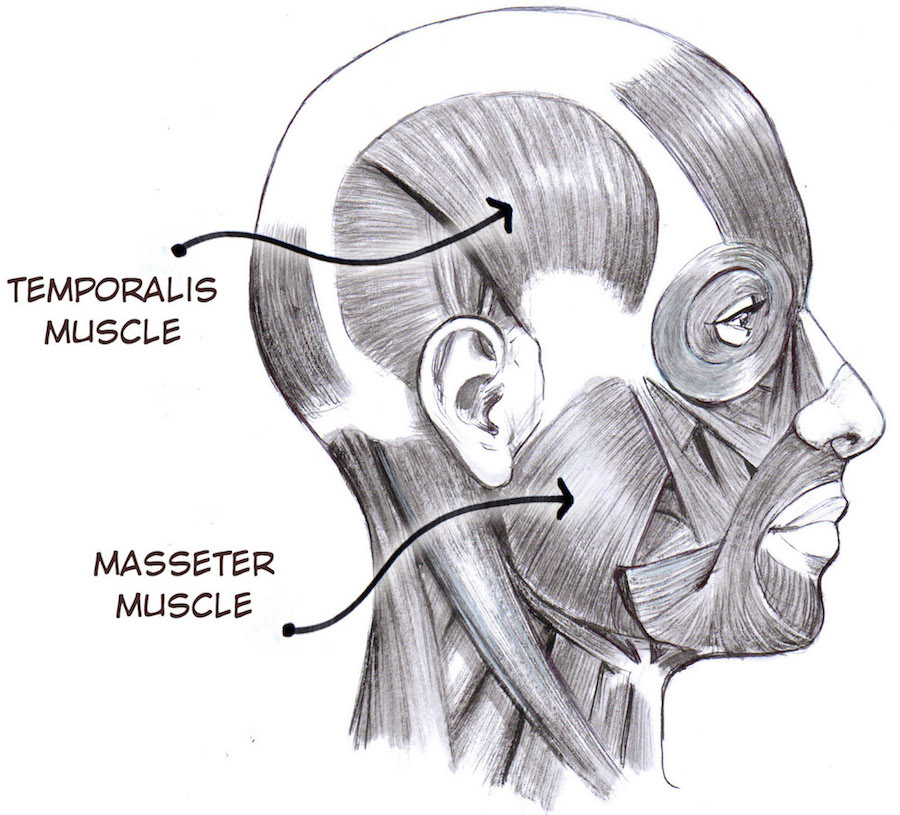
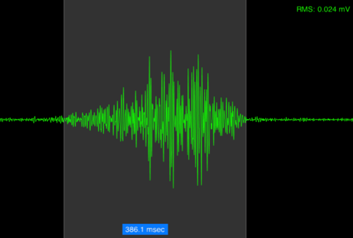

# Experiment:Muscle Recruitment in your Jaw!

Everybody chews. You will use the Muscle SpikerBox to record EMG's of the
masseter and temporalis muscles, the two jaw closing muscles, while chewing
different foods.

**Time:**  20 Minutes

**Difficulty:**   Beginner

#### What will you learn?

You will learn about the relationship between the size of the command from the
brain and the muscle force required to accomplish a task, and that even the
simplest movements involve more than one muscle. You will measure the EMG
amplitude of these muscles to see how the brain recruits and recruits motor
neurons and muscle fibers to produce different amounts of force.

##### Prerequisite Labs

  * [Record Electricity from your Muscles](musclespikerbox) \- You should read this experiment first to learn about electromyography and motor units.
  * [Muscle Action Potentials](muscleap) \- You should be familiar with using the small popsicle stick electrodes to record muscle action potentials.

##### Equipment

[Muscle SpikerBox Bundle](/https://backyardbrains.com/products/muscleSpikerboxBundle)

*[Foods of similar size but differing consistency](https://en.wikipedia.org/wiki/Food)

## Background

_Based on experiments and writing by Colorado State University student Breonna
E. Holland, Associate Professor[Brian L.
Tracy](https://www.hes.chhs.colostate.edu/faculty-staff/tracy.aspx), and CSU's
[Muscles Alive!](https://www.facebook.com/MusclesAliveCSU/) outreach program._

Muscles are responsible for every single movement a human makes, the smallest
things and biggest things- from running to blinking. The muscles in your face
do many of the movements that make us human. Without them you couldn't speak,
smile, frown, laugh, show surprise or sadness, kiss your loved one goodnight,
or eat.

You should recall what a motor unit is from the [Record Electricity from your
Muscles!](musclespikerbox) and [Muscle Fatigue](fatigue) experiments.
(Refresher - it's a single alpha motor neuron and all the muscle fibers it
innervates). In those experiments you looked at the biceps brachii and flexor
digitorum, muscles with big, powerful motor units. The muscles in the face are
much smaller, so they have smaller motor units (fewer muscle fibers innervated
for each alpha motor neuron). The chewing muscles, however, have a combination
of power and control to first break up tough food with larger forces but then
chew it smoothly with finesse. Taking advantage of leverage attachment points
on your skull, the jaw muscles can exert a very high and controlled amount of
force. Recruiting different numbers of motor units and firing them faster or
slower allows us to dynamically change the muscle force we require. The neural
output of the brain is the main thing that determines the number of motor
units recruited and their firing rates.

Particular brain areas control specific body parts. When you decide to chew
your food, the "mouth area" of the motor cortex in your brain is activated.
The electrical signal that is created when these neurons are activated travels
via neural axons out of your brain, out of nuclei in your brainstem, and
excites motor neurons in the mandibular nerve (the lower third branch of the
trigeminal nerve (cranial nerve V)). The mandibular nerve axons then synapse
on the jaw muscles. When the motor neurons release acetylcholine on the
muscles, the muscles themselves fire action potentials as well, which we can
record with our Muscle SpikerBox

A larger EMG (electromyography) signal indicates that more motor units are
being recruited. As you will find out, you don't have to "think" about making
that signal bigger to create more force in your muscle. Your brain
automatically adjusts the neural output from the motor cortex to adjust to
whatever movement you want to accomplish. We'll use chewing to demonstrate the
relationship between brain command, EMG level, and force output. Assuming you
don't want to stick electrodes in your brain, we'll measure the activation
level (number of action potentials generated by your muscle fibers) in the
chewing muscles of your face as a reflection of the command from the brain.

#### Downloads

> Before you begin, make sure you have the [Backyard Brains Spike
> Recorder](https://backyardbrains.com/products/spikerecorder) installed on
> your computer/smartphone/tablet. The Backyard Brains Spike Recorder program
> allows you to visualize and save the data on your computer when doing
> experiments. We have also built a simple lab handout to help you tabulate
> your data.
>
> [Spike Recorder Computer
> Software](https://backyardbrains.com/products/spikerecorder)
>
> [Class
> Handout](https://backyardbrains.com./files/MuscleChewing_Hand-
> Out.pdf)

## Video

## Experiment

In this experiment we are going to learn about how our brain recruits the
correct number of motor units and eat some yummy snacks. Before we start,
let's make a hypothesis-a prediction about what we think we will observe in
the experiment. For our hypothesis we are going to rank several foods from
largest to smallest expected EMG signal.

  1. Make your hypothesis. Use the downloadable form above to write down the foods you think go in their progression from softest to hardest. 

  2. Set up your Muscle SpikerBox Pro using a smartphone or computer with the Spike Recorder app. Make sure the red leads are attached to the metal tabs on the popsicle sticks and the black ground is around the screw you will gripping with your hand. Add conductive gel to metal tabs the red alligator clips are attached to.>

  3. Clench your teeth together as you feel the area of your face between your cheekbones and front of your ear for the muscle that sticks out while you are clenching. This is your masseter muscle. We are going to measure the electromyogram (EMG) of this muscle while chewing. 

  4. Connect the USB cable from the Muscle SpikerBox Pro to the computer. Open Spike Recorder, and turn on your Muscle SpikerBox Pro. A USB icon should appear on the main SpikeRecorder screen. Click on it to connect to your Muscle SpikerBox Pro. (Note_ If you are using a tablet, smartphone, and/or a Regular Muscle SpikerBox, you can connect to your tablet/smartphone/computer with the green smartphone audio cable.) 
  5. As best as possible, use food materials of roughly the same size. 

  6. Place the popsicle-stick electrode over the masseter muscle.

  7. Select the first food you want to test and place it between your back teeth on the same side as your electrodes. 

  8. Press the record button in your SpikeRecorder software. Now chew! Try to chew normally and consistently, **_just enough to break apart the food._**

  9. Observe (hear and see) the result of your brain using just enough motor units to chew the food you picked. 

  10. Stop the recording, and play the recordings back to measure the root mean square (RMS) of the middle part of each EMG "burst." Zoom in so that you can measure only the EMG signal without any noise. The RMS is a measure of the size of the signal. Use it to compare the force needed to chew different foods. Be consistent in your selection of the data for measurement. Check out the example below!

This burst lasted 386.1 milliseconds and had an RMS of 0.024 millivolts. This
was from chewing a gummy bear. How do your foods compare?

  11. Now repeat this process with the next food you want to test. Chew the foods in a random order selected by someone else. DO NOT move the electrodes between foods. Which food requires the greatest RMS value? How do your results compare with your hypothesis? Can you graph your results? What else can you discover? 

  12. Look again at the muscle diagram above. Do you think there might be other muscles that help us chew? Feel the side of your temple for the other jaw-clencher, the temporalis muscle. You could repeat the experiment with that muscle. Muscles that do the same thing at a particular joint are called synergists. How do the temporalis signals compare to the signals from the masseter? 

## Science Fair Project Ideas

* Try recording from using different parts of your mouth to chew something. Does the electrical signal look different? Why do you think they do/don't look different? Does it depend on what you're chewing on in that part of your mouth? Does food normally use different parts of the mouth?
* We recorded from muscles responsible for clenching your jaw, but try to figure out and isolate which muscle is responsible for opening the jaw. Try the experiment again with foods that are "sticky" and make it harder to open your mouth to chew again. Hint, the muscle is called the Lateral pterygoid. 
* When muscles "spike", they contract-so opening and closing your mouth must use different muscles. Try recording both the masseter and temporalis muscles at the same time with our Muscle SpikerBox Pro. 

## Notes

If you have our very first original Muscle SpikerBox with 3 separate leads
(not a single orange cable), the colors of the alligator clips are different.
The Red and Black clips should go around the metal tabs on the popsicle
sticks, while the white clip goes around the screw you are gripping with your
hand.