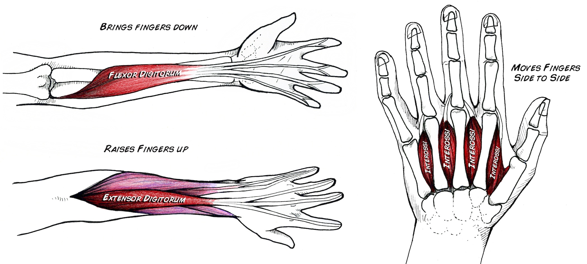
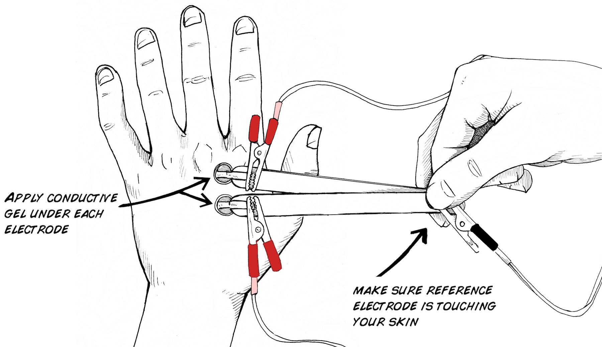
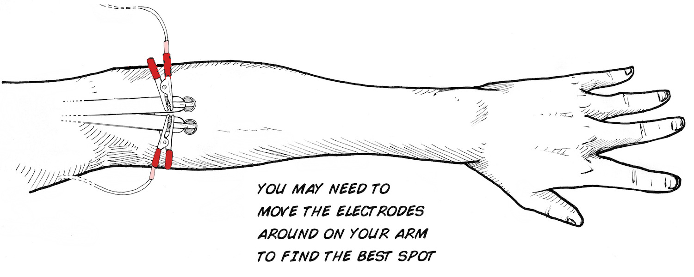
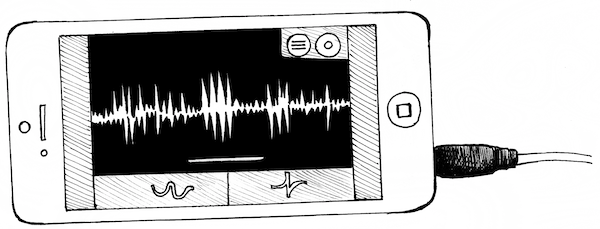

# Experiment:Muscle Action Potentials

In this experiment we will look at EMG activity more closely. The muscle
activity we saw in our previous experiment was the result of many muscle
fibers contracting at once. When you add up the electrical activity from each
fiber, you get a large distributed EMG signal that we can pick up using
surface electrodes. But what about the signal to each fiber? How are these
contractions controlled?

**Time:**  30 Minutes

**Difficulty:**   Beginner

#### What will you learn?

This experiment will show you how to use your Muscle SpikerBox to record
neural activity or motor units from the small interosseous muscles in your
hand. Can you find other small muscles to record from?

##### Prerequisite Labs

  * [Muscle SpikerBox](emgspikerbox) \- You should become familiar with how to use your Muscle SpikerBox and Smartphone, iPad, or Computer.

##### Equipment

* [Muscle SpikerBox](/https://backyardbrains.com/products/emgspikerbox)
* [Cable_ Laptop](/https://backyardbrains.com/products/laptopcable) 
* [Phone](/https://backyardbrains.com/products/smartphonecable)

## Background

There are two things that determine strength of contraction_ 1) the rate of
action potentials that occur in the nerve cell and its accompanying muscle
fibers, and 2) the "number" of motor units recruited. The rate of action
potentials is a code very similar to what you have seen in the cockroach leg.
The more action potentials, the more contractions occur. Recruitment, however,
is a new concept for us here.

In a relatively weak muscle contraction you recruit motor units with the
smallest number of muscle fibers first. These small motor units produce small
twitch forces when they contract. If you increase the strength of the
contraction you gradually recruit larger and larger motor units with greater
numbers of muscle fibers. They produce larger and larger twitch forces. At the
same time that you are gradually recruiting more and more motor units, you are
also firing them faster and faster (more twitches per second equals more
force!). All of these twitches are added together in the muscle. This is why
motor units are so cool.... they convert the code of the nervous system into a
perfectly adjusted muscle force that pulls on a tendon connected to a bone -
and allow you to chew your food, kick a soccer ball, press a keyboard button,
or hug a loved one.

We can use our Muscle SpikerBox to record the individual muscle action
potentials that occur as you contract muscles! One of the simplest EMG
experiments takes advantage of the fact that most of the muscles that control
your hand are in your forearm. Move your fingers up and down. These are
controlled by the _flexor digitorum superficialis_ and _extensor digitorum
communis_ muscles in your forearm. Now move your fingers from side to side.
These are controlled by the _dorsal interossei_ muscles which are actually
some of the few muscles inside of your hand. Since our Muscle SpikerBox is
only detecting local electric activity of muscles, and we put electrodes on
the top of your hand, would you expect a difference if you moved your fingers
up and down vs left or right? Let's see!

## Video

## Experiment

  1. Using your orange electrode cable, attach the red alligator clips to each of the brass fasteners in our "popsicle stick electrode" that came with your SpikerBox. Attach the black alligator clip to the ground screw. See images below as a guide. 

  2. Locate an indent (valley) between knuckles on your hand. 

  3. Place the electrodes over the back of your hand between the knuckles as shown below. Make sure you put a dab of [conductive gel](https://backyardbrains.com/products/emgelectrodegel) in-between each electrode and your skin. This will increase your signal quality (without gel you will most likely just get noise). 

  4. Hook up the Muscle SpikerBox to the electrode cable (see video above as a guide). 
  5. Turn on the Muscle SpikerBox. 
  6. Plug in your [SmartPhone Cable](https://backyardbrains.com/products/smartphonecable) (with our free [Android](https://play.google.com/store/apps/details?id=com.backyardbrains) or [iPhone](https://itunes.apple.com/gb/app/backyard-brains/id367151200?mt=8) apps installed) or computer (using our [Backyard Brains PC app](./files/Backyard_Brains_Neuron_Recorder_Install.air.zip) and a USB cable if you have the [Muscle SpikerBox Pro](https://backyardbrains.com/products/musclespikerboxpro)). 
  7. Move your middle or ring finger either side to side or up and down. Do you notice a difference? 

  8. Now, try to isolate the muscles in your forearm responsible for up and down motion of your fingers! Can you find your _flexor digitorum superficialis_? 

  9. Observe your smartphone or computer screen to see if you can isolate single muscle action potentials. You may find you have to "think about moving" so that you only generate a single twitch and a single AP! See if you can do it! 

## Science Fair Project Ideas

  * What do muscle Action Potentials look like on different muscles or different parts of the body? Why do you think they're different (or the same?) 
  * Does anything impact the amplitude of the muscle action potentials? Perhaps fatigue? Athleticism? 
  * Can you use this technique to pick up any neuronal action potentials? Why or why not? 
  * Try to see what the difference is (if there is one) between an action potential coming from a reflex (like the patellar reflex) and the same motion happening voluntarily. Why might there be or not be a difference? 

## Notes

If you have our original Muscle SpikerBox with 3 separate leads (not a single
orange cable), the colors of the alligator clips are different. The Red and
Black clips should go around the muscle of interest, while the white is used
as the ground electrode.