---
id_ experiment__octopus_fighting
title_ "Experiment_ Octopus Fighting"
slug_ /retired/experiments/octopus_fighting
---

# Experiment_ Octopus Fighting

The octopus is a rather strange-looking animal that exhibits amazingly complex
behaviors. And that's no wonder... they have the most impressive nervous
system in the entire invertebrate world! Two-Thirds of the neurons are
actually in the legs. The 8 smart legs and a large brain give rise to
excellent vision, delicate object manipulation and foremost the ability to
learn rapidly. Mix this in with camouflaging cells, jet propulsion and razor
sharp beak and you have all the makings of a formidable predator. And then,
throw in the fact that the octopus is a solitary creature and suddenly we have
ourselves a real cephalopod fight. This experiment was prepared by Ilya
Chugunov, a freshman from UC Berkeley, during our Summer Fellowship Program.

Time  50 Minutes

Difficulty  Advanced

#### What will you learn?

You will learn how to use [python code](https_//www.python.org/) and the
[OpenCV library](https_//opencv.org/) to extract useful features and data
(angle and speed of approach to a fight for our octopus specimens) out of
simple video recordings of octopuses. This is an introduction to how advanced
computational techniques can be used to analyze a wide net of problems.

##### Prerequisite Labs

None

##### Equipment

GoPro Camera

Small Container

Computer

* * *

[ 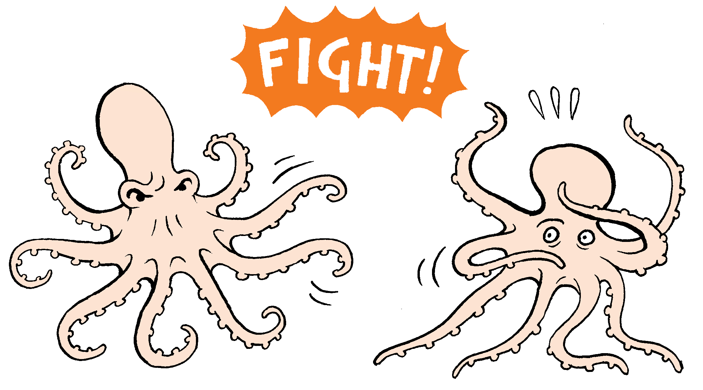](img/octopusFighting.png)

## Background

Octopuses, or _Octopodes_ , are some of the sea's most fascinating creatures.
Just like cuttlefish and squid, they are Cephalopods, which is a surprisingly
good descriptor for them as "Cephalopod" is a combination of the Greek
"kephale" meaning head, and “pod” meaning feet; they are heads on feet
with no body in the middle to speak of.

Though undoubtedly anti-social animals, doing their best to live as far from
their brothers as possible and going as far as to eat ones that come too
close, this doesn't meant that they are completely devoid of inter-octopus
interaction. Quite the opposite is true, they exhibit fascinating behaviours
when put in close quarters with one another. They dance around each other,
flash colouration, poke at one another with their outstretched arms, and given
a good opportunity they will begin a friendly match of octopus wrestling!

[ 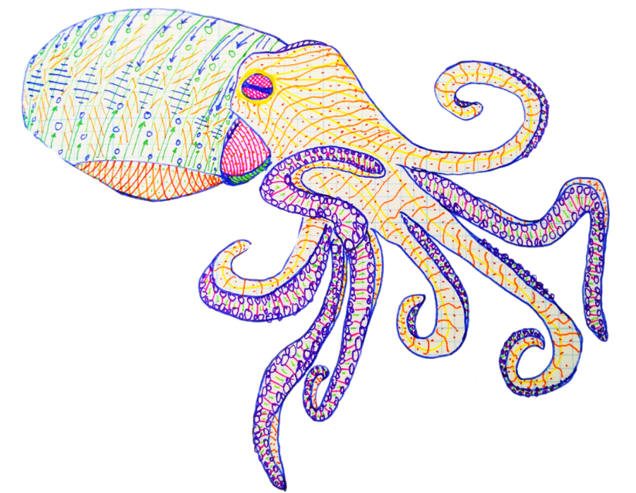](img/octopusFighting-
PennedOctopus.png)

The octopus of interest for this experiment is the California two-spot
(_Octopus bimaculoides_), named after the two blue spots found on the sides of
it's head. (Read more info [here](https_//www.tonmo.com/pages/bimac-care-
sheet/)) They're a great candidate for experimentation since they are an
extremely hardy and easy to keep animal, living comfortably in temperatures
all the way from 60-80°F. They're diurnal (they sleep at night), which makes
for very convenient testing since they'll actually be awake during the same
hours as you.

The most difficult problem with them is their pickiness when it comes to food;
these octopuses aren't opportunistic hunters so if the food doesn't move they
don't want it (but that's fine, just keep a bucket of live crabs to throw them
occasionally).

## DIY Neuroscience Episode of Experiment

> [How Octopuses Battle Each
> Other](https_//www.facebook.com/DIYNeuro/videos/232576497312859/)
>
> These are the 3 rules of an octopus duel_
>
> Posted by [DIY Neuroscience](https_//www.facebook.com/DIYNeuro/) on Monday,
> March 19, 2018

## Materials

For this experiment you will need_

  * Octopus chamber (Laser cut and assembled) - Source File_ [Octopus_Chamber.ai](files/Octopus_Chamber.ai)
  * Go Pro camera 
  * Mini-USB cable 
  * Laptop 
  * Aquarium with sea water 
  * Two California two-spot octopuses 
  * Empty, cleaned out milk jug for sea water 
  * Lamp with a diffusive filter/cover 
  * Paper towels (lots) 
  * Small plastic cup to carry octopus 

## Hardware Setup

You can assemble our laser cut octopus chamber using preferably non-toxic
glues. Use hot glue and silicon to seal. Make sure the bottom is as watertight
as possible, but still keep some paper towels under it.

[ 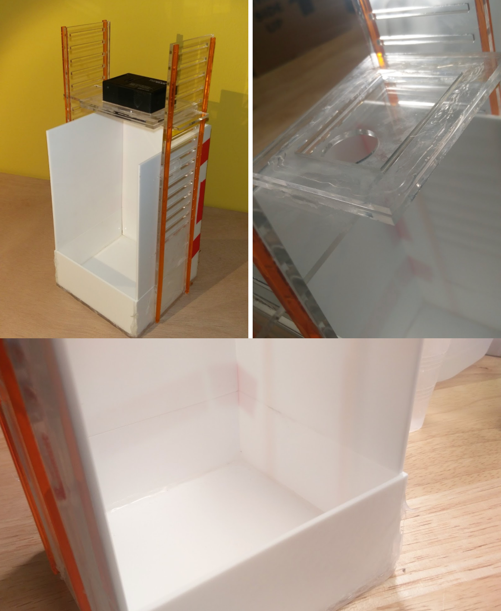](img/octopusFighting-
LasercutContainer.png)

You can also use your own container, but just be sure the camera is steady
above the small "arena".

## Software Setup

You can find the software referenced on our
[Github](https_//github.com/General-Ilya/Computer_Vision_for_Cephalopods).

You are going to need quite a lot of software to be able to run the provided
Jupyter notebook; and you will very likely run into bugs. Don't panic... this
kind of problem-solving is an essential experience for anyone looking to delve
into computer science.

If you are on a Windows machine, we highly recommend Git Bash as a pseudo-bash
console_ [Git](https_//git-scm.com/downloads)

You will need, first and foremost, PIP, the Jupyter notebook itself, and
OpenCV_

PIP_ <https_//packaging.python.org/tutorials/installing-packages></https>

Jupyter_ <http_//jupyter.readthedocs.io/en/latest/install.html> (We recommend
Anaconda)

OpenCV_ If all goes well all you need to do is "pip install opencv-contrib-
python" Remember to install opencv-contrib specifically as it contains
packages that we need.

## Octopus Filming

  1. Fill jug about a quarter of the way with sea water and shake it to aerate.
  2. Fill the octopus chamber until there's at least an inch of water.

[ 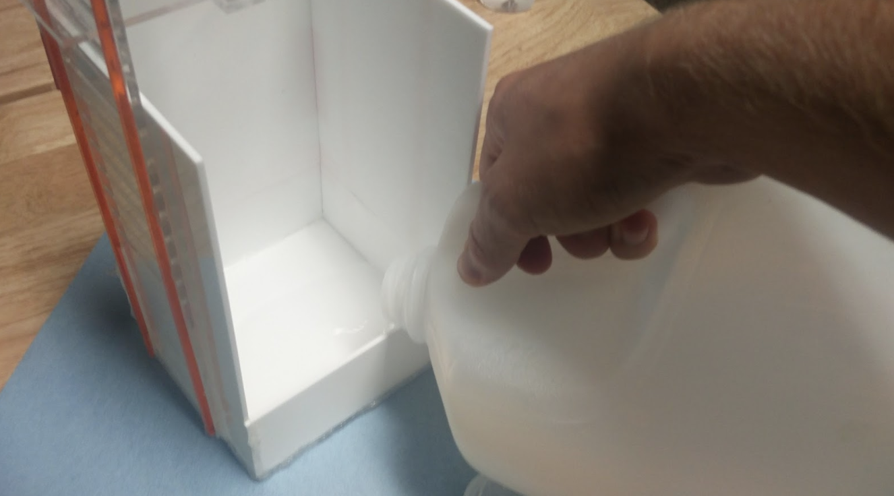](img/octopusFighting-
fightStep2.png)

  3. Set up Go Pro on top of the chamber.

[ 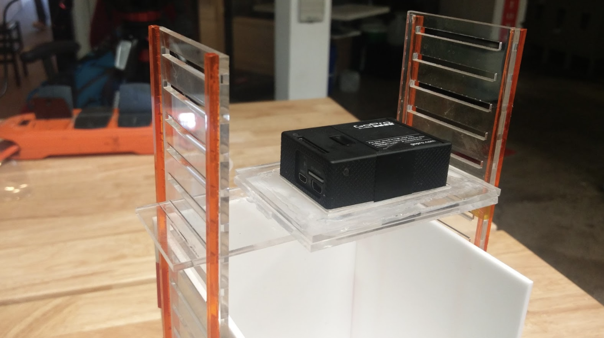](img/octopusFighting-
fightStep3.png)

  4. Set up lamp so that the chamber is lit as evenly as possibly, meaning the walls don't cast major shadows, but also such that the lamp is not facing directly downwards causing reflection in the water. (Take Go Pro footage and check multiple times to see that the lighting looks good)
  5. Scoop up one octopus with the plastic cup, be careful not to hurt their arms.

[ 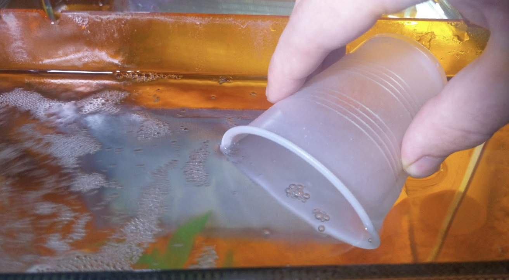](img/octopusFighting-
fightStep5.png)

  6. Gently let the octopus leave the cup into the chamber.
  7. Scoop up second octopus.
  8. Press record.
  9. Place second octopus into chamber and record for 15-25 minutes.
  10. Stop recording, and place octopuses back into their respective tanks.
  11. Repeat this filming up to 3 times per day, giving the octopuses at least 2 hours of break in between.
  12. Move the video recordings from the Go Pro onto a computer, and use any preferred video-editing software to cut it into 15-20 second clips surrounding the observed interactions (i.e. starting 10 seconds before a fight and ending 5 seconds after). Place the behaviour videoclips in the same folder as the Octopus_Optical_Flow.ipynb. Important_ Video clips must be 720x1280, anything else requires significant code changes and you're on your own. 60fps is recommended.
  13. Press Shift and Tab at the same time to run a cell of the Optical Flow notebook. Start by running the cell with all the import statements.
  14. Change the filepath to match that of the videoclip you want to analyse 

[ 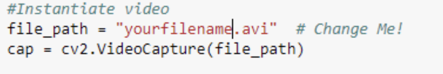](img/octopusFighting-
fightStep14.png)

  15. Leave one of the two options uncommented_ top is full-colour, bottom is black and white with the mask applied, exactly what the computer sees_ 

[ 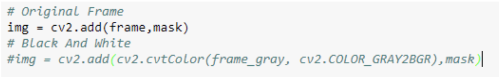](img/octopusFighting-
fightStep15.png)

  16. Run the optical flow codeblock. A GUI will pop up if the video is loaded correctly. Since the corners will be selected manually the only important settings are in the top half of the GUI_ 

[ 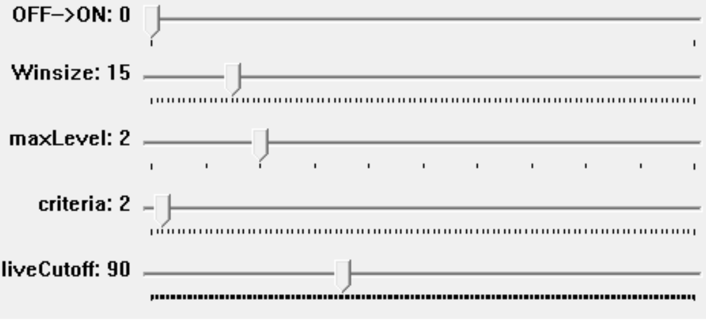](img/octopusFighting-
fightStep16.png)

The top switch is to start the corner selection, flip this when finished with
the four settings below it.

     * Winsize_ Size of the search window at each pyramid level
     * maxLevel_ Height of image pyramid created
     * criteria_ Parameter, specifying the termination criteria of the iterative search algorithm
     * liveCutoff_ Maximum brightness (0-255) that the algorithm will look at (anything above is ignored)

Best way to really figure out what these do is via trial and error.

  17. After the switch is flipped, select two points for tracking on one octopus (the eyes are recommended) by clicking on them. 

[ 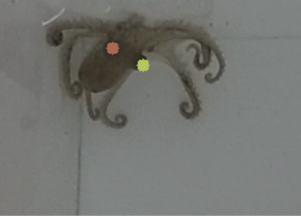](img/octopusFighting-
fightStep17.png)

Press escape to run the algorithm.

  18. The code will now run and trace paths of the octopus, if one of the points loses contact with the octopus, terminate the code by pressing escape and try again. Try changing settings or clicking different points on the octopus. 

[ 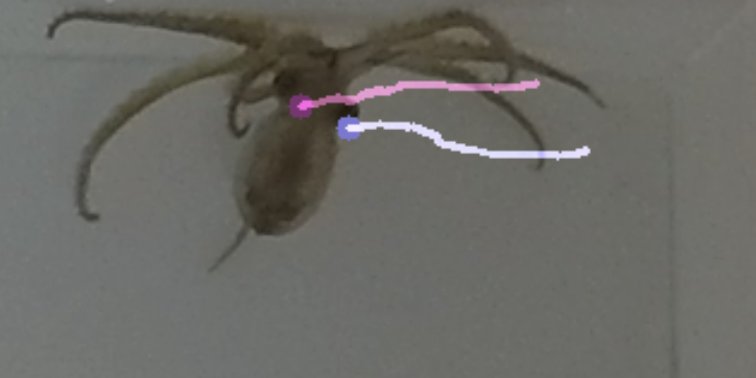](img/octopusFighting-
fightStep18.png)

  19. Upon completion, the codeblock will print out an image like this, this is the traced path_ 

[ 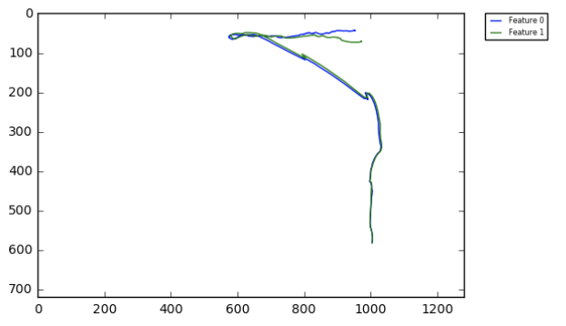](img/octopusFighting-
fightStep19.png)

  20. Run first pointcopy block_ 

  21. Run steps 17-19 for second octopus. Save by running only pointcopy2 block. Don't run the first pointcopy block again, this will overwrite the data. 

[ 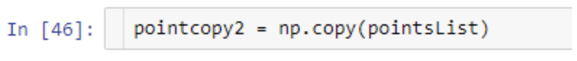](img/octopusFighting-
fightStep21.png)

  22. Change number to be a name you'll remember (probably the current videoclip name) 

[ 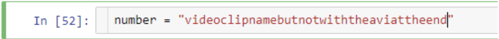](img/octopusFighting-
fightStep22.png)

  23. Save the data. This will create two files, a for the first octopus and b for the second. 

[ 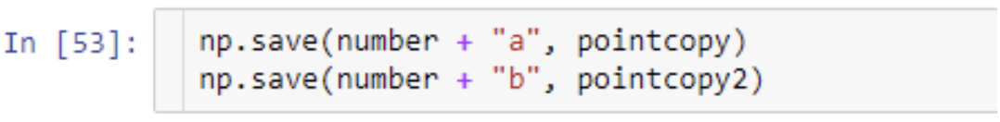](img/octopusFighting-
fightStep23.png)

  24. Repeat steps 14-23 for as many videoclips as needed.

## Experiment_ Angle and Distance after Contact

  1. First in Octopus_Optical_Flow load the a and b point data saved from the videoclips analyzed in the methods. To do this define number as the name of the saved points (the .npy file without the a or b at the end)_ 

  2. Run the two np.load codeblocks to load and display the a and b paths. 

[ 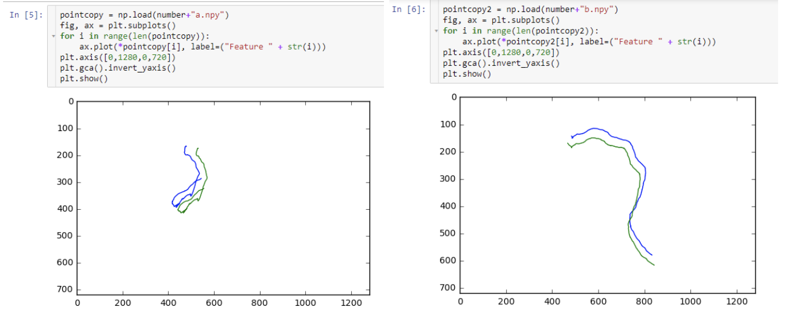](img/octopusFighting-
AngleStep2.png)

  3. Run the next codeblock to make sure both arrows go from the octopus' mantle to its head. If it is incorrect such as this_ 

[ 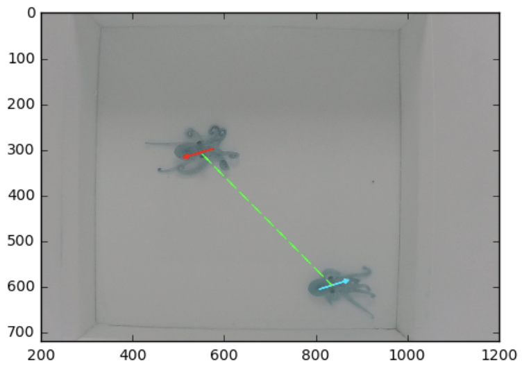](img/octopusFighting-
AngleStep3a.png)

Use the codeblocks below to flip the points_

[ 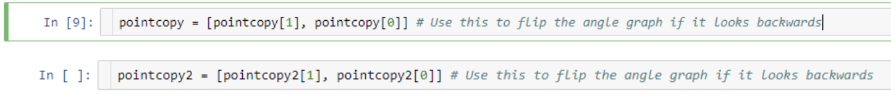](img/octopusFighting-
AngleStep3b.png)

Until both arrow look like this_

[ 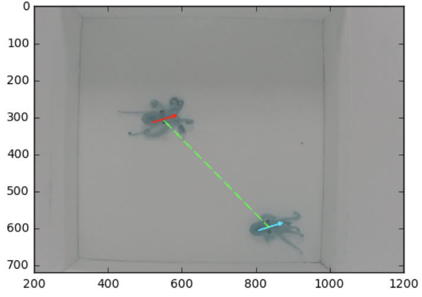](img/octopusFighting-
AngleStep3c.png)

  4. Run the last 2 codeblocks to calculate and save the distance and angle data_ 

[ 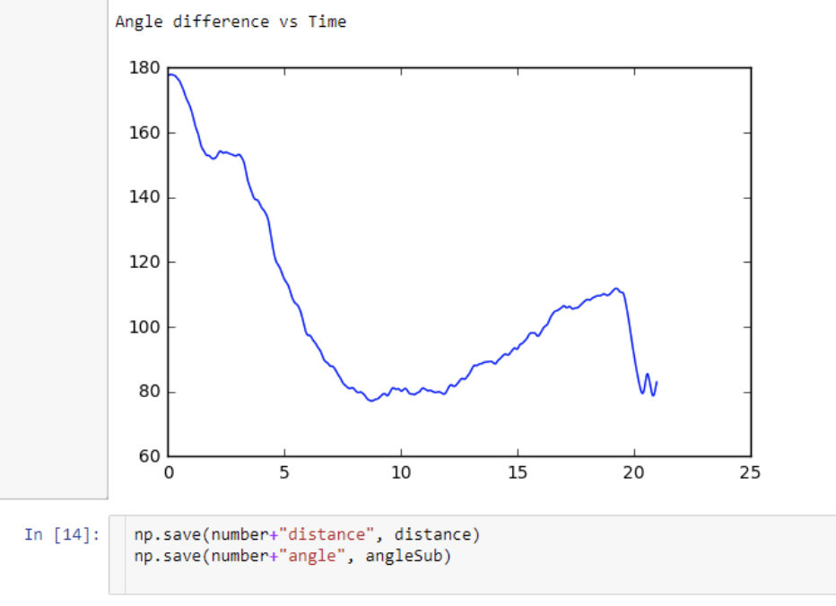](img/octopusFighting-
AngleStep4.png)

  5. For all the videoclips analyzed for distance/angle data it is now necessary to find contour gradient data so that all the points of contact can be aligned. Open up Octopus_Contact and change the filename for the desired videoclip_ 

[ 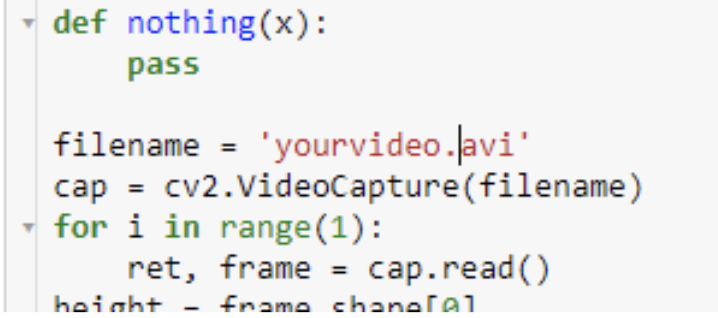](img/octopusFighting-
AngleStep5.png)

  6. Run the codeblock and adjust the sliders (mostly v-high) until the green lines draw a nice contour of the octopus_ 

[ 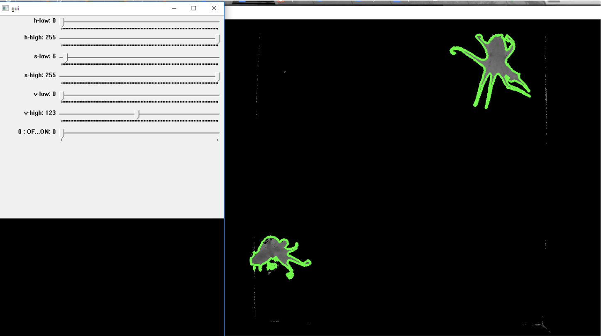](img/octopusFighting-
AngleStep6.png)

  7. Flip the Off-On switch and let the video run.
  8. Upon completion of videoclip, run the codeblock below it_ 

[ 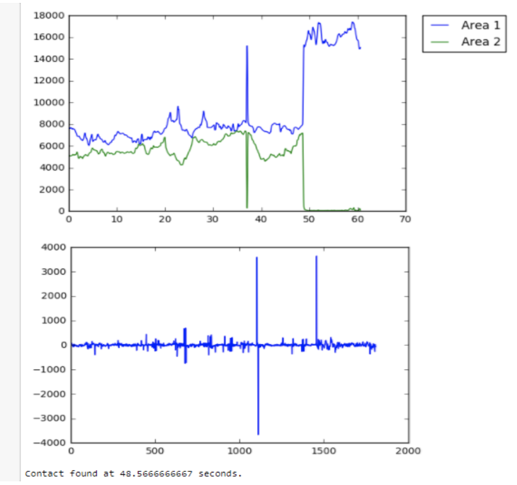](img/octopusFighting-
AngleStep8.png)

  9. Save the data and repeat the procedure for the rest of the videoclips_ 

  10. Now it's time to write some code. Create a new Jupyter notebook and write a sequence of codeblocks that will_ 
    1. Load all the distance, angle, and gradient files.
    2. Cut out a 200 frame width window from the distance and angle vectors that is +100 frames and -100 frames of the frame where the respective gradient vector has its peak.
    3. Normalize and add together all these windows.
    4. Plot the results.
    5. Add some extra features like labels, lines of best fit, coloration!
The end result shoud look like this_

[ 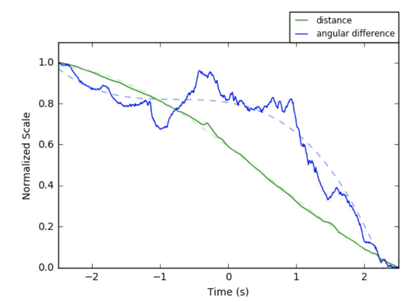](img/octopusFighting-
AngleStep10.png)

## Science Fair Project Ideas

  * Is there a heirarchy formed amungst octopodes?
  * What other patterns do you observe in their behaviours?
  * Do the octopodes always approach on the same side? Can you write code to determine this?