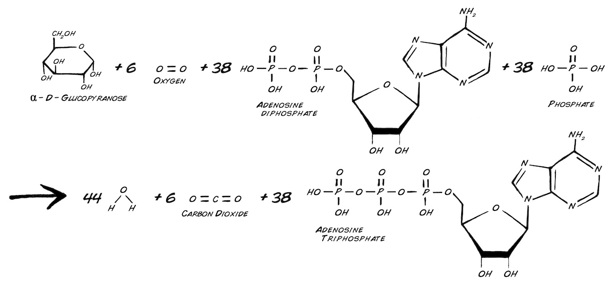
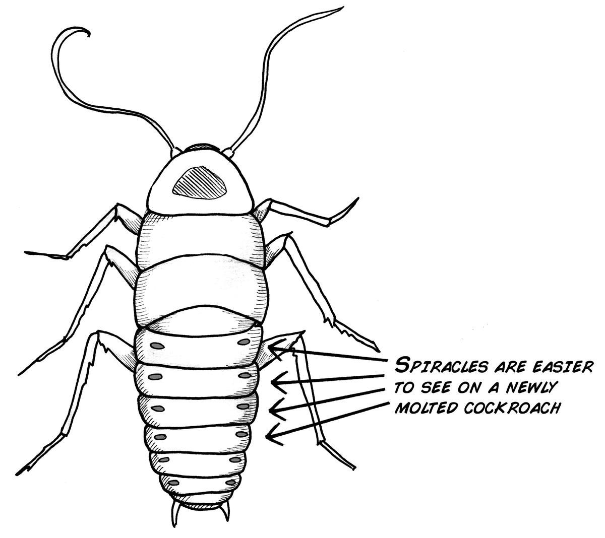
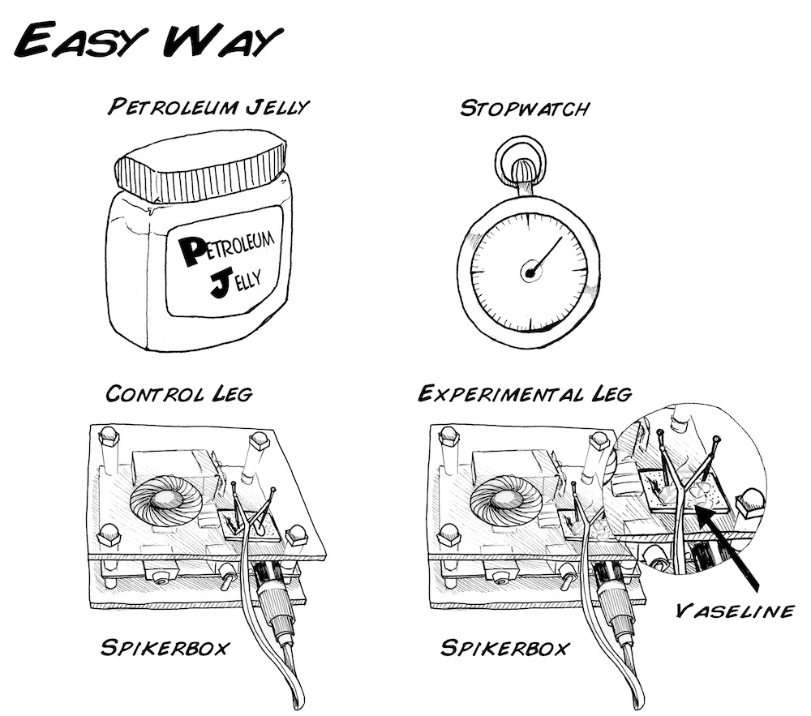
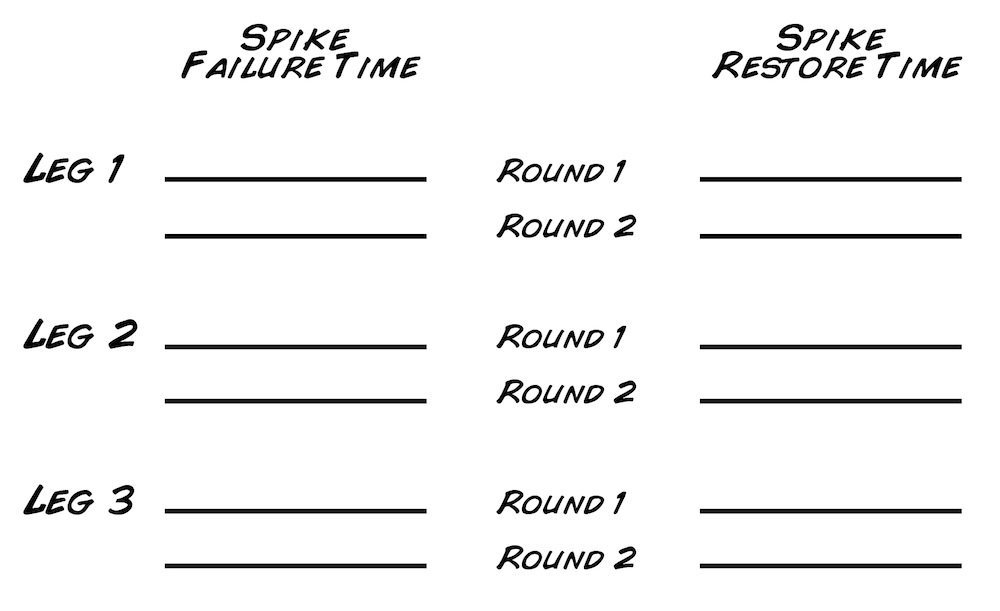

# Experiment: Oxygen and Spiking

Have you ever wondered what exactly happens to the oxygen you breath after it
has entered your lungs and goes into your bloodstream? In this experiment, we
will show you how neurons make use of oxygen, our most needed resource. We
will also examine what happens to neurons when they are deprived of oxygen.

Time  1 hour

Difficulty  Advanced

#### What will you learn?

You will learn why oxygen is essential for cell function and creation of ATP
(adenosine triphosphate). You will test the reversible effects of oxygen
deprivation on a cockroach leg's neurons.

##### Prerequisite Labs

  * [SpikerBox](spikerbox) \- You should become familiar with how to use your SpikerBox.

##### Equipment

[SpikerBox](/products/spikerbox)

[Extra Electrode](/products/recordingelectrode)

* * *

## Background

Let's recall a [former
experiment](http://wiki.backyardbrains.com/Experiment%3A_Power_Consumption),
where we talked about the energy neurons need to continue generating spikes
and specifically the energy needed to operate the sodium-potassium pump. This
energy is provided by adenosine triphostate, or ATP. ATP is made from the
foods you eat, but what else besides food do you need to stay alive? What is
invisible, tasteless, void of form, yet critical to your life?

Oxygen! Oxygen is an "oxidizer," meaning it is greedy for electrons. Pure
gaseous elemental oxygen is so electron greedy that it was a poison for most
life on Earth a couple billion years ago. In fact, the only elements greedier
for electrons are fluorine and chlorine, both of which are still very
poisonous in elemental gas form. Once lifeforms evolved to harness oxygen's
electron-grabbing power though, oxygen breathing ("aerobic") creatures began
colonizing Earth.

All animals, like insects, fish, birds, dogs, and you, need oxygen in addition
to food to generate enough ATP to stay alive. But how? And why? Time for some
biochemistry. For example, here is how your body breaks down the sugar
glucose:

This chemical reaction is quite complicated and has dozens of tightly
controlled steps that are classed into three pathways, beginning with 1)
glycolysis (breakdown of the 6 carbon sugar into 3 carbon pyruvate), to 2) the
Krebs (citric acid) cycle, which generates electron-rich molecules with funny
names like NADH and FADH, and finally 3) the oxidative phosphorylation
pathway, where the electrons from FADH and NADH are transferred though
multiple molecules (with more funny names like coenzyme Q and complex IV)
before going to the final electron acceptor, oxygen. Oxygen is converted to
H2O (water) in the process.

As these electrons move through the successive owners (like coenzyme Q,
complex IV, and oxygen) in the oxidative phosphorylation pathway, this creates
energy that is used to generate an excess of hydrogen ions (protons) outside
the membrane of the mitochondria, the cell organelle where this oxidative
phosphorylation pathway occurs. The ionic imbalance, as you can probably
surmise, is used to power a very special enzyme, ATP synthase. As the hydrogen
ions travel back into the mitochondria by going through the ATP synthase, this
causes the synthase to "rotate," generating the work that, through protein
chemistry, converts ADP to ATP.

Now let's think back to our friend the humble cockroach and his donated leg.
While the disconnected leg has enough food stored inside to survive for up to
a couple days, the leg does not have enough oxygen to survive for nearly as
long. For example, how long can you go without eating? And how long can you
survive without breathing?

An interesting fact about cockroaches is that it is impossible for a cockroach
to choke on food. It uses its mouth for eating only, and has a separate system
for breathing. If you look a freshly molted cockroach (a freshly molted
cockroach will be white), you will notice a series of holes along its back
(dorsal) side running along both sides of it's abdomen. These hole are called
"spiracles" and allow the passage of air through its tracheal system.

Let's see if we can investigate the dependence of oxygen on spikes in your
cockroach leg preparation. There are two ways you can do this:

##### A. The Hard Way

Put your cockroach leg and SpikerBox in a positive airflow container. Buy an
oxygen tank and an argon tank (typically used as an inert gas), some
regulators, some tubing, and hook up the tanks such that you can slowly
decrease the percentage of oxygen in your container to see the effect of
spiking activity in the cockroach leg.

##### B. The Easy Way

Since the leg of the cockroach gets all its oxygen through the open wound (see
our discovery of this when [we visited our friendly local electron
microscopist](http://blog.backyardbrains.com/2010/11/byb-visits-a-scanning-
electron-microscope/)), we can "starve" the leg of oxygen by simply liberally
coating the leg with petroleum jelly (vaseline).

## Video

## Materials

##### For this experiment you need:

  1. Two cockroach legs from a cockroach 
  2. Two Recording Electrodes 
  3. One SpikerBox (though you will find this experiment easier with two) 
  4. Petroleum Jelly 
  5. Toothpicks 
  6. Stopwatch 

## Procedure

  1. Anesthesize a cockroach in ice water, cut off two legs, and hook up each leg into your SpikerBox as you did in [Experiment 1](http://backyardbrains.com/experiments/spikerbox) to test if you can hear spiking. Note that you do not need two SpikerBoxes to do this experiment; you can simply swap out the electrodes that are hooked up to each cockroach leg. 
  2. Liberally coat one leg (the "experimental leg") with petroleum jelly using a toothpick and start your stopwatch. 
  3. Every 10-15 minutes, manipulate both the control and experimental leg by touching one of the barbs to see if you can evoke spikes. 
  4. After a time, the experimental leg should stop spiking (if it doesn't you may not have put enough petroleum jelly on the leg to create a good seal against the air.) Mark down the time the spikes stopped. 
  5. Carefully remove the petroleum jelly with a napkin or paper towel. Restart your stopwatch. Every 10-15 minutes attempt to evoke spikes. Eventually they should return. Mark the time at which it does. Again also check if the control is still generating spikes. 
  6. Repeat steps 2-5 as long as you have time for AND as long as the control leg is still generating spikes. Note: why is monitoring the control important? 
  7. Repeat this experiment over a couple legs to see if you can find an "average time for the spikes to go away" and an "average time for the spikes to come back." Are they different or the same? What would be the reasons? Use the table below as a guide. 

## Discussion Questions

  1. It's easy to understand why the spikes eventually go away when you starve the leg of oxygen, but why do the spikes come back? How long can the leg be coated in petroleum jelly before the spikes go away permanently? 
  2. You've probably figured out that the leg eventually dies from drying out. Is there a way you can keep the leg moist, while also allowing oxygen to pass through? Is there any material that is permeable to air but not water?