# Experiment: Quantify Your EEG

Many students and teachers have enjoyed measuring their own brain activity
with our Heart and Brain SpikerBox, but quantifying the brain signal has been
a challenge. We now come to help.

Time  1 hour

Difficulty  Advanced

#### What will you learn?

With this experiment, you will learn about the open-source data analysis
program Python, how to use it, and general issues with data analysis and the
EEG.

##### Prerequisite Labs

  * [EEG-Record from the Human Brain](eeg) \- You should have know how to successfully record the alpha waves of the visual cortex before moving on to this data analysis project

##### Equipment

* [Heart & Brain SpikerBox](/https://backyardbrains.com/products/heartAndBrainSpikerBox)

## Background

_Designed and written by Natalia Díaz Acevedo, student of Mathematical Engineering at the University of Santiago, Chile._

Analyzing electroencephalograms (EEGs) is trickier than analyzing the action
potentials from human muscles (using our Muscle SpikerBox or
cockroach leg nerves (using our Neuron SpikerBox). When
recording EEG with the Heart and Brain SpikerBox, we are observing the
collective electrical activity of many neurons in your brain at the same time,
filtered through your skull and scalp. Thus, we cannot simply do a "spikes per
second" count as we do with neurons or muscles, or even a "beats per minute"
and "interbeat interval" count like we do with heart activity. Analyzing EEGs
is mathematically complex, as it is a signal with multiple frequencies
changing over time, often with a lot of embedded noise.

[ 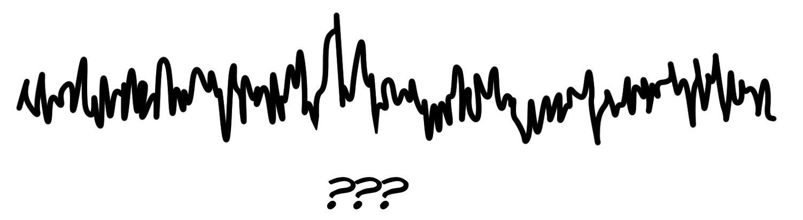](img/EEG-Confusion.jpg)

The two most common analysis techniques are 1) averaging the signal over many
trials to see an "evoked potential," and 2) building a spectrogram to see
frequency changes over time. In an evoked potential, we average the EEG signal
over many repeated stimulus presentations and get an average "evoked
response." This is what we do in our
[P300](https://backyardbrains.com/experiments/p300) experiment.

[ 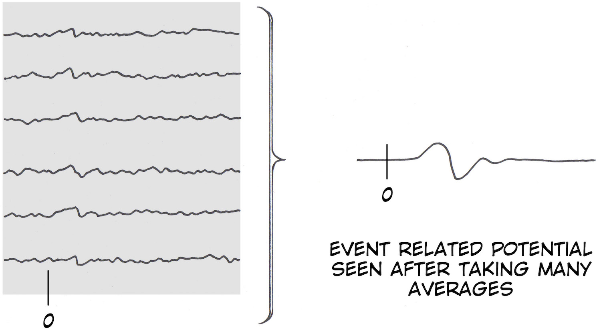](img/Potentials_Math_red.jpg)

In contrast, building a spectrogram decomposes a complex signal into its many
frequency components often using a "[Fourier
Transform](https://en.wikipedia.org/wiki/Fourier_transform)," which states
that any complex signal can be broken down into distinct sine and cosine
waves. Joseph Fourier is a hero of ours, and he derived his famous formula
studying heat flow in metals.

[ 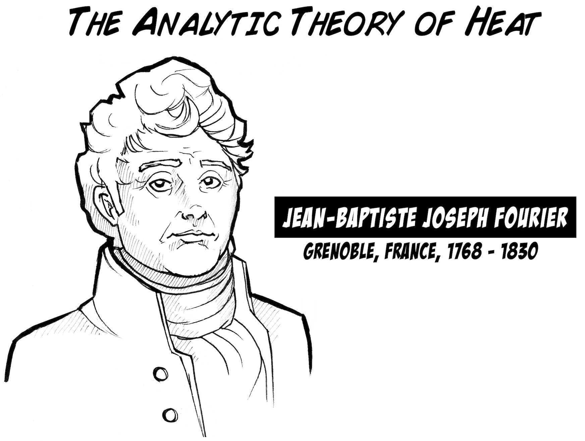](img/JosephFourier.jpg)

[ 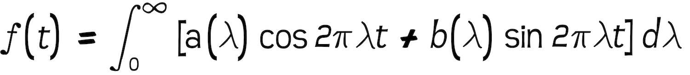](img/FFT_Equation.jpg)

This Fourier Transform is what data analysis programs use to generate
spectrograms, which show the frequency content of a signal changing over time.
For example, below is an example of a spectrogram when one of us whistled, and
we decreased the pitch (made it lower-sounding) as we whistled.

[ 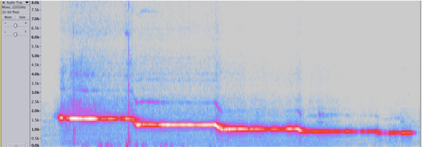](img/Spectrogram_whistle.jpg)

Notice that the whistle frequency started at 1500 Hz and dropped to 500 Hz. We
can similarly do this analysis in an EEG recording on our Spike Recorder
Software. When you are doing an EEG recording, you can push the "FFT" button
(fast Fourier transform).

[ ](img/FFT-Button-SpikeRecorder.jpg)

In Spike Recorder, a spectrogram will then appear below the moving EEG trace.

[ 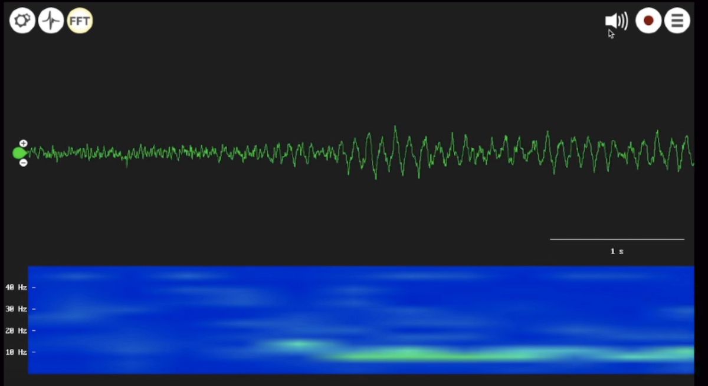](img/FFT-SpikeRecorder.jpg)

This was a recording over the visual cortex, and when we closed our eyes, the
prominent 8 Hz alpha waves appeared, which you can see in the raw trace as
well as in the spectrogram. We can then measure the "power" of the alpha waves
over time by analyzing the spectrogram.

For example, in a simple example, if you imagine a signal alternating between
2 and 4 Hz, you can eventually generate the figure below.

[ 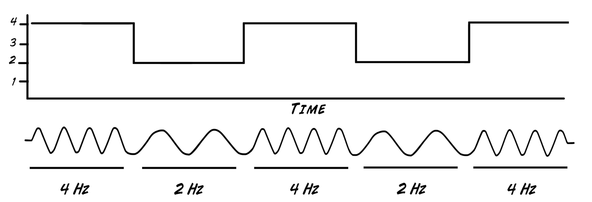](img/FrequencyAndTime.jpg)

At the moment our Spike Recorder software does not provide any quantitative
analysis of the EEG after you record it, thus we will generate a figure using
the popular open source analysis software [Python-based
Anaconda](https://www.anaconda.com/products/individual). This software can be
intimidating to use, but just be patient; it is a very useful tool. We will do
an example below.

#### Downloads

> [Spike Recorder Software for Displaying and Saving Data from Heart and Brain
> SpikerBox on Computer](https://backyardbrains.com/products/spikerecorder)
>
> [Python-Based Anaconda Program for
> Download](https://www.anaconda.com/products/individual)
>
> [Our Python Script for Analyzing
> EEG](https://backyardbrains.com/experiments/files/Quantify_EEG4.py.zip)

## Procedure

Now let's get our hands dirty with some code!

  1. You can download our [test recording](https://backyardbrains.com/experiments/files/EEG_Alpha_SampleData.zip) of the alpha waves of the visual cortex while we opened and closed our eyes or [you can record the data on yourself](https://backyardbrains.com/experiments/eeg). Just remember to press the number 1 every time you close your eyes and the number 2 every time you open your eyes on your keyboard. 
  2. Download the Anaconda Program and install it on your computer. 
  3. Once installed, you will open the Spyder Application, and you will see a window that looks like this. 

[ 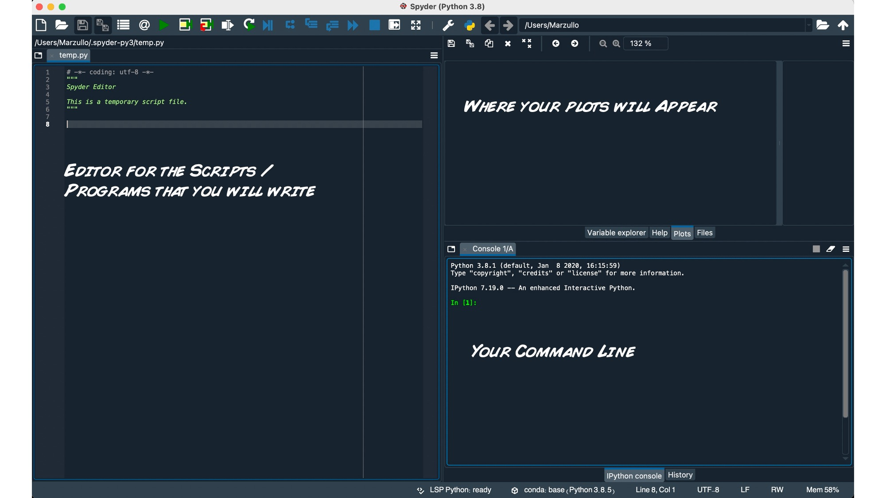](img/Spyder_Window_Explain.jpg)

  4. To start you must install some packages_ 1) numpy to use the math tools, 2) matplotlib.pyplot to be able to plot, 3) scipy.io.wavfile to read and transform the .wav audio file, 4) cvs to save your data, and 5) pandas for the dataframes. For this, you must write_ 

 ```python  
    
    import numpy as np
    import matplotlib.pyplot as plt
    import scipy.io.wavfile as waves
    import csv
    import pandas as pd
```

  5. It will color code in your editor to look like 

[ 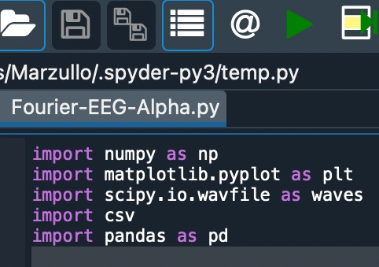](img/Screenshot-Initial-Python-Code.jpg)

  6. Note we are putting all these commands in the editor. We are creating a script, and we must name and save the script in the same location as our data. The sample file we will be using is named "TimBrain_VisualCortex_BYB_Recording.wav," which you can download above. Make sure it is saved in the same location as where you save this python script file (typically a folder called Spyder.Py in your user directory). 

[ 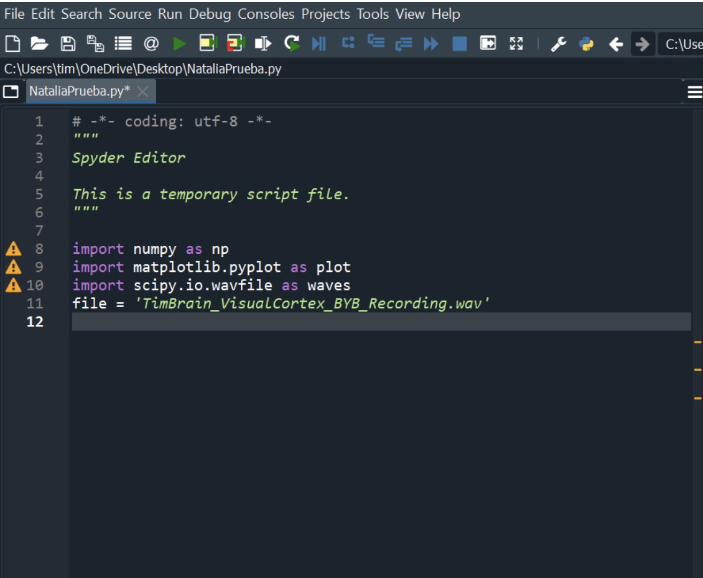](img/Screenshot-Adding-File-Recording.jpg)

    
  ```python     
    file = 'TimBrain_VisualCortex_BYB_Recording.wav'
    fs, data = waves.read(file)
  ``` 

  7. Now we want to reduce the sample from 10,000 Hz to 500 Hz to be less demanding on the computer. To do this, we first calculate the size of the sample, we reduce it 20 times (* 0.05), and in case we have a non-integer number, we take out the non-integer part of the result. Next, we use the "signal.resample" function indicating the final data number we want to obtain. 
    
   ```python   
    length_data=np.shape(data)
    length_new=length_data[0]*0.05
    ld_int=int(length_new)
    from scipy import signal
    data_new=signal.resample(data,ld_int)
   ``` 

  8. And...we are ready to graph! We will use the "specgram" command with the following data_ 1) data_new_ our sample, 2) NFFT = 256_ the number of samples for the frequency analysis, 3) Fs = 500_ the sampling rate, and 4) noverlap = 250, the number of samples for the overlap in the moving window. 
 
  9. We save the data obtained by the spectrogram in the variables d (data), f (frequency), t (time) and im (image). In addition, we will define the limits to set the frequencies that interest us (0-90Hz). 
    
    ```python  
    plt.figure('Spectrogram')
    d, f, t, im = plt.specgram(data_new, NFFT= 256, Fs=500, noverlap=250)
    plt.ylim(0,90)
    plt.colorbar(label= "Power/Frequency")
    plt.ylabel('Frequency [Hz]')
    plt.xlabel('Time [s]')
    plt.show()
    ```

  10. Select the command run in the menu! (it's the green triangle). Click on "Plots" in the upper right of the screen. 
  
  11. In the upper right of the Spyder window, you should see the spectrogram plot. 

[ 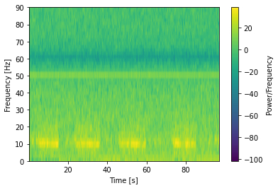](img/EEG_Spectrogram_Plot.jpg)

  12. Notice the increased power at 10 Hz during various periods (more yellow). This is the increased alpha power in the visual cortex when the eyes were closed. Cool huh? 
  
  13. Now we want to get the values out to analyze the alpha waves (8-10 Hz). We will select the data where the frequencies are close to the alpha wave frequency range. If you want to save the values to see them well, first we convert f into a vector and make it transpose. Then we save it in a .csv file, with the "pd" library we read it to give it a title (Frequencies), and then we save the change. 
    
    ```python  
    matrixf=np.array(f).T
    np.savetxt('Frequencies.csv', matrixf)
    df = pd.read_csv("Frequencies.csv", header=None, index_col=None)
    df.columns = ["Frequencies"]
    df.to_csv("Frequencies.csv", index=False)
    ```


  14. A file named "Frequencies" will be saved in the same location as your python script. You can open it in excel or any text editor. Note that in excel you will have to select "import text file." 
  15. As you can see in the following image, the frequency matrix has 129 data points. In python, the positions start from the number 0, so, we are going to choose the ones close to the Alpha waves which will be the positions 4 (7,81 Hz), 5 (9,77 Hz) and 6 (11,7 Hz). (Note that in the figure the positions start from 1, this is because we are seeing it in an excel table). We can do it "by hand" but if it were a lot of data it would be a lot of work, so we will do it in python. 

[ 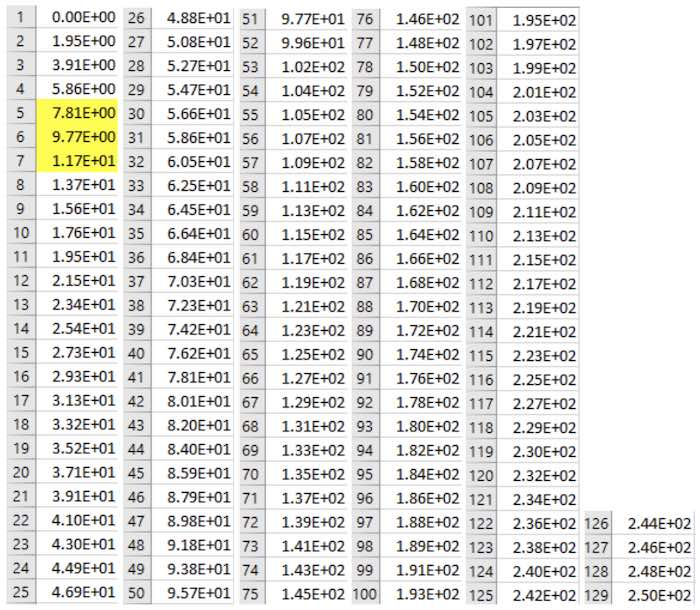](img/Frequency_Matrix.jpg)

  16. To select the data, we will create a vector with the positions that interest us (we will choose the data corresponding to frequencies from 7 Hz to 12 Hz). 
    
    ```python  
    position_vector=[]
    length_f=np.shape(f)
    l_row_f=length_f[0]
    for i in range(0, l_row_f)_
        if f[i]>=7 and f[i]<=12_
            position_vector.append(i)
    ```

  17. Now we will take the average of the values between 7 and 12 Hz moving in time. 
    
    ```python  
    length_d=np.shape(d)
    l_col_d=length_d[1]
    AlphaRange=[]
    for i in range(0,l_col_d)_
        AlphaRange.append(np.mean(d[position_vector[0]_max(position_vector)+1,i]))
    ```

  18. We will then smooth the data using the smoothTriangle function. You can find the documentation [here](https://plotly.com/python/smoothing/). 
    
    ```python  
    def smoothTriangle(data, degree)_
        triangle=np.concatenate((np.arange(degree + 1), np.arange(degree)[__-1])) # up then down
        smoothed=[]
    
        for i in range(degree, len(data) - degree * 2)_
            point=data[i_i + len(triangle)] * triangle
            smoothed.append(np.sum(point)/np.sum(triangle))
        # Handle boundaries
        smoothed=[smoothed[0]]*int(degree + degree/2) + smoothed
        while len(smoothed) < len(data)_
            smoothed.append(smoothed[-1])
        return smoothed
    ```

  19. We then plot the alpha values alone over time. 
    
    ```python  
    plt.figure('AlphaRange')
    y=smoothTriangle(AlphaRange, 100)
    plt.plot(t, y)
    plt.xlabel('Time [s]')
    plt.xlim(0,max(t))
    ```

  20. Thus, you can get the following image_ 

[ 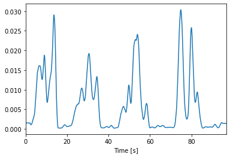](img/Alpha_Power_With_Time.jpg)

  21. Notice we are now just seeing the alpha power change over time, a two dimensional graph instead of the three dimensional graph like in the spectrogram. But we still want more, we want to run some statistics on this graph to quantify how much greater the alpha is when the eyes are closed (though it is obvious in this graph). But first let's talk about saving the data 
  22. You can save this data in excel should you desire. To save it neatly, we again use a .csv file. To do this, first we create the data matrix that we are going to use (alpha power and time), and then we create the file ('Excel-tab' helps us so that the data columns are separated by that type of space). 
    
    ```python  
    datosy=np.asarray(y)
    datosyt=np.array(
           [
           datosy,
            t
            ])
    with open ('datosyt.csv', 'w', newline='') as file_
       writer=csv.writer(file, dialect='excel-tab')
      writer.writerows(datosyt.T)
      
    df = pd.read_csv("datosyt.csv", header=None, index_col=None)
    df.columns = ["Power                   Time"]
    df.to_csv("datosyt.csv", index=False)
    ```

  23. If you want to see the data in excel, youu open the .csv file in excel. Everything will be seen together in a column, so we will separate it in two to analyze them well. To do this, you must select the entire column (you can click A), then go to data and choose text to columns-delimited- tab and space -general and finish. 

[ 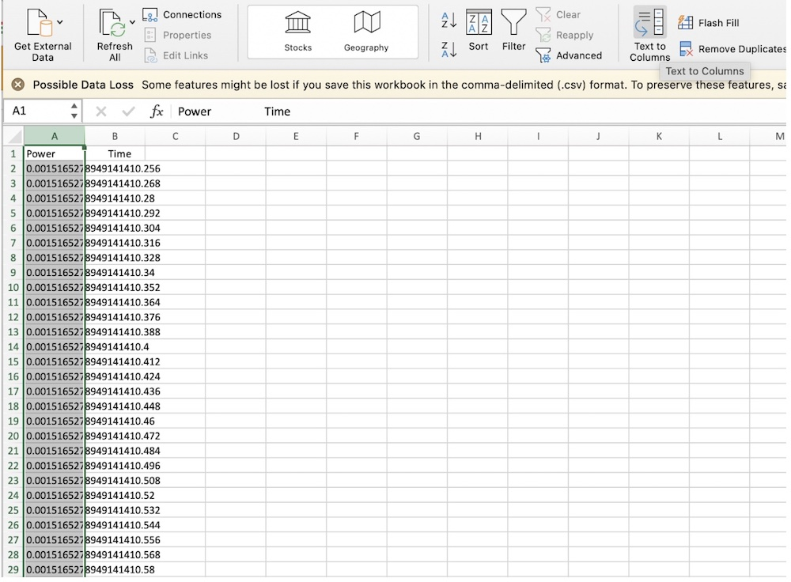](img/Unified_Column.jpg)

[ 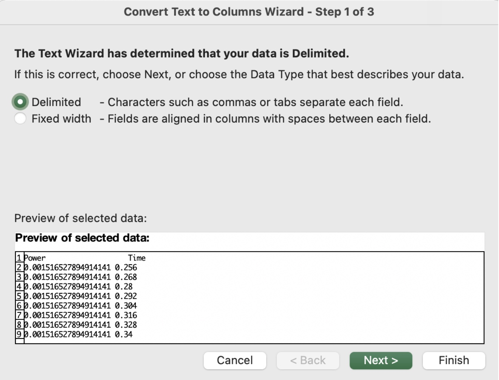](img/Text-to-Columns.jpg)

[ 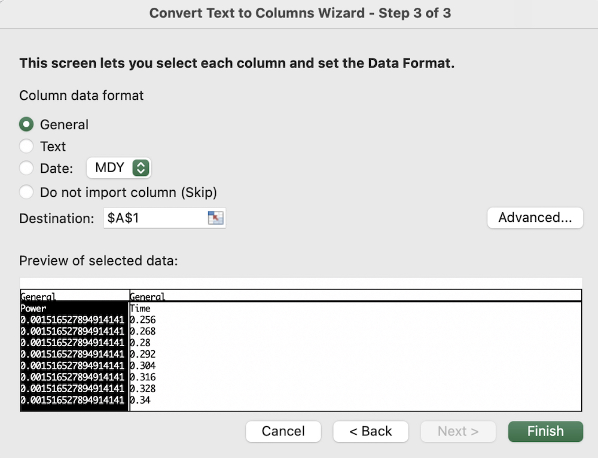](img/Text-to-ColumnsII.jpg)

  24. Now let's set out to do what we originally wanted to - have a statistical test showing that alpha power in the visual cortex is higher when the eyes are closed versus when the eyes are open. We want to generate some box plots on the data. With such a [box plot](https://en.wikipedia.org/wiki/File_Box_plot_description.jpg) we can identify various characteristics of the data, such as 1) Median, 2) Quantiles, 3) Maximum and minimum, 4) Atypical values (outlier), 5) Interquartile range (IQR). 

[ 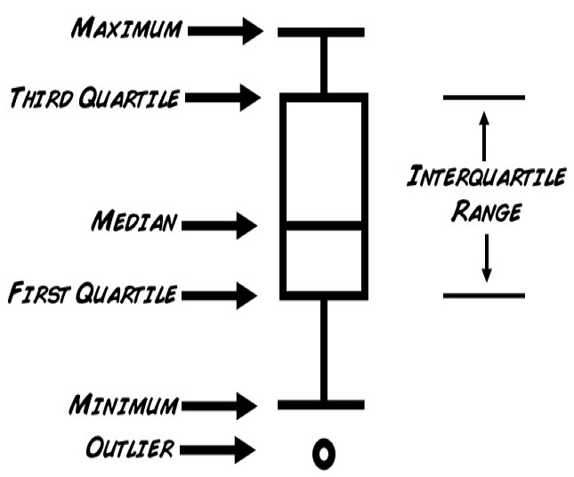](img/BoxPlot.jpg)

  25. So, for this, we will use the data that you can find in the same folder as the .wav file you downloaded. In the file called TimBrain_VisualCortex_BYB_Recording-events.txt you have the data of the exact times where the eyes are opened or closed. Now, we will find the alpha power data for the corresponding times and we will average them forming two vectors ("eyes open" and "eyes closed"). Don't panic! I'll show you. 

[ 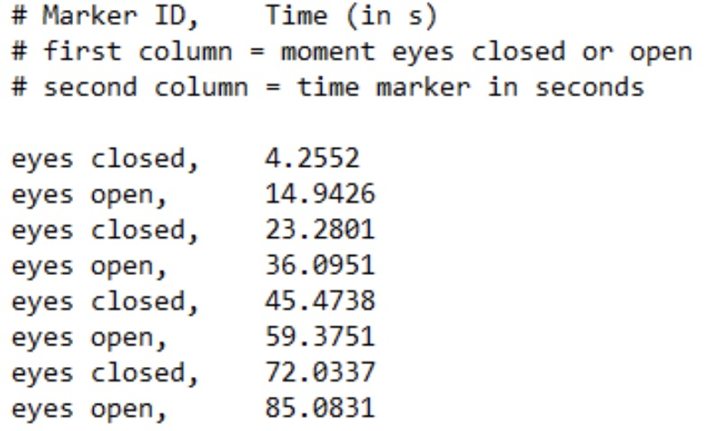](img/Event_Times_Eyes.jpg)

  26. First we form a vector with all the indicated times_ 
    
    ```python  
    tg=np.array([4.2552,14.9426, 23.2801,36.0951, 45.4738,59.3751, 72.0337,85.0831, max(t)+1])
    ```

  27. And then we define certain parameters to fill our vectors. For this we will calculate the average of the data when the eyes are open and when the eyes are closed. 
    
    ```python  
    length_t=np.shape(t)
    l_row_t=length_t[0]
    eyesclosed=[]
    eyesopen=[]
    j=0  #initial variable to traverse tg
    l=0  #initial variable to loop through the "y" data
    for i in range(0, l_row_t)_
        if t[i]>=tg[j]_
            
            if j%2==0_
                eyesopen.append(np.mean(datosy[l_i]))
            if j%2==1_
                eyesclosed.append(np.mean(datosy[l_i]))
            l=i
            j=j+1
    
            
    plt.figure('DataAnalysis')
    plt.boxplot([eyesopen, eyesclosed], sym = 'ko', whis = 1.5)
    plt.xticks([1,2], ['Eyes open', 'Eyes closed'], size = 'small', color = 'k')
    plt.ylabel('AlphaPower')
    ```

  28. You should get an image like this. 

[ 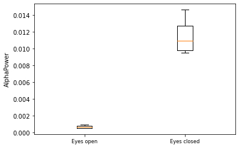](img/BoxPlotEyesOpenEyesClosed.jpg)

  29. So how do you think we could interpret it? Think about it... 
  30. We can do the t-test to the samples of "closed eyes" and "open eyes" (you can learn more about the t-test [here](https://backyardbrains.com/experiments/p-value)). 
    
    ```python  
    meanopen=np.mean(eyesopen)
    meanclosed=np.mean(eyesclosed)
    sdopen=np.std(eyesopen)
    sdclosed=np.std(eyesclosed)
    eyes=np.array([eyesopen, eyesclosed])
    
    from scipy import stats
    result=stats.ttest_ind(eyesopen, eyesclosed, equal_var = False)
    print(result)
    ```

  31. In your command line of Spyder, you should see the output "Ttest_indResult(statistic=-8.665195698899302, pvalue=0.002021363006497095)" 
  
  32. The p-value equals 0.002. Not too shabby. Now we can say with some statistical confidence that alpha power is higher in the visual cortex when your eyes are closed versus when your eyes are open. Finally, we have quantified the EEG in this first step. We know this protocol is a bit challenging, but studying the brain is a challenge, and we continue ;) Happy exploring! Below is all the code is its glory. Modify it and make your own analysis! 

**The Code**

    ```python  
    # -*- coding_ utf-8 -*-
    """
    Created on Feb 2021
    
    @author_ Natalia
    """
    
    import numpy as np
    import matplotlib.pyplot as plt
    import scipy.io.wavfile as waves
    import csv
    import pandas as pd
    
    file = 'TimBrain_VisualCortex_BYB_Recording.wav'
    fs, data = waves.read(file)
    
    length_data=np.shape(data)
    length_new=length_data[0]*0.05
    ld_int=int(length_new)
    from scipy import signal
    data_new=signal.resample(data,ld_int)
    
    plt.figure('Spectrogram')
    d, f, t, im = plt.specgram(data_new, NFFT= 256, Fs=500, noverlap=250)
    plt.ylim(0,90)
    plt.colorbar(label= "Power/Frequency")
    plt.ylabel('Frequency [Hz]')
    plt.xlabel('Time [s]')
    plt.show()
    
    matrixf=np.array(f).T
    np.savetxt('Frequencies.csv', matrixf)
    df = pd.read_csv("Frequencies.csv", header=None, index_col=None)
    df.columns = ["Frequencies"]
    df.to_csv("Frequencies.csv", index=False)
    
    position_vector=[]
    length_f=np.shape(f)
    l_row_f=length_f[0]
    for i in range(0, l_row_f)_
        if f[i]>=7 and f[i]<=12_
            position_vector.append(i)
    
    length_d=np.shape(d)
    l_col_d=length_d[1]
    AlphaRange=[]
    for i in range(0,l_col_d)_
        AlphaRange.append(np.mean(d[position_vector[0]_max(position_vector)+1,i]))
    
    
    def smoothTriangle(data, degree)_
        triangle=np.concatenate((np.arange(degree + 1), np.arange(degree)[__-1])) # up then down
        smoothed=[]
    
        for i in range(degree, len(data) - degree * 2)_
            point=data[i_i + len(triangle)] * triangle
            smoothed.append(np.sum(point)/np.sum(triangle))
        # Handle boundaries
        smoothed=[smoothed[0]]*int(degree + degree/2) + smoothed
        while len(smoothed) < len(data)_
            smoothed.append(smoothed[-1])
        return smoothed
    
    plt.figure('AlphaRange')
    y=smoothTriangle(AlphaRange, 100)
    plt.plot(t, y)
    plt.xlabel('Time [s]')
    plt.xlim(0,max(t))
    
    datosy=np.asarray(y)
    datosyt=np.array(
            [
            datosy,
            t
            ])
    with open ('datosyt.csv', 'w', newline='') as file_
        writer=csv.writer(file, dialect='excel-tab')
        writer.writerows(datosyt.T)
        
    
    df = pd.read_csv("datosyt.csv", header=None, index_col=None)
    df.columns = ["Power                   Time"]
    df.to_csv("datosyt.csv", index=False)
    
    
    
    tg=np.array([4.2552,14.9426, 23.2801,36.0951, 45.4738,59.3751, 72.0337,85.0831, max(t)+1])
    
    length_t=np.shape(t)
    l_row_t=length_t[0]
    eyesclosed=[]
    eyesopen=[]
    j=0  #initial variable to traverse tg
    l=0  #initial variable to loop through the "y" data
    for i in range(0, l_row_t)_
        if t[i]>=tg[j]_
            
            if j%2==0_
                eyesopen.append(np.mean(datosy[l_i]))
            if j%2==1_
                eyesclosed.append(np.mean(datosy[l_i]))
            l=i
            j=j+1
    
            
    plt.figure('DataAnalysis')
    plt.boxplot([eyesopen, eyesclosed], sym = 'ko', whis = 1.5)
    plt.xticks([1,2], ['Eyes open', 'Eyes closed'], size = 'small', color = 'k')
    plt.ylabel('AlphaPower')
    
    meanopen=np.mean(eyesopen)
    meanclosed=np.mean(eyesclosed)
    sdopen=np.std(eyesopen)
    sdclosed=np.std(eyesclosed)
    eyes=np.array([eyesopen, eyesclosed])
    
    from scipy import stats
    result=stats.ttest_ind(eyesopen, eyesclosed, equal_var = False)
    print(result)
    ```

## Discussion / Further Work

  1. In the motor cortex there is a 20 Hz Beta wave "event related desynchronization" when you initiate movement. Perhaps you can see this in your motor cortex EEG with this described spectrogram method. 
  2. Finally, EEG is wonderful to measure, but novices may find the low signal strength surprising. EEG is one of the weaker electrophysiological signals, and it is important to remain still (don't move any muscle of the head) and reduce noise as much as possible. See figure below that illustrates the EEG signal strength compared to other signals we can measure with the heart and brain SpikerBox. 

[ 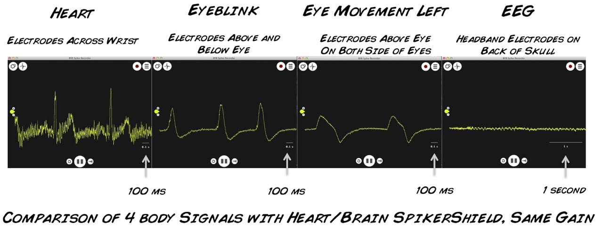](img/Signal_Comparison.jpg)

## Notes

  * In 2017 we had the opportunity to visit Paris, and of course we stopped by the famous Père Lachaise cementary. We said hello to Professor Fourier and thanked him for his important work. 

[ 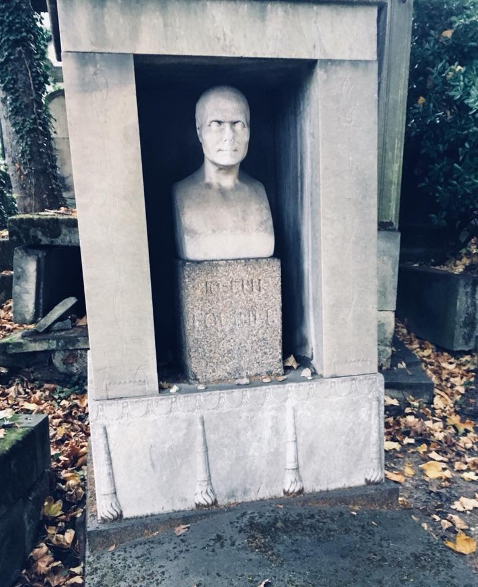](img/JosephFourier-Rests.jpg)