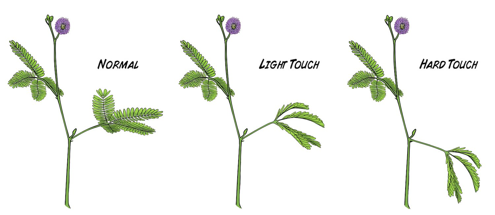
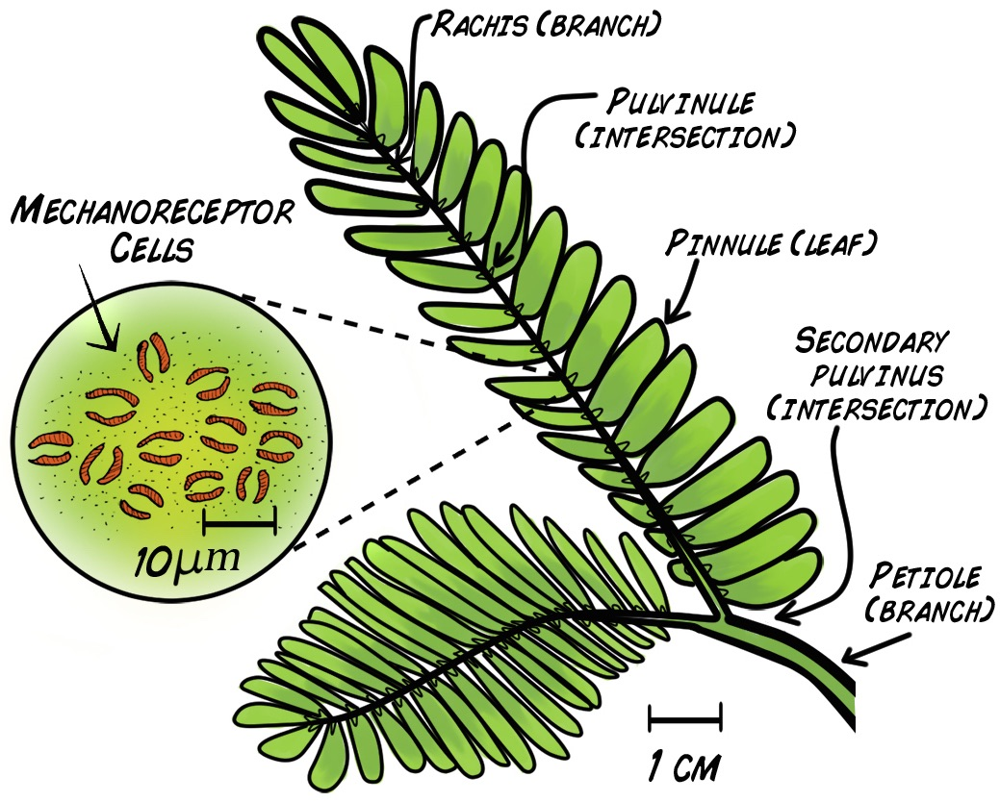
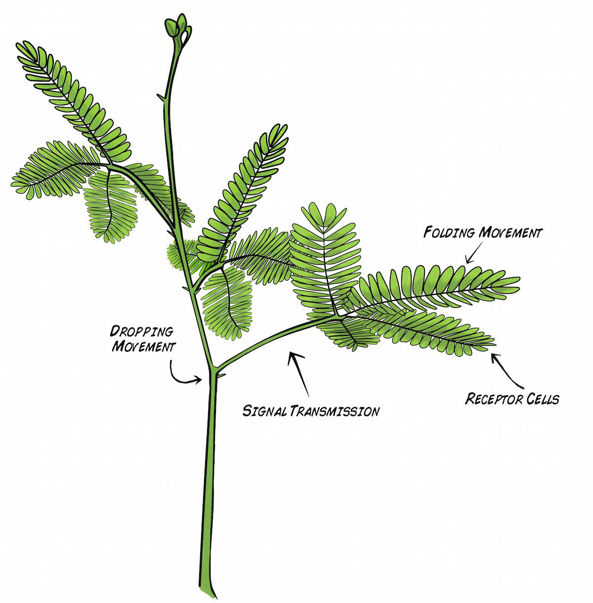
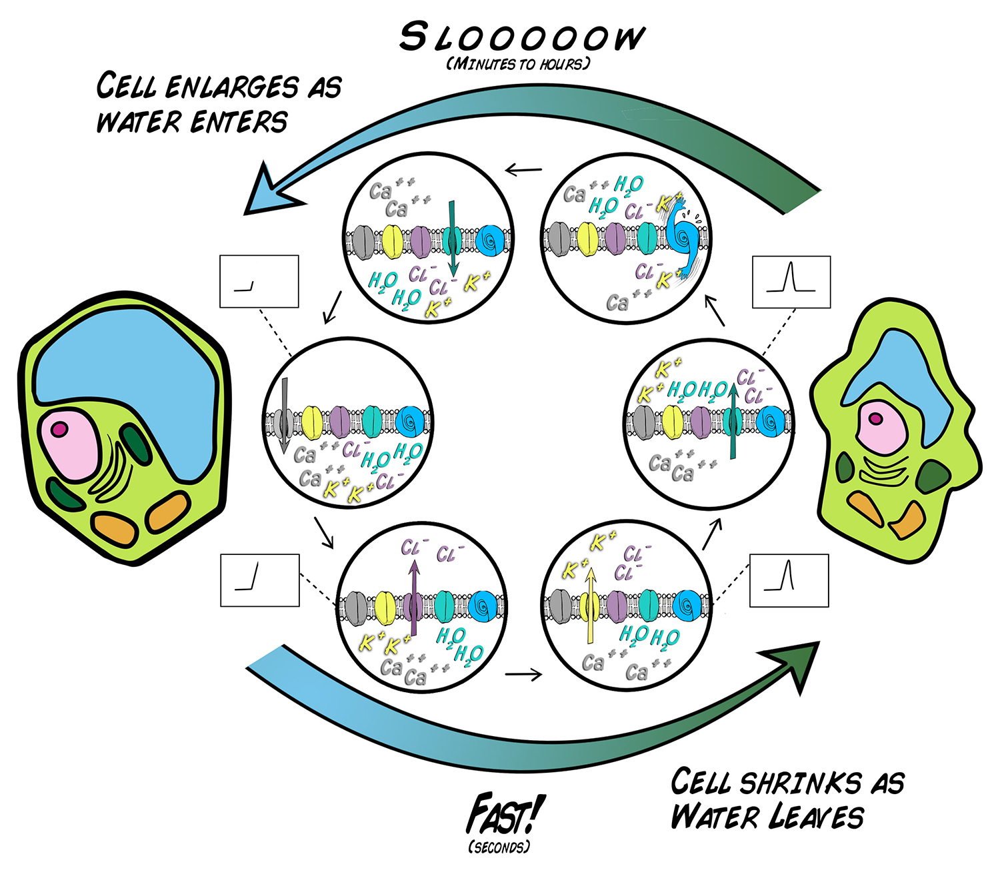
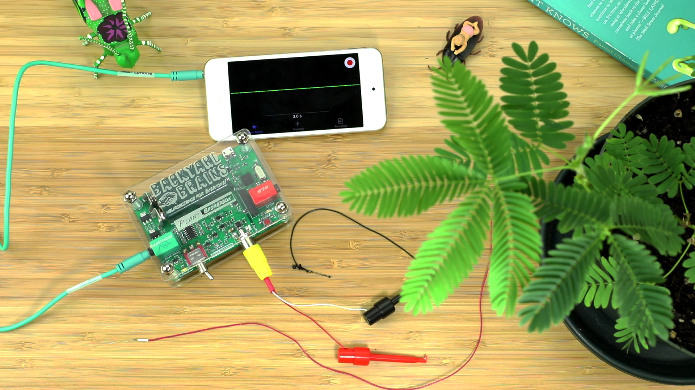
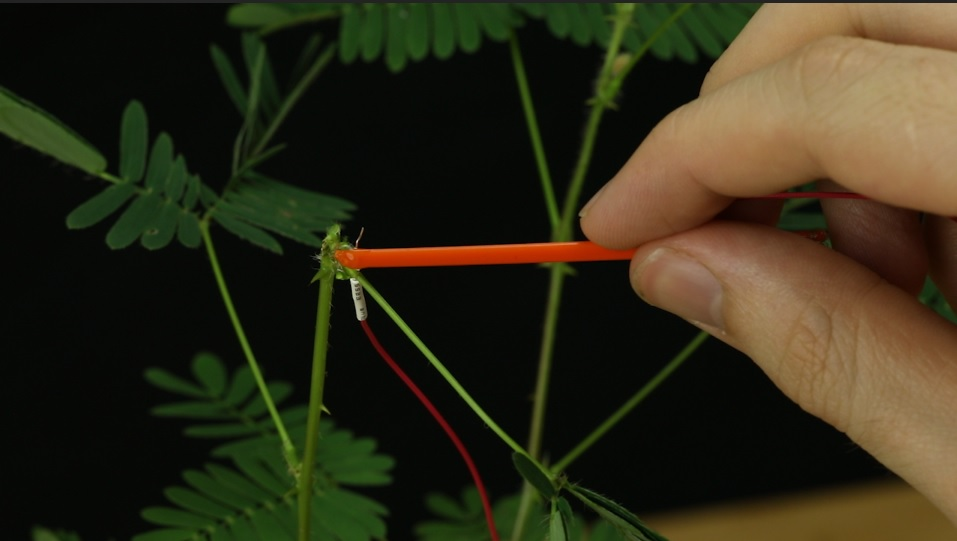
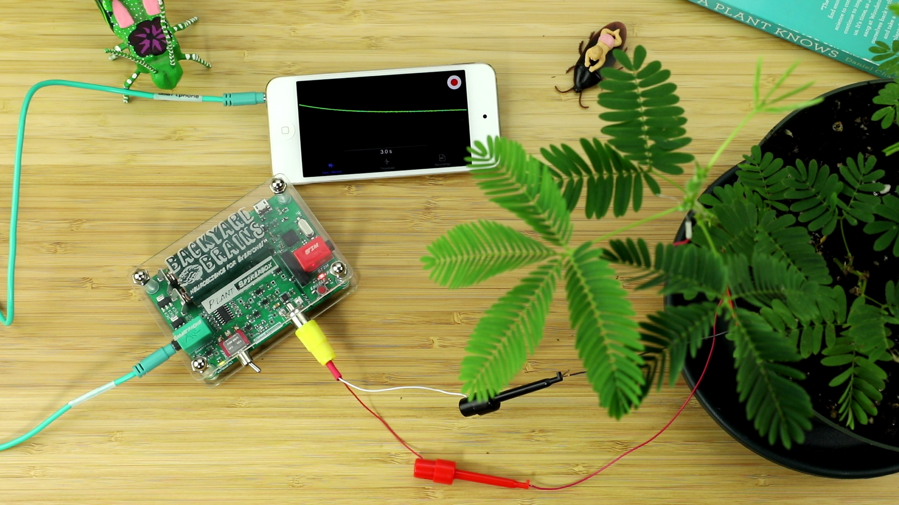
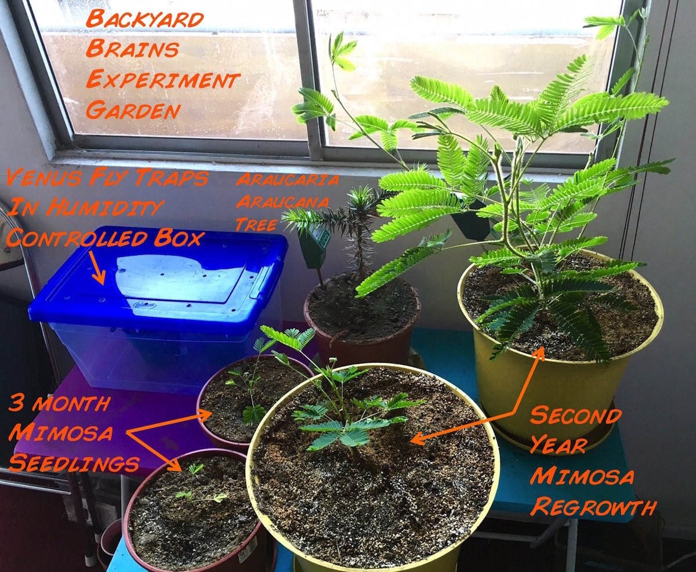

# Experiment:Sensitive Mimosa Pudica Electrophysiology

With the Venus Flytrap experiment, we previously introduced you to plant
electrophysiology, showing that plants can generate electrical impulses too!
We now move to a second exquisite "rapid movement plant" - the Sensitive
Mimosa, featured in our [TED Main
Stage](https://www.ted.com/talks/greg_gage_electrical_experiments_with_plants_that_count_and_communicate?utm_campaign=tedspread
--a&utm_medium=referral&utm_source=tedcomshare) talk.

Time  1 hour

Difficulty  Intermediate

#### What will you learn?

You will learn more details about rapid plant movement, how water is moved
rapidly through cells, plant morphology, and the ion channels used by plants.

##### Prerequisite Labs

  * [ Venus Flytrap Electrophysiology](plants) \- Our Venus Flytrap experiment is easier and serves as a good start to plant electrophysiology before moving to the more challenging Mimosa preparation.

##### Equipment

* [Plant SpikerBox](/https://backyardbrains.com/products/plantspikerbox)

*[Mimosa Seeds](https://www.amazon.com/Package-Sensitive-Compact-Seed-Needs/dp/B00323LXCG/ref=sr_1_1?ie=UTF8&qid=1449965936&sr=8-1&keywords=Mimosa+seeds)

## Background

_Note_ As you cannot normally buy Sensitive Mimosa plant seedlings, you have
to[buy seeds](https://www.amazon.com/Package-Sensitive-Compact-Seed-
Needs/dp/B00323LXCG/ref=sr_1_1?ie=UTF8&qid=1449965936&sr=8-1&keywords=Mimosa+seeds)
and grow them. Mimosas are famously tricky to germinate; See our note at the
bottom of this page for recommendations on Mimosa growth._

With its lovely purple flowers and the hypnotic way the leaves fold when
touched, the Sensitive Mimosa, (_Mimosa Pudica_), has enraptured home
gardeners and plant physiologists alike for its beauty and its unique
behavior.

In a healthy Mimosa plant, you can observe two "rapid movement" responses to
touch. With a **light** touch brushed along the leaves (called _pinnules_),
the leaves fold together at points (_pulvinules_) along the rib (_rachis_).
With a **strong** touch, the leaves will fold and the branch will drop along
the point (_pulvinus_) where the main branch (_petiole_) joins the stem.

How does such dramatic movement occur? How does the plant even detect the
touch to begin with? Hard-working scientists have hypothesized that [ small
red mechanoreceptor cells](files/Visnovitz_2006_Mechanoreceptor_Cells.pdf) on
the underside of the leaves respond to mechanical disturbance. This initiates
an electrical impulse (Action Potential) propagation along the rachis that
results in the plant movement behavior we observe.

With a strong touch, the Action Potential travels along the rachis, down the
petiole, and all the way to the main joint (_pulvinus_) via "phloem tubes."
The exact nature of this signal propagation is still actively being
investigated.

But how then do the plants actually move? Since plants do not have
[muscles](muscleSpikerBox) like we do, plant movement occurs through hydraulic
forces (the flow of water). Plant cells have special large organs called
"[vacuoles](https://en.wikipedia.org/wiki/Vacuole)" which are filled with
water and can make up 70-80% of the cell volume. Plants thus have developed
ways to rapidly move water in and out of the the vacuoles through special
transport channels in their cell walls called
"[aquaporins](https://en.wikipedia.org/wiki/Aquaporin)." These are like ion
channels, but instead of permitting ions to flow across membranes, they permit
the rapid flow of water. As such, plants capable of rapid movement quickly
flush water out of select cells. Such efflux of water shrinks the cell, and
the shrinking of multiple cells at once, depending on location in the plant,
can cause a mechanical strain that results in rapid movement.

What initiates the water movement to begin with? Why, the Action Potential
itself! The movement of ions across the cell membrane, which causes the Action
Potential we observe, also creates the osmotic imbalance that results in water
movement

The illustration below depicts this process. The Action Potential begins with
an increase in the intracellular calcium levels, which, being positively
charged, makes the voltage on inside of the cell more positive. This increase
in voltage then opens the voltage Sensitive chloride channels, causing
chloride to flow out of the cell, making the inside of the plant cell yet even
more positive. In response to this chloride efflux, potassium channels then
open to permit potassium to also flow out of the plant cell. Since potassium
is positively charged, this restores the resting potential and balances the
chloride charges.

Buuuuuttttt...we now have an ionic situation the plant cell can exploit_ an
excess of chloride and potassium ion are now outside the cells, or, we have an
[osmotic imbalance](https://en.wikipedia.org/wiki/Osmotic_pressure). Through
the aquaporins, Water will then "chase" the potassium and chlorine ions,
causing the plant cells to lose water rapidly, shrink, and, ultimately, result
in the rapid movement of plant structures.

After the cells have shrunk, they can be refilled with water again by moving
the chloride and potassium ions back into the cells, but this requires energy
expenditure and is a slower process. In Mimosas, this takes ~10 minutes, in
Venus Flytraps_ ~1-2 days.

We will now observe and measure the behavior and electrophysiology of the
Sensitive Mimosa. Join us as we continually expand our plant electrophysiology
knowledge!

#### Downloads

> Before you begin, make sure you have the [Backyard Brains
> SpikeRecorder](https://backyardbrains.com/products/spikerecorder). The
> Backyard Brains SpikeRecorder program allows you to visualize and save the
> data on your computer when doing experiments.
>
> [SpikeRecorder Software for Displaying and Saving Data on
> Computer](https://backyardbrains.com/products/spikerecorder)

## Tutorial Video of Experiment

## Procedure

In this experiment, you will measure the Action Potentials generated at the
stem/petiole joint of Mimosa plants.

  1. Grab your [Plant SpikerBox](https://www.backyardbrains.com/products/plantspikershield) and select from the kit the materials you will need_ One long red recording wire with silver tip, one grounding pin with long black wire, yellow RCA jack with recording electrode clips, and conductive electrode gel. 

  2. Take the red wire with the silver tip and carefully, wrap the silver tip snugly around a large Mimosa branch. Try to wrap it close to the joint where the branch meets the stem. This will probably cause the branch to “fall” as you fumble to wrap the electrode. That’s okay, you just have to wait 10-20m for it to reset before performing the experiment. 

  3. Place some conductive gel along the silver wire electrode you wrapped around the pbranch. Note_ We have noticed that placement of excessive conductive gel (perhaps due to ionic shunting?) prevents movement of the branch. Place only a dab of conductive gel along the silver wire electrode. 

  4. Put the black grounding pin with long black wire in the...wait for it...ground of the plant pot. 
  5. Plug the yellow RCA jack with black and red electrode clips into the Plant SpikerBox. Attach the Red clip to the red recording wire and the black clip to the black grounding wire. 

  6. Wait about 10 minutes for the plant to recover from its droopping movement. As said before, an advantage of the Sensitive Mimosa is that, unlike the Venus Flytrap, it only takes 10 minutes to recover instead of 1-2 days. 
  7. Connect your Plant SpikerBox to your Smartphone (via Green Smartphone Cable) or PC (via Blue USB Cable). 

  8. Open our SpikeRecorder software. If on a Smartphone, you are ready to go! If on the PC, pair your SpikerBox with SpikeRecorder by clicking the "Plant" button in the upper left corner. 
  9. Press the "Record" button (red button on top right of screen) to begin a recording. 
  10. With a plastic probe, a pen, or your finger, forcefully tap or flick the leaves of the branch you are recording from. The plant branch should drop in a dramatic fashion, and, in the SpikeRecorder software, you should notice a large slow spike! Congratulations! you have just recorded an Action Potential in the Mimosa! 

  11. If your Action Potential is too big, resulting in "flat tops," either pinch to reduce the scale on your smartphone display, or on a computer click the minus button on the SpikeRecorder display. Similarly, if it is small, you can zoom in to better see the shape of the Spike. 
  12. To analyze the data, such as the duration and amplitude of the plant Action Potential, you can open your .wav recording files by clicking the "open button" (looks like three horizontal lines) next to the "record button" on your laptop. On your phone, select the "recordings" tab. 
  13. Now go investigate further the electrophysiology of the Mimosa and make new discoveries! 

## Discussion / Further Work

* Cold stimuli supposedly also affect the Mimosa. If cold water is applied to the soil, does this cause Action Potential propagation and branch movement? 
* We stated above that excessive gel will actually prevent branch movement. Why could this be? Perhaps because conductive gel contains ionic elements and can affect the osmotic pressure? 
* In the osmosis figure, the inside of the cell becomes more positive initially due to the chloride ion efflux. But, in our recordings, which were done outside the cells, we also noticed an increase. It should be in reverse? We should be observing a decrease in potential. Why is this? We are unsure. 
* Now that we have studied the two most famous "rapid movement plants," an obvious next step is to study the electrical impulses of other "normal" plants that don't have rapid movement properties. This is a more difficult experiment. Why? 
* While the molecular biology is completely different between muscles and plant cells, it is interesting that an [Action Potential](muscleAP) in animal muscles is also what initiates movement. 
* Sometimes we see mysterious "double Action Potentials." What could these be? 

## Notes on Growing Mimosas

We have been growing Mimosa plants in various attempts for the last three
years, and below we summarize our efforts to ensure generation. A surprise to
us was our observation that the Mimosas have [very deep
roots](img/Mimosa_Roots_web.jpg), notable while the seedlings are still small.
We present our growing recommendations, and [let us
know](mailto_tim@backyardbrains.com) if you have any insider tips.

  1. The seeds are fairly easy to obtain, you can purchase them on [Amazon](https://www.amazon.com/Package-Sensitive-Compact-Seed-Needs/dp/B00323LXCG/ref=sr_1_1?ie=UTF8&qid=1448571799&sr=8-1&keywords=Mimosa+seeds), but the germination rate is not high. We have only observed that only 10-20% of the seeds will germinate, and of, these, only 1/3 will survive the seedling phase. 
  2. With a pair of pliers, lightly compress a seed to cause the hard outer shell to "crack." This will allow water to diffuse into the seed more readily and cause germination. 
  3. Place about 50 "cracked" seeds between two layers of soaked paper towels, to make a "moist paper towel - Mimosa seed - moist paper towel" sandwich. 
  4. Keep the towels moist everyday, and everyday, check the seeds to see if you observe small white "rootlets" coming out of the seeds. This is a sign of germination. This can take 3 days to 3 weeks to occur (seriously). 
  5. Place any seeds with rootlets in medium-sized pots. Keep the soil moist. We usually put three to a pot, as typically only one will survive anyway. 
  6. Once the Mimosas reach 2-4 cm (~1-1.5 inches) in height, with [three-four small branches](img/Mimosa_seedling_web.jpg), you have survived the most difficult part. Now care for the Mimosa as you would any other plant, giving it sunlight and water, and transplanting it to a large pot, is it has very deep roots. 
  7. After summer flowering and the arrival of fall, the leaves will yellow and whither away, leaving a plant structure consisting of nothing more than stems and sticks. We thought our plants were annuals and thus had died... but when we cut the stem, the inside was still vibrant green! And indeed, when spring arrived, the plants began growing new branches and leaves! We have two plants that are now in their second year, appearing thus to be perennials. It is worth maintaining healthy Mimosas indefinitely once you have them, as we have said before, the hardest part of cultivation is the germination of the seeds. 

