# Experiment:Signal Classification

Here we will teach how to isolate activity of individual finger muscles of
your forearm and use them to control a robotic hand. You will be introduced to
the wonderful challenge of "signal classification."

Time  90 minutes

Difficulty  Advanced

#### What will you learn?

This is a continuation of our
[Neuroprosthetics](https://www.backyardbrains.com/experiments/neuroprosthetics)
and [EMG SpikerShield](https://backyardbrains.com/experiments/emgspikershield)
experiments; only now, you will use multiple EMG Signals from your forearm to
attempt to control individual fingers on a robotic hand.

##### Prerequisite Labs

  * [EMG SpikerShield](emgspikershield) \- You should learn about how we amplify muscle signals and decode them in single channel settings.

##### Equipment

HackerHand 5-Channel EMG + SpikerShield System (retired for time being)

* * *

## Background

_Note_ This experiment refers to a prototype multichannel amplifier and
robotic hand that we previously released as a developmental beta project. We
leave this experiment up for current beta users as we re-engineer the control
software._

The field of NeuroProsthetics is growing rapidly as neuroscientists and
engineers learn how to interface with and exploit the intrinsic electrical
signals of neurons and muscles to control mechanical and computational
devices. We have previously shown experiments where you can control lights,
gripper hands, and even other humans! But, these were all one channel
interfaces using gross muscle activity to control one object. However, what if
we wanted finer control, what if we wanted to control multiple "degrees of
freedom," such as individual finger movements of a robotic hand, or multiple
joints of a robotic arm?

The human hand is an exquisite instrument allowing you to pick up a soldering
iron and precisely position it to build very small electronics, **and** it can
maintain a grip force equivalent of your own body weight. The muscular anatomy
has fascinated medical scientists from antiquity to the present day.

[ 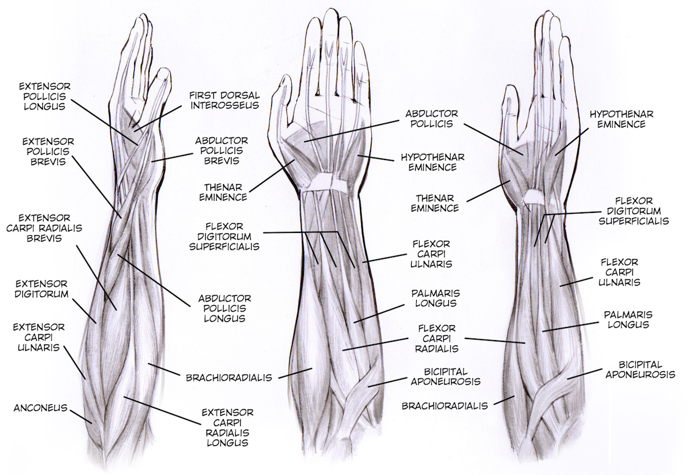](img/musculatura_brazos_web.jpg)

You can see the hand has muscles "inside of it" (intrinsic) and "outside of
it" (extrinsic). Here we are looking at the inner forearm, which has the
muscles that can allow "flexion" (curling of fingers, wrist, gripping, etc).

If we attached the one-channel SpikerShield to our arm and tried to control
individual fingers of a robotic hand by moving our own fingers, do you think
we could control each finger distinctly? We couldn't, because we would be
recording the activity of many muscle groups at the same time. To isolate
individual muscles that control each finger, we need to put multiple
electrodes on the forearm and use a bit of "signal classication theory".

If we place five electrode pairs on various parts of the arm, as we have
determined through experiment below_

[ 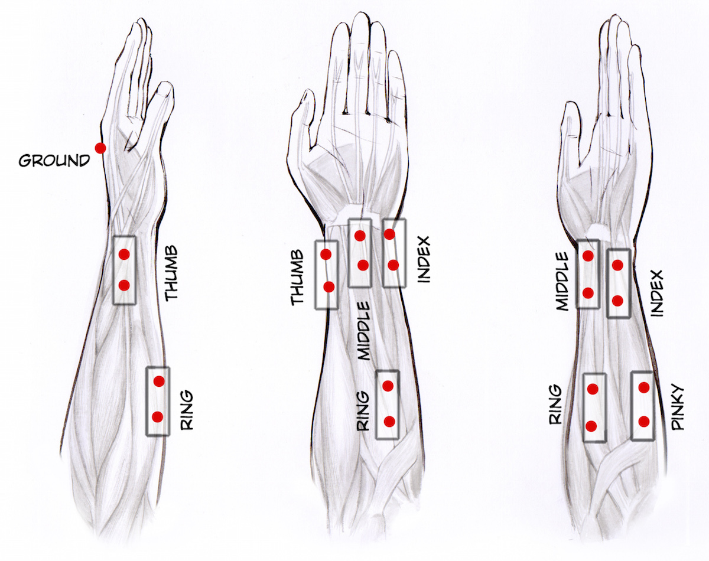](img/electrodos_brazos_web.jpg)

We can record different "levels of EMG" in the 5 channels that give distinct
patterns to individual finger movements that we can try to decode!
Enterprising electrical engineering graduate students often obtain Ph.D.
dissertations by studying and inventory new types of signal classification
algorithms, and now you can too! We are fans of Kalman filters, PCA, ICA, and
ANNs.

[
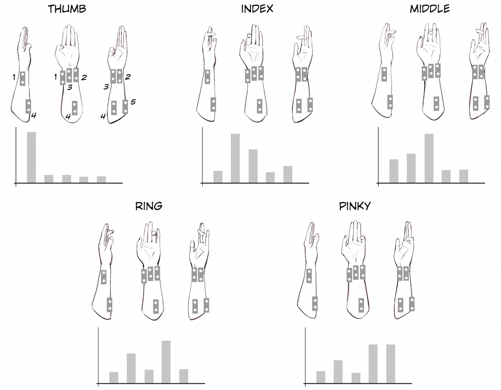](img/representacion_graficos_web.jpg)

At present we are implementing [euclidean
distance](https://en.wikipedia.org/wiki/Euclidean_distance) and [support
vector machine](https://en.wikipedia.org/wiki/Support_vector_machine)
algorithms to isolate individual finger movements to control individual
fingers of a robotic hand.

[ 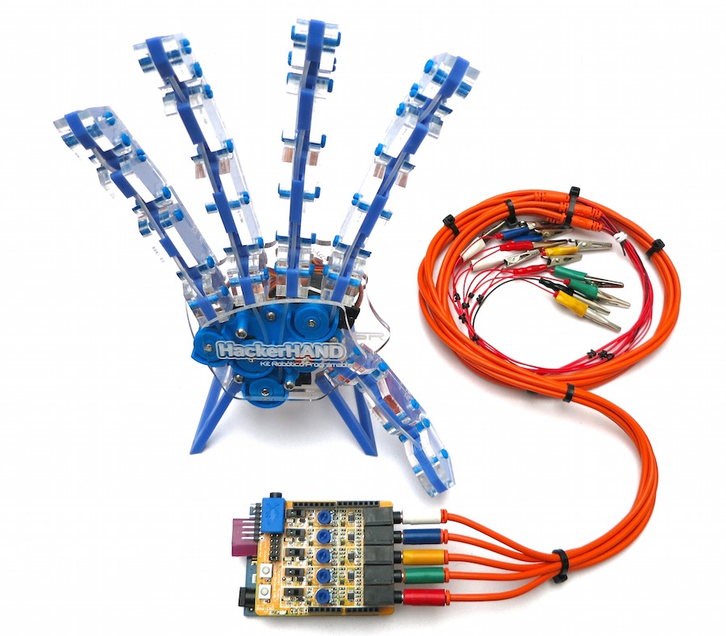](img/HackerHand_View2_web.jpg)

#### Downloads

> Below are two Arduino Sketches. "Control Arduino Sketch" is an Arduino
> sketch students can use to read the multichannel Arduino values in the
> serial monitor and build rules for enabling figure contraction (servo motor
> movement). "Random Mode Arduino Sketch", operates the hand in "random mode"
> for demos without human control. Normally the fingers move in a random
> continuous loop, but the inner button on your 5 Channel Board causes the
> hand to make a peace sign, and the outer button causes a fist.
>
> [Arduino Software](https://arduino.cc/en/main/software#.Uxd6XYWhZMk)
>
> Download our Arduino(.ino) sketches and Control Software
>
> [ Control Arduino
> Sketch](https://backyardbrains.com/products/files/HackerHand_Arduino_v0_BB_Oct2016.ino.zip)
>
> [Random Mode Arduino
> Sketch](https://backyardbrains.com/products/files/HackerHand_Test_FingersLoop_FistPeaceV2.ino.zip)

## Video

_The video below shows a development version of the software (see legacy links
below) we hope to redesign._

### Procedure (Summer 2015)

  1. Your HackerHand System came with a Ribbon Cable with different endings on either side. Insert the Linear End (blue stripe on left) in the connector on the back of the hand. 

[ 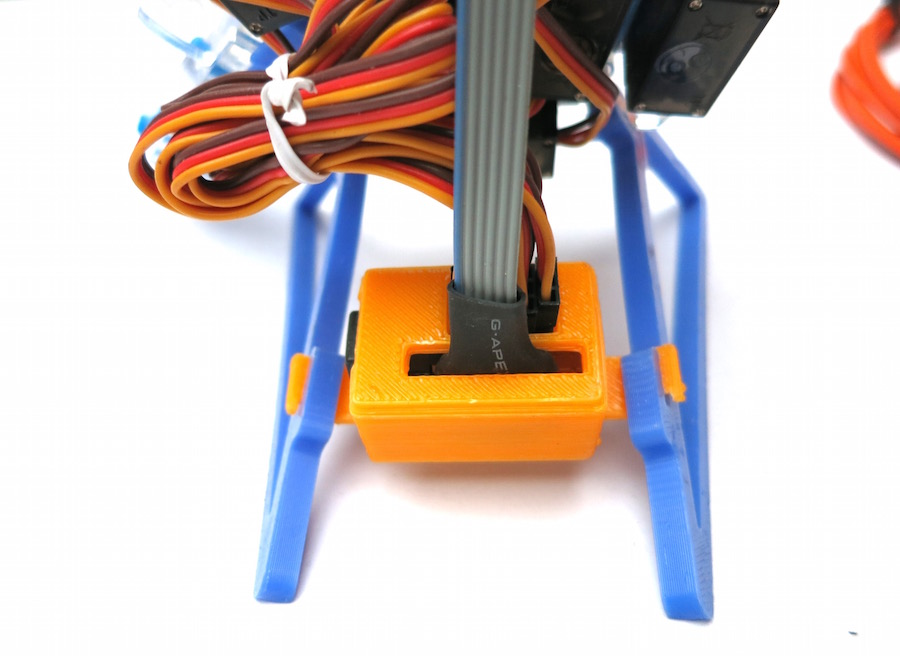](img/HH-RibbonBack.jpg)

  2. And plug in your power cord with the barrel style connector on the hand. Attach other end of the power cord to your USB battery. Since the Hand has five hungry servo motors, it needs its own power supply. 

[ 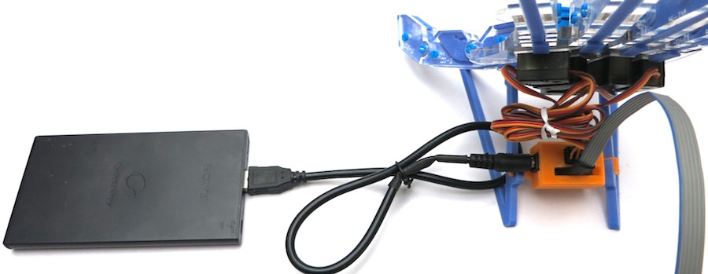](img/HH-PowerCord.jpg)

  3. Plug the other end of the ribbon cable to the connector on the Shield that is close to the audio out. There is a mark of red paint that identifies the orientation of the plug. Use the photo below as a guide. 

[ 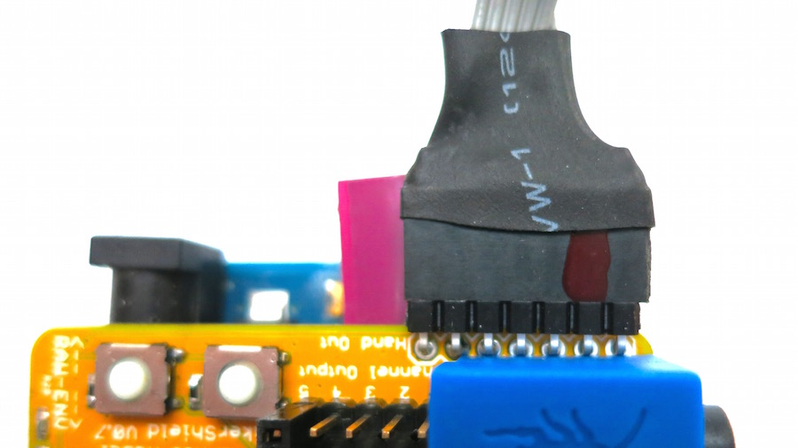](img/HH-BoardConnection.jpg)

  4. Plug the other USB cable into the back of the 5-Channel EMG Board. 

[ 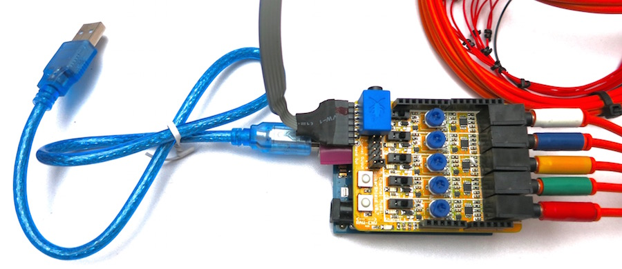](img/HH-PluggingInUSB.jpg)

  5. Plug the other side of the USB Cable into the computer, and you are ready to begin your first test! Load the [Random Mode Arduino Sketch](https://backyardbrains.com/products/files/HackerHand_Test_FingersLoop_FistPeaceV2.ino.zip) (also above) on your Arduino, turn the USB battery on that gives power to the Hand Server Motors, and you should see the fingers begin to move in a hypnotic random fashion! The inner button on your 5 Channel Board also causes the hand to make a peace sign, and the outer button causes a fist. 
  6. Now it is time to wire yourself up. Plug in the electrode cables. Note colored tape labels. 

[ 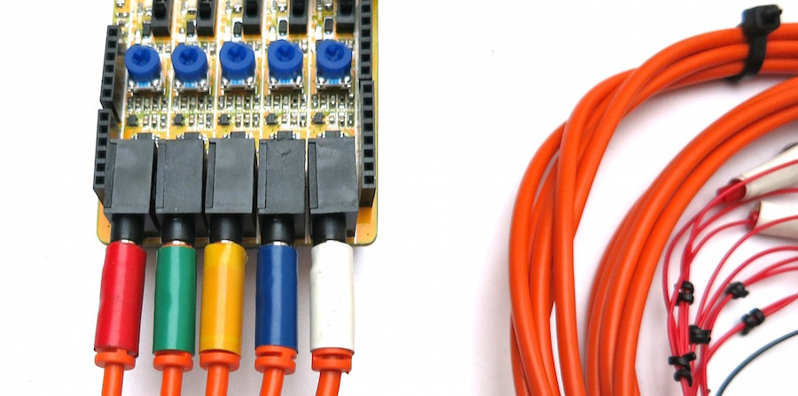](img/HH-EMG-Cables.jpg)

  7. And now it's time to hook up the electrode stickers to your forearm. Place the 11 electrodes on your arm using the photos below or the illustration above as your guide. 

[ 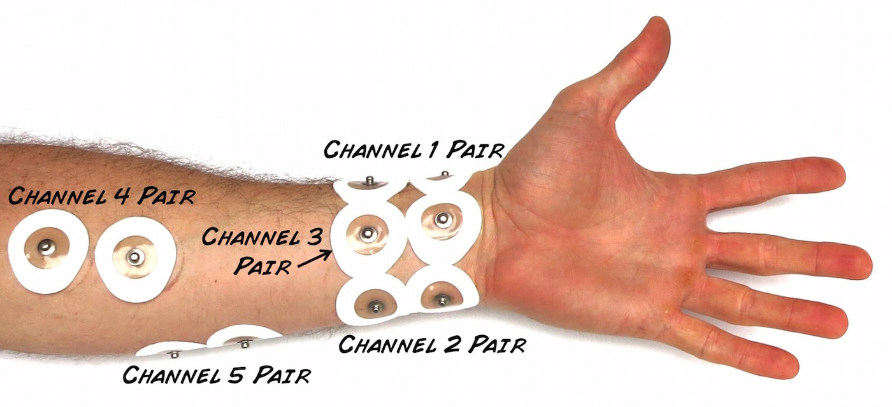](img/HH-Electrodes_on_Hands-
labelled.jpg)

[ 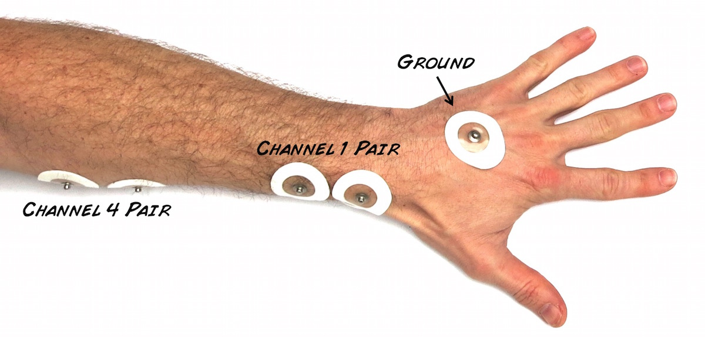](img/HH-Ground_on_Hand-
labelled.jpg)

  8. It's time to interface the machine to your muscles. Connect the electrode cables to sticker electrodes as shown below.The red alligators go the thumb position (channel 1), green to the index position (channel 2), yellow to the middle position (channel 3), blue to the ring position (channel 4), and white to the pinky position (channel 5). Ground (black clip) goes on the electrode sticker placed on the back of your hand. 

[ 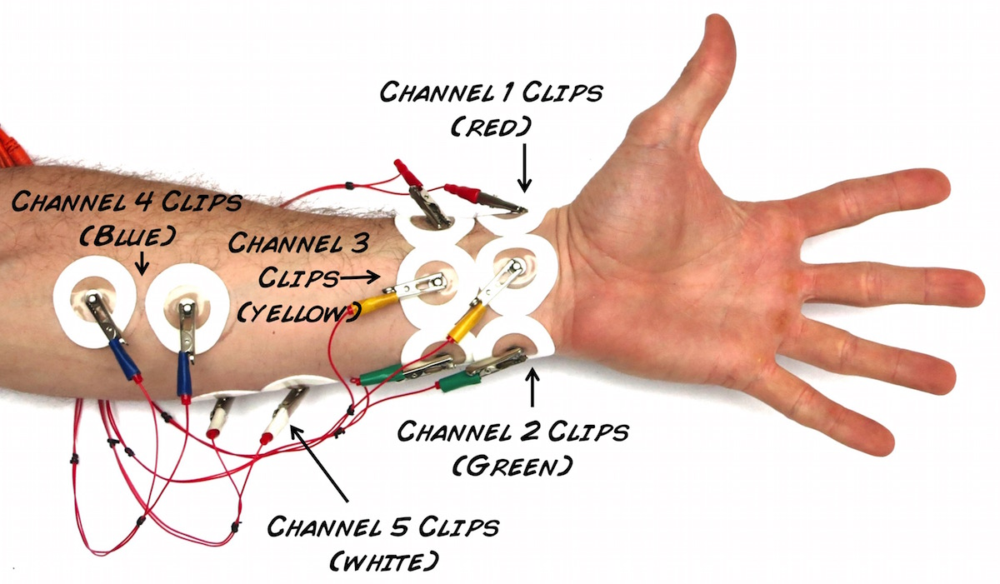](img/HH-Cables_Plugged_In-
labelled.jpg)

[ 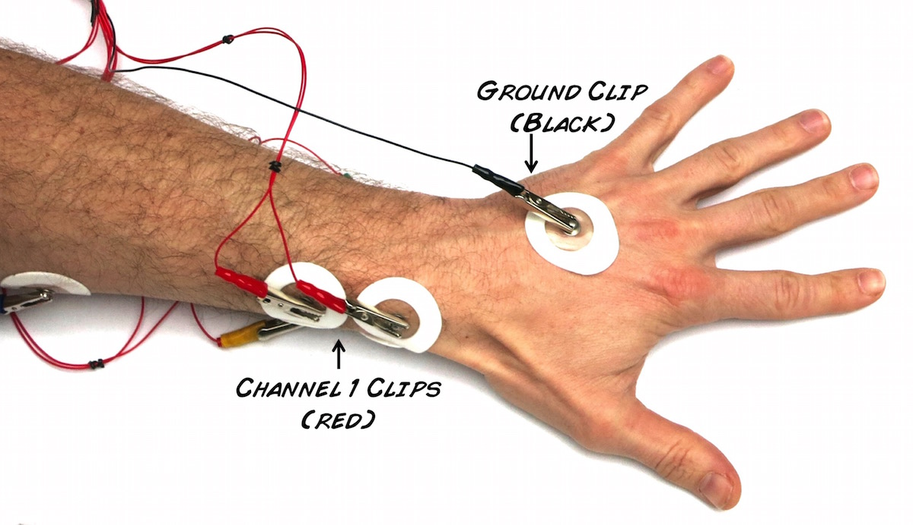](img/HH-Ground-Cable_labelled.jpg)

  9. Load the [Human Control Arduino Sketch](https://backyardbrains.com/products/files/HackerHand_Arduino_2.7.ino.zip) (also above) on your Arduino. 
  10. With your Arduino loaded with the control Code, open our [BYB HackerHand Control (MacOS)](https://backyardbrains.com/products/files/BYB_HackerHand_Control_v2.7.zip) software on your laptop. As you move your fingers, you should see the levels for each channel change. 

[ 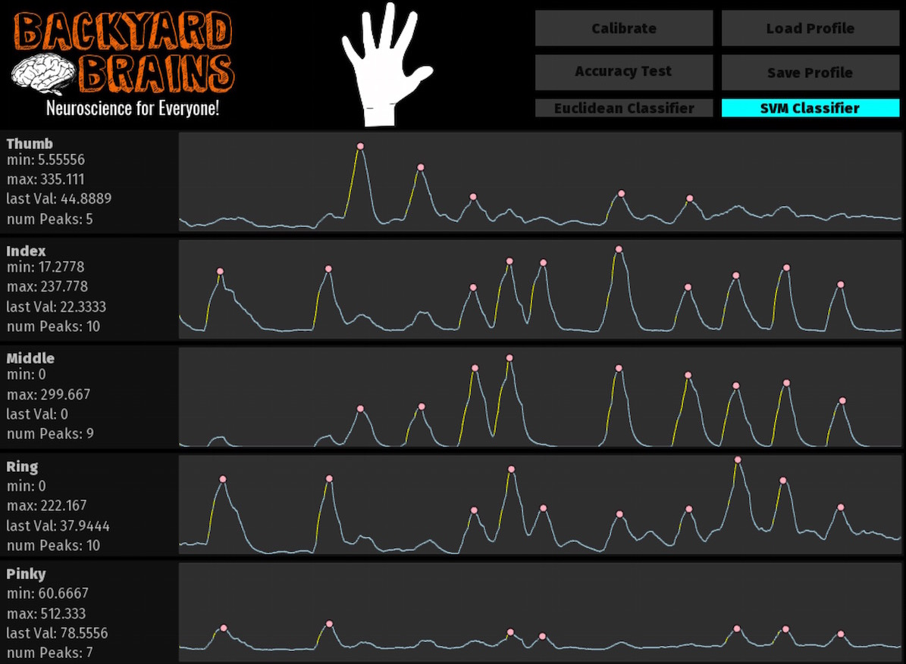](img/HH-ControlSoftware-
LevelsChange.jpg)

  11. Press the "Calibrate" Button and follow the On-Screen Instructions 

[ 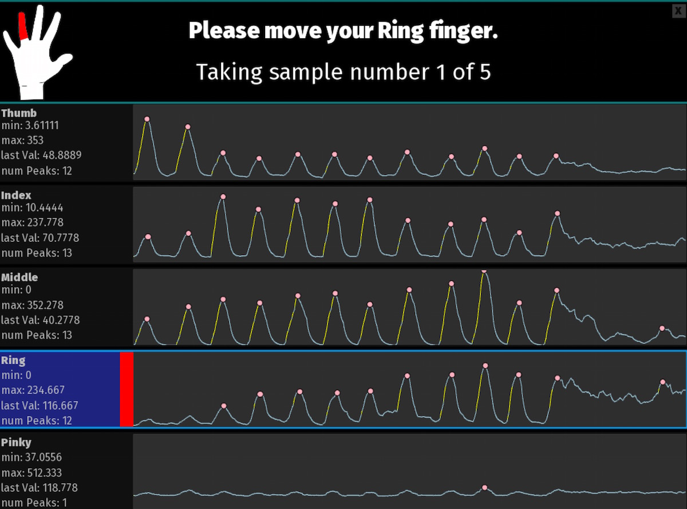](img/HH-ControlSoftware-
Calibrate.jpg)

  12. You are now in control mode! You can switch between the SVM and Euclidean Distance algorithms. Move your fingers in discrete movements. If the algorithms are working, the corresponding fingers on the robotic hand should correspondingly move. 
  13. You can test the accuracy of our software by touching the "Accuracy Button" and following the on-screen instructions. 
  14. Welcome down the rabbit hole of Signal Classification! 

## Science Fair Project ideas

  * While we have achieved a level of control here, we would of course like the hand to mimic more complex motions of hands (like more fingers moving at the same time, hands forming a fist, a peace sign, and others). Why are these more difficult to do? 
  * If all we want to do is track hand and finger movements, is EMG the best signal for this? Are there other technologies that are advancing very quickly? Computer vision, perhaps.... 
  * Why do we need to go through all this signal classification? What do you think would happen if we didn't? 
  * We're hooking up to the forearm, but not everybody who needs a hand has a forearm they can use. Can you control the hand with muscles farther up your arm? Biceps? Shoulder muscles? 

_Note1_ _ Gracias to [Italo Ahumada
Morasky](https://www.italoahumada.cl/about/), a Chilean artist who illustrated
this experiment with us.

_Note2_ _ Thanks to Professor DJ Brasier and his students at Carnegie Mellon
for providing a easily-understandable and hackable control Arduino Sketch
(above.)

#### Legacy Downloads

> **The software below is no longer supported as new software strategies are
> being researched. If you would like to download this legacy software, we
> leave it available.** The Arduino "Human Control Arduino Sketch" is what you
> install on your Arduino circuit board using the Arduino laptop software;
> this allows the Shield to EMG signal and send them to the computer, and the
> "BYB HackerHand Control" is our software that talks to the EMG SpikerShield,
> controls the Hacker Hand, and does the signal classification.
>
> [Arduino Software](https://arduino.cc/en/main/software#.Uxd6XYWhZMk)
>
> Download our Arduino(.ino) sketches and Control Software
>
> [Human Control Arduino
> Sketch](https://backyardbrains.com/products/files/HackerHand_Arduino_v2.7.ino.zip)
>
> [BYB HackerHand Control (beta)
> (MacOS)](https://backyardbrains.com/products/files/BYB_HackerHand_Control_v2.7.zip)
>
> [BYB HackerHand Control (alpha) (Windows
> 8)](https://backyardbrains.com/products/files/BYB_HackerHand_Control_Win8_Installer.EXE.zip)
>
> [GitHub Source Code Repository (whole
> project)](https://github.com/TimByB/HackerHand-Control)
>
> [GitHub Source Code Repository (Mac
> Version)](https://github.com/TimByB/HackerHand-Control/releases/tag/1.2)

#### Twitter

#### Recent Posts

  * [ It's The Backyard Brains 10-Year Anniversary!](https://blog.backyardbrains.com/?p=4906)
  * [ Cincinnati Neuroscience Outreach by BYB Alumna](https://blog.backyardbrains.com/?p=4870)
  * [ First Place at Science Fair for Student using BYB Gear](https://blog.backyardbrains.com/?p=4861)

#### BYB Information

  * [Spike Counter](/About/SpikeCounter)
  * [Contact](/About/Contact)
  * [FAQ](/About/FAQ)
  * [Our Finances](/About/Finance)
  * [Privacy Policy](/About/Privacy)

* * *

Copyright © 2009-2017 [ Backyard Brains](https://backyardbrains.com) | Protected under the Creative Common License 