# Experiment:The Beginning of Modern Neuroscience - The Galvani/Volta
Debate

One of our first experiments was the "[dancing cockroach
leg](https://backyardbrains.com/experiments/microstimulation)" in which nerves
and muscles of a cockroach leg could be electrically excited by the output of
an mp3 player. But let's go further back. Way back. To 1780. To Northern
Italy.

Time  30 minutes

Difficulty  Beginner

#### What will you learn?

In this lab you will recreate the famous experiments of Galvani and Volta. You
will build a replica of the very first battery, invented by Volta and which
began the electronics revolution that continues today, and you will use it to
to stimulate the nerves of a cockroach leg, in an adaptation of Luigi
Galvani's famous frog leg experiments that began the NeuroRevolution still
manifesting.

##### Prerequisite Labs

  * You are starting from zero. You are beginning the field of neuroscience. There are no previous experiments to do. 

##### Equipment

* [Galvani/Volta Replica Kit](/https://backyardbrains.com/products/galvanivoltakit)
* [Cockroaches](/https://backyardbrains.com/products/cockroaches)

## Background

In our previous [microsimulation
experiment](https://backyardbrains.com/experiments/microstimulation) we
plugged the audio cable of an mp3 player directly into pins inserted into a
cockroach leg. The electrical waves of the music then excited the nerves and
muscles of the leg, causing the leg to appear to "dance" to the low
frequencies (the beat) of pop music. This worked because an mp3 player is
capable at max volume of sending out oscillating voltage signals at 1.3 V,
which is sufficient to excite nerves and muscle at the music frequencies below
200 Hz (the bass). This was a modern interpretation of Luigi Galvani's famous
frog leg experiments, but we have now found the experiment can be made more
educationally and emotionally compelling by building our own voltage source
(battery) out of common materials - a potato, a sheet of aluminum, and a sheet
of copper. In this variation, we are building a replica of Volta's "Voltaic
Pile" and using it to stimulate the cockroach leg, as a remake of the famous
debate between the two scientists.

Our differences are minor_ 1) We won't need to sacrifice frogs like Galvani
did. Rather, we will remove a hind leg from a cockroach, which the cockroach
can easily tolerate, continue walking, eating, being a cockroach, and,
moreover, will [regrow a new hind
leg](https://journals.plos.org/plosone/article?id=10.1371/journal.pone.0146778)
within 125 days, and 2) Volta's "Pile" used alternating layers of copper and
**zinc** separated by cardboard soaked with salty water. We will use
alternating layers of copper and **aluminum** , as aluminum sheeting is easier
to find in art/hardware supply stores. Also, using cardboard soaked with salty
water (a salt battery) can be leaky and difficult to manage, and thus we will
use slices of fresh potatoes as a weakly acidic conductor (acid battery),
which maintains moisture quite well and does not drip.

[ 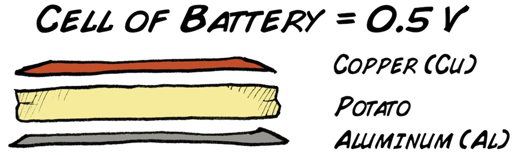](img/CellOfBattery_web.jpg)

Aluminum, potatoes, electricity... _what?_ Yes, placing a slice of fresh
potato between a plate of copper and a plate of aluminum will enable electron
flow that we can harvest. Aluminum, being the anode, loses electrons
(_oxidation_). The electrons flow through the acidic bridge (the potato) to
the surface of the copper plate, which, being the cathode, gains electrons
(_reduction_). What is the potato doing? By being electrically conductive and
slightly acidic, it permits electron transfer from the aluminum to the copper
via the H+ ions (the hydrogen ions are reduced to hydrogen gas H2). The
voltage that this homemade battery generates is not very high (0.5 volts), and
the current is very low (~1 mA - our lab voltmeters are not even sensitive
enough to reliably measure it) but the battery is sufficient to stimulate a
cockroach leg or turn on an LED if multiple copper-potato-aluminum cells are
"piled" up.

[ 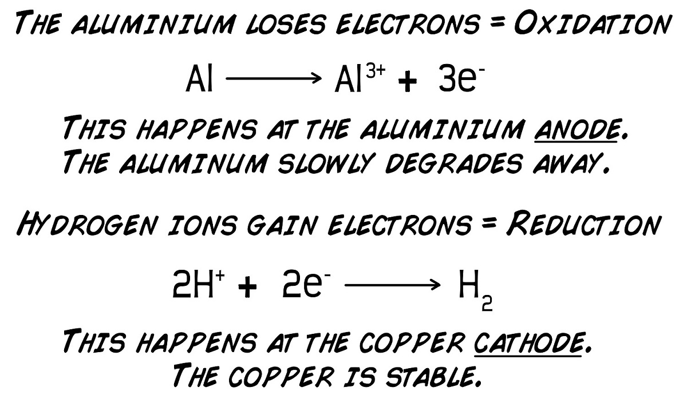](img/Electrochemistry.jpg)

But let us consider the historical context. What motivated Galvani to even
examine the electrical excitability of nerves in the first place? What was the
knowledge of his time? Systematic study of electricity as "something" was just
beginning in the 18th century in Europe. Some clues were eternally present.
The ancient Greeks had observed odd properties of substances living and
material. For instance, Amber is an excretion of certain trees in response to
wounds and was made famous by the movie [Jurassic
park](https://en.wikipedia.org/wiki/Jurassic_Park_\(film\)). When rubbed with
a piece of cloth or hair, hardened amber will attract small particles of dust,
and indeed the Greek word for amber is "elektron". Mediterranean peoples had
also long known of the strange properties of the [torpedo
fish](https://en.wikipedia.org/wiki/Common_torpedo) that lived in coastal
areas and caused stinging sensations when bothered (the fish uses electrical
shocks for attack and defense behaviors [1]).

But what is happening exactly when the torpedo fish "shocks" someone? And how
is amber able to attract dust? Are the two phenomena even related? And do they
have anything to do with the lightning of electrical storms? For that matter,
what is even going on in [lodestones](https://en.wikipedia.org/wiki/Lodestone)
(naturally occurring magnets). Such questions were very of the age in 18th
century Europe. The [Leyden Jar](https://en.wikipedia.org/wiki/Leyden_jar)
(the first capacitor) had been invented in the 1740's, and reliable
[electrostatic friction
machines](https://en.wikipedia.org/wiki/Electrostatic_generator) (machines
capability of generating electrical sparks) had recently just been invented as
well.

[ 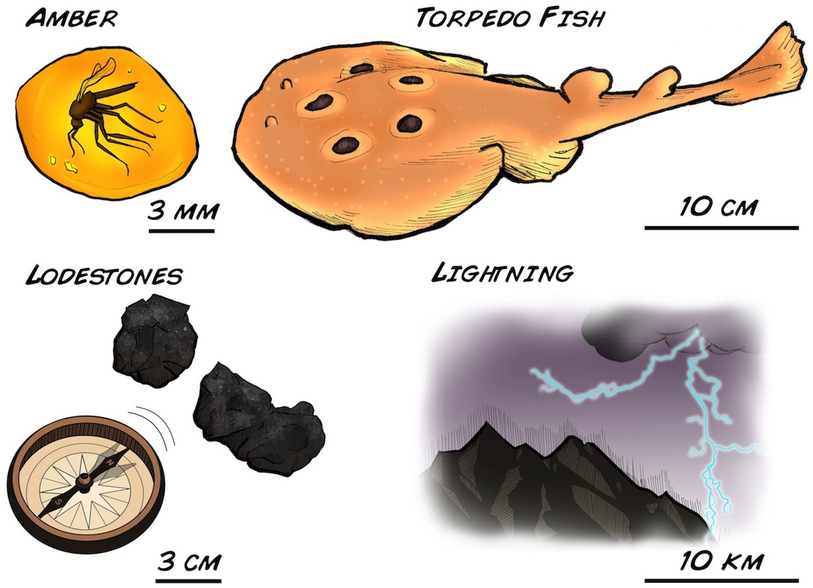](img/AmberFishLodestone_web.jpg)

Interested in the possible connection between electricity and living beings,
Bologna physician and professor Luigi Galvani began studying
"electrophysiology" in 1780. He was aware of previous experiments by other
Italian scientist Tommaso Laghi, who observed in 1757 that electrical
stimulation of nerves caused muscle contraction. Using a common frog leg
preparation in which the muscle and nerve tissue are viable for a number of
hours, Galvani decided to systematically study this phenomenon in more detail,
leading to the recognition that we give him today.

The majority of Luigi's experiments involved connecting the frog legs to
capacitors and metallic loops during the 1780's, which are described in detail
in his 1791 magnum opus_ "De viribus electricitatis in motu musculari
commentarius" - translated from Latin to "Commentary on the Force of
Electricity on Muscular Motion." Beginning his general experiments on exactly
November 6th, 1780 (noted from his lab book), he connected a type of capacitor
- a "Franklin Square" (yes, an invention of [Benjamin
Franklin](https://en.wikipedia.org/wiki/Benjamin_Franklin)) to the nerve of a
frog leg, causing the leg to famously twitch.

[ 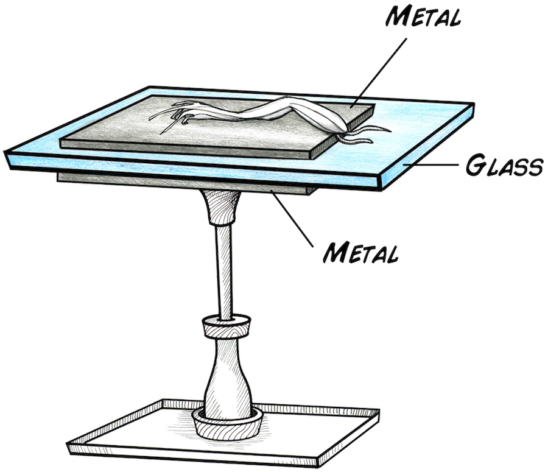](img/FranklinwithColor_web2.jpg)

Luigi's next step was connecting nerve to muscle, or nerve to nerve, with
metallics arcs and examining leg contraction [2]. These experiments revealed
that an external voltage source (be it in a spark generator or a capacitor)
was not necessary to cause leg contraction, providing evidence to Galvani's
hypothesis that the nerve and muscle tissue itself was a generator of
electrical energy that it used for its own proper functioning.

[ 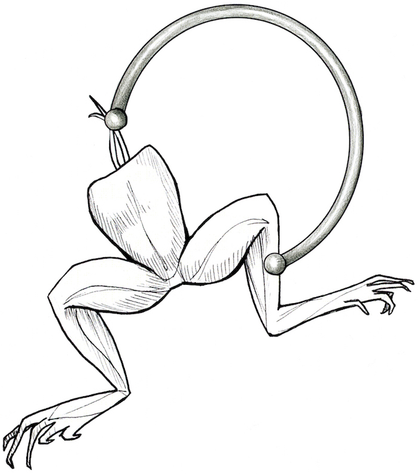](img/loopcolor_web.jpg)

After Luigi published his results in 1791, he gained a reader turned
scientific rival from nearby Pavia. Alessandro Volta had previously invented
an instrument called the electrophorus - a capacitor that could be used
multiple times without recharging, and the "weak electricity" of the frog
nerve experiments intrigued Volta. He began examining the preparation as well,
and he importantly found that using using bimetallic arcs of two different
metals worked much better in stimulating frog legs than arcs composed of just
one metal, and he published this observation in 1792 in "Memoria seconda
sull'elettricita animale" (-Italian - Second Memoir on Animal Electricity). He
believed that Galvani's use of metallic arcs and organic tissue created a sort
of electrical disequilibrium that caused contraction, and the animal did not
generate its own electricity.

In response to this criticism, Galvani did a further experiment in which he
connected one severed nerve on one leg to another severed nerve on another
leg, causing both legs to twitch. The experiment was essential to show that
external metal wasn't needed to cause contraction and was his strongest
evidence against Volta. Galvani published this in 1794 in "Dell'uso e
dell'attivita dell'arco conduttore nelle contrazioni dei usoli" (Of the Use
and Activity of the Conducting Arc in the Contractions of the Muscles) [3]

.

[ 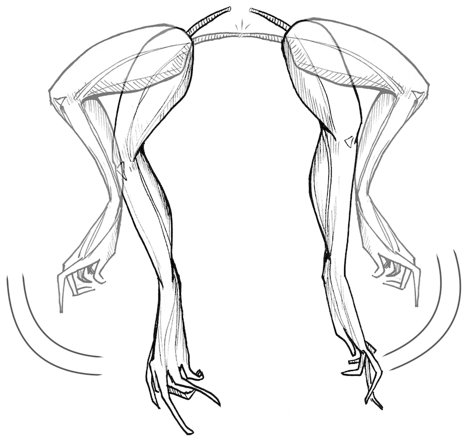](img/movinglegs_web.jpg)

The vigorous debate between Galvani and Volta continued for three years more
in another round of letters and manuscripts, but then Napoleon arrived,
disrupted Northern Italy, and Luigi died in 1798. Volta continued
investigating, going on to build a prototype based on the two metal
disequilibrium called "the pile" - which was **the invention** of what we now
call the battery [4]. His prototype contained alternating layers of copper,
salt-water impregnated cardboard, and zinc, and when he sent his battery to
the Royal Society in England in 1800, Volta gained enormous international
recognition. The use of the battery as a continuous controllable source of
voltage and current allowed many more experiments by many more scientists,
such as [Humphrey Davy
](https://en.wikipedia.org/wiki/Humphry_Davy#Discovery_of_new_elements) and
[Michael Faraday](https://en.wikipedia.org/wiki/Michael_Faraday) who used the
battery for electrolysis experiments that led to the discovery of new elements
(sodium, potassium, chlorine, calcium, etc), and [Georg
Ohm](https://en.wikipedia.org/wiki/Georg_Ohm) using the battery to derive the
law after his namesake.

[ 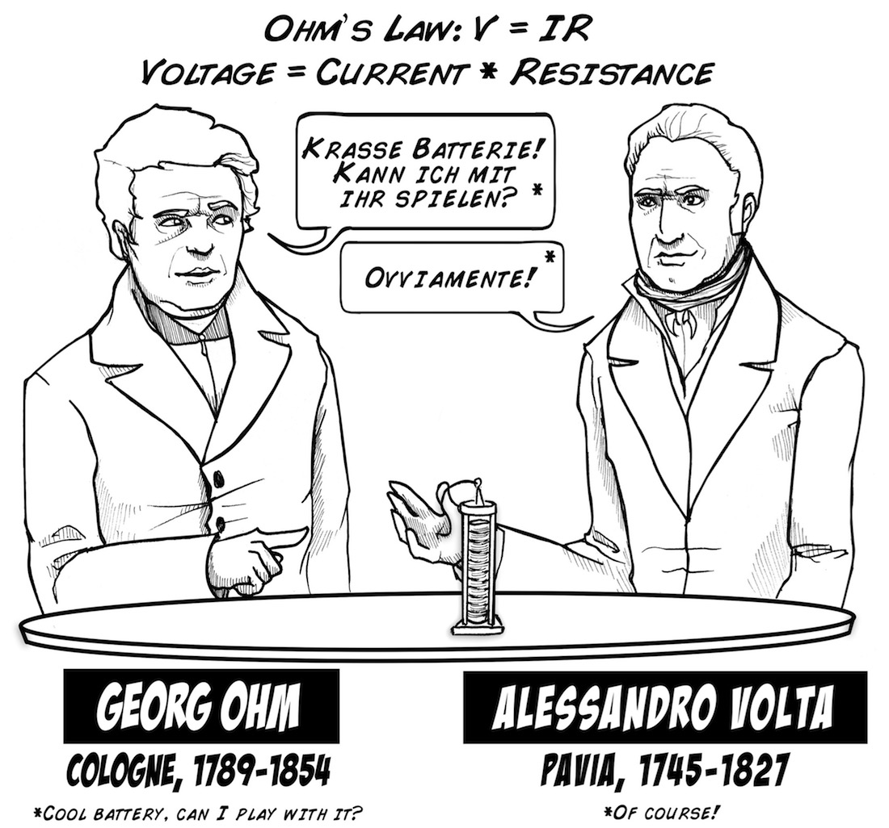](img/Volta_Ohm_English_web.jpg)

This excellent "Galvani/Volta" debate centers on 1) whether nerve or muscle
tissue generates its own electricity or if 2) externally applied electricity
merely excites the tissue. The debate was not resolved until the mid-19th
century when electrical impulses in nerves were observed through indirect
methods with the [first primitive
amplifiers](https://backyardbrains.com/experiments/history) [5], and finally
unequivocally in the early 20th century with the invention of the vacuum tube
amplifier. But, being residents of the future, we can now see that both
Italian scientists were correct. Volta's suggestion that two metals connected
with a salty medium (the frog) could generate electricity was correct.
Galvani's suggestion that the nerves and muscle generated their own internal
electricity for proper functioning was also correct.

Which would you think if you were present in that epoch? Let's see.

## Video

## Procedure

Here are the tools with which you will begin the fields of neuroscience and
electronics.

[ 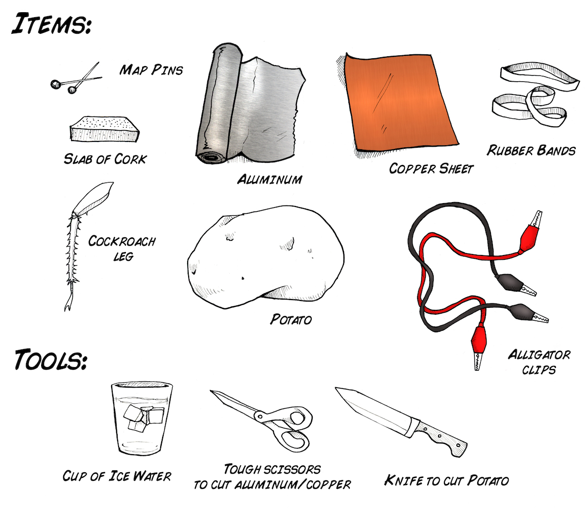](img/itemsforexperiment_web.jpg)

We need about 2-2.5V Volts to do our experiment, so we will build a "pile" of
5 cells.

[ 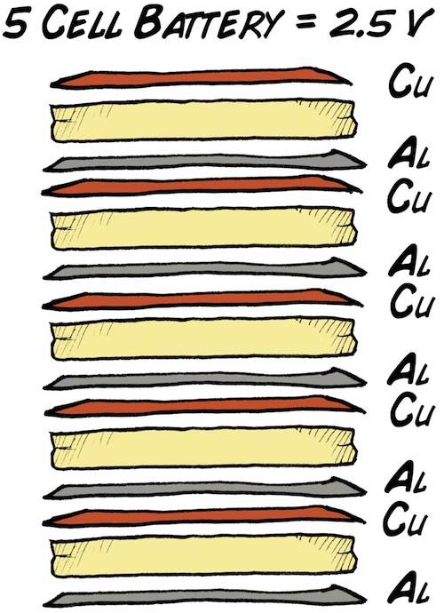](img/5CellBattery_web.jpg)

...which we can use to stimulate a cockroach leg or turn on an LED.

[ 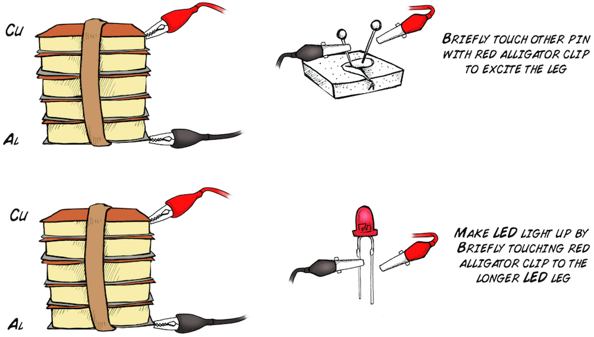](img/legclip_web.jpg)

Step by step details continue below. It is important to attempt to imagine a
world where we do not have a system to understand this phenomenon. What is
going on the pile? What is going on in the leg? The experiment strikes us
oddly still today even when we understand the science. Imagine how it must
have been perceived 235 years ago.....

* Cut five 1.5 inch x 1.5 inch (4 cm * 4 cm) squares of copper sheet. 
* Cut five 1.5 inch x 1.5 inch (4 cm * 4 cm) squares of aluminum or zinc. 
* Cut five 1.5 inch x 1.5 inch (4 cm * 4 cm) slabs of potatoes. Keep at 1/8 inch or 0.3 cm thick. 
* Make a sandwich of one square of copper, one square of potato slice, and one square of aluminum [6]. 
* If you have a voltmeter, place the positive lead on the copper piece, the negative lead of the aluminum piece, and measure the voltage. You should measure ~0.5 Volts. 
* We need at least 2-2.5 Volts to stimulate a cockroach leg or light up an LED, so we will stack up 5 copper/potato/aluminum cells. This is an "artisanal battery," thus subtle adjustments like making sure the copper and aluminum layers are not touching, that the potato slices have good contact with the metal, etc, will ensure you have the appropriate voltage. 
* Secure the five cells with rubber bands to make sure all layers are touching their adjacent layers snugly, but not be so tight that the metal sheets deform, touching each other, and short-circuit (this will only reduce the voltage -- the battery is too weak to be dangerous when short circuited). 
* Using a red alligator cable as the positive lead, connect one end of the red alligator clip to the copper on one end of your pile and other end to the longer leg of a red LED. 
* Connect a black alligator clip to the aluminum on the other end of the pile, and, looking at the LED head on (it helps if the room is dark), tap the shorter leg of the LED with the other end of the black alligator clip. If your artisanal battery is well constructed, you should see the LED briefly flash on and off with a low intensity light. 
* You know your battery works! Now it is time to excite the cockroach leg. Take a juvenile cockroach and submerge it in a jar of ice water, and wait 1-2 minutes as the cockroach enters anesthesia. 
* Once the cockroach has stopped moving, remove it from the ice water, grasp the femur with your fingers, and in a smart, swift motion, pull the leg off. A quick movement will cause the minimum damage to the cockroach, as the leg will break cleanly at its built-in breakage (autotomy) joint, thus assuring fast healing and [regrowth of a new leg](https://journals.plos.org/plosone/article?id=10.1371/journal.pone.0146778). 

* Return the cockroach to its home cage. It will recover in approximately half an hour and be fine. 
* Place the leg of the cockroach on a piece of cork, and place two pins in the femur of the leg. 

[ 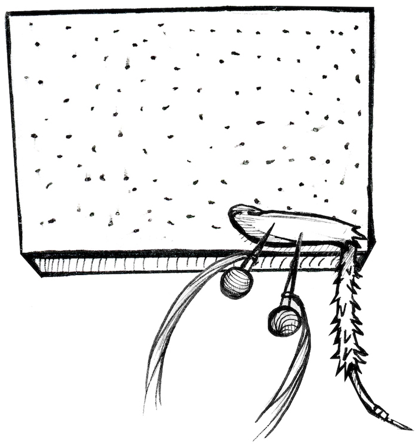](img/reconfiguration_web2.jpg)

* Attach the red alligator clip to one map pin (which is which does not matter). Then, briefly tap the other map pin with the black alligator clip. The tarsus (tip, clawlike part of the leg), should twitch with each tap. 

Congratulations, you have just begun electronics and neuroscience! We
emphasize again, as you do this experiment, imagine that as of yet 1) there is
not any unifying theory of how electricity works, and 2) physiology is still
in its infancy [7]. What would you think was occurring if you connected a
primitive battery to a nerve of muscle, saw twitching, and had no background
knowledge?

We close with the words of what Galvani himself thought_ _"Such a
disequilibrium in the animal either must be there naturally or should result
from artifice. If it is there naturally, we should admit that in the animal
there is a particular machine capable of generating such a disequilibrium, and
it will be convenient to refer to this form of electricity as to an animal
electricity in order to denote, not an electricity whatsoever, but a
particular one referred to a particular machine.…But what will it be this
animal machine? We cannot establish it with certitude; it remains totally
occult to the most acute sight; we can do nothing else than figure out its
properties, and, from these, somewhat envision its nature.”_

Well said, Professor Galvani.

## Notes

* 1\. It was later discovered that a torpedo fish can deliver up to 200 V electric shocks due to highly modified parallel arranged muscle tissue contained inside its head. 
* 2\. Galvani also performed a wireless variant that would be bizarre even if replicated today (stay tuned). When an electrostatic machine was generating electrical sparks, while _at the same time, in the same room_ Luigi Galvani touched a frog nerve with a metallic scalpel (unconnected to the machine), the leg muscles would contract as well! At the time there was no theory to explain this effect, as this was a full 100 years before [Heinrich Hertz's](https://en.wikipedia.org/wiki/Heinrich_Hertz) experiments showing that a high voltage spark generated electromagnetic waves that could induce another spark in an isolated adjacent coil, beginning the wireless telegraphy age. 

[
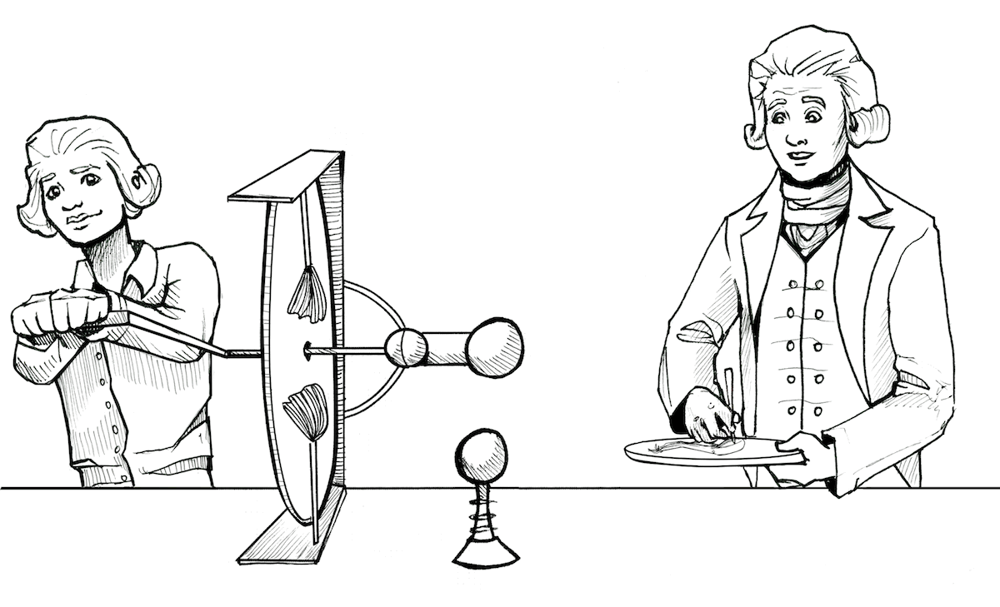](img/DoesthisWorkbetter_trimmed_web.gif)

* 3\. This can seem confusing, but it was later found in the 19th century that cut nerve has a damage current called a "demarcation current" that can sometimes be sufficient to excite other nerves and muscle if the preparation is very fresh. 
* 4\. Oddly enough, inspired by the torpedo fish, due to, again, the specialized shocking muscles cells arranged in parallel columns. 
* 5\. See our treatment on the [development of amplification](https://backyardbrains.com/experiments/history) for much more details on the history of amplifier invention. 
* 6\. In this cell, the copper is the anode and is the positive side. The copper is the "positive" side as it receives electrons from aluminum. This terminology is famously designed to be confusing. The aluminum is the anode as electrodes flow out of it, buuuttttttttt...due to historical reasons current is **opposite** the direction of electron flow, thus current flows "into the anode," though electrons flow "out of it." 
* 7\. We thank the students and teachers of [Colegio Alberto Blest Gana](https://www.facebook.com/Colegio.AlbertoBlestGana/) for inspiring us to create this lesson as part of an "Introduction to Neural Engineering" high school course. Lo llamamos "el experimento de la papa-pila-pata" 

## Science Fair Project Ideas

* If you use zinc instead of aluminum, each cell will generate 0.9-1.0 V instead of 0.5 V. Why does changing the anode metal to zinc increase the voltage? 
* You can use this experiment to derive Ohm's law. Georg Ohm used Volta's battery and noticed when he added more cells to the battery, the brightness of the a lamp ("current") became larger. 
* You can use a salt bridge (like Volta did with salty water cardboard) in place of an acid bridge (like we did with the potato). The electrochemistry is slightly different - see references below. 
* Try fruits and vegetables of different acidity to see if that affects the power of your battery (sour apples vs normal apples, for example). 
* If you look at electric potentials in your chemistry textbook, you will see that zinc has an electric potential of -0.8V, but aluminum has an electric potential of -1.6. We observe a voltage of 0.9V (close) in a zinc-copper battery, but only 0.5V in our aluminum-copper battery. The aluminum-copper battery should have a higher voltage! Why do we not observe this. We actually do not know. [Email us](mailto_tim@backyardbrains.com) if you have any insight 

[ 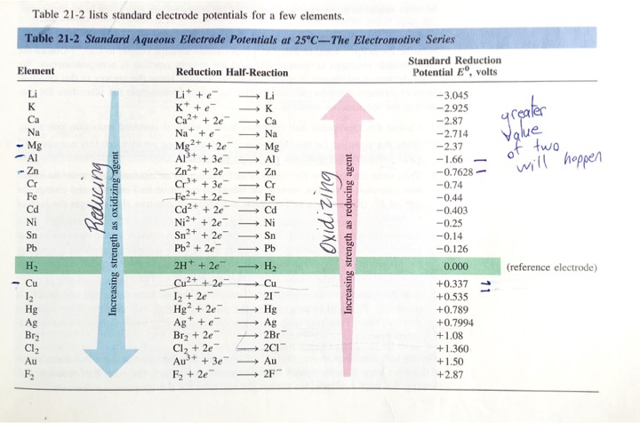](img/ElectricPotential.jpg)

##  References

* [Shocking Frogs](https://www.amazon.com/Shocking-Frogs-Neuroscience-Piccolino-Bresadola/dp/B011DC7JHA) by Marco Piccolino and Marco Bresadola - A dense work, translated from Italian, in which the authors carefully analyzed Galvani's and Volta's lab books and correspondence. This is deep as you can go without learning Italian and Latin, traveling to Italy, and reading the lab books of Volta and Galvani yourself. Almost of the detailed historical information, Galvani quotes, etc, in this experiment writeup comes from the Shocking Frogs book, and we thank the authors for their scholarship. 
* [Galvani's Spark](https://www.amazon.com/Galvanis-Spark-Story-Nerve-Impulse/dp/0199751757/ref=sr_1_1?s=books&ie=UTF8&qid=1475891898&sr=1-1&keywords=galvani%27s+spark) by Alan McComas - A very useful read on the history of electrophysiology that we recommend to everyone. 
* [Salty Science](files/TPT_Salty_Science.pdf) by Chasteen, Chasteen, and Doherty, offers further reading on the actual electrochemistry reactions of the copper aluminum batteries in their "salt" or "acid" variants. 
* [Observations on Lemon Cells](files/Observations_Lemon_Cells.pdf) by Jerry Goodisman offers an electrochemical explanation on the famous lemon variant of the copper-zinc battery.