# Experiment:The Consciousness Detector - EEG, Oddball Task, and P300

Now that you've seen the rhythmic activity of the brain, you can look at
coordinated surges in brain activity associated with specific sensory events.
Are you conscious? Let's find out! **Note_** For now, this advanced experiment
requires that you have Matlab downloaded on your computer-it will be used for
data analysis.

**Time:**  2 hours

**Difficulty:**   Advanced

#### What will you learn?

With this experiment, you will learn even more about communication within the
human brain, and look at the brain's response when it senses an unexpected
stimulus. You will observe this by measuring the p300 signal, which is a more
cognitively-based signal than the visual cortex alpha rhythm.

##### Prerequisite Labs

  * [EEG](EEG) - You should have an intermediate understanding of the Arduino platform and how to use the Heart & Brain SpikerShield to record your alpha waves before moving on to this more challenging experiment of recording event related potentials.

##### Equipment

* [Heart & Brain SpikerShield Bundle](/https://backyardbrains.com/products/heartAndBrainSpikerShieldBundle)

## Background

_Based on a summer intern research project by Michigan State University student Kylie Smith._

What exactly happens in our brain, "behind the scenes", when we're thinking?
In our [EEG-Record from the Human Brain](EEG) experiment, we explored rhythmic
activity in the occipital lobe of the brain when we don't see any light (eyes
closed). But this reflects a sort of "state" that part of the brain is
entering-whereas thoughts are often rapid and momentary. If we want to begin
looking at cognition, there are some non-rhythmic electrical phenomena we can
pick up in the brain.

Let's talk a little more about the electrical signals we can see through the
skull. The P300 signal is an event related potential (ERP), meaning that the
signal is seen on an EEG as a rapid single potential change as a response to a
sensory, cognitive, or motor event. The signal's peak comes an average of 300
milliseconds after, or "post", the stimulus, so we call it the P300. This is
opposed to rhythmic waves (alpha, beta, theta, etc) which reflect a longer
term state a brain is experiencing.

[ 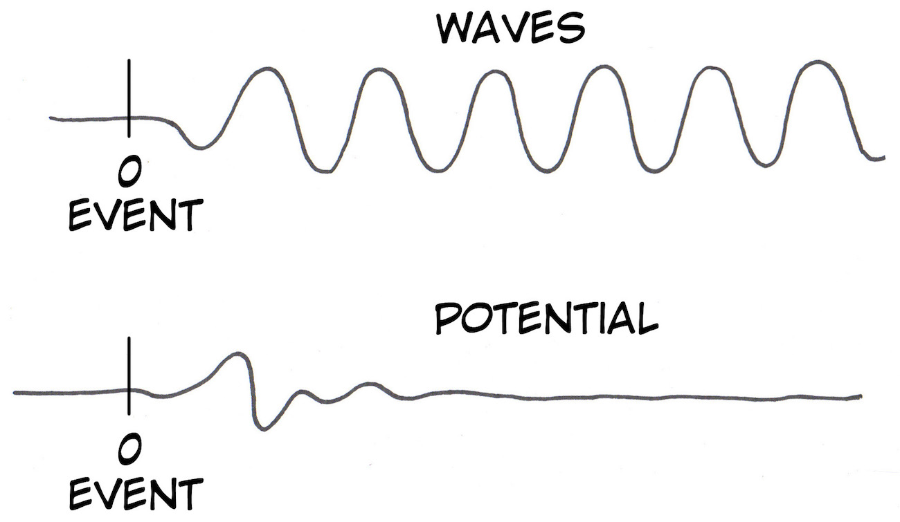](img/Waves_Potentials_web.jpg)

The P300 signal is thought to come from the parietal lobe, which is where we
will place the electrodes. This part of your brain has an important role in
attention to your surroundings. People with damage on the right parietal
hemisphere can often have difficulty acknowledging the existence of the left
side of the world, a phenomenon known as "hemi-neglect" (Note_ Damage to the
left parietal hemisphere does not cause right spatial neglect, something
rather still a mystery).

When you see or hear something odd, something that sticks out to you, neurons
in the parietal lobe have a surge in activation as your neurons begin rapidly
spiking in this area as your brain works to react to and understand this new
stimulus. The P300 signal doesn't come directly from sensation-seeing a light
come on or hearing a sound-but from your brain's assessment of these
"unexpected" stimuli. We'll see in this experiment that not all sounds
initiate this signal.

[ 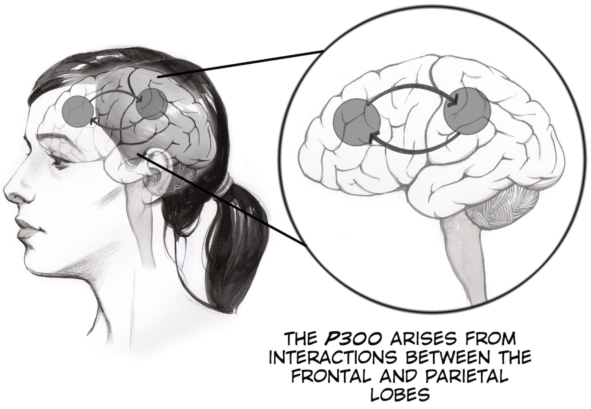](img/P300_network_red_web.jpg)

The experiment you'll be doing is called an "oddball task", where you will
hear a repeated, regular presentation of tones of a particular frequency, but
10 percent of the time it will instead be a slightly different - a higher
pitched tone for us. An average of 300 milliseconds after this novel, or
"oddball" event, our EEG will manifest a large combined potential across the
parietal lobe.

[
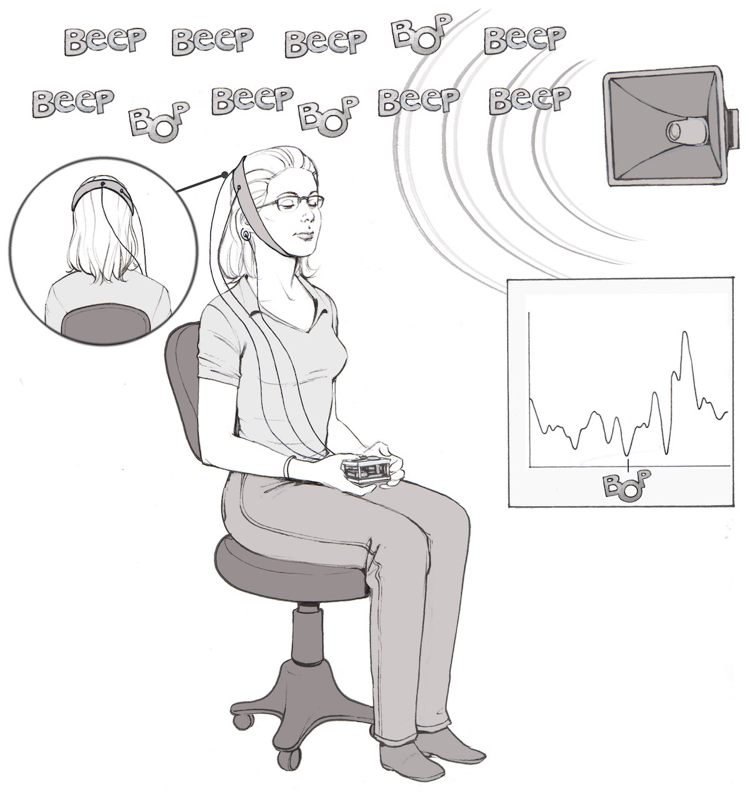](img/P300_Experimental_Setup_web.jpg)

One of the most fascinating applications of the auditory p300 is to examine
the brain activity of comatose patients. [Some evidence
shows](https://www.neurology.org/content/82/10_Supplement/P1.281) that if you
perform this experiment on an individual in a coma and see a variant of the
p300 signal in their EEG, it is a strong indicator that they might be able to
be brought out of the coma. Hence why we name this experiment the
"Consciousness Detector."

[ 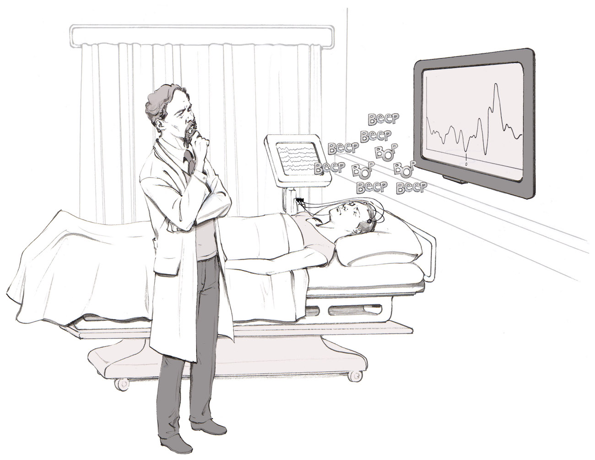](img/Doctor_EEGP300_web.jpg)

The p300 signal is difficult to see as you are performing the experiment, it
only becomes clear after doing data analysis on many trials. It is most
visible after you have taken all the time periods following when the oddball
tone is played, averaging those recordings, and then comparing them to the
same time period around the non-oddball tones. The drawing below illustrates
this concept. The averaging of multiple trials highlights the signal for us
and allows us to directly compare when we hypothesize a p300 should appear
versus when we hypothesize it should not.

#### Downloads

> Before you begin, make sure you have the [Backyard Brains Spike
> Recorder](https://backyardbrains.com/products/spikerecorder) and
> [Arduino](https://arduino.cc/en/main/software#.Uxd6XYWhZMk) Programs
> installed on your computer. The Arduino "Sketch" is what you install on your
> Arduino circuit board using the Arduino laptop software (your board comes
> preinstalled if you bought the Arduino from us), and Backyard Brains Spike
> Recorder program allows you to visualize and save the data on your computer
> when doing experiments. You should be familiar with this from your
> experience finding alpha waves. For now, analyzing the data your collect
> requires
> [Matlab](https://www.mathworks.com/academia/student_version/?s_tid=main_sv_ML_tb),
> which is typically available on university engineering library computers.
>
> [Spike Recorder Computer Software](https://backyardbrains.com/products/spikerecorder)
>
> [EEG Arduino code](./files/SpikeRecorderArduino.zip)
>
> [Buzzer Arduino code](./files/Buzzer_with_delay.zip)
>
> [Matlab Scripts](./files/MatlabFiles.zip)

## Tutorial Video of Experiment

## Procedure

This experiment uses the Heart and Brain SpikerShield that has a gain of
approximately 880x with a bandpass filter of 1-129 Hz.

[ 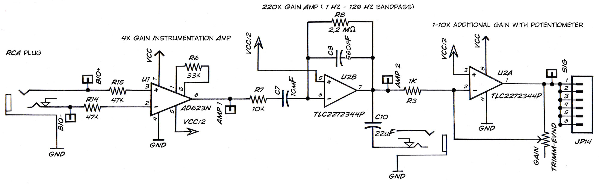](img/EEG_Circuit_Diagram_web.jpg)

In the Consciousness Detector - EEG, Oddball Task, and P300, we will examine
the event-related potential that results from the arrival of an oddball
stimulus among a series of standard stimuli.

**Device Setup**

  1. Two Arduinos will be used for this experiment. The Arduino equipped with the Heart & Brain SpikerShield will be referred to as "Brainduino", and the additional Arduino , which controls the buzzers generating sound, will be called the "Buzzduino". Download the standard [ Heart & Brain code](./files/SpikeRecorderArduino.zip) onto the Brainduino and the [Buzzer Arduino code](./files/Buzzer_with_delay.zip) to the Buzzduino. Note_ Our Heart & Brain SpikerShield comes with the SpikeRecorder Drivers already loaded, so unless you are hacking your own code you do not have to worry about the code on the Heart & Brain SpikerShield. 
  2. Wire up two small speakers to your Brainduino and Buzzduino as shown below. The tones come out of Digital Out 8 and 9 on the BuzzDuino and go to the Speakers as well as Analog input 1 and 2 on the Brainduino. Grounds are shared. Replicate the setup per the circuit diagram photo and schematic. 

[ 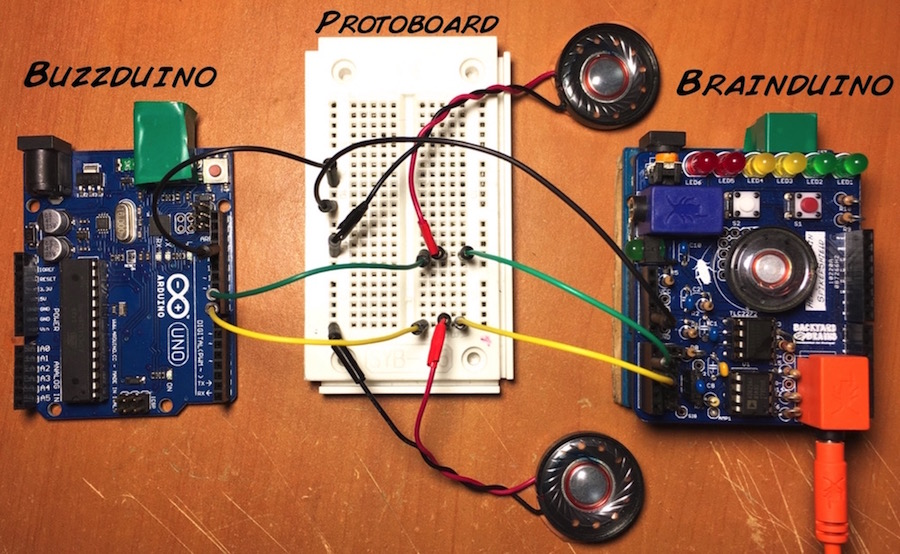](img/P300-photoschematic_web.jpg)

Here is a circuit diagram showing the connections to be made_

[ 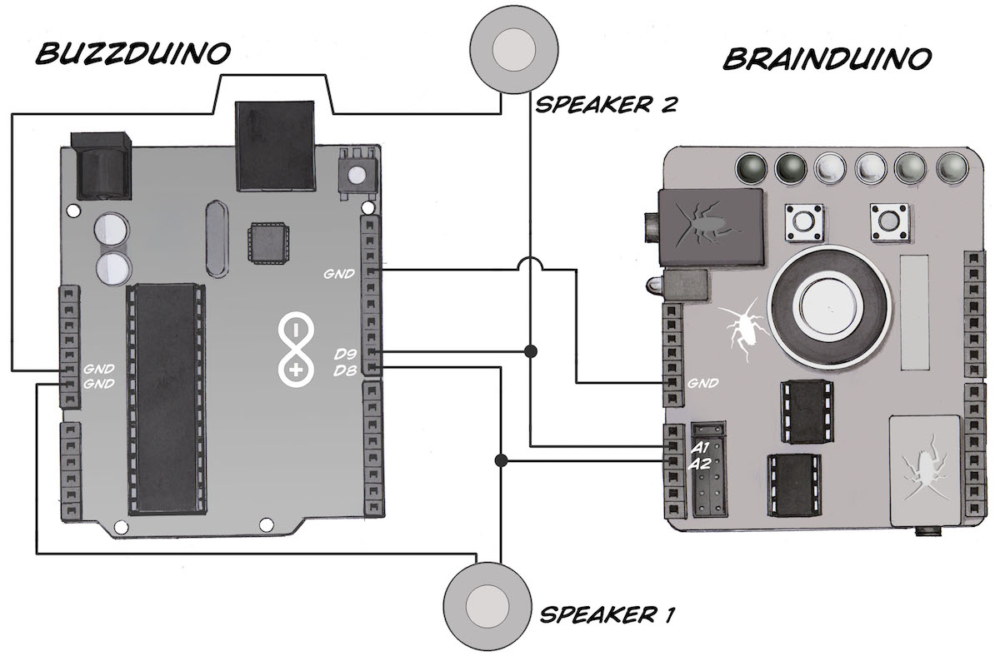](img/P300_circuit_diagram.jpg)

**Electrode Setup and Testing**

  1. Place one BYB headband with the electrodes over the P4-Pz locations using the EEG 10-20 system-see the map below. 

[ 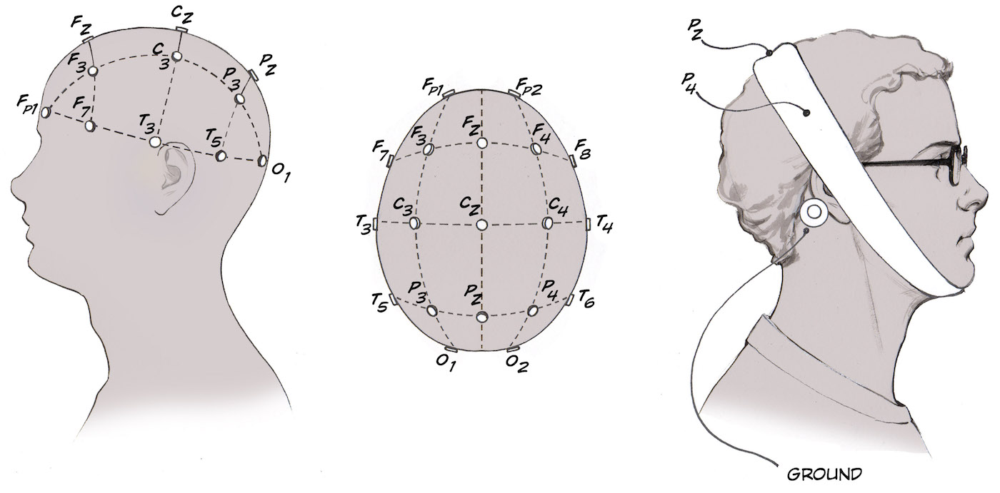](img/Head_P300_placement_web.jpg)

  2. Make sure the subject is comfortably seated and equipped with a piece of paper and writing utensil. 
  3. Add globs of electrode gel underneath the metal button electrodes at the top of the headband. Make sure that there is as little hair as possible between the metal and their skin. 
  4. Add a ground to the mastoid process behind the ear. 
  5. Now it's time to connect your electrodes! With your orange electrode cable, clip the two red alligator clips to the metal buttons on the top of the head, and the black alligator clip to the ground behind the ear. 
  6. Plug the other end of the orange electrode cable into the Brainduino (Heart and Brain SpikerShield). 
  7. Set up the Spike Recorder program. As with the previous EEG experiment, this amplifier's filter settings are right in the sweet spot of house electrical systems, so you will have to be very vigilant of noise in this experiment. Have your laptop and SpikerShield far from any electrical outlets, away from any fluorescent lights, etc. Also have your laptop running on battery power alone. If the signal seems excessively noisy and unstable, add more conductive gel between the headband electrodes and your scalp. 
  8. On our SpikeRecorder software, turn on the 50Hz (Europe, South America) or the 60Hz (United States, United Kingdom) notch filters to reduce the electrical noise and slide the digital filters to 1-100 Hz. 
  9. Hold still and relax while you are attempting to record EEGs - muscle movements from the jaw and forehead can be picked up very easily, which causes interference with your EEG reading. 
  10. Test the legitimacy of the signal - have the subject open and close his/her eyes, alternating every ten seconds. If alpha waves as described in the EEG experiment appear when eyes are closed and disappear after the eyes are open, you are most likely recording a real EEG signal. Hurray!. You may continue to the next step. If not, try the following_ make sure the electrode area has contact with the scalp, and make sure your wires are all connected correctly. 

**Oddball Task**

  1. Now that you've found a legitimate signal, you can begin the oddball recording. Keep the electrodes where they are, and start a new recording. 
  2. Turn on the Buzzduino with a 9 V battery or a second USB cable plugged into your computer. You will become hearing the normal and oddball tones. 
  3. Start recording data on the Spike Recorder software. 
  4. The buzzers being connected to the Brainduino via the split wires ensures that these signals will show up on the Spike Recorder file. A typical recording should look similar to the one shown below, with an EEG trace, and normal tone trace, and an "oddball" tone trace. 

[
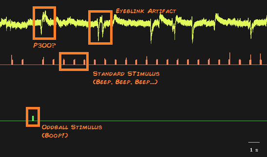](img/p300_spike_recorder_pic_labeled.png)

  5. The subject will mark each oddball tone that they hear on the piece of paper (and keep track of the total) until they've tallied fifty. At this point, we end the recording.

**Analysis**

  1. Open Matlab and upload the data file recorded from the Spike Recorder app. Run the [Matlab script](./files/MatlabFiles.zip) by typing "runP300" in the command window and pressing "Enter" if on PC or "Return" if on Mac. 
  2. The prompt will ask for the name of the file. Write it in single quotes. As in_ 'nameoffile.wav' 
    1. Three figures will then be generated. 
    2. Each gray line in this figure shows one second of the EEG recording surrounding each standard tone onset in the experiment. The average of each of these tone responses is taken and plotted in red.
    3. Each gray line in this figure shows one second of the EEG recording surrounding each oddball tone onset in the experiment. The average of each of these tone responses is taken and plotted in green. Since the P300 is only between 10 to 20 mV, it can easily be lost in the EEG "noise". For this reason the signal is only visible when average around the flash onset after the EEG "noise" is averaged to zero.

[
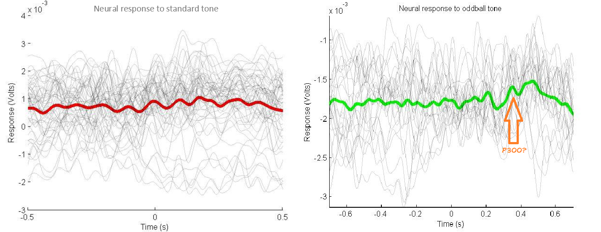](img/p300_standard_v_oddball_labeled.png)

    4. We must check that our results are scientifically significant by applying statistics principles to our data. To check whether our results may have occurred by chance, we choose as many points as there are flashes by random and average one second of data surrounding these randomly chosen points to be plotted in gray. This is done one hundred times and another average is taken and plotted in blue. This is the Monte Carlo average
    5. All averages are plotted together. A 95% confidence interval based around the Monte Carlo average mean value is plotted to show significant data - data outside of the confidence interval. The P300 waveform has a label for the latency of the largest positive potential occurring between 250 ms and 600 ms after the oddball tone, as the P300 signal is defined.
    6. You can download the [data file](files/Parietal_Tim_Conf.wav) used in the video above for your comparisons.

[ 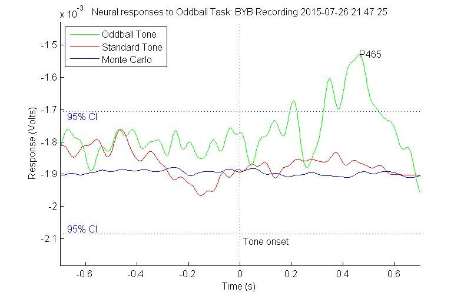](img/p300montecarlo-example.jpg)

