# Experiment: The Leeuwenhoek Microscope and the Beginning of Our View into the Small

You see glass everywhere. Your windows, your drinking vessels, your
smartphone. Now you can too can manipulate this material to make a microscope
completely from scratch. Forge a ball lens, see worlds previously unknown, and
join the ranks of scientists who have assembled their own instruments.

Time  30 minutes

Difficulty  Beginner

#### What will you learn?

You will learn the history of the microscope's development in Northern Europe
during the Enlightenment and the physics of how balls lenses function. You
will learn how to manipulate glass into a simple lens. You will also learn,
because of a material's index of refraction, why a ball of glass works as a
magnifying lens, but a ball of diamond does not.

##### Prerequisite Labs

  * You are starting from zero. You are beginning the field of microscopy. There are no previous experiments to do. 

##### Equipment

[Leeuwenhoek Replica Kit](/products/LeeuwenScope)

[Onion](https://en.wikipedia.org/wiki/Onion)

* * *

## Background

In grade school you are taught that your body is composed of individual
"lives" called cells. Your heart, your muscles, your brain, your stomach, and
almost all the parts of your body are made up of the trillions of cells that
are you. Perhaps you have even seen some examples of these cells from our
[previous Backyard Brains
experiments](https://backyardbrains.com/experiments/RoachScopeHighPower) or
experiments in your school. You may have also heard from your loved ones to
wash your hands because of indivisible little things called "germs." The
existence of cells and microscopic life is common knowledge as it should be.

But there was a time when this was not common knowledge. There was a time when
such was the very edge of science. This time was the 1660s and 1670s in
England and Holland with work done by two scientists - Robert Hooke and
Antonie Philips van Leeuwenhoek.

[ 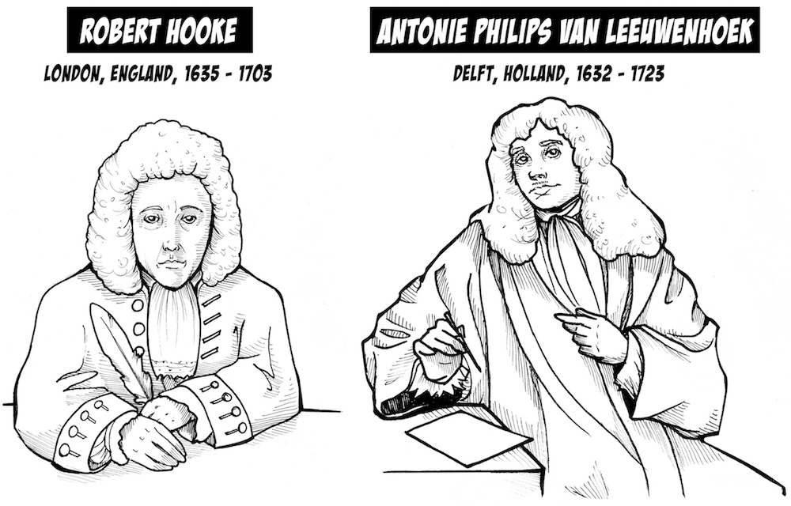](img/Hooke_Leeuenhoek-web.jpg)

In 1664, a 29-year-old Robert Hooke was commissioned by the Royal Society of
England to write and publish _"Micrografia – Or some Physiological
Descriptions of the Minute Bodies Made by Magnifying Glasses With Observations
and Inquiries Thereupon."_ Using a compound microscope (two lenses - a
condenser and an objective), he made a famous observation of a slice of cork,
showing that the tissue of the plant was made up of individual elements he
called "cells," after their appearance to the cells of bee honeycombs.

[ 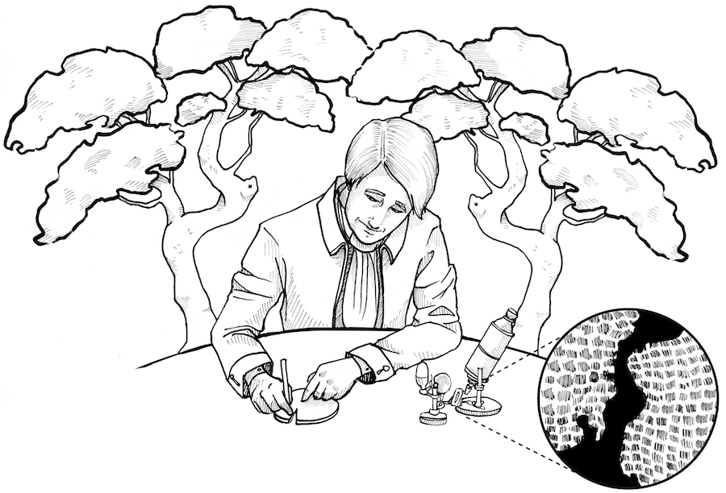](img/Hooke_with_cork_web.jpg)

Robert Hooke was an excellent inventor and polymath. He is indeed the Hooke of
["Hooke's Law"](https://en.wikipedia.org/wiki/Hooke%27s_law) concerning the
force on springs, and he did important work along with Galileo and Huygens
verifying the rings of Saturn. As far as we know, he moved on to other
investigations after he published Micrografia and did not turn to further
investigating the microworld. However, across the English Channel, in the
nation of Holland, a successful clothing vendor in Delft began cultivating an
interest in optics. He fabricated small glass spheres and developed a metal
casing for the spheres in a deceptively simple and elegant design for viewing
samples at different angles by changing the position of various screws.

Leeuwenhoek would stare at samples through the sphere in bright daylight, and,
one day beginning in 1674, viewing a drop of pond water, he observed things
moving which he called "animalcules." This was the first documented view of
the living microworld, that there are living things in the world that our
naked eyes cannot see, but with the invention of magnifying tools, we can. He
also did an experiment observing bacteria on scum on his teeth, which were not
present after he drank hot coffee (supposedly killing/removing the bacteria).
He did "organism-culture" experiments with pepper grains to determine the
origin of the animalcules. While he never formally published his findings in
monographs or books, he communicated his observations in many letters written
in Dutch to the Royal Society in England, which are stilled preserved and
archived in London.

[
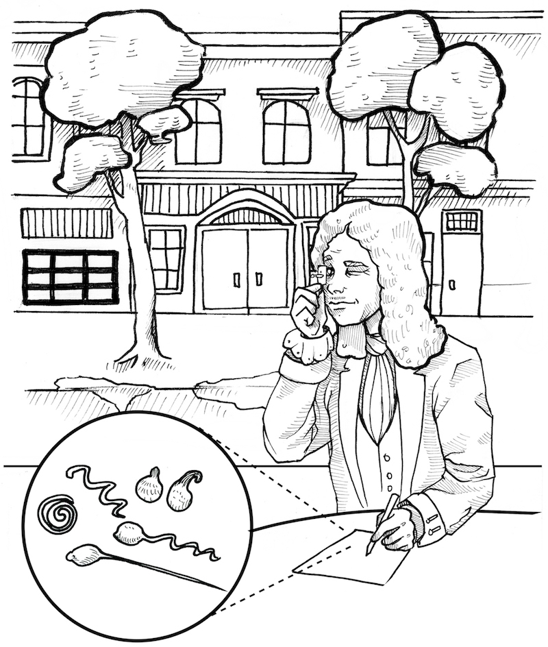](img/Leeuwenhoek_with_scope_web.jpg)

We at Backyard Brains are certainly fans of scientists who are excellent tool
builders, which is one of the reasons we study Leeuwenhoek here. But let's
take a step back. How does a lens work? Moreover, what is even a lens?

[ 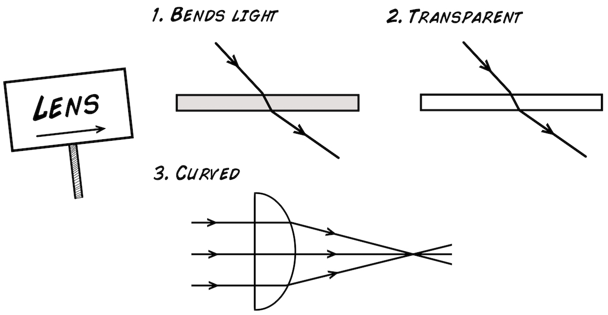](img/WhatIsALens_web.jpg)

A lens has three properties, it is clear, it is curved, and it bends light.
The bending of the light is the key property that allows microscopes to
magnify images. Light bends when it enters or exits transparent material at an
angle, and the curved form of a lens allows the bending to either "diverge
out" or "converge in" depending on the shape of the lens.

[ 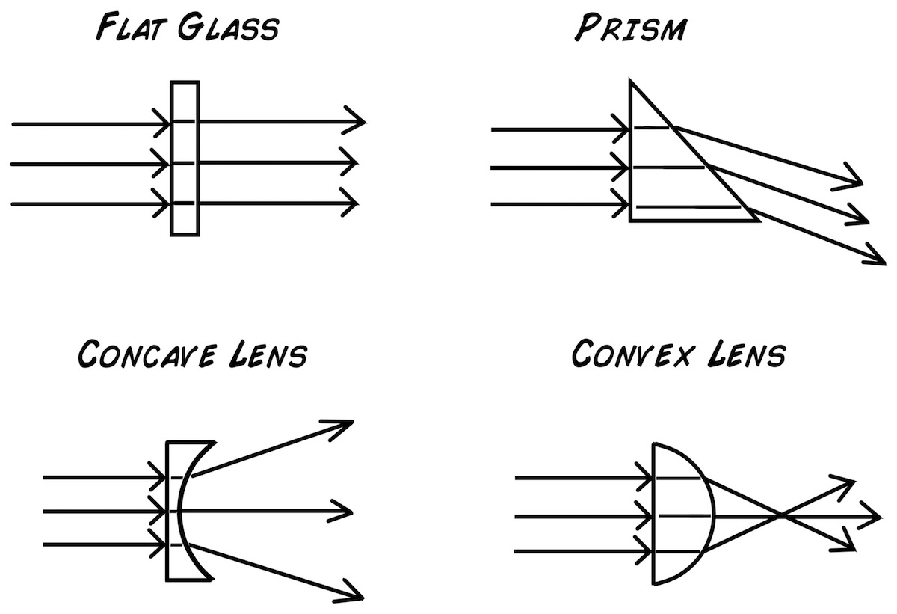](img/Lens_Types_web.jpg)

The bending property is actually due to the speed of light. We often think of
the speed of light as a constant that can never be surpassed, but light
actually travels at different velocities depending on the material in which it
is passing through.

[ 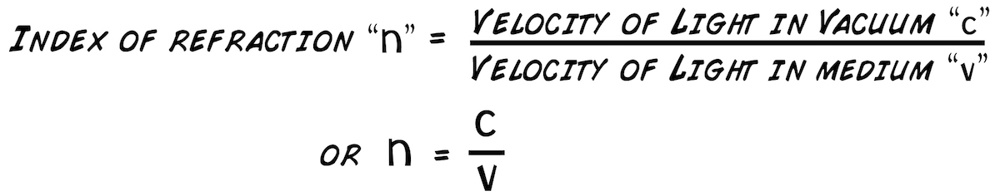](img/refractionequation_web.jpg)

Because of this difference in speed of light between two materials, and given
light's peculiarities, when a ray of light, traveling in vacuum or air,
encounters a new material, the angle will change so that light "spends less
time" in the material. This level of bending is defined as an "index of
refraction." Conceptually, we can think of a famous example where a runner
must cross a stream to reach a table of donuts. The direct route is actually
slower, since running in water reduces the runner's speed. Thus the runner
actually takes the "least time route," in which she changes the angles where
she enters the water and exits the water to reach the donuts in the fastest
time possible. This "time minimization" serves as an analogy as to why light
bends when entering a material.

[ 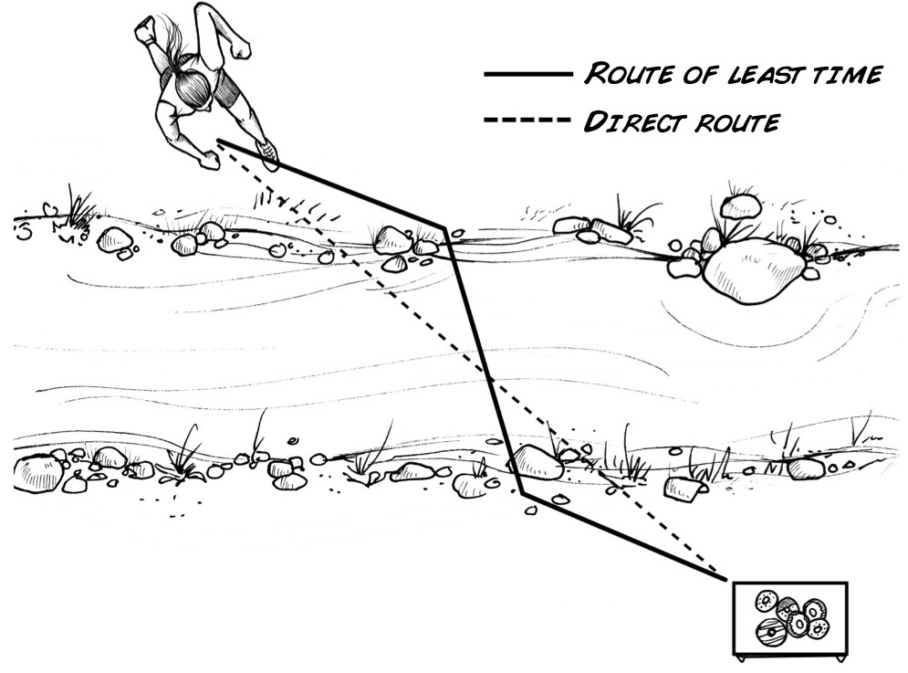](img/Runner-of-Light.jpg)

Mathematically, the bending, the index of refraction, is expressed as:

[ 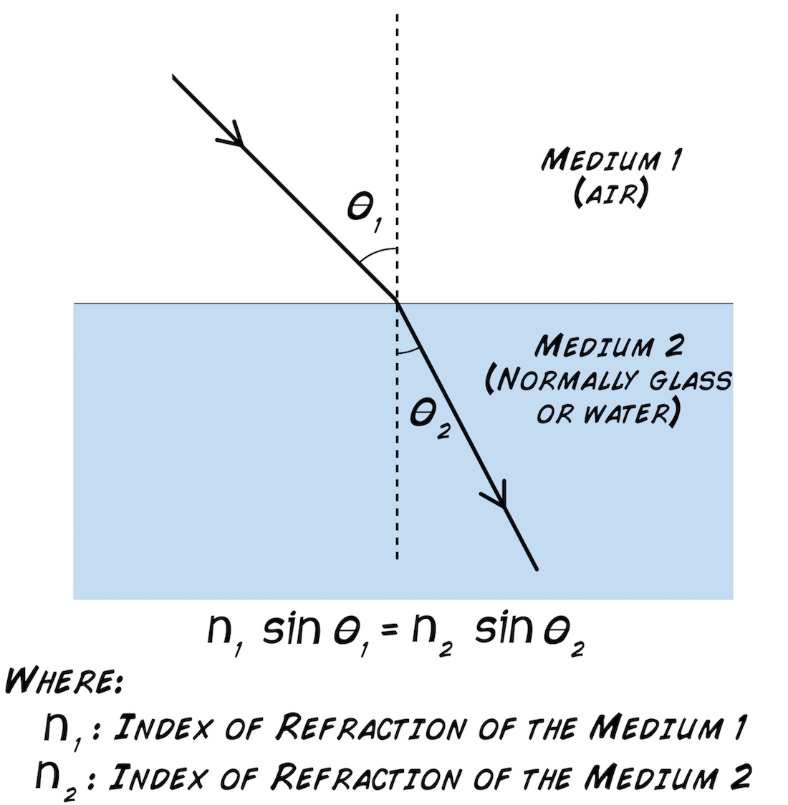](img/Snell's_Law_Web.jpg)

and the higher a material's index of refraction, the more the light ray bends.

[ 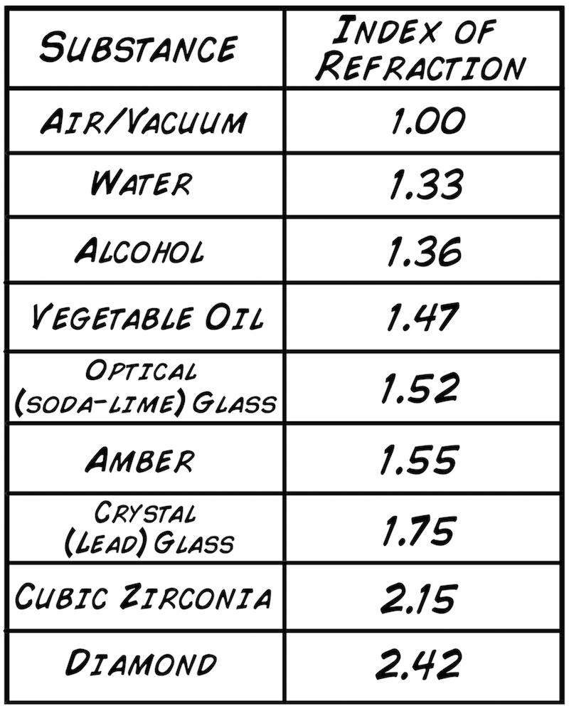](img/Refraction_Chart_web.jpg)

This mathematical relationship of the changing angles between two materials
was first derived geometrically by the Persian/Baghdad scholar Ibn Sahl in the
10th century. Sahl was interested in the geometry of "burning mirrors and
lenses" that can converge light rays from the sun to allow localized increases
in temperature and flames. The law was then independently discovered again by
Willebrord Snellius in Leiden in Holland in the early 17th century. Science
history recognizes it the equation above as Snell's law, though it was known
during the Islamic Golden age by Ibn Sahl and the famous optics theorist Ibn
al-Haytham.

With just this simple index of refraction equation, you can calculate how
lenses behave. Remember that a lens needs be curved. With this curvature, you
can cause light rays to diverge or converge. Let's look at the simplest
example, a ball lens.

[ 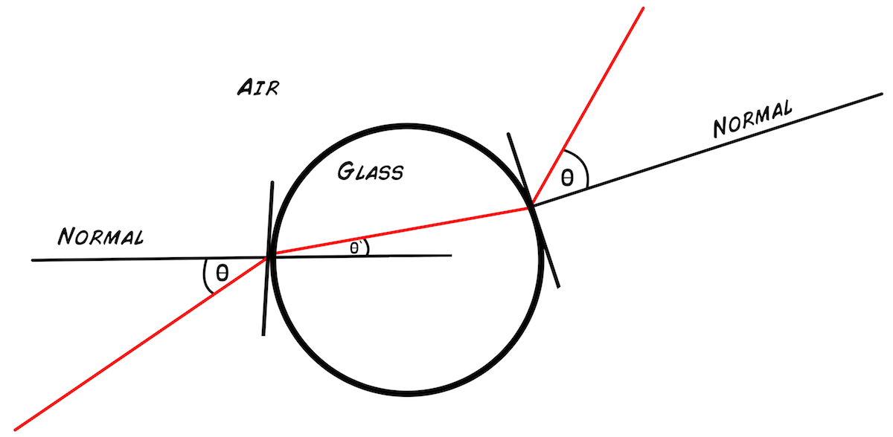](img/Ball_Draft_1ray.jpg)

Note that the curvature of lens deflects the ray of light more than if it were
simple flat piece of glass. The curvature causes an image to focus at some
distance away from the lens, or the effective focal length.

[ 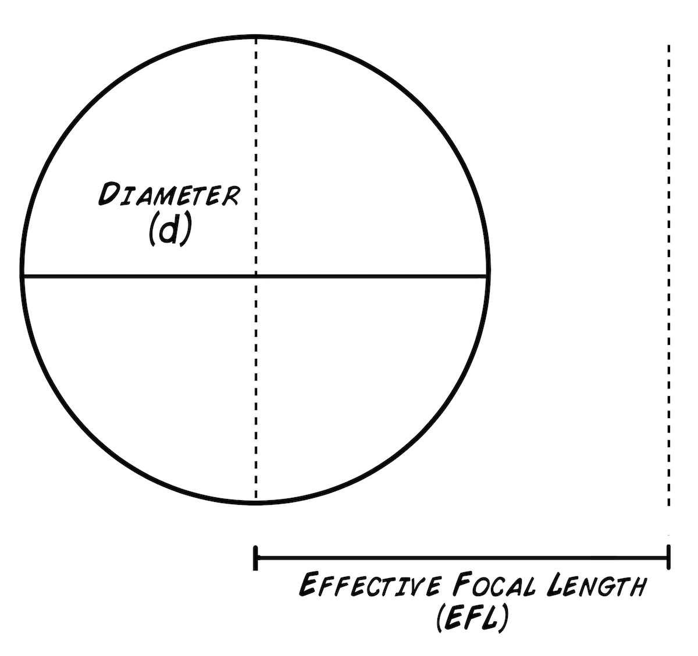](img/LensDiameter_web.jpg)

Optics is all geometry, and the equation for calculating focal length based on
the geometrical bending only requires we only know the diameter of the sphere
(d) and the index of refraction of the material the sphere is made out of (n).

[ 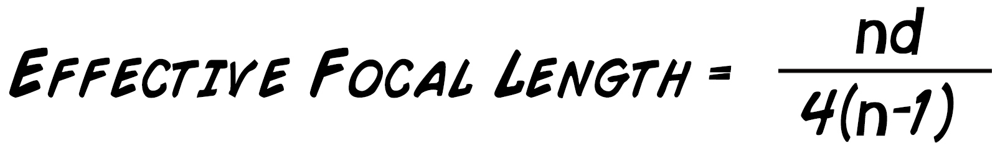](img/Focus_Ball_Lens_Equation.jpg)

But, you may ask, how does the lens actually enlarge the image and cause the
magnification. See the image below, and you will recognize, again, why the
curvature of the lens is the fundamental key.

[ 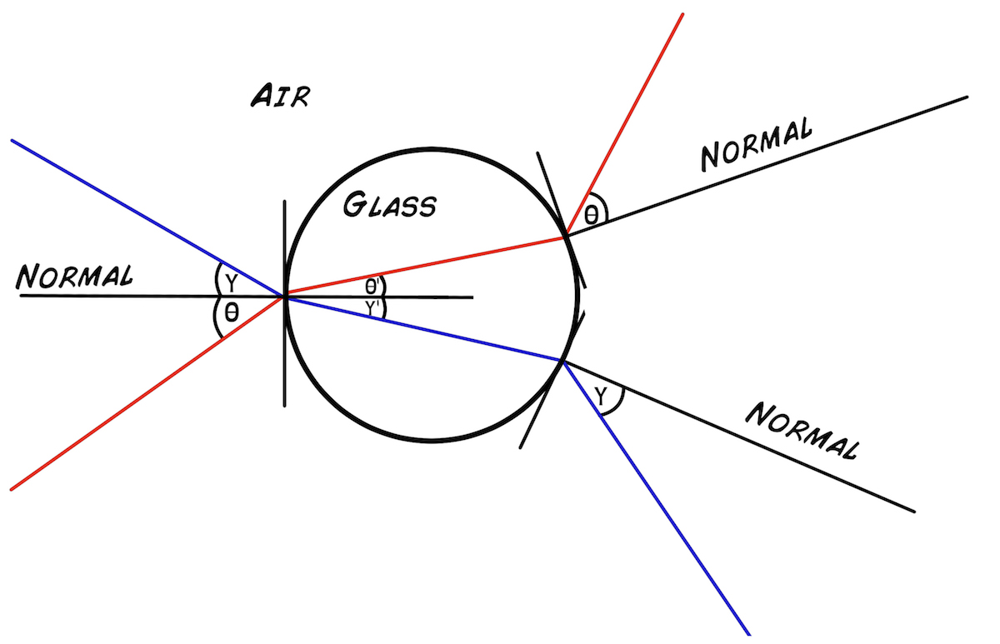](img/Ball_Draft_2ray.jpg)

Returning to the parameters of the ball lens:

You see that either lowering d (diameter) and increasing n (index of
refraction) lowers the effective focal length and increases the magnification.
A strange property thus reveals itself. If you have an index of refraction
greater than 2, the effective focal length never surpasses more than 1/2
diameter, _or the radius_. Since diamond has an index of refraction of 2.6,
you actually cannot make a ball lens out of diamond! Such will never be
focused, as the focus plane is _actually inside the lens_. Normal soda-lima
glass has an index of refraction of 1.5, so the focal plane is outside the
lens - Lucky for Leeuwenhoek! But how do we calculate the magnification of a
ball lens? We use an equation based on the [general lens
equation](https://en.wikipedia.org/wiki/Thin_lens):

[ 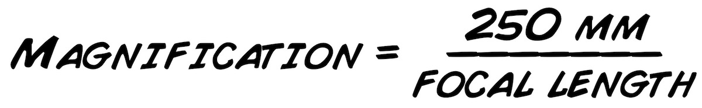](img/Equation_Magnification.jpg)

A 5 mm diameter lens, which has a focal length of 3.75 mm, thus has a 67x
magnification. The range of useful diameters is:

[
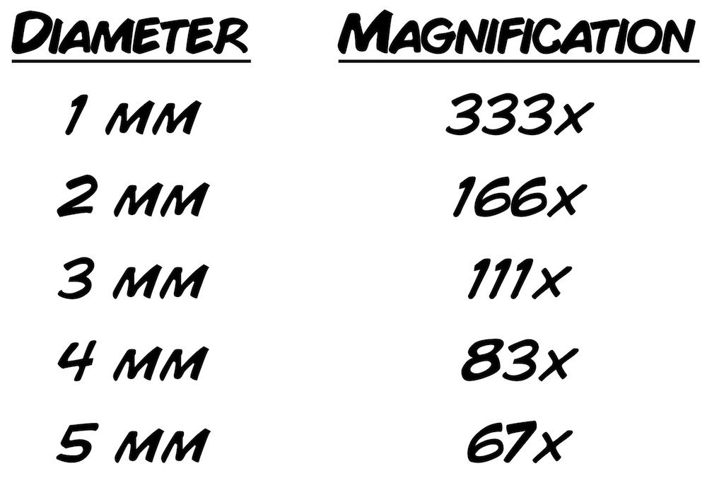](img/Magnification_Calculations.jpg)

As you decrease the size of the lens, you increase the magnification more and
more! The caveat is that the focal length, for glass, starts becoming
unmanageable around 1 mm in diameter. The focal length for 1 mm diameter glass
sphere lens is 0.75 from the center of the sphere, or 0.25 mm outside the
lens. This 0.25 mm focus is creeping into the thickness of cover slip glass
(~0.2 mm), and it will appear you will never be able to focus your sample. At
2 mm diameter lens, the focal length is 0.5 mm outside the lens, more
manageable, and at 5 mm, you have a comfortable 1.25 mm focus outside the edge
of the sphere. Of course, you magnification is less.

Now enough with such lovely history and theory, let's step away from our magic
glass screens where we read of the accomplishments of others and build
something of our own. We will construct a "re-imagination" of Antonie van
Leeuwenhoek's microscope by melting clear glass, forming small spheres, and
using our eyes to view worlds unseen.

## Video

## Procedure

Here are the tools with which you will build the first microscope. In the most
basic form, you will need:

[ 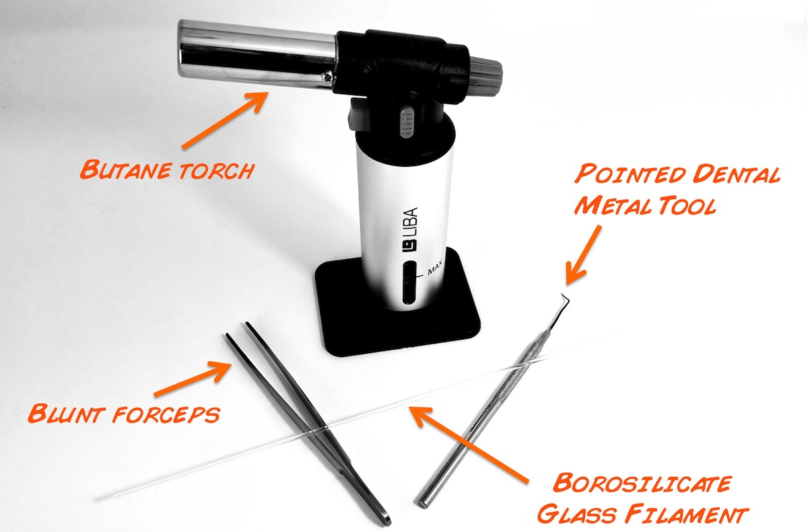](img/Tools_Needed_web.jpg)

**How to build the basic LeeuwenScope**

  1. A high temperature flame - it can be a [camping torch](https://www.amazon.com/Etekcity-Ultralight-Portable-Backpacking-Ignition/dp/B00B4FY8YO/ref=pd_bxgy_468_img_2?_encoding=UTF8&psc=1&refRID=2685X0QM77XANZYY5KQ3) or a [crème broûlèe torch.](https://www.amazon.com/Culinary-Torch-Brulee-Kitchen-Cooking/dp/B013MQ0ELS)
  2. Solid Glass Filament, we use [McMaster-Carr borosilicate glass filament](https://www.mcmaster.com/#8496k1/=19wzfco) but you can try with your own different glass filament, such as crystal glass (higher index of refraction, lower melting point) or soda lime glass (same index of refraction, lower melting point, more susceptible to fracture). 
  3. Basic Metal Probe tools - we have found [dental picks](https://www.amazon.com/Moody-Tools-55-1292-Anodized-Precision/dp/B001VXUI3O/ref=sr_1_3?ie=UTF8&qid=1508638501&sr=8-3&keywords=dental+straight+pick) work the best. 
  4. Basic [Needle Noise Pliers](https://www.amazon.com/Stanley-84-101-Basic-Cutting-Plier/dp/B000B8FRQ8/ref=sr_1_3?s=hi&ie=UTF8&qid=1508639033&sr=1-3&keywords=stanley+needle+nose+pliers), forceps, or a [jewelry toolset](https://www.amazon.com/Wisehands-Professional-Jewelry-Crafting-Storage/dp/B01N1RV9HZ/ref=sr_1_1_sspa?s=power-hand-tools&ie=UTF8&qid=1508638759&sr=1-1-spons&keywords=jewelry+pliers&psc=1). 
  5. [Support](https://backyardbrains.com/products/files/2mm_1mm_diameter_holes_2x.stl.zip) for the sphere lens 
  6. [Plain Glass Slide](https://www.amazon.com/AmScope-BS-72P-100S-22-Pre-Cleaned-Microscope-Coverslips/dp/B00L1S93PS/ref=sr_1_1?ie=UTF8&qid=1510109128&sr=8-1&keywords=glass+slide+microscopy)
  7. Onion 

**How to Fabricate the Ball Lens**

  1. Turn on the flame. Respect it. 
  2. Take a filament of glass, hold it over the flame and pull the filament apart until you get two thin points. Make sure to use solid glass filament, not hollow glass. 
  3. Take one half of your now two glass pieces, and push the tapered end into the flame until it forms a small spheroid end. 
  4. With your forceps, break off the spherical end over a flame. 
  5. Put your dental probe fine end into your glass bit over the flame. 
  6. With patience, work the glass spheroid bit with the flame, forming it and forming it, using the heat and gravity as your friend, in your attempt to make a glass sphere. It should be as round as possible and without any bubbles and minimal embedded black residue. 
  7. Once formed and cooled, please the sphere in a small hole in our 3D printer support (or alternatively a piece of cardboard). If the the glass sphere doesn't fit, use a small scissor blade to enlarge the hole. 
  8. Now prepare a slide sample or look for a pre-prepared slide sample. 

**Prepare a simple slide**

  1. Hunt or Buy an onion. 
  2. Remove the outer dark skin. Cut the onion in half. 
  3. With a tweezer, take a bit of clear onion skin. This skin layer is only one cell layer thick! 
  4. Place the onion sample on a glass slide. You are now ready to look at it with your lens. 
  5. If you have access to methylene blue, you can also view your skin cheek cells. Scrape the inside of your cheek with a tooth pick. Rub toothpick on glass side. Apply a drop of methylene blue. Soak up excess. 

**Using your Ball Lens to view the sample**

  1. Place the holder with your embedded glass sphere up to your eye, as if you are looking through a ... microscope. 
  2. Turn on a lamp and look at the lamp through the microscope. You need a light source. 
  3. Bring your slide up to the other end of the ball lens. Note that the focal length is very short, 0.3-1.0 mm away from the lens. 
  4. With patience and steady hands, the image should come into focus. Note that your ball lens needs to be at least 1 mm in diameter or greater, otherwise the focal length will be too short and too hard to focus for you. 

**Using the Leeuwenscope**

  1. With our LeeuwenScope that you can [buy](https://backyardbrains.com/products/LeeuwenScope) or [build,](https://backyardbrains.com/products/files/LeeuwenScope_Building_Instructions.pdf) place your plastic holder with its ball lens in the support stand on the LeeuwenScope. 
  2. Turn LED light on. 
  3. Place your smartphone over the lens. 
  4. Focus sample by turning the focus knobs. The depth of field is very narrow on ball lenses. 
  5. Sample should come into focus on your smartphone, and you should be able to take a picture. 
  6. Now find some pond water and see what Leeuwenhoek also saw! The greener the water, the better, and if there is plant debris is the water sample, even more so! 

How is the quality of your ball lens compared to our industry ball lens and
our [RoachScope](https://backyardbrains.com/products/roachscope)? See image
comparison below.

[ 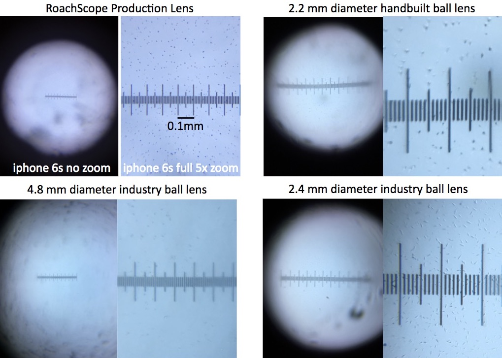](img/Magnification_Compare.jpg)

Happy exploring the previously invisible worlds!

## Notes

* You can see the microscope that Robert Hooke used for his studies at the National Museum of Health and Medicine in Washington, D.C. as part of an exhibition - [The Evolution of the Microscope](http://www.medicalmuseum.mil/?p=collections.historical.index). Scans of Hooke's gorgeously drawn book are [available online](https://www.nlm.nih.gov/exhibition/historicalanatomies/hooke_home.html). 
* Leeuwenhoek's microscope are rare (only [11 verified microscopes survive to date](https://lensonleeuwenhoek.net/content/what-happened-microscopes)), and most museum exhibitions only show replicas. But...if you want to see original Leeuwenhoek microscopes, your road leads to the [Boerhaave Museum](https://rijksmuseumboerhaave.nl/) in Leiden, the Netherlands. We have heard rumors that another is stored at the [Delft University of Technology](https://www.tudelft.nl/en/).
* Scans of Leeuwenhoek's letters to the Royal Society are [available online](http://lensonleeuwenhoek.net/content/letters). 
* If you want to visit the resting places of the scientists mentioned here, Antonie van Leeuwenhoek is buried at the "Oude Kerk" (Old Church) in the small town of Delft. Willebrord Snellius is buried at the Pieterskerk church in Leiden. The resting places of Robert Hooke and Ibn Sahl, to our knowledge, are unknown and have been lost to history. 
* The compound microscope that Hooke used should have been good enough to see at least unicellular organisms. Perhaps he never looked a pond water as Leeuwenhoek had? Or perhaps the optical quality was not high enough? We will not know short of looking ourselves at pond water with Hooke's microscope (we are trying to obtain permission....) 
* The recent re-make of Cosmos, hosted by Neil Dygrass Tyson, has an episode talking about Ibn al-Haytham's work, who was a contemporary of Ibn Sahl. Go to time mark 8:20 of episode 5 "Hiding in the Light" (available on [Netflix](https://www.netflix.com/watch/80004601?trackId=14170286&tctx=1%2C2%2C420bd144-2237-4699-a228-bb435a4529b8-61876731) and [iTunes](https://itunes.apple.com/us/tv-season/hiding-in-the-light/id888781083?i=889287736)).
* If you want to dive into the original text and understand how Ibn Sahl derived the "Sahl's Law" (Snell's Law), you can read [French scholar Roshdi Rashed's](files/Rashed_1990_Ibn_Sahl.pdf) extensive examination of Ibn Sahl's original Arabic text.
* Paul de Kruif's famous 1926 book [The Microbe Hunters](https://www.amazon.com/Microbe-Hunters-Paul-Kruif/dp/0156002620/ref=pd_lpo_sbs_14_t_0?_encoding=UTF8&psc=1&refRID=RGGVWSR9BJ75R641QAHK) has an excellent early chapter on Leeuwenhoek. Unfortunately the later chapters on 19th century disease science propagate racial stereotypes of the epoch. 
* It is easier to make microscopes out of glass than out of mirrors, and it is easier to make telescopes out of mirrors than glass. Why is this? Think about the sizes and weights involved. 
* It is interesting to think that light travels 2.6x less when it is traveling through diamond, with its index of refraction of 2.6. Could we imagine a material with an infinite index of refraction? A Black Hole? Can we imagine a science fiction world with indices of refraction less than 1, or, gasp, less than zero? 
* How Leeuwenhoek built his microscope is still unknown and only hypothesized as he never revealed his techniques, typical of scientists of his day (as Galileo also never revealed how he built his telescopes). They were not very open-source, but we try.

## Science Fair / Research Project Ideas

* Why did it take until the enlightenment for Europe to invent the microscope and telescope? A historical examination into the development of glass shaping techniques would be a valuable endeavor. The Venetians made advancements in shaping glass and mirrors in the 1300s-1400s, which they [militantly kept a trade secret](https://en.wikipedia.org/wiki/Hall_of_Mirrors). Glass had been manipulated since antiquity (Romans), but it appears glass clear enough to be used as corrective eyeglasses [occurred in the 1300s in Italy](https://en.wikipedia.org/wiki/Glasses). The first European telescopes were invented in Holland in 1608 by [Hans Lippershey](https://en.wikipedia.org/wiki/Hans_Lippershey). Why you think it took so long between eye glasses and telescopes? If you can make eye glasses, you are almost there.....Our hypothesis is that truly "clear" glass was [difficult to manufacture](https://en.wikipedia.org/wiki/George_Ravenscroft) until the 17th century, and optic theory was still not understood well. 

## Acknowledgements

* This project was developed in collaboration with biologist Daniela Flores of the Chilean science outreach group [MicroMundo](http://micromundo.microscopiavirtual.cl/). 

##  References

* John N. Davis. 2007. [Measuring the magnification of homemade simple microscope lenses](http://www.microscopy-uk.org.uk/mag/indexmag.html?http://www.microscopy-uk.org.uk/mag/artoct07/jd-lens.html). Micscape magazine. 
* Howard Gest. 2004. [The discovery of microorganisms by Robert Hooke and Antoni Van Leeuwenhoek, fellows of the royal society.](/experiments/files/2004_Gest_The discovery_of_microorganisms.pdf) Notes Rec. R. Soc. Lond. 58 (2), 187–201 
* Edmund Optics. [ Understanding Ball Lenses](https://www.edmundoptics.com/resources/application-notes/optics/understanding-ball-lenses/). 
* Roshdi Rashed. 1990. [A pioneer in anaclastics: Ibn Sahl on burning mirrors and lenses.](files/Rashed_1990_Ibn_Sahl.pdf) Isis, Vol. 81, No. 3. pp. 464-491. 
* Lesley Robertson. 2015. [van Leeuwenhoek microscopes—where are they now? ](/experiments/files/2015-Robertson_Where_are_microscopes_Leeuwenhoek.pdf)FEMS Microbiology Letters, 362, 2015, fnv056. 
* Maria Rooseboom. 1939. [Concerning the optical qualities of some microscopes made by leeuwenhoek.](/experiments/files/1939_Maria_Rooseboom_Concerning_the_optical_qualities_ leeuwenhoek.pdf) Journal of Microscopy. Vol 59,3, Pgs 177–183. 
* J. Van Zuylen. 1981. [The microscopes of Antoni van Leeuwenhoek](/experiments/files/1981_Zuylen_The_microscopes_Leeuwenhoek.pdf) Journal of Microscopy. Vol. 121, Pt 3, pp. 309-328 

#### Twitter

#### Recent Posts

  * [ It's The Backyard Brains 10-Year Anniversary!](http://blog.backyardbrains.com/?p=4906)
  * [ Cincinnati Neuroscience Outreach by BYB Alumna](http://blog.backyardbrains.com/?p=4870)
  * [ First Place at Science Fair for Student using BYB Gear](http://blog.backyardbrains.com/?p=4861)

#### BYB Information

  * [Spike Counter](/About/SpikeCounter)
  * [Contact](/About/Contact)
  * [FAQ](/About/FAQ)
  * [Our Finances](/About/Finance)
  * [Privacy Policy](/About/Privacy)

* * *

Copyright © 2009-2017 [ Backyard Brains](http://backyardbrains.com) | Protected under the Creative Common License 