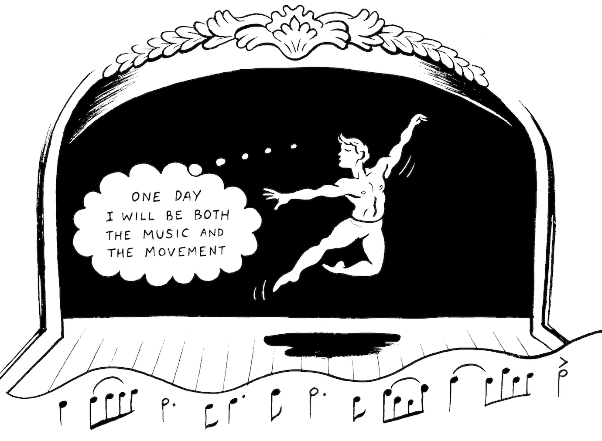
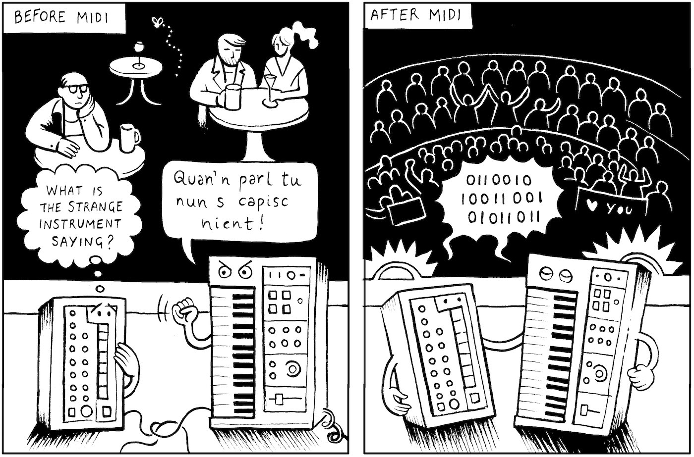
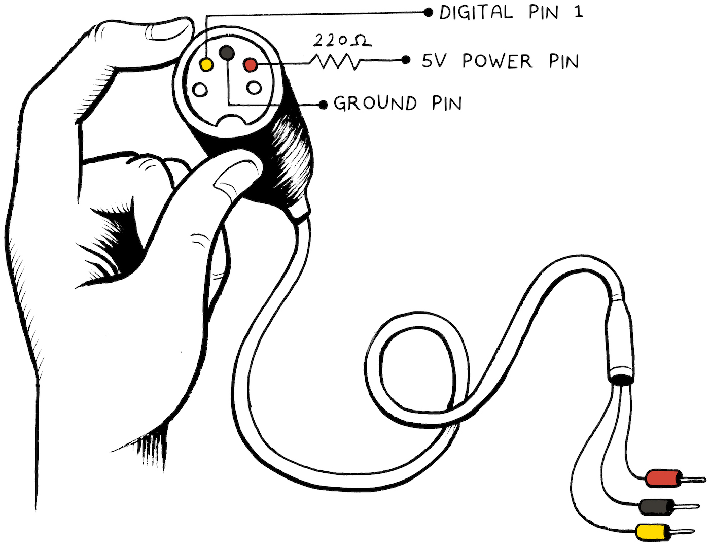
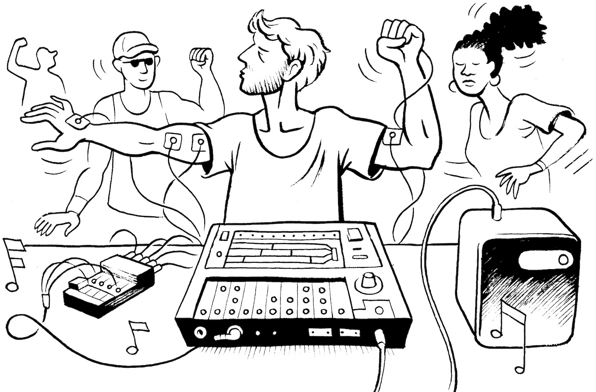
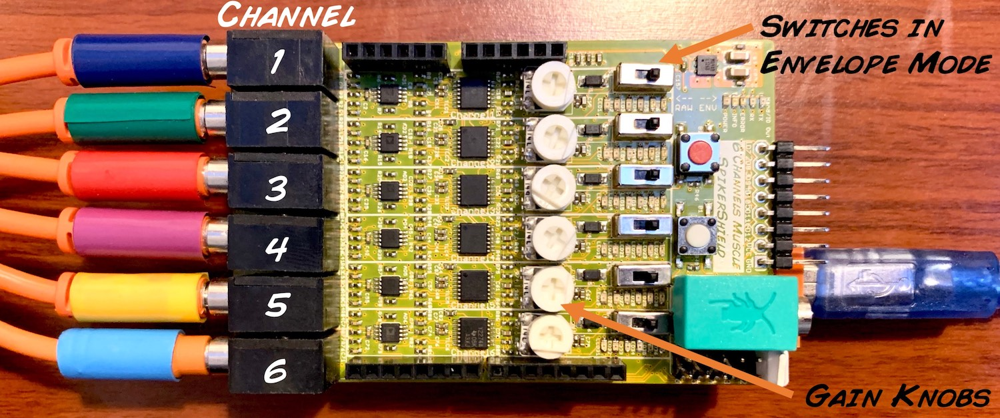
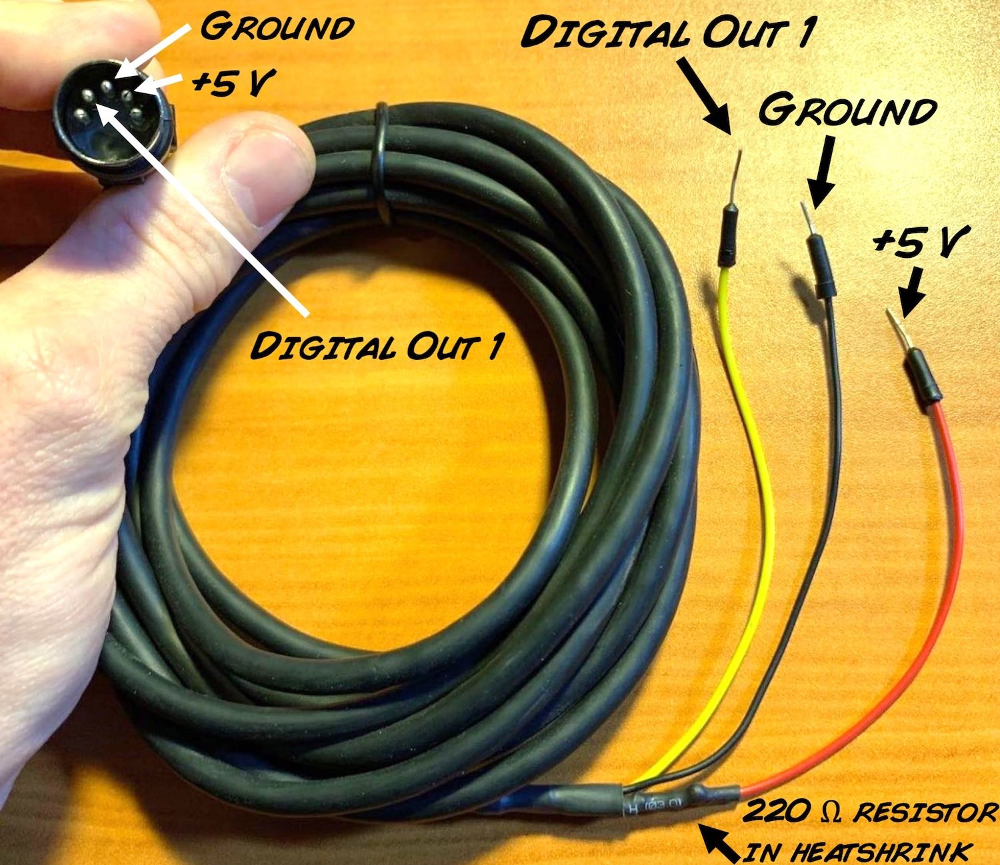
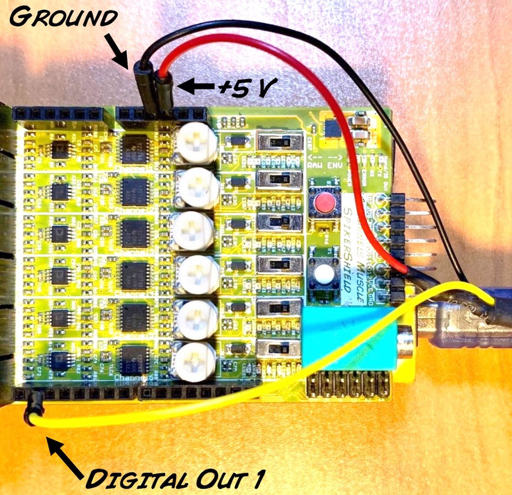

#  The MIDI Muscle Machine

We have previously developed experiments generating simple pure tones with
your muscle contraction. Now the prophecy is fulfilled, we will control a real
musical instrument with our muscles via the MIDI interface. Now you can play
more than one note at a time! Invent new styles and forms of music!

**Time:**  1 hour

**Difficulty:**   Advanced

#### What will you learn?

You will learn how to use the Muscle SpikerShield Pro to read the action
potentials of multiple muscle groups and use that information to control a
synthesizer through a MIDI interface. Music will never look back.

##### Prerequisite Labs

  * [ Music with Muscles ](music) \- This previous experiment introduces you to basic music theory and control with our simpler one-channel device. 
  * [ Muscle SpikerShield Pro ](SpikerShieldPro) \- This experiment introduces you to our more advanced multichannel device and how to generate musical sequences. 

##### Equipment

* [ Muscle SpikerShield Pro](https://backyardbrains.com/products/MuscleSpikerShieldPro)


## Background

Backyard Brains has always been a vanguard in embracing new technology. Last
year, we took a risk on a new type of peripheral interface, the [universal
serial bus](https://simple.wikipedia.org/wiki/USB), adding that capacity to
our SpikerBox Pros. We continue this tradition in risk taking and innovation
by embracing another new protocol called the [MIDI musical
interface](https://en.wikipedia.org/wiki/MIDI). With this protocol we can
control real electronic musical instruments with the contractions of multiple
muscles. Your body in motion makes the dance and the rhythm.



But first, what is MIDI? Where does it live? How do I care for it? We had the
same questions when we started this project. Luckily we have a long time
friend and musician, [Pablo Guerra](https://www.polwor.cl), that appears in a
lot of the Backyard Brains videos and explained everything to our innocent and
naive minds. [MIDI](https://en.wikipedia.org/wiki/MIDI) (Musical Instrument
Digital Interface) is a protocol standard for allowing electronic music
instruments to talk to each other. You could use a keyboard to control a drum
machine, for example. Before MIDI, it was very complicated to hook up
electrical musical instruments from different manufacturers together.



Our interface products use [Arduino](https://www.arduino.cc/) as the
microprocessor for controlling things, and, lucky for us, there are [MIDI
libraries for the Arduino](https://arduinomidilib.sourceforge.net/a00001.html).
When writing code for the Arduino for a MIDI interface, you need to specify
the instrument key, which is a number hardcoded in your electronic musical
instrument. If you want to know what the number is of the specific MIDI note
on your instrument you want to play with the Arduino, you need to look up the
Implementation Chart of [your particular MIDI
device](https://www.roland.com/global/support/by_product/tr-8/owners_manuals/)
online. In our example of the [Roland
TR-8](https://www.roland.com/global/products/tr-8/), we have 6 drum sounds
connected, and their codes are the numbers 38 - Snare Drum (Channel 1 in our
SpikerShield); 39 - Hand Clap (Channel 2 in our SpikerShield); 36 - Bass Drum
(Channel 3 in our SpikerShield); 50 - High Tom (Channel 4 in our
SpikerShield); 46 - Open High Hat (Channel 5 in our SpikerShield), and 51 -
Ride Cymbal (Channel 6 in our SpikerShield). The fundamental lines of code in
our Arduino sketch are_

MIDI.sendNoteOn(38, 127, 1);

delay(25);

MIDI.sendNoteOff(38, 127, 1);

For example, in the code above, we are turning on instrument number 38, the
Snare Drum, for 25 ms, then turning it off. The numbers 127 and 1 represent
velocity and channel in the MIDI machine (do not confuse with the SpikerShield
channel). Velocity means how "hard" you touch the key on a keyboard or hit the
drum. Channel is an independent path over which messages travel to their
destination. When you have multiple MIDI devices connected, it is useful to
have each one on a different channel (you can normally hook up a maximum of
16). For now, since we are only controlling one MIDI device (the Roland TR-8),
we just use channel 1.

To connect our Muscle SpikerShield Pro / Arduino to the synthesizer, we have
to build a special cable for this experiment, so we can make a connection
between the Muscle SpikerShield Pro and the MIDI instrument. Once we have our
Muscle SpikerShield Pro hooked up to the MIDI device, we hook up the 6
electrode channels to different muscle groups on your body.



Now let's play some music! We of course choose for our musical interface the
Roland TR-8, the modern duplicate of the classic 80s synthesizer the [Roland
T-808](https://en.wikipedia.org/wiki/Roland_TR-808) that revolutionized
electronic music and is THE behind the scenes synthesizer we can hear in our
favorite genres of hip-hop, raggaeton, and trap with their synth loops with
creative word play. Now you can invent a new genre too! Let your creativity
flow!



## Tutorial Video of Experiment

#### Downloads

> This experiment assumes you have a basic understanding of how to use the
> Arduino Platform and you know how to upload code to your board. If you are
> new to Arduino, or need a refresher, check out [Getting Started with Arduino
> on Windows](https://arduino.cc/en/guide/windows#.UyIUTYW3t4x) or [Getting
> Started with Arduino on Mac OS X
> ](https://arduino.cc/en/guide/macOSX#.UyIU2IW3t4w).
>
> [Arduino Software](https://arduino.cc/en/main/software#.Uxd6XYWhZMk)
>
> [MIDI library for
> Arduino](https://backyardbrains.com./files/MIDI.zip)
>
> [Arduino MIDI sketch you
> upload](https://backyardbrains.com./files/InvisibleDrums.ino.zip)
>
> [Simple Serial Reader for Troubleshooting](
> https://backyardbrains.com./files/SpikerShield_Pro_Serial_Read.zip)

### Procedure

  1. We will use, again, the Muscle SpikerShield Pro for this experiment.   

  


  2. We will have to build a special cable to interface the MIDI input on modern synthesizers. A MIDI has five pins but we will only need to use three of the pins_ power, ground, and serial text. Also see stylized illustation above for the schematic. Though unseen in the photo below, there is a 220 Ω resistor soldered in series with the +5 power pin in the cable. 

  


  3. Plug the MIDI end of the modified MIDI cable into the synthesizer MIDI input, and plug the modified end of the MIDI cable into Digital Input 1, ground, and 5V on your Muscle SpikerShield Pro, as shown below. 

  


  4. Plug an audio cable from the synthesizer to a speaker so you can blast your jam to the world. 
  5. Note that you will have to add a MIDI library into your Arduino Program. To do this, download the MIDI library from above (we obtained it from [a sparse online resource](https://arduinomidilib.sourceforge.net/a00001.html)). In the Arduino program, you will go to the Menu Item "Sketch"--->"Library"--->"add .zip library." Find the downloaded .zip file you just downloaded on your computer, and add it. If you do not do this, you will not be able to upload our MIDI control code to your arduino. 
  6. After that we will upload the actual MIDI control arduino code we wrote. The default code we wrote is for a Roland TR-8, but you can use any synthesizer (just look up the MIDI key numbers that came with the device -- you will have to change the code). 
  7. Now it is time to place the electrodes. We have 6 pairs of electrodes plus a ground for a total of 13 electrodes. We often put the pairs on both the hands near the thumb, on the biceps, and on the calves. The ground we place on the back of one of the hands. This is the Pablo Pardo system, an electrode configuration designed for our previous [Muscle SpikerShield Pro](https://backyardbrains.com/experiments/spikershieldpro) experiment. 
  8. Hook up the electrode cables to the electrodes (using video above as reference), and power on the Muscle SpikerShield Pro with a battery or the USB cable port. 
  9. Now it is time to dive in and make your body a musical instrument. Turn the synthesizer on, hit instrument play on the Roland T-8 or your personal synthesizer, and you are ready to begin writing music with your muscle contraction. 
  10. The code can certainly be optimized, and you can see the commented version below. Feel to modify! [Let us know](mailto_tim@backyardbrains.com) if you discover or compose something. Happy creating! 

    
```cpp
    #include 
    #include 
    #define MAX 150     //maximum posible reading. TWEAK THIS VALUE!!
    #define EMG AO
    int reading[10];
    int finalReading;
    int interBeatTime = 130; // to prevent repeat drum hits with a single contraction. You can TWEAK this as well.
    byte multiplier = 1;
    unsigned long TimeClock1;
    unsigned long TimeClock2;
    unsigned long TimeClock3;
    unsigned long TimeClock4;
    unsigned long TimeClock5;
    unsigned long TimeClock6;
    
    MIDI_CREATE_DEFAULT_INSTANCE();
    
    
    void setup(){
    
      Serial.begin(9600); //begin serial communications
      MIDI.begin(MIDI_CHANNEL_OFF);
      TimeClock1=millis();
      TimeClock2=millis();
      TimeClock3=millis();
      TimeClock4=millis();
      TimeClock5=millis();
      TimeClock6=millis();
      }
      
    
    void loop(){
    
      //channel 1 
      for(int i = 0; i < 10; i++){    //take ten readings in ~0.02 seconds
        reading[i] = analogRead(A0) * multiplier;//set the channel here in the Analog input
        delay(2);
      }
      for(int i = 0; i < 10; i++){   //average the ten readings
        finalReading += reading[i];
      }
      finalReading /= 10;
     
    
      finalReading = constrain(finalReading, 0, MAX);
     
    
        if(finalReading > 100){
        if ((millis()-TimeClock1)>interBeatTime) { 
     MIDI.sendNoteOn(38, 127, 1);//set note here, look up for the MIDI Implementation Chart of your machine
     delay(25);
      MIDI.sendNoteOff(38, 127, 1);
      TimeClock1=millis();
      }}
    
      
    
       //channel 2 
      for(int i = 0; i < 10; i++){    //take ten readings in ~0.02 seconds
        reading[i] = analogRead(A1) * multiplier; //set the channel here in the Analog input
        delay(2);
      }
      for(int i = 0; i < 10; i++){   //average the ten readings
        finalReading += reading[i];
      }
      finalReading /= 10;
     
    
      finalReading = constrain(finalReading, 0, MAX);
     
    
        if(finalReading > 100){
        if ((millis()-TimeClock2)>interBeatTime) { 
     MIDI.sendNoteOn(39, 127, 1); //set note here, look up for the MIDI Implementation Chart of your machine
     delay(25);
      MIDI.sendNoteOff(39, 127, 1);
      TimeClock2=millis();
      }}
    
    
    
       //channel 3 
      for(int i = 0; i < 10; i++){    //take ten readings in ~0.02 seconds
        reading[i] = analogRead(A2) * multiplier; //set the channel here in the Analog input
        delay(2);
      }
      for(int i = 0; i < 10; i++){   //average the ten readings
        finalReading += reading[i];
      }
      finalReading /= 10;
    
    
      finalReading = constrain(finalReading, 0, MAX);
     
        if(finalReading > 100){
        if ((millis()-TimeClock3)>interBeatTime) { 
     MIDI.sendNoteOn(36, 127, 1); //set note here, look up for the MIDI Implementation Chart of your machine
     delay(25);
      MIDI.sendNoteOff(36, 127, 1);
      TimeClock3=millis();
      }}
    
    
       //channel 4 
      for(int i = 0; i < 10; i++){    //take ten readings in ~0.02 seconds
        reading[i] = analogRead(A3) * multiplier; //set the channel here in the Analog input
        delay(2);
      }
      for(int i = 0; i < 10; i++){   //average the ten readings
        finalReading += reading[i];
      }
      finalReading /= 10;
     
      finalReading = constrain(finalReading, 0, MAX);
     
    
        if(finalReading > 100){
          if ((millis()-TimeClock4)>interBeatTime) { 
     MIDI.sendNoteOn(50, 127, 1); //set note here, look up for the MIDI Implementation Chart of your machine
     delay(25);
      MIDI.sendNoteOff(50, 127, 1);
      TimeClock4=millis();
      }}
    
       //channel 5 
      for(int i = 0; i < 10; i++){    //take ten readings in ~0.02 seconds
        reading[i] = analogRead(A4) * multiplier; //set the channel here in the Analog input
        delay(2);
      }
      for(int i = 0; i < 10; i++){   //average the ten readings
        finalReading += reading[i];
      }
      finalReading /= 10;
     
      finalReading = constrain(finalReading, 0, MAX);
     
    
        if(finalReading > 100){
        if ((millis()-TimeClock5)>interBeatTime) {
     MIDI.sendNoteOn(46, 127, 1); //set note here, look up for the MIDI Implementation Chart of your machine
     delay(25);
      MIDI.sendNoteOff(46, 127, 1);
      TimeClock5=millis();
      }}
    
    
       //channel 6 
      for(int i = 0; i < 10; i++){    //take ten readings in ~0.02 seconds
        reading[i] = analogRead(A5) * multiplier; //set the channel here in the Analog input
        delay(2);
      }
      for(int i = 0; i < 10; i++){   //average the ten readings
        finalReading += reading[i];
      }
      finalReading /= 10;
     
      finalReading = constrain(finalReading, 0, MAX);
     
    
        if(finalReading > 100){
        if ((millis()-TimeClock6>interBeatTime)) {
     MIDI.sendNoteOn(51, 127, 1); //set note here, look up for the MIDI Implementation Chart of your machine
     delay(25);
      MIDI.sendNoteOff(51, 127, 1);
      TimeClock6=millis();
      }}
    }
    
```

### Discussion

  1. If you want to know more about how MIDI channels work, you can go [ down the rabbit hole.](https://www.indiana.edu/~emusic/361/midi.htm)
  2. This is a MIDI Instrument! You are obviously not limited to connecting your body to one synthesizer. You could have the output of the Roland TR-8 Control a [Korg Volca Bass](https://www.korg.com/us/products/dj/volca_bass/), as we do in the advanced section of the video above. 
  3. A wireless version, where someone could freely dance and generate music, would certainly be compelling and truly be [the mother of all demos](https://en.wikipedia.org/wiki/The_Mother_of_All_Demos). What do you think are the technical challenges for achieving this? 

### Troubleshooting

  1. Since we have six wires going to different muscles, we have to be careful about the organization of the wires to make sure we have a full range of movement. 
  2. If you are not causing a tone to activate, you can look at the serial monitor to see the values your muscle contracting is causing, and change the gain by increasing it (clockwise) or decreasing it (counter-clockwise) on the corresponding white knobs on the SpikerShield Pro board. With our MIDI control Arduino code, unfortunately you cannot open the Serial Monitor on the Arduino Program (you will just see a bunch of weird symbols). However, you can use a [Serial Test Reader](https://backyardbrains.com./files/SpikerShield_Pro_Serial_Read.zip) (also downloadable above) that Pablo Pardo, a high school intern, wrote for us. Upload this code to check your values, and then you can re-upload the MIDI sketch again. 

### Acknowledgements

  1. We thank [Florencia Edwards](mailto:flo@backyardbrains.com) for investigating and diagramming the MIDI-Arduino connection for us, which was fundamental to getting the experiment working. 
  2. We also want to thank longtime collaborator [Pablo Guerra](https://www.polwor.cl) for helping us with the pilot MIDI experiments and for loaning us his Roland TR-8 for two months. He is also the actor on the video above. We additionally thank Belén Richard for her impromptu acting services. 
  3. We also thank Almudena Cerrudos of the Spanish Television show "El Hormiguero" for [inviting us](https://www.youtube.com/watch?v=NlWiHZfd70A) to present the first prototype of this project on their program. A well known invited celebrity had the chance to see it...