# Experiment:The Patellar Reflex and Reaction

Time  30 Minutes

Difficulty  Intermediate

#### What will you learn?

We can use this demonstration to learn how reflexes work. Many important motor
reflexes are processed by the spinal cord and occur without any input from our
brain. Motor reflexes are involuntary, which we will see here. Make someone
move without their control! (again)

##### Prerequisite Labs

  * [Record Electricity from your Muscles](musclespikerbox) \- You should read this experiment first to learn about electromyography and motor units.
  * [Reaction Time](reactiontime) \- This experiment also explains the difference between reactions and reflexes.

##### Equipment

[Muscle SpikerBox Pro](/products/musclespikerboxpro)

[Reflex Hammer](/products/reflexhamer)

* * *

## Background

Reflexes require no thought. They are automatic, fast, and of huge importance
to a human's ability to successfully respond to their environment. Despite the
magnificent information-processing power of the billions of neurons in our
brain, we need a lot of stuff to be done automatically. Without reflexes, our
brains would be overloaded with worrying about constantly updating the
position of our unstable bodies to keep us upright. Without reflexes, our
ability to engage in complex thought (black holes, neuroscience, what to do
this weekend, how do I make an instrumented reflex hammer?) would be limited.
Without reflexes, your reactions to painful stimuli would require thought,
and... don't take it personally.. but you think very slowly... Don't feel bad,
all humans are slow thinkers, and we need more speed to respond to dangerous
painful stimuli. So we let our spinal cord do that fast work for us.

One example of a reflex is the patellar stretch reflex. Our spinal cord
partners with sensors in our muscles, called muscle spindles, to keep track of
where our bodies are in space and how stretched or contracted our muscles are.
The way that these sensors interact with our spinal cord is through a reflex
pathway. Stretching the muscle activates the muscle spindle at the end of the
sensory neuron (embedded in your muscle) and starts the reflex. The reflex is
to prevent overstretching of the muscle and compensates with a contraction.

[ 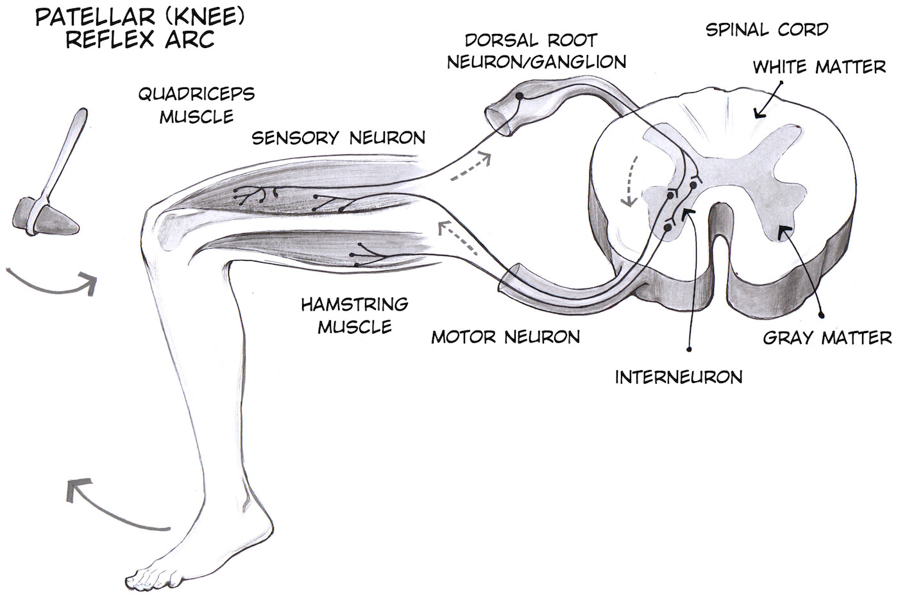](img/Knee_Reflex_web.jpg)

As you can see, there is only one connection (a synapse) needed for the
information from the sensory neuron to get to the motor neuron and cause a
muscle contraction. Because of this single synapse, this can happen very fast.
In a young, healthy person, it takes 15-30 milliseconds for the stretch
stimulus to produce a muscle contraction, by comparison, it takes 5-10 times
that long to blink your eye in response to a stimulus, or 150-300
milliseconds. This is super useful for correcting your muscle length in
response to rapid changes such as a slip or trip. These situations require
very fast corrections to prevent falling and injury. If you had to consciously
flex your leg in response to the leg stretch (a reaction) it would be much
slower than the 15-30 seconds of reflex.

Now let's try to measure this reflex! And perhaps let's measure a reaction
too!

> Before you begin, make sure you have the [Backyard Brains Spike
> Recorder](https://backyardbrains.com/products/spikerecorder) installed on
> your computer/smartphone/tablet. The Backyard Brains Spike Recorder program
> allows you to visualize and save the data on your computer when doing
> experiments. We have also built a simple lab handout to help you tabulate
> your data.
>
> ### Updated Firmware
>
> If you purchased your [Muscle SpikerBox Pro](products/MuscleSpikerBoxPro)
> before Feb 2019, you will need to follow the [Firmware Update
> Instructions](https://backyardbrains.com/products/files/UpdateMuscleSpikerBoxProFirmware.pdf)
>
> [Spike Recorder Computer
> Software](https://backyardbrains.com/products/spikerecorder)
>
> [Class
> Handout](https://backyardbrains.com/experiments/files/Knee_Jerk_Handout.pdf)
>
> [Firmware Update
> Instructions](https://backyardbrains.com/products/files/UpdateMuscleSpikerBoxProFirmware.pdf)

## Video

#### Print Materials

> If you're looking for a PDF to print and scribble on, or a google doc to
> edit, [check out this repository of print resources
> here!](https://drive.google.com/drive/folders/1bE1B0DvsGNauhyj-z8YjzuBXmFYivfkR?usp=sharing)

## Experiment

For this experiment, we are going to look at the electromyographic signal in
the [_rectus femoris_](https://en.wikipedia.org/wiki/Rectus_femoris_muscle)
muscle, one of the muscles in the quadriceps femoris group. We elicit a reflex
using a tap to the patellar tendon. This is the same test that is done when
you go to the doctor's office (the doctors use it as a quick test to determine
spinal pathway health - problems can be symptomatic of neuromuscular
diseases).

  1. Set up your Muscle SpikerBox Pro using a smartphone or computer with the Spike Recorder app. 
  2. Connect the USB cable from the Muscle SpikerBox Pro to the computer. Open Spike Recorder, and turn on your Muscle SpikerBox Pro. A USB icon should appear on the main SpikeRecorder screen. Click on it to connect to your Muscle SpikerBox Pro. (Note_ If you are using a tablet, smartphone, and/or a Regular Muscle SpikerBox, you can connect to your tablet/smartphone/computer with the green smartphone audio cable. 
  3. Have the subject sit on a sturdy surface high enough to allow their lower legs and feet to dangle freely. 
  4. Have the subject contract their quadriceps (knee extensor) muscle so you can place two on either side of the knee as shown in below. One electrode on the Vastus Medialis, one on the Vastus Lateralis. Place a ground adhesive electrode on the back of the hand. 

[ 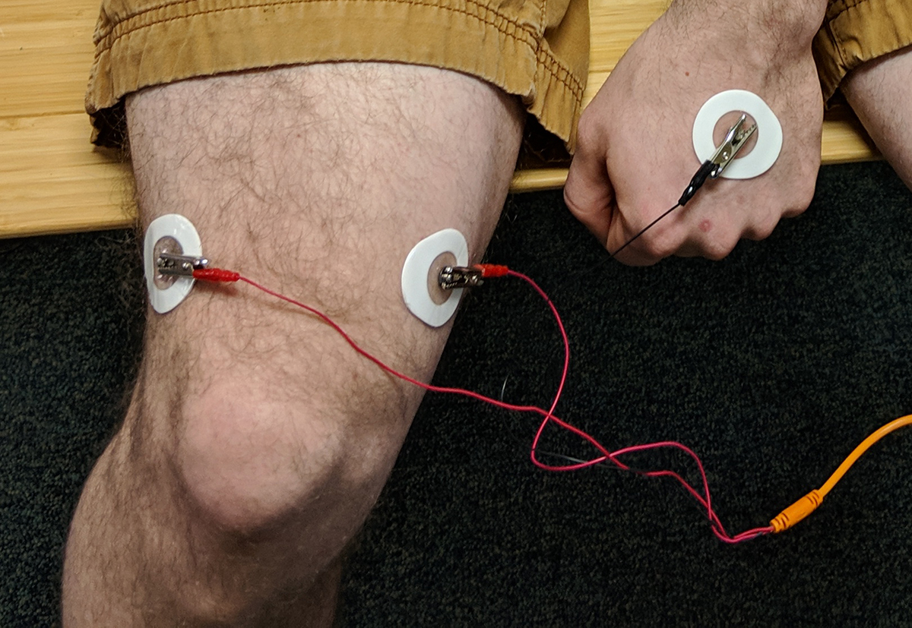](img/ReflexHammerPrep2.jpg)

  5. Clip the red leads of your orange muscle cable of the electrodes on the muscle of your thigh, and the black lead on the ground on your outer palm.
  6. Getting a good quality muscle signal is really important for this experiment. Test to see if you get a good EMG signal with a fairly small contraction by asking the subject to straighten their knee against resistance. Poor signal? Adjust the vertical zoom on SpikeRecorder. If that still doesn't help, adjust the electrode placement. 
  7. Also, if you are still not getting a very clear signal, feel free to experiment with where you place the ground electrode. You can also go into the SpikeRecorder settings and set the signal threshold from 70 to 1500, and check the box by "60hz" to filter out more noise. 
  8. Locate the part of the patellar tendon just below the kneecap and above where it inserts into the shinbone. The best place to tap it is just below the kneecap. If you like this person, avoid hitting the knee cap because...ouch! Use a quick, firm tap to the tendon to elicit an involuntary kick out. Experiment with small changes in location and tap force. Find the sweet spot.

[ 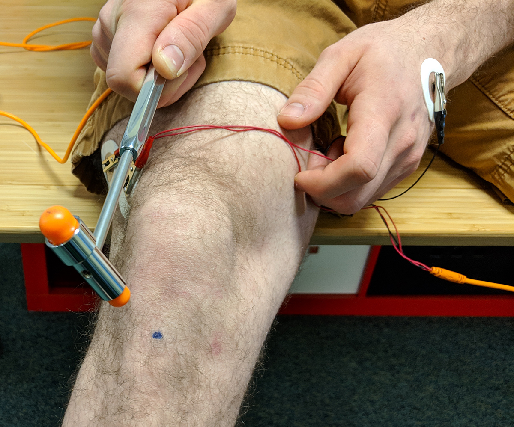](img/ReflexHammerPrep4.jpg)

[ 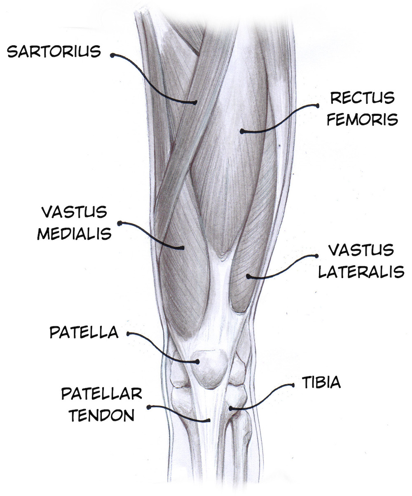](img/Knee_Anatomy_web.jpg)

  9. If you have good electrode placement and apply a smart tap to the patellar tendon, you should see something like this (Note, it will be small! You may have to zoom in)_

[ 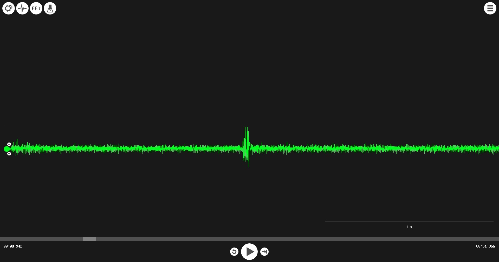](img/ReflexEMG.jpg)

  10. Make a recording and zoom in over one of the reflex signals. You can see that the EMG signal looks much like other EMGs you have seen_

[ 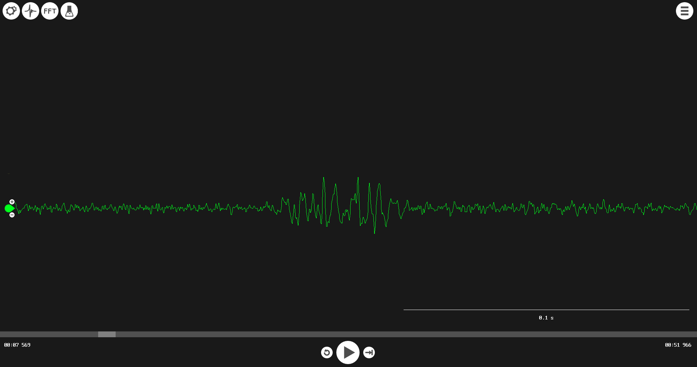](img/ReflexEMG2.png)

  11. Congratulations! You can now record the muscular response to the Patellar Reflex. But how might we measure the time difference between when the hammer strikes and the muscle flexes?

###

**Measure Reflex time**

  1. Yes! We can measure the reflex time with the Backyard Brains [Reflex Hammer](https://backyardbrains.com/products/reflexhammer) \- an expansion kit for the [Muscle SpikerBox Pro](https://backyardbrains.com/products/musclespikerboxpro). 

[ 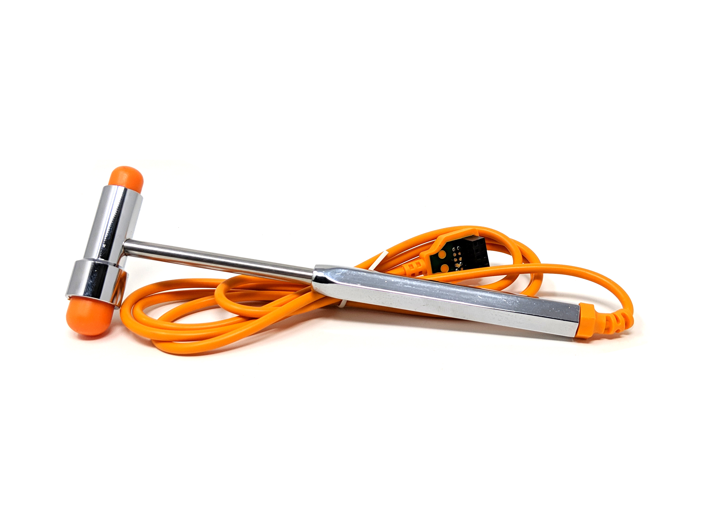](img/Hammer_Large.jpg)

  2. Plug the Reflex Hammer into the Muscle SpikerBox Pro. If you are connected to SpikeRecorder already, you should see a second channel appear in the recording! Give the hammer a wiggle... then gently strike it against a nearby obstacle or foe. Watch in SpikeRecorder as the accelerometer in the Reflex Hammer creates great wiggles and spikes! 

[ 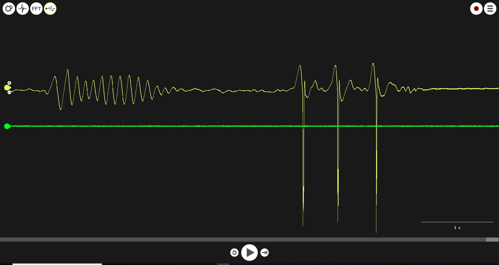](img/ReflexRecord4.jpg)

  3. Now, have your subject sit up high so their legs are dangling. Also, and this is important, have your subject **close their eyes or look away** so that they can't anticipate the hammer. 
  4. Begin experimenting! Depending on how you'd prefer to describe it, give your subject some forceful taps, or gentle strikes, below their kneecap. Once you find the sweet spot, you should be able to evoke the leg-kick reflex! 

[ 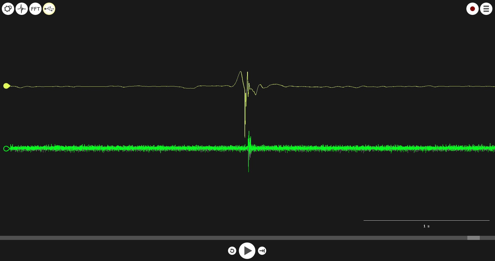](img/ReflexRecord1.png)

  5. Zoom in with touch controls or your mouse wheel. You can measure the reflex time by measuring the difference between the spike when the hammer strikes and the muscles flex in response! The hammer strike is when the accelerometer in the reflex hammer experiences the greatest degree of (de)acceleration, so alight the EMG recording to the earliest "vertical" mark on the accelerometer reading - see photo before. You can use the handout link above to have a form to allow you to easily tabulate the data. 

[ 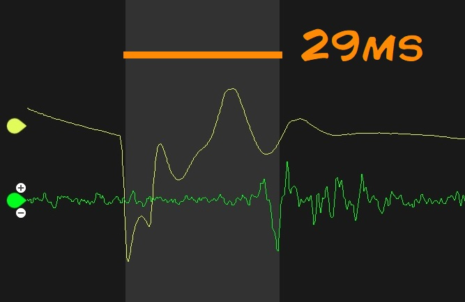](img/ReflexRecord2_Label_small.jpg)

###

**Compare Against Reaction time**

If you have the [Reaction
Timer](https://backyardbrains.com/products/ReactionTimer) and performed the
experiment [How Fast can Your Body
React?"](https://backyardbrains.com/experiments/MuscleReactionTime), compare
your findings and see how Reflex and Reaction times stack up against each
other. Don't have the Reaction Timer? Well, you can record a simple reaction
time test with this set-up too!

  1. We can measure and compare the time difference between "brain circuits" (reaction) and "spinal cord circuits" (reflex) with this setup! 
  2. Use the second channel of the Muscle SpikerBox Pro to record from your other leg with the same electrode placement. 
  3. Tell the research subject to close their eyes again. Tell them to kick their other leg when they feel the hammer tap the same leg you had recorded from previously. 
  4. Compare the reflex of one leg to the reaction of the other! You should notice the reaction is dramatically slower than the reflex. Why do you think that is? (We think you know the answer!) 

[ 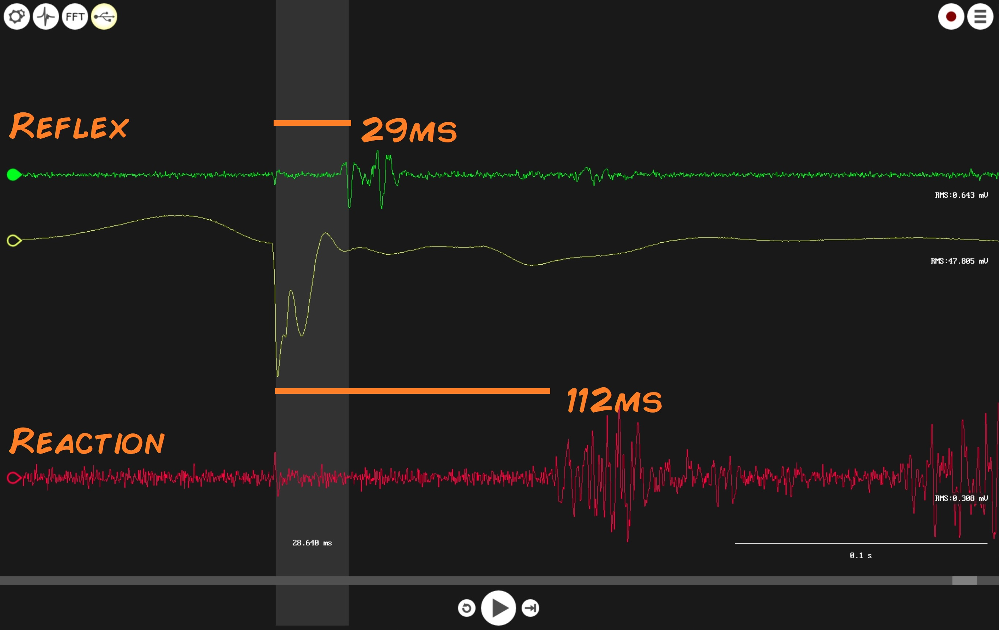](img/ReflexReact.jpg)

## Troubleshooting Suggestions

There is large variability between subjects in how well the EMG signal can be
seen. As a last resort, you may need to try the demonstration with a different
volunteer. If you are still having trouble, it may be necessary to move the
placement of the electrodes. Recording strictly from the vastus medialis or
lateralis can also work well. See below_

**Medialis**

[ 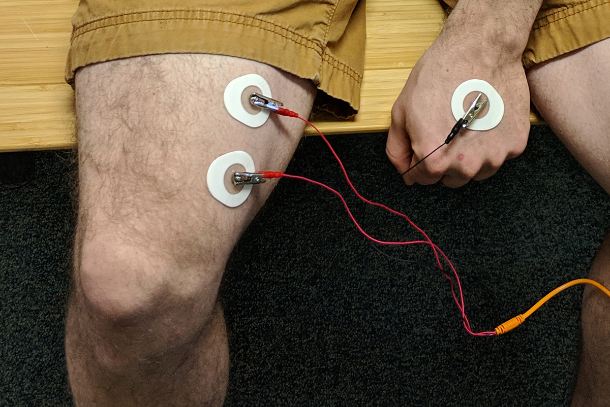](img/ReflexHammerPrep1.jpg)

**Lateralis**

[ 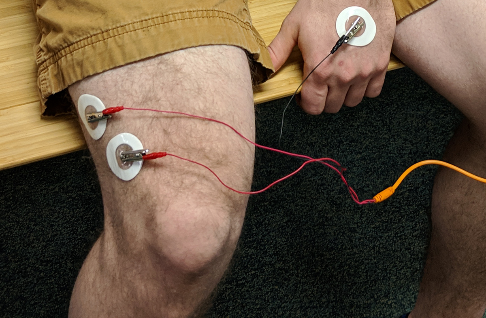](img/ReflexHammerPrep3.jpg)

  * Still having trouble? Try positioning the electrodes even further onto the lateral or medial sides of the leg. 
  * If you are plugged into a wall outlet, go into the settings a check the box that says "60hz" to filter out electrical interference. 
  * Make sure your hammer isn't hitting one of the red wires! 

## Science Fair Project Ideas

* What are some other reflexes you think you could test? 
* Does the speed/amplitude of the response change depending on the state someone is in? For example, if they are tired, have a lot of energy, had coffee recently, etc. Why do you think these do or don't affect the reflex? 
* Don't hurt yourself or anyone else investigating this, but does the speed or amplitude depend at all with the force you strike the knee with? Why might this be or not be? 
* For this experiment, the person having their reflex activated normally keeps the leg relaxed, but what if they try to resist the reflex? Does that affect the speed or amplitude at all, or does the reflex even happen? Why might this be? 
* We have noticed two things worth further examination. The reflex time tends not to be very variant in a single person during a session (always +-2 ms), but the reflex time between individuals can range from 13 ms to 35 ms. Since this is an unconscious reflex, what may be the reasons for such variability between individuals? Age, fitness, athletes (runners vs weightlifters, etc) may all be factors. Also, the reaction component tends to be more varied trial to trial _within a person_ (from 130 - 200 ms), as this requires conscious control and "attention" which increase time variability between trials. Start collecting data from all the people you know!