# Experiment_ Transistor Circuit Design

You can now explain with confidence what p-doping, n-doping, and depletion
layers mean. Now you will put that knowledge to use. You have the transistor
in your hand. You stare at it, knowing the power it contains and what it has
done for the world. Here you will use your transistor to amplify some spikes.

Time  1-3 Hours

Difficulty  Advanced

#### What will you learn?

In the [previous Transistor lesson
plan](https://www.backyardbrains.com/experiments/transistorTheory), you learned
the theory. Now you will apply it and build your own simple amplifier circuit
from scratch using two transistors and some various resistors/capacitors.

##### Prerequisite Labs

  * [Transistor Theory](https://www.backyardbrains.com/experiments/transistorTheory) \- Read how a transistor works before proceeding
  * [SpikerBox](spikerbox) \- A familiarity with spikes will make this activity more meaningful

##### Equipment

[Stimulation Cable](/products/stimulationcable)

[Cockroaches](/products/cockroaches)

[Electrode](/products/recordingelectrode)

* * *

## Procedure

**Note_**_This circuit was designed when we were just learning how to teach
transistor function. Wiser now, we know there are some errors below in the
math with the filter calculations. We will redesign this circuit when time and
resources permit, but note that the circuit still works (can amplify spikes)._

In order to build an amplifier, all you need are a transistor, a power source,
some resistors, and some capacitors. There are many ways to mix these
together, which is an art ([Steve Jobs](https://www.vimeo.com/31813340) often
called laying out circuits "digital art"), but we will give you some basic
conditions and assumptions to work with and then walk you through the design
of your very first simple bio-amp!

There are multiple configurations using NPN transistors, but we will use the
"common emitter configuration" because it allows us to have high voltage gain.
Why is it called a "common emitter amplifier?" - because the base is the
input, the collector is the output, and the "common" or ground is the emitter.

[ 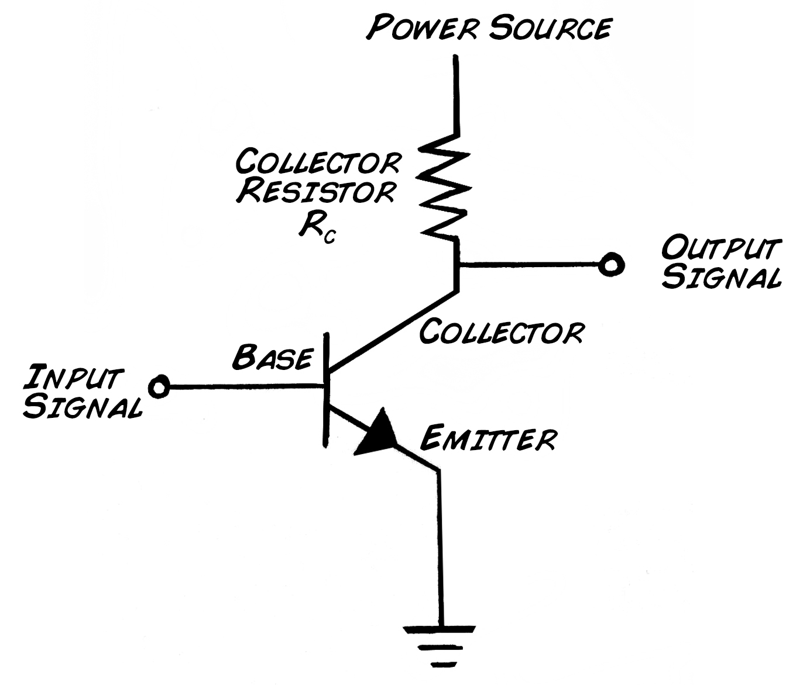](img/CommonEmitter.jpg)

Like any diligent engineer, let's start with the "requirements" which is a
boring way to say_ "what we want this machine to actually do." For our bio-
amp, we want to "amplify" the very small electrical signals in the cockroach
nerves. Let's aim for a "gain" of 150, or increasing the amplitude of the
signal 150 times. We also want to limit what we amplify to ensure we are only
paying attention to spikes (action potentials) and not other electrical
signals like electrical noise from your house. So, like the real SpikerBox, we
only want to measure signals with components above 300 Hz (cycles per second).
This is also called "high-passing" the signal.

Thus, we have two requirements

  1. Gain of 150. 
  2. Filter setting_ high pass filter of 300 Hz.

Now back to the art of electronics design. We base our amp heavily from the
very excellent book ["Practical Electronics for
Inventors"](https://www.amazon.com/Practical-Electronics-Inventors-Third-
Edition/dp/0071771336/ref=dp_ob_title_bk) by Paul Scherz.

##### Parts

In addition to the
[cockroaches](https://www.backyardbrains.com/products/cockroaches), the
[cable](https://www.backyardbrains.com/products/stimulationcable), and the
[electrode](https://www.backyardbrains.com/products/recordingelectrode)
mentioned above, you need to visit your local friendly
[RadioShack](https://www.radioshack.com/storeLocator3/index.jsp?clickid=rsk_header_storeLocator)
to obtain_

  1. two NPN transistors (2N4401) -from [transistor sample pack](https://www.radioshack.com/product/index.jsp?productId=2062586)
  2. four 4.7 kΩ Resistors -from [resistor sample pack](https://www.radioshack.com/product/index.jsp?productId=2994585)
  3. four 1 kΩ Resistors from same sample pack 
  4. one 50 Ω Resistor from same sample pack 
  5. two [1 µF capacitors](https://www.radioshack.com/product/index.jsp?productId=12401431&filterName=Type&filterValue=Ceramic+disc+capacitors)
  6. four [10 µF capacitors](https://www.radioshack.com/product/index.jsp?productId=2102481)
  7. some [jumper wire](https://www.radioshack.com/product/index.jsp?productId=2103801)
  8. a [solderless breadboard](https://www.radioshack.com/product/index.jsp?productId=12165713)
  9. a [9V battery connector](https://www.radioshack.com/product/index.jsp?productId=2062218)
  10. a [9V battery](https://www.radioshack.com/product/index.jsp?productId=3897297)
  11. an [RCA plug](https://www.radioshack.com/product/index.jsp?productId=2103224&filterName=Category&numProdsPerPage=60)
  12. a [RadioShack Speaker](https://www.radioshack.com/product/index.jsp?productId=2062620) (we love these things) 

You also need a small piece of cork or styrofoam to lay the cockroach leg on.

## Designing the Circuit

##### Emitter and Collector Resistors

Since we will be using a 9V battery, and our spikes have both a positive and
negative component_

[ 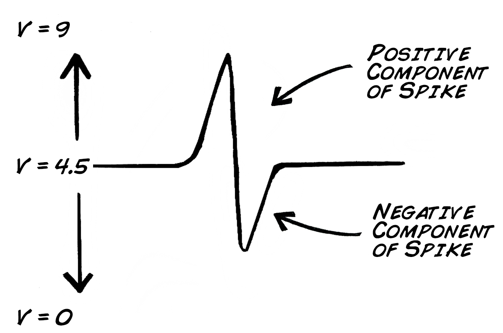](img/SpikePosNeg.jpg)

We want the neural signal to ride on top of +4.5 V, so we have enough voltage
"room" to amplify both the negative and positive parts of the signal. Thus,
need the Vc, or voltage at the collector, to be 1/2 Vcc (it's confusing, but
Vcc means "common current"" or more generally, our 9V power source). We thus
need to put a resistor at Vc to set Vc = 1/2 Vcc, and we use Ohm's law V=IR,
which we can rewrite as_

[ 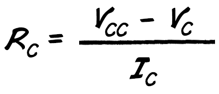](img/RcCalc_1.jpg)

Ic is the current through the collector and function of the transistor (you
use the [data
sheet](https://edge.rit.edu/content/P12005/public/Part%20DataSheets/2N4401NPN.pdf)
of the transistor to calculate it). We will use a value of 1 mA for Ic.

[ 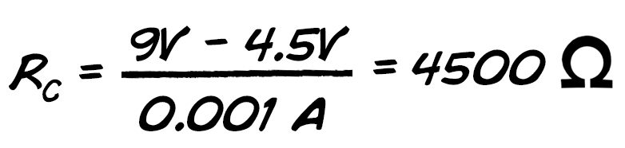](img/RcCalc_2.jpg)

4.7 kΩ is a standard value from a resistor pack, so we will use 4.7 kΩ for Rc

[ 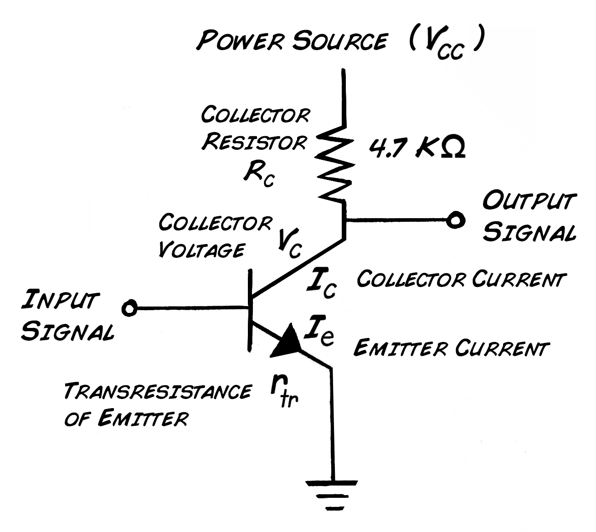](img/CommonEmitter2.jpg)

The gain of our circuit as it stands at ΔVc/ΔVe which is equal to the ratio of
Rc/Re.

[ 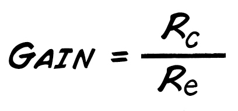](img/GainCalc0.jpg)

We have already set Rc = 4.7 kΩ, and Re is already built into transistor. Its
Re is called the transresistance, which is calculated as_

[ 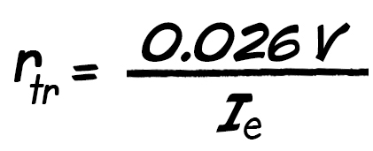](img/transresistance_1.jpg.jpg)

Ie is approximately the same as Ic, so the transresistance is thus 26 Ω.

[ 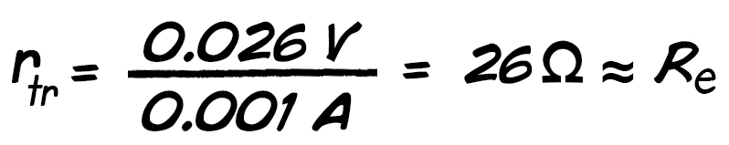](img/transresistance_2.jpg)

We can calculate the gain as thus_

However, the transresistance can be unstable in the transistor, so we need to
add our own R in addition to the transresistance.
[Scherz](https://www.amazon.com/Practical-Electronics-Inventors-Third-
Edition/dp/0071771336/ref=dp_ob_title_bk) recommends a Ve of 1 V to stabilize
the transresistance instability, so via Ohm's law_

But note that that adding this R to the circuit_

[ 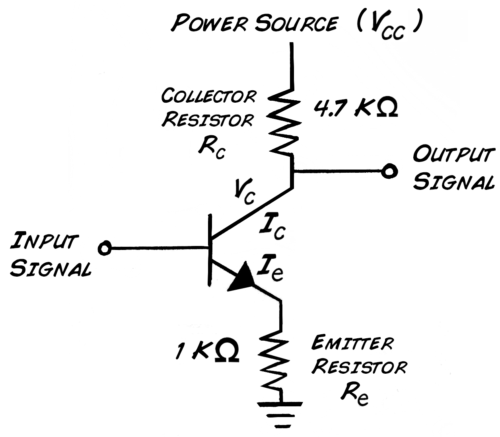](img/RcRe_Known.jpg)

We will have a change in gain. The new gain is_

Oh no! Our original gain of 180 disappeared! And our gain is now much smaller
than we need! But, have no fear, we can add a capacitor in parallel with the 1
kΩ resistor that will effectively make the 1 kΩ disappear for our spike
signal. We want to add the capacitor anyway, as we need to make a_

##### High Pass Filter

A resistor and capacitor in parallel act as high pass filters, and, as stated
above, we want our high pass to 300 Hz. This is easy to calculate.

[ 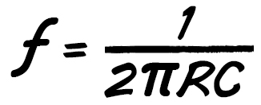](img/HighPassCapacitor_1.jpg)

We already have R = 1 kΩ, and the f should be 300 Hz, so the capacitor is thus
20 uF.

[ 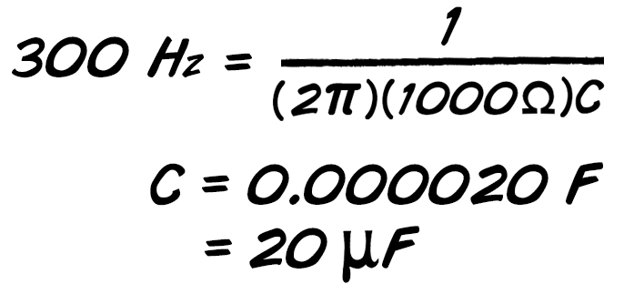](img/HighPassCapacitor_2.jpg)

All that remains is the input capacitor to remove any DC offset on the input
signal and keep our circuit stable. Let's just set it to 1 uF.

[ 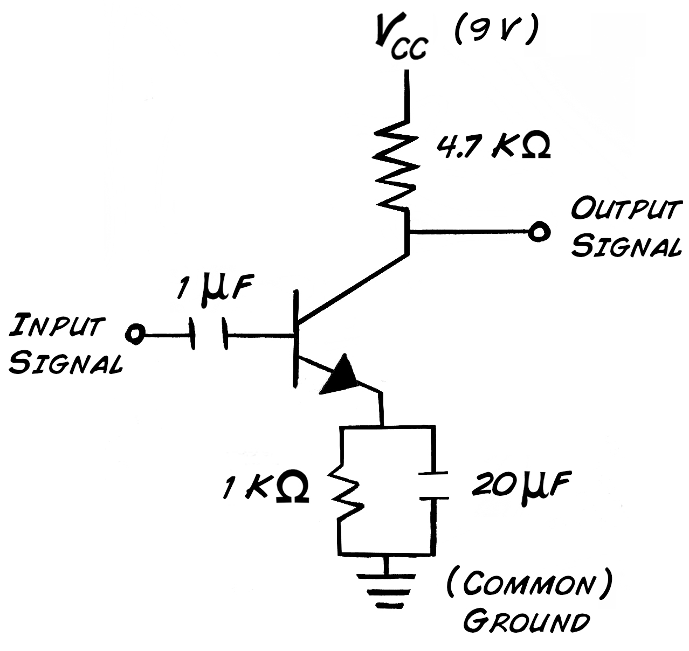](img/CommonEmitter_CapsIN.jpg)

##### Setting the Bias Voltages

Remember from our [transistor
theory](https://www.backyardbrains.com/experiments/transistorTheory) that the
transistor will not switch on without a lower limit voltage push, and this is
approximately 0.6 V for silicon-based circuits. We need to add bias resistors.

[ 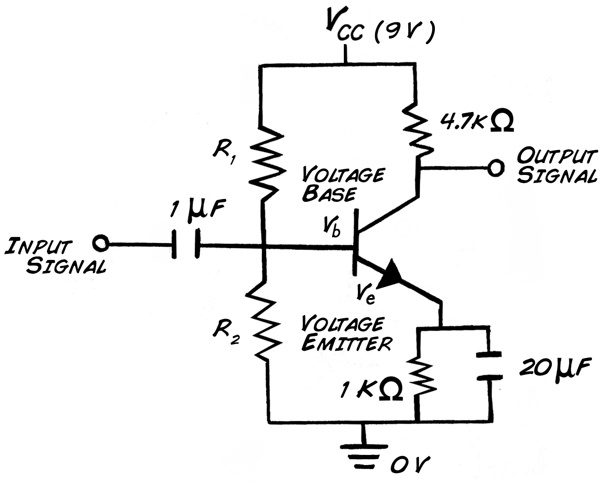](img/NeedR1R2.jpg)

We want Vb, the voltage at the base, to be 0.6 V higher that the Voltage at
Ve, so

[ 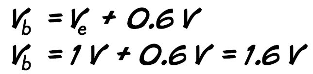](img/Vbase.jpg)

We know Ve to be 1V due to the voltage drop calculated above, so Vb should be
1.6V. We will make a voltage divider!

[ 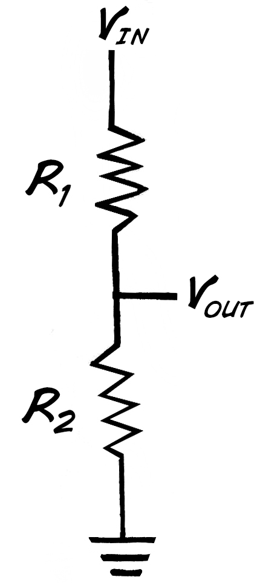](img/VoltageDivider.jpg)

Our Vin is course 9V, and our Vout is 1.6 V, and we use the classic voltage
divider equation_

[ 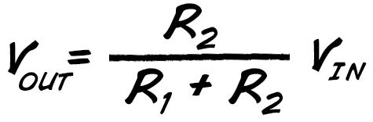](img/VoltageDividerEquation.jpg)

We can rearrange the equation and calculate...

[ 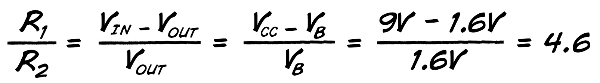](img/R1vR2.jpg)

Thus, R1 needs to be ~4.6x larger than R2. Sounds simple enough, but, as a
rule of thumb for this transistor design_

[ 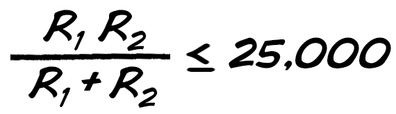](img/minimumR1R2.jpg)

So, we'll just select R2 = 1 kΩ, and R1 = 4.7kΩ as values, since we are
already using these resistor values and have them on hand.

[ 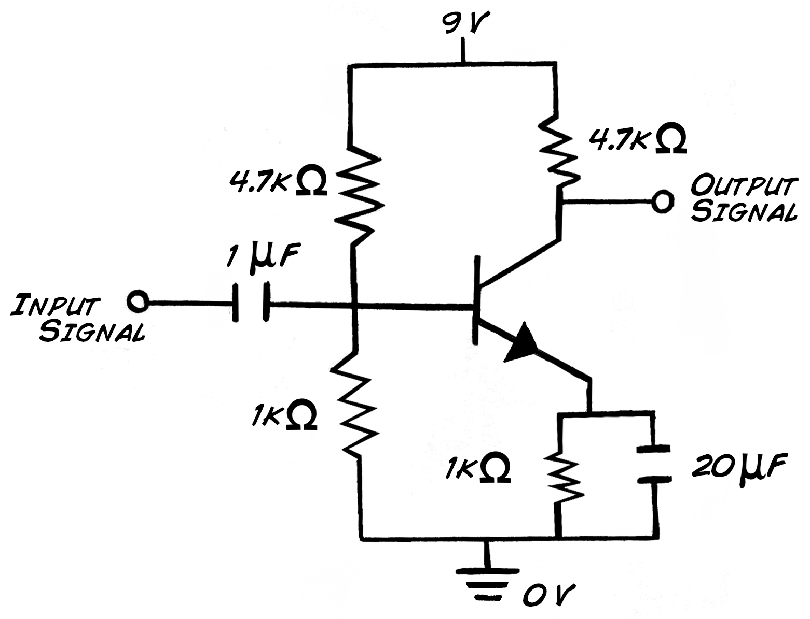](img/Finished1stage.jpg)

And that's that! Now it's time to...

## Build the Circuit

You've done the math, and now it's time to physically build your circuit. Put
your battery, transistor, resistors, capacitors, and input/output components
into place on your breadboard, as below_

[ 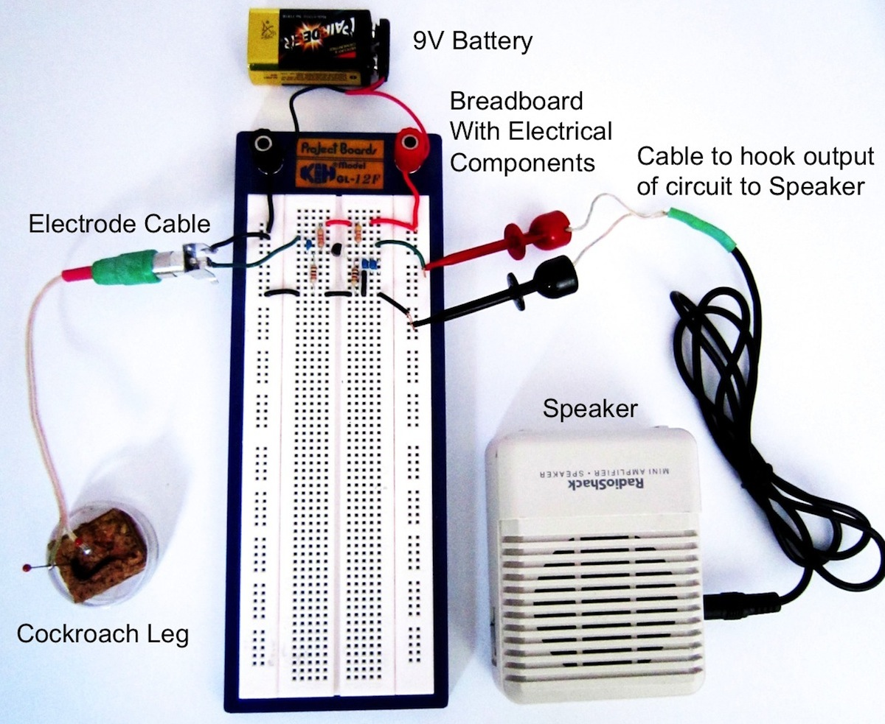](img/1StageBig.jpg)

A closer look at the circuit on the breadboard_

[ 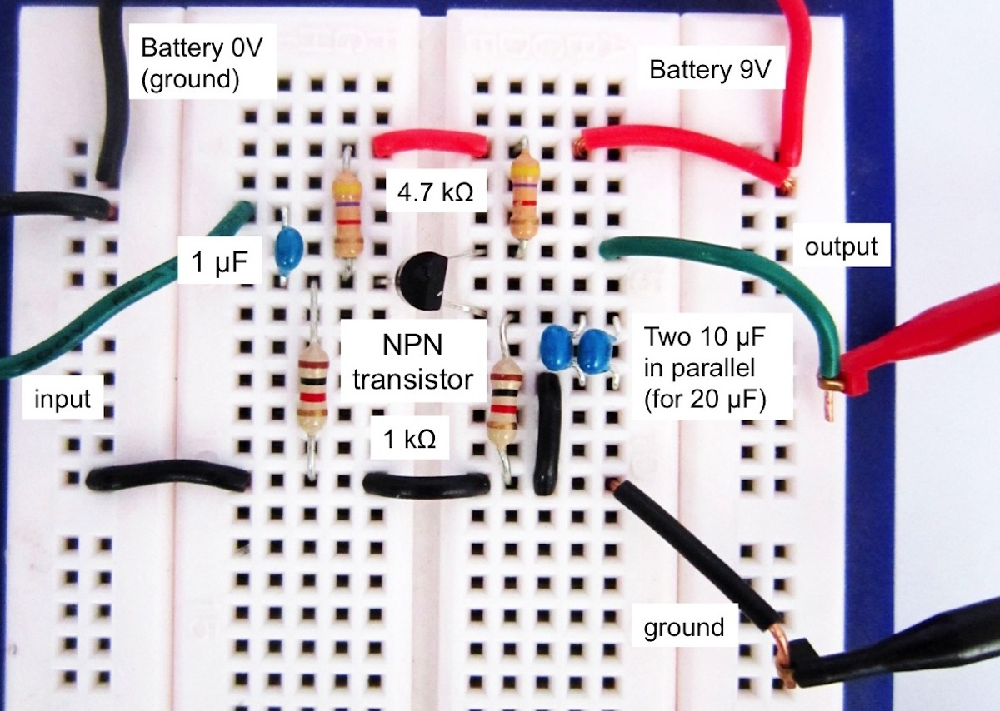](img/1StageSmall.jpg)

Insert the electrodes into a cockroach leg like you have done in [previous
experiments](https://www.backyardbrains.com/experiments/spikerbox) and hook up
your speaker to the circuit. Turn the speaker up all the way, and brush the
cockroach leg with a toothpick. You may hear a very faint response, but it
will be buried in the noise. Let's amplify the spikes some more. You can
create a "second stage" of amplification, much like we do with our normal
SpikerBox, where you have output of the circuit go into the input of another
copy of the circuit, as below_

[ 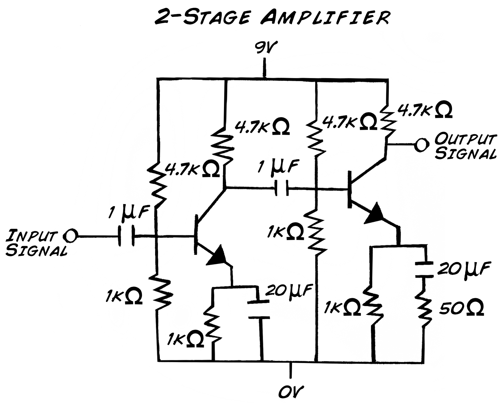](img/2StageAmp.jpg.)

[ 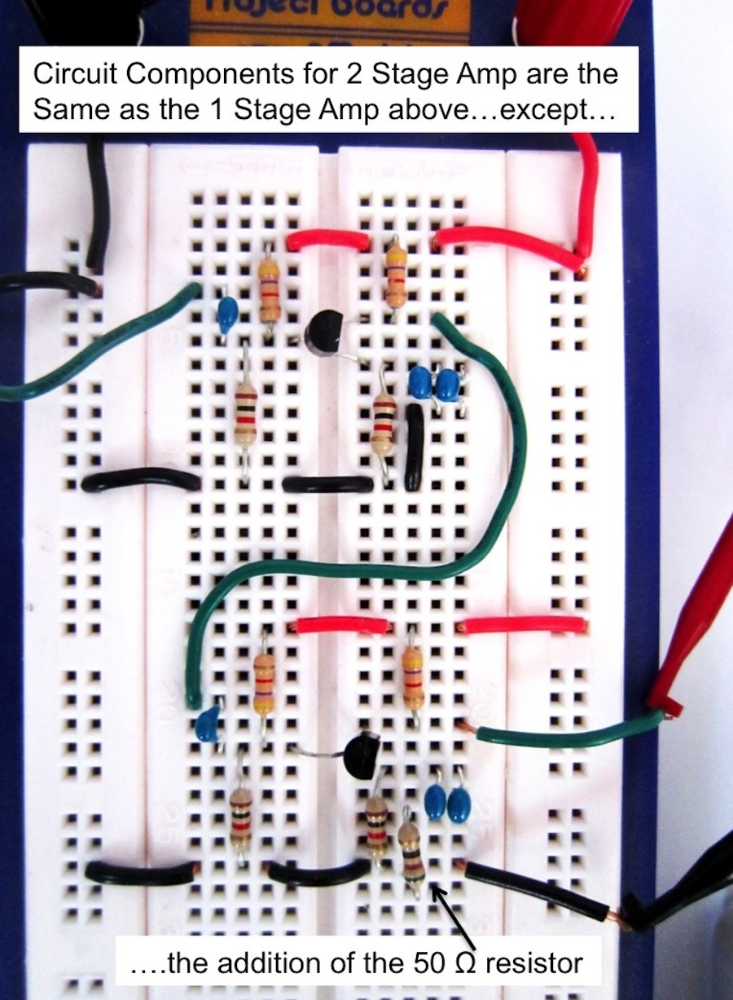](img/2StageSmall.jpg)

However, you will find this "doubling up" makes the circuit slightly unstable,
so let's drop the gain a bit on the second stage. We've added a 50 Ω resistor
in parallel with Re to lower the gain of the second stage a bit, but will
still make for louder spikes when you hook up up this circuit to your
cockroach leg. See video below.

You have now built your very own amplifier with transistors! Congratulations!
[Let us know](mailto_info@backyardbrains.com) if you have figured out a way to
make the circuit simpler, cleaner, and with more amplification.

## Discussion

You are on your way to inventing many more wonderful things. The history of
science is defined by the invention of new equipment in the hands of
imaginative minds. The telescope allows you to see things very far away. The
microscope allows you to see the very small. The PCR machine allows you to
measure molecules of DNA, and the transistor allows you to observe tiny
electrical signals. With these tools we can see and attempt to understand the
world beyond the ability of our naked senses. Now begin discovering.

## Discussion Questions

  1. Why are the spikes from our simple two-transistor bioamp "noisier" than the SpikerBox? What does the SpikerBox do? Hint_ the SpikerBox has many more transistors and uses them to build [operational amplifiers](https://en.wikipedia.org/wiki/Operational_amplifier), which are then further mixed into [instrumentation amplifiers](https://en.wikipedia.org/wiki/Instrumentation_amp). Welcome to the Art of Electronics!