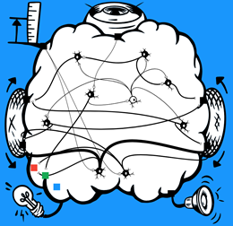
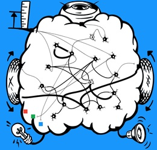
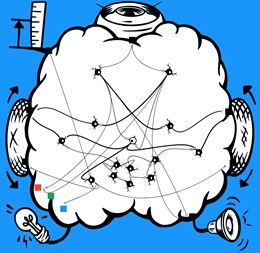

# The SpikerBot App #
The SpikerBot app is the neural network simulator that controls the [SpikerBot](https://docs.backyardbrains.com/Neuroengineering/Pre-Release/SpikerBot/). It runs on multiple platforms and allows users to design and test custom brains in real-time.

Get it here: [robot.backyardbrains.com](https://robot.backyardbrains.com).

## How The App Works ##
- Drag and drop neurons from the panel on the left into the brain area.
- Drag the handle that appears under selected neurons to form synapses.
- Press **Play** to put your brain in control of the robot and see what it does.

## Neurons ##
- **Activity Mode** - Neurons can be silent or spontaneously active. They can generate spikes individually or in bursts.
- **Synaptic Polarity** - Neurons can either excite or inhibit their synaptic targets.

## Neural Circuits ##
- **Recurrent Excitation** - When two or more neurons excite each other, they create a feedback loop that can sustain activity indefinitely. This process underlies behaviors such as walking, breathing, or holding a thought in memory.

- **Lateral Inhibition** - When two or more neurons inhibit each other, only one remains active. Lateral inhibition helps clarify perception and enables decision-making.

## How To Build Brains ##
1. Describe the behavior you want to model.
2. Break down the behavior into its components.
3. Design a spiking neural network for each component:
    - Place neurons in the brain. Neurons can be quiet or bursting, and excitatory or inhibitory.
    - Connect sensors to neurons. Visual stimuli can be red, blue, green, or one of 16 common objects. They can appear on the left, right, or anywhere in the visual field. Distance stimuli can be near, medium, or far.
    - Connect neurons to effectors. The left and right motors can move forward or backward. The lights can turn red, blue, and green. The speaker can produce tones.
    - Connect neurons to other neurons.
4. Use inhibitory connections between networks to prevent conflicting behaviors.

## Examples ##
Each example consists of a **behavior** and a **brain** that makes SpikerBot perform that behavior. Neurons are quiet and excitatory unless otherwise indicated.

### Behavior: Avoid Obstacles ###
**Brain**: A neuron responds to distance detection, and drives both wheels backward while activating the speaker and turning red lights on.

[Download Brain](./AvoidObstacles.zip)

---

### Behavior: Approach Green ###
**Brain**: A neuron responds to a green visual target appearing to the left, and drives the right wheel forward. A second neuron responds to green appearing on the right, and drives the left wheel forward. Both neurons activate the speaker and turn on green lights.

[Download Brain](./ApproachGreen.zip)

---

### Behavior: Explore ###
**Brain**: Five spontaneously active neurons drive the wheels in different directions. A single neurons is activated by distance detection and drives both wheels backward.

[Download Brain](./Explore.zip)

---

### Behavior: Blink And Beep At Nearby People ###
**Brain**: Two neurons respond to people, and distance, respectively. Five neurons activate different light colors and speaker tones. A neuron sits inbetween. Both stimulus-detecting neurons synapse onto it with weight 15 synapses (so that both must be active simultaneously to trigger a response). The neuron, in turn, activates each of the five output neurons.

[Download Brain](./BlinkAndBeepAtNearbyPeople.zip)

---

### Behavior: Sustained Movement ###
**Brain**: Two neurons strongly activate each other (forming a recurrent excitatory circuit that can sustain activation indefinitely). Each neuron drives one of the wheels forward. A neuron detects green and activates the recurrent circuit. A second, inhibitory neuron responds to red, and stops the recurrent circuit.

[Download Brain](./SustainedMovement.zip)

---

### Behavior: Make Decisions ###
**Brain**: Two recurrent excitatory circuits drive the robot forward and backward, respectively. Two sensory neurons respond to green and red, respectively. The green-detecting neuron activates the forward circuit and inhibits the backward circuit. The red-detecting neuron has the opposite effect.

[Download Brain](./MakeDecisions.zip)

---

### Behavior: Search For Green ###
**Video**: https://youtu.be/RObP80CZoho

**Brain**: Eight excitatory and one inhibitory neuron.

[Download Brain](./SearchForGreen.zip)

---

### Behavior: Thigmotaxis ###
**Brain**: Fourteen excitatory and two inhibitory neurons.

[Download Brain](./Thigmotaxis.zip)

---

### Behavior: Chase Red ###
**Brain**: Thirteen excitatory and one inhibitory neuron.

[Download Brain](./ChaseRed.zip)

---

## Troubleshooting ##
1. No Response from Robot: Check that it's turned on and charged.
2. Wi-Fi Connection Issues: Ensure you're connected to the correct robot's Wi-Fi network. The robot's lights should change from blue to green when the Wi-Fi connection with your device is established.