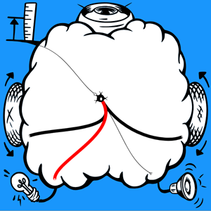
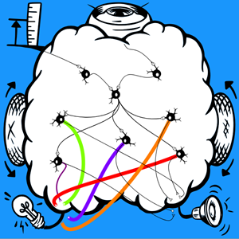

# The SpikerBot App

Welcome to the SpikerBot App – the brain simulator that powers the [SpikerBot robot](https://docs.backyardbrains.com/Neuroengineering/Pre-Release/SpikerBot/).

[Get the app here](https://robot.backyardbrains.com) for Windows, MacOS, iOS, Android and Chrome.

## How The App Works

The SpikerBot application features an interactive graphical interface for designing and testing embodied spiking neural networks. Users drag black (excitatory) or white (inhibitory) neurons from the toolbar into the brain-shaped workspace. Clicking a neuron brings up a menu to adjust its properties (type and polarity) and a triangular handle to create synaptic connections.

**Drag & Drop:** Pick neurons from the left panel and drop them into the brain area.

**Connect:** Drag the handle that appears under selected neurons to form synapses.

**Activate:** Press **Play** to let your brain control the robot.

## Spiking Neurons and Synapses

SpikerBot uses the biologically inspired Izhikevich model to replicate diverse neuron behaviors, including spontaneous spiking and bursting. Each neuron has a membrane potential that gradually returns to a resting state unless it receives input. When the potential exceeds a threshold, the neuron fires a spike, visually indicated by a colored nucleus — green for excitatory neurons and red for inhibitory neurons.

**Neuron Type:** Neurons may be quiet, occasionally active, highly active, generate bursts or burst when activated.

**Neuron Polarity:** Neurons can either excite or inhibit their targets.

Connections between neurons — synapses — are formed by dragging axon handles to target neurons or effectors. Synapse weights can be configured from 1 to 100, with values above 25 typically ensuring reliable activation.

 

## Neural Circuits

A neural circuit is a small network of interconnected neurons whose collective activity carries out a well‑defined computation, like detecting a looming object, producing a walking rhythm, or gating a motor command. Each circuit acts as a reusable building block: when several circuits are layered or chained together they can orchestrate increasingly sophisticated behaviors. 

**Reflex Arcs:** Minimal circuit in which stimulus activates a neuron which directly activates an effector. These circuits produce simple stimulus-response behaviors and serve as an entry point to neural modeling.

**Crossed Circuits:** Midline-crossing circuit allowing activity in the left visual field to drive the right motor and vice‑versa. These circuits are central to behaviors such as target tracking.

**Synaptic Integration:** Circuits in which a neuron requires input from multiple upstream sources to reach threshold and fire. This occurs when synapses are weak (weight < 10). These circuits can be used for coincidence detection.

**Recurrent Circuits:** Self-reinforcing feedback loops in which neurons excite each other, maintaining activity after an initial stimulus is removed. This occurs when synapses are very strong (weight > 90). These circuits can be used to simulate short-term memory or persistent behavioral states.

**Mutual Inhibition:** Circuits that inhibit one another, creating competitive dynamics. These circuits are useful for modeling decision-making processes.

---

## How To Build Brains

1. **Define the Target Behavior in Observable Terms:** Clearly state the desired behavior in observable terms. Be specific about what the robot should do under different conditions.
2. **Decompose the Behavior into Functional Components:** Break the behavior down into smaller, manageable sub-tasks (e.g., "detect obstacle," "initiate forward movement," "halt motion").
3. **Design a Neural Circuit for Each Component:** Create neural circuits (e.g., reflex arcs, recurrent circuits) that correspond to each component of the target behavior. Select appropriate neuron types and connect sensors, neurons, and effectors accordingly.
4. **Use Inhibition to Choose Between Conflicting Outputs:** Apply inhibitory connections where necessary to suppress competing signals or prevent simultaneous activation of incompatible behaviors.
5. **Test and Refine:** Observe behavior, identify failure points, and iteratively adjust neuron parameters and circuit structure to achieve the desired outcome.

---

## Brain Library

The Brain Library is a collection SpikerBot brains modeling a wide range of neural circuits and behaviors.

[Download All Brains](./AllBrains.zip)

Unzip the .brain files to your local documents/spikerbot/text folder.

---

**Avoid Obstacles**

This brain implements a basic reflex arc. A single neuron is activated by the distance sensor and drives backward motion, red lights and sound.

[Download Brain](./AvoidObstacles@@@@@@1741355891776312.zip)

---

**Approach Green**

This brain uses a crossed circuit to approach a target. Two neurons respond to green stimuli on the left or right, driving the wheel on the opposite side forward, with green lights and speaker activation. This makes the robot turn toward green objects and approach them when they are straight ahead.

[Download Brain](./ApproachGreen@@@@@@1745258760359229.zip)

  

---

**Explore**

This brain uses burst generator neurons to explore. Five neurons that spontaneously generate intermittent bursts of spikes drive the wheels in different directions (forward or turn). This makes the robot move around randomly. A neuron activated by distance-detection drives both wheels backward (reflex arc), preventing the robot from getting stuck.

[Download Brain](./Explore@@@@@@1741374617065859.zip)

---

**Greet Nearby People**

This brain uses synaptic integration to signal when people are close. Two neurons respond to distance and people; their weak synapses (weight 10) converge on a third neuron that in turn activates five light- and sound-producing neurons. Simultaneous detection of people and a nearby object makes the robot blink and beep.

[Download Brain](./GreetNearbyPeople@@@@@@1745258931213783.zip)

  

---

**Traffic Lights**

This brain uses a recurrent circuit to move until stopped. The circuit drives the wheels forward. A neuron activated by green activates the circuit. An inhibitory neuron activated by red stops the circuit. This makes the robot move forward indefinitely after seeing green, stopping only when it sees red.

[Download Brain](./TrafficLigthts@@@@@@1745278802895935.zip)

  

---

**Left or Right**

This brain uses mutual inhibition between two competing recurrent circuits to ensure only one behavior at a time is executed. One recurrent circuit is activated by green and turns the robot to the left. The other circuit is activated by blue and turns the robot to the right. Mutual inhibition prevents both circuits from being simultaneously active, which causes a seizure-like state. Finally, a neuron activated by red activates an inhibitory neuron that stops both circuits.

[Download Brain](./LeftOrRight@@@@@@1745281004343835.zip)

  

---

**Find Green** 

Five spontaneously bursting neurons drive the wheels in different directions. A crossed circuit consisting of two quiet neurons respond to green stimuli on the left or right, driving the wheel on the opposite side forward. The crossed circuit inhibits the bursting neurons, making the robot stop exploring while it’s approaching green. A single distance-activated inhibitory neuron stops both exploration and approach while the robot is close to a green target.

[Download Brain](./FindGreen@@@@@@1745279789457094.zip)

**Video:** [Watch Here](https://youtu.be/RObP80CZoho)

## Troubleshooting ##

1. **No Response from Robot:** Check that it's turned on and charged.
2. **Wi-Fi Connection Issues:** Click pause, then play. Ensure you’re connected to the correct robot's Wi-Fi network, the robot's LEDs should change from blue to green when the WiFi connection is established.
3. **Movement Problems:** Check wheels and tires, re-seat if necessary.
4. **Camera Recognition Issues:** Adjust lighting, use a clearer color sample and check the camera view to see what the robot 'sees'.