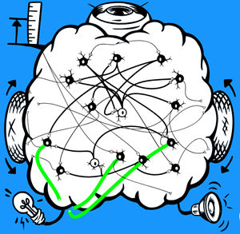

# The SpikerBot App

Welcome to the SpikerBot App – the neural network simulator that powers the [SpikerBot](https://docs.backyardbrains.com/Neuroengineering/Pre-Release/SpikerBot/). Design and test custom brains in real-time on multiple platforms.  
[Get it here](https://robot.backyardbrains.com)

---

## 1. How The App Works

- **Drag & Drop:** Pick neurons from the left panel and drop them into the brain area.
- **Connect:** Drag the handle that appears under selected neurons to form synapses.
- **Activate:** Press **Play** to let your brain control the robot.

---

## 2. Neurons Overview

- **Activity Mode:** Neurons may be quiet or spontaneously active, generating spikes individually or in bursts.
- **Synaptic Polarity:** They can either excite or inhibit their targets.

---

## 3. Neural Circuits

### 3.1 Recurrent Excitation

Feedback loops reinforce activity to sustain behaviors like memory or rhythmic movements. Disruptions in these loops have been linked to neurological disorders such as epilepsy.

### 3.2 Lateral Inhibition

Interconnected neurons suppress each other, ensuring only the strongest signals come through. This sharpens sensory perception and aids in decision-making, while impairments are associated with conditions like ADHD and autism.

---

## 4. How To Build Brains

1. **Define Behavior:** Identify the target behavior.
2. **Decompose:** Break it into key components.
3. **Design the Network:**
   - Select neuron types (quiet/bursting, excitatory/inhibitory).
   - Connect sensors (color, object, location, distance).
   - Link neurons to effectors (motors, lights, speaker).
   - Wire neurons together.
4. **Apply Inhibition:** Use inhibitory connections to prevent conflicts.

---

## 5. Examples

Each example below pairs a behavior with a corresponding brain design:

### Example 1: Avoid Obstacles
  
*A single neuron responds to distance detection, driving both wheels backward. Red lights and the speaker are also activated.*  
[Download Brain](./AvoidObstacles@@@@@@1741355891776312.zip)

---

### Example 2: Approach Targets
  
*Two neurons respond to green stimuli on the left or right, driving the opposite wheel forward, with green lights and speaker activation.*  
[Download Brain](./ApproachGreen@@@@@@1741374496739371.zip)

---

### Example 3: Explore
  
*Five spontaneously active neurons drive the wheels in various directions, while a neuron activated by distance detection drives both wheels backward.*  
[Download Brain](./ExploExplore@@@@@@1741374617065859.zip)

---

### Example 4: Greet Nearby People
  
*Two neurons respond to people and distance; their weak synapses converge on a third neuron that triggers five neurons for lights and tones.*  
[Download Brain](./GreetNearbyPeople@@@@@@1741374676649059.zip)  
**Video:** [Watch Here](https://youtu.be/RObP80CZoho)

---

### Example 5: Sustained Movement
  
*A recurrent circuit drives the wheels forward. A neuron activated by green initiates the circuit, and an inhibitory neuron stops it when red is detected.*  
[Download Brain](./SustainedMovement@@@@@@1741357186235744.zip)

---

### Example 6: Make Decisions
  
*Two recurrent circuits control forward and backward movement. Neurons responsive to green and red activate left-turning or right-turning circuits respectively, with lateral inhibition preventing conflict.*  
[Download Brain](./MakeDecisions@@@@@@1741357550554323.zip)

---

### Example 7: Search for Green
  
*A network of eight excitatory neurons and one inhibitory neuron drives exploratory behavior until the color green is detected.*  
[Download Brain](./SearchForGreen@@@@@@1741374814353702.zip)

---

### Example 8: Chase Red
  
*A hierarchical network of fourteen excitatory and two inhibitory neurons defaults to exploratory behavior, switching to approach behavior upon detecting red, and continuing until close-range proximity is sensed.*  
[Download Brain](./ChaseRed@@@@@@1741361409563828.zip)

---

### Example 9: Escape
  
*One neuron detects near distance and makes the robot turn around, while also activating a delay neuron. After 1 second the delay neuron activates a recurrent circuit that drives the wheels forward until near-distance activates an inhibitory neuron that deactivates the recurrent circuit.*  
[Download Brain](./Escape@@@@@@1742227473693283.zip)

---

## 6. Troubleshooting

1. **No Response from Robot:** Ensure the robot is turned on and adequately charged.
2. **Wi-Fi Issues:** Connect to the correct robot's Wi-Fi network; the robot’s lights should change from blue to green upon a successful connection.
