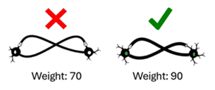
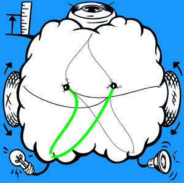
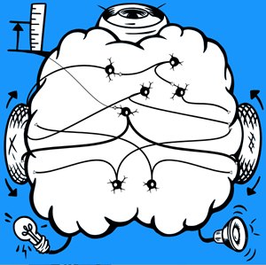
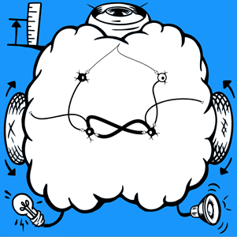
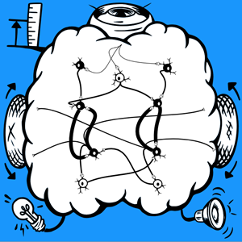

# The SpikerBot App #
The [SpikerBot robot](https://docs.backyardbrains.com/Neuroengineering/Pre-Release/SpikerBot/) is meant to be used with the SpikerBot app, available for Windows, macOS, iOS, Android and Chrome at [robot.backardbrains.com](https://robot.backyardbrains.com). The app is a neural network simulator that receives sensory data from the robot while controlling its behavior.

## How the app works ##
- Drag and drop neurons from the panel on the left into the brain area.
- Drag the handle that appears under selected neurons to form synapses.
- Press **Play** to put your brain in control of the robot and see what it does.

## Neurons ##
- **Activity Mode** – Neurons can be silent or spontaneously active. They can generate spikes individually or in bursts.
- **Synaptic Polarity** - Neurons can either excite or inhibit activity in their synaptic targets

## Neural Circuits ##
- **Recurrent Excitation** - When two or more neurons excite each other, they create a feedback loop that can sustain activity indefinitely. This process underlies behaviors such as walking, breathing, or holding a thought in memory.

- **Lateral Inhibition** - When two or more neurons inhibit each other, only one remains active. Lateral inhibition helps clarify perception and enables decision-making.

## How To Build Brains ##
1. Describe the behavior you want to model.
2. Break down the behavior into its components.
3. Design a spiking neural network for each component:
    - Place neurons in the brain. Neurons can be quiet, bursting, excitatory, or inhibitory.
    - Connect sensors to neurons. Visual stimuli can be red, blue, green, or one of 16 common objects. They can appear on the left, right, or anywhere in the visual field. Distance stimuli can be near, medium, or far.
    - Connect neurons to effectors. The left and right motors can move forward or backward. The lights can turn red, blue, or green. The speaker can produce tones.
    - Connect neurons to other neurons. Synapses can be excitatory or inhibitory.
4. Use inhibitory connections between networks to prevent conflicting behaviors.

## Examples ##
To download a brain, click **Download Brain**, save the file to your computer, and place the unzipped text file in your **Documents/spikerbot/text** folder.

### Behavior: Avoid Obstacles ###
**Brain**: A single neuron is activated by the distance sensor, driving the robot backwards while blinking and beeping.

[Download Brain](./AvoidObstacles.zip)

---

### Behavior: Approach Green ###
**Brain**: Two neurons respond to a visual target (green) appearing on the left and/or right side of the brain, driving the wheel on the opposite side forward.

[Download Brain](./ApproachGreen.zip)

---

### Behavior: Explore ###
**Brain**: Five bursting neurons activate the motors at random intervals. A single quiet distance sensing neuron produces backward movement.

---

### Behavior: Blink And Beep At Nearby People ###
**Brain**: A single quiet neuron responds to seeing people, and activates five light-and-sound producing neurons at random intervals.

---

### Behavior: Sustained Movement ###
**Brain**: Two neurons strongly activate each other, forming a recurrent excitatory circuit. Both neurons drive the robot forward. A sensory neuron detects green and activates the recurrent circuit. A second, inhibitory sensory neuron detects red and stops the recurrent circuit.

---

### Behavior: Make Decisions ###
**Brain**: Two recurrent excitatory circuits drive the robot forward and backward, respectively. Two sensory neurons respond to green and red, respectively. The green-detecting neuron activates the forward circuit and inhibits the backward circuit. The red-detecting neuron has the opposite effect.

---

### Behavior: Explore Unless Seeing Green ###
**Brain**: 

**Video**: https://youtu.be/RObP80CZoho

---

### Behavior: Thigmotaxis ###
**Brain**: 

---

### Behavior: Find and Chase Red ###
**Brain**: 

---

## Troubleshooting ##
1. No Response from Robot: Check that it's turned on and charged.
2. Wi-Fi Connection Issues: Ensure you're connected to the correct robot’s Wi-Fi network, the robot’s LEDs should change from blue to green when the WiFi connection is established.