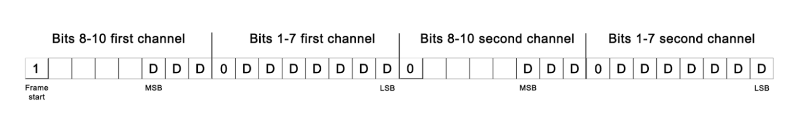

# Guide for USB Communication with SpikerBox

Version: R7 (05. April 2024)

Backyard Brains has numerous SpikerBox devices that can communicate via USB. Different SpikerBoxes implement different USB device classes:

### HID USB Device Class
- Muscle SpikerBox Pro (Pre 2023)
- Neuron SpikerBox Pro (Pre 2023)

### CDC (Serial) USB Device Class
- Plant SpikerBox
- Muscle SpikerShield (with genuine Arduino Uno)
- Muscle SpikerShield Pro (with genuine Arduino Uno)
- Muscle SpikerBox Pro
- Neuron SpikerBox Pro

### Vendor Specific Device Class
- Heart and Brain Spikerbox
- Human Human Interface (new)
- Neuron SpikerBox (single channel)
- Muscle SpikerBox (single channel)
- Muscle SpikerShield (with Chinese clone Arduino Uno)

### Composite Device (ACM CDC Interface + Vendor Specific Interface for iOS)
- Human SpikerBox
- Neuron SpikerBox
- Spike Station SpikerBox

SpikerBox will use HID, CDC (serial), or vendor specific interface to receive or send a stream of bytes to the host device (Win, macOS, Linux, Android, iOS). This stream of bytes will be formatted according to a custom protocol explained in this document. Each SpikerBox product will implement a subset of the custom protocol depending on the features it supports.

## Backyard Brains USB ID Table

| Date Valid          | MFG             | Product Description        | Vendor ID | ProductID | Interface Class |
| ------------------- | --------------- | -------------------------- | --------- | --------- | --------------- |
| 2017 (Old Muscle Pro) | BackyardBrains  | SpikeRecorder               | 0x2E73    | 0x0001    | 0x03            |
| 2017 (Old Neuron Pro) | BackyardBrains  | Neuron Pro                  | 0x2E73    | 0x0002    | 0x03            |
| 2022-Nov-01         | Backyard Brains | Human SpikerBox             | 0x2E73    | 0x0004    | 0x02 0x0a 0xFF  |
| 2022-Nov-01         | STMicroelectronics | STM32L4_Boot             | 0x2E73    | 0x0005    | 0x02            |
| 2022-Nov-01         | Backyard Brains | Muscle SpikerBox Pro        | 0x2E73    | 0x0006    | 0x02            |
| 2022-Nov-01         | Backyard Brains | Neuron SpikerBox Pro        | 0x2E73    | 0x0007    | 0x02            |
| 2022-Nov-01         | Backyard Brains | Plant SpikerBox             | 0x2341    | 0x8036    | 0x02            |
| 2022-Nov-01         | BYB             | Heart and Brain SpikerBox   | 0x0403    | 0x6015    | 0xFF            |
| 2023-4-20           | BYB             | Neuron SpikerBox Classic    | 0x0403    | 0x6015    | 0xFF            |
| 2022-Nov-01         | Backyard Brains | Muscle SpikerBox            | 0x0403    | 0x6015    | 0xFF            |
| 2022-Nov-01         | BYB             | Human Human Interface       | 0x0403    | 0x6015    | 0xFF            |
| 2023-Jan-01         | Backyard Brains | UniBox                      | 0x2E73    | 0x000D    | 0x02 0x0a 0xFF  |
| 2023-Jan-23         | BackyardBrains  | Neuron SpikerBox Pro        | 0x2E73    | 0x0009    | 0x02 0x0a 0xFF  |
| 2023-Oct-2023       | Backyard Brains | Neuron Bootloader           | 0x2E73    | 0x000A    | 0x02            |
| 2024-Mar-12         | BackyardBrains  | Spike Station Bootloader    | 0x2E73    | 0x000B    | 0x02            |

## SpikerBox Hardware Details

### Spike Station
- **USB Chip**: STM32L462RET6
- **USB VID**: 0x2E73 (Backyard Brains Inc)
- **USB PID**: 0x000D
- **Max Sampling Rate**: 42.6615kHz
- **Number of Channels**: 2 @ 42.6615kHz
- **Sample Resolution**: 14bit
- **USB Device Name**: SpikerBox
- **Serial Baud Rate**: Any
- **Expansion Port**: Reaction timer, Reflex hammer, Game controller events

### Muscle SpikerBox Pro (HID)
- **USB Chip**: MSP430F5522
- **USB VID**: 0x2E73 (Backyard Brains Inc.)
- **USB PID**: 0x001
- **Max Sampling Rate**: 10kHz
- **Number of Channels**: 
  - 2 @ 10kHz
  - 3 @ 5kHz
  - 4 @ 5kHz
- **Sample Resolution**: 10bit
- **USB Device Name**: SpikeRecorder
- **Max Useful Data Throughput**: 1000 packages/s with 62 Bytes (62kB)
- **Expansion Port**: Reaction timer, Reflex hammer, Game controller events

### Muscle SpikerBox Pro (Serial)
- **USB Chip**: MSP430F5522
- **USB VID**: 0x2E73 (Backyard Brains Inc.)
- **USB PID**: 0x006
- **Max Sampling Rate**: 10kHz
- **Number of Channels**: 
  - 2 @ 10kHz
  - 3 @ 5kHz
  - 4 @ 5kHz
- **Sample Resolution**: 10bit
- **USB Device Name**: Muscle SpikerBox Pro
- **Max Useful Data Throughput**: 1000 packages/s with 62 Bytes (62kB)
- **Expansion Port**: Reaction timer, Reflex hammer, Game controller events

### Neuron SpikerBox Pro (HID)
- **USB VID**: 0x2E73 (Backyard Brains Inc.)
- **USB PID**: 0x002
- **Max sampling rate**: 10kHz
- **Number of channels**:
  - **2 @ 10kHz**
  - **3 @ 5kHz**
  - **4 @ 5kHz**
- **Sample resolution**: 10bit
- **USB Device Name**: SpikeRecorder
- **Max useful data throughput**: 1000 packages/s with 62 Bytes (62kB)
  - **Expansion port (Reaction timer, Reflex hammer, Game controller,  events)**

### Neuron SpikerBox Pro (Serial)
- **USB VID**: 0x2E73 (Backyard Brains Inc.)
- **USB PID**: 0x007
- **Max sampling rate**: 10kHz
- **Number of channels**:
  - **2 @ 10kHz**
  - **3 @ 5kHz**
  - **4 @ 5kHz**
- **Sample resolution**: 10bit
- **USB Device Name**: Neuron SpikerBox Pro
- **Max useful data throughput**: 1000 packages/s with 62 Bytes (62kB)
  - **Expansion port (Reaction timer, Reflex hammer, Game controller,  events)**

### Neuron SpikerBox Pro (Serial + Mfi)
- **USB VID**: 0x2E73 (Backyard Brains Inc.)
- **USB PID**: 0x009
- **Max sampling rate**: 10kHz
- **Number of channels**:
  - **2 @ 10kHz**
  - **3 @ 10kHz**
- **Sample resolution**: 14bit
- **USB Device Name**: Neuron SpikerBox Pro
- **Serial baud rate**: 222222bps or 500000bps
  - **Expansion port (Reaction timer, Reflex hammer, Game controller,  events)**

### Heart & Brain SpikerBox
- **USB VID**: 0x0403 (FTDI)
- **USB PID**: 0x6015
- **Max sampling rate**: 10kHz
- **Number of channels**:
  - **1**
- **Sample resolution**: 10bit
- **Serial baud rate**: 222222bps
- **USB Device Name**: FT231X USB UART

### Plant SpikerBox
- **USB VID**: 0x2341 (Arduino SA)
- **USB PID**: 0x8036
- **Max sampling rate**: 10kHz
- **Number of channels**:
  - **1**
- **Sample resolution**: 10bit
- **Serial baud rate**: 222222bps (or 230400bps)
- **USB Device Name**: Arduino Leonardo

### (OBSOLETE) Human-Human-Interface
- **USB VID**: 0x2341 (Arduino SA)
- **USB PID**: 0x0043
- **Max sampling rate**: 10kHz
- **Number of channels**:
  - **1**
- **Sample resolution**: 10bit
- **Serial baud rate**: 222222bps (or 230400bps)
- **USB Device Name**: Arduino Uno

### Human-Human-Interface (second generation)
- **USB VID**: 0x0403 (FTDI)
- **USB PID**: 0x6015
- **Max sampling rate**: 10kHz
- **Number of channels**:
  - **1**
- **Sample resolution**: 10bit
- **Serial baud rate**: 500000 bps
- **USB Device Name**: HHI 1v1, Human Human Interface

### Muscle SpikerShield
- **USB VID**: 0x2341 (Arduino SA)
- **USB PID**: 0x0043
- **Max sampling rate**: 10kHz
- **Number of channels**:
  - **1 @ 10kHz**
  - **2 @ 5kHz**
  - **3 @ 3333Hz**
  - **4 @ 2500Hz**
  - **5 @ 2000Hz**
  - **6 @ 1666Hz**
- **Sample resolution**: 10bit
- **Serial baud rate**: 222222bps (or 230400bps)
- **USB Device Name**: Arduino Uno

### Muscle SpikerShield Pro
- **USB VID**: 0x2341 (Arduino SA)
- **USB PID**: 0x0043
- **Max sampling rate**: 10kHz
- **Number of channels**:
  - **1 @ 10kHz**
  - **2 @ 5kHz**
  - **3 @ 3333Hz**
  - **4 @ 2500Hz**
  - **5 @ 2000Hz**
  - **6 @ 1666Hz**
- **Sample resolution**: 10bit
- **Serial baud rate**: 222222bps (or 230400bps)
- **USB Device Name**: Arduino Uno

### Human SpikerBox
- **USB VID**: 0x2E73 (Backyard Brains Inc)
- **USB PID**: 0x0004
- **Max sampling rate**: 5kHz
- **Number of channels**:
  - **2 @ 5kHz**
  - **3 @ 5kHz**
  - **4 @ 5kHz**
- **Sample resolution**: 14bit
- **USB Device Name**: SpikerBox
- **Serial baud rate**: any
  - **Expansion port (Reaction timer, Reflex hammer, Game controller, events)**

### Human SpikerBox Bootloader
- **USB VID**: 0x2E73 (Backyard Brains Inc)
- **USB PID**: 0x0005
- **USB Device Name**: STM32L4_Boot

### Neuron SpikerBox Bootloader
- **USB VID**: 0x2E73 (Backyard Brains Inc)
- **USB PID**: 0x000A
- **USB Device Name**: Neuron SB Bootloader

### Spike Station Bootloader
- **USB VID**: 0x2E73 (Backyard Brains Inc)
- **USB PID**: 0x000B
- **USB Device Name**: Spike Station Bootloader

## SpikerBox Custom Protocol

Sample stream is a byte stream divided into frames. Each frame contains one sample for every recording channel. Depending on the SpikerBox type and mode of operation, the stream (and therefore the frame) can contain from one to six channels. The sample can be a 10 to 14 bit value, and two bytes represent each sample. For example, in the case of a two-channel SpikerBox, one frame will contain 4 bytes.

### Frame Structure

In order to mark the beginning of the frame, we reserve the most significant bit of every byte for the frame flag. If this bit is set to 1, the current byte represents the start of the frame. Ten bits of one data sample are divided into two bytes so that the first byte contains 3 most significant bits, and the second byte contains 7 least significant bits.



### Escape Sequences

Since the stream of samples from recording channels and custom messages share the same channel, all messages sent from SpikerBox are embedded in escape sequences. The same is not true for the messages sent from the Host software to the SpikerBox. The escape sequence that signals the beginning of the message block can appear on the communication channel at any time. So the Host software should be capable of detecting the escape sequence and extracting the message from the stream of data if SpikerBox is streaming recording data.

#### Start of Message Block
```hex
0xFF 0xFF 0x01 0x01 0x80 0xFF
```

#### End of Message Block
```hex
0xFF 0xFF 0x01 0x01 0x81 0xFF
```

### Custom Messages

Custom messages are currently used for a number of different purposes: 
- Start/stop of sampling stream
- Inform Host about firmware version, hardware version, and SpikerBox device type 
- Start firmware update procedure
- Inform Host about the type of device connected to the expansion port
- Exchange messages with the device connected to the expansion port

#### Message Syntax
Syntax of one message can be divided into five parts:
- Type of message 
- Colon separator 
- Value of message 
- Semicolon terminator
- In that same order.

Below are all messages supported:

#### Start Streaming Sample Data
**Message sent by the Host:**
```
start:;
```
**Supported by**: Muscle SpikerBox Pro, Neuron SpikerBox Pro

#### Stop Streaming Sample Data
**Message sent by the Host:**
```
h:;
```
**Supported by**: Muscle SpikerBox Pro, Neuron SpikerBox Pro

... (continue for each message)
