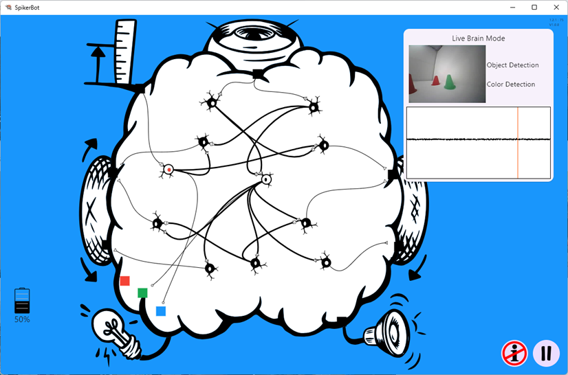

# The SpikerBot App #
The [SpikerBot robot](https://github.com/BackyardBrains/docs.backyardbrains.com/blob/main/docs/Engineering/SpikerBot/index.md) is meant to be used with our SpikerBot App, available for Windows, macOS, iOS, Android and Chrome at [robot.backardbrains.com](https://robot.backyardbrains.com). The app provides a visual, drag-and-drop interface to create and simulate neural networks. Users can add neurons, define synapses (excitatory or inhibitory), and assign sensory and motor functions.

[Here is the curriculum](https://docs.google.com/document/d/1yH6h94hUa3R4xYCxvR1eQLUwc2i9hXfQeMHIHB0ZtTQ/edit)

## How the app works##
How the App Works:
- Drag and drop neurons to form neural networks.
- Connect neurons with synapses that excite or inhibit targets.
- Adjust neuron properties (spike pattern, excitatory/inhibitory) to change robot behavior.
- Drop neurons onto sensors to create sensory neurons that respond to the environment.
- Press play to run the neural network in real time and watch the robot move and react.

