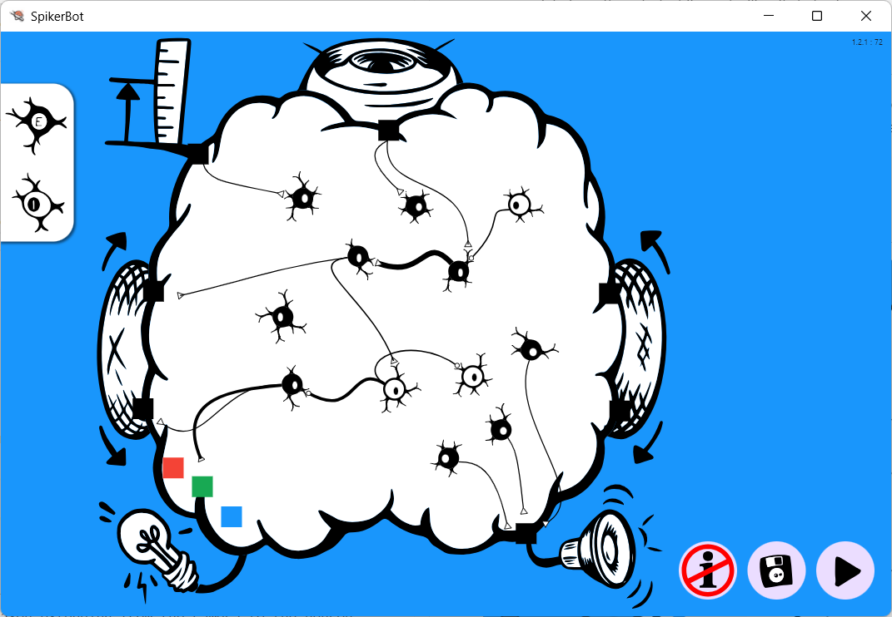

# The SpikerBot App #
The [SpikerBot robot](https://docs.backyardbrains.com/Engineering/SpikerBot/) is meant to be used with the **SpikerBot app**, available for Windows, macOS, iOS, Android and Chrome at [robot.backardbrains.com](https://robot.backyardbrains.com). The app is a neural network simulator that receives sensory data from the robot while controlling its behavior.

## How the app works ##
- Drag and drop **neurons** from the panel on the left into the brain area.
- Drag the handle that appears under selected neurons to form **synapses**.
- Neurons can be **quiet or spontaneously active**.
- Neurons can **excite or inhibit** activity in their targets.
- Press play to put your network in control of the robot and see what it does.
 
 

## Neural Circuits ##
- **Recurrent Excitation** is when two or more neurons excite each other, creating a feedback loop that can maintain activity indefinitely. Recurrent excitation underlies sustained activities like walking, breathing, or holding a thought in memory.
- **Lateral Inhibition** is when two or more neurons inhibit each other, suppressing activity in all but one. Lateral inhibition clarifies perception and enables decisio-making.

## Brain Library ##
The SpikerBot app includes several pre-built brains that generate different behaviors.

### Threat Avoidance ###
A single neuron is activated by the distance sensor, driving the robot backwards while blinking and beeping.

### Target Tracking ###
Two neurons respond to a visual target appearing on the left or right, driving the wheel on the opposite side forward.

### Explore Autonomously ###
Five bursting neurons activate the motors at random intervals. A single quiet distance sensing neuron produces backward movement.

### Blink And Beep At People ###
A single quiet neuron responds to seeing people, and activates five light-and-sound producing neurons at random intervals.

### Sustained Activity ###
Two neurons strongly activate each other, forming a recurrent excitatory circuit. Both neurons drive the robot forward. A sensory neuron detects green and activates the recurrent circuit. A second, inhibitory sensory neuron detects red and stops the recurrent circuit.

### Make Decisions ###
Two recurrent excitatory circuits drive the robot forward and backward, respectively. Two sensory neurons respond to green and red, respectively. The green-detecting neuron activates the forward circuit and inhibits the backward circuit. The red-detecting neuron has the opposite effect.

## Troubleshooting ##

1. No Response from Robot: Check that it’s turned on and charged.
2. Wi-Fi Connection Issues: Ensure you’re connected to the correct robot’s Wi-Fi network, the robot’s LEDs should change from blue to green when the WiFi connection is established.