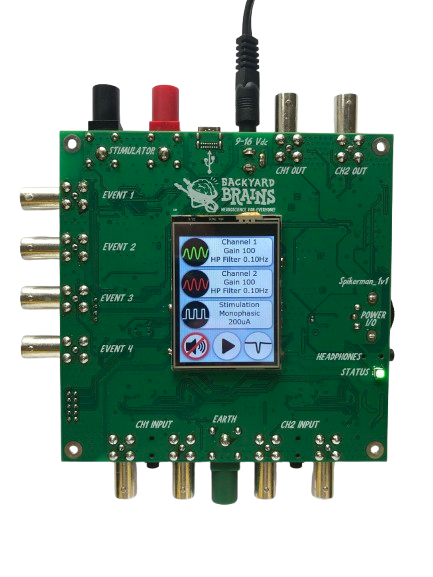

# SpikeStation: An Educational Tool for Advanced Science Labs #

Figure1. Photo of the SpikeStation Device Setup

## Introduction ##
The SpikeStation is a versatile and powerful tool for exploring biological and electrophysiological phenomena whether you are a high school student or teacher or you are an advanced user. 
### For High School Teachers:
SpikeStation is an easy-to-use educational tool, designed for high school classrooms, allowing students to explore the fascinating world of biological signals in living organisms. With pre-configured settings for common classroom experiments such as muscle activity (EMG), heart rate (ECG), and brainwave detection (EEG), students can engage with science in real time.
### For Advanced Users:
For researchers and advanced users, SpikeStation offers precise control over a wide range of biological and electrophysiological experiments. The system’s customizable settings, high input impedance, and fine-tuned filtering allow for advanced applications, including neural network analysis and deep studies in bioelectric phenomena.

Whether you're exploring neural communication in animals or monitoring the electrical signals of the human body, SpikeStation offers pre-configured settings for activities such as muscle monitoring (EMG), heart rate tracking (ECG), brainwave detection (EEG), and more. Additionally, the customizable settings provide an opportunity for more advanced students to explore scientific inquiry further.

# Hardware Specifications

## Key Features of SpikeStation for Classroom Experiments

SpikeStation provides a user-friendly interface for both high school teachers and researchers, with customizable settings that make it ideal for classroom demonstrations and independent student projects. The device comes equipped with the following features:

### Input Amplifiers

#### Dual Amplifiers with Programmable Gain
SpikeStation includes two amplifiers that can adjust signal strength with a programmable gain range from 1 to 15,000. This means you can amplify small signals (like neural spikes) or larger signals (such as muscle activity), with a user interface allowing for quick selection of common signal types. This makes SpikeStation quick and easy for students to set up and adaptable to almost any neuroscience experiment. High gain helps students detect even the smallest changes in biological activity, making abstract concepts more tangible.

#### Galvanic Isolation for Safety
The amplifiers are galvanically isolated with 5kV protection. This ensures the electrical components are shielded from direct electrical connection to the power supply, keeping students safe while connected to the device for recordings. It also prevents electrical interference and guarantees clean, accurate data, even in electrically noisy environments like classrooms.

#### High Input Impedance & Excellent Signal Fidelity
SpikeStation boasts a 200GΩ input impedance, preventing the device from interfering with natural signals during recording. Its high CMRR (Common Mode Rejection Ratio) of >140dB allows the amplifier to reject electrical noise (such as the 50/60Hz hum from electrical outlets), enabling students to focus on biological signals without distraction from external noise.

#### Programmable Filters for Flexibility
The high-pass filter can be adjusted between 0 Hz and 100 Hz in fine 0.1 Hz steps, allowing students to remove unwanted low-frequency signals, like slow drifts in electrical potential, which can interfere with recordings. Teachers can tailor experiments to different biological signals—like slow heart rhythms or fast neuron spikes. The amplifier also works in true DC mode coupling to electrodes for X/Y graphing of eye movement without discernible decay.

These amplifiers allow students to safely and effectively explore and record electrical signals from various biological sources. They can also use older electrodes and those with high-offset voltage.

### Stimulator

SpikeStation includes a constant current stimulator with monophasic and biphasic pulse shapes, letting students stimulate nerves or muscles and observe the resulting electrical activity. 

- **Output Current**: Finely adjustable from 0 to 10mA with 1µA precision, providing precise control over stimulation.
- **Stimulation Type**: Constant current, allowing controlled neural stimulation.
- **Programmable Output**: Monophasic or biphasic pulse shapes, with an output current of up to 10mA at 95V output voltage.
- **Applications**: Students can experiment with nerve or muscle stimulation, bringing abstract biological concepts into a real-world context.

### Analog Outputs

- **Number of Outputs**: 2, ideal for connecting additional monitors or displays.
  
This feature allows students to visualize real-time signals using external tools like oscilloscopes, broadening their laboratory experience.

### Communication Interface

- **USB-C**: Compatible with major platforms (Windows, Mac, iOS, Linux, Android), making it easy to integrate SpikeStation into existing classroom setups.

### Sound and Additional Inputs

- **Sound Features**: Adjustable volume control for auditory signal feedback, allowing students to “hear” the electrical activity they are recording.
- **4 Event Inputs**: Ideal for triggering complex experimental setups or monitoring multiple processes simultaneously.

Figure 2. Hardware Diagram with Annotations for Input Amplifiers, Outputs, Connectors

Detailed hardware specifications can be found below:

Here is the information formatted into a markdown table:

| **Category**             | **Specification**                                                        |
|--------------------------|--------------------------------------------------------------------------|
| **Input Amplifiers**      |                                                                          |
| Number of amplifiers      | 2                                                                        |
| Galvanic isolation        | YES. 5kV                                                                 |
| Gain of the amplifiers    | Programmable in hardware: 1 – 15000                                      |
| High pass frequency       | Programmable in hardware: 0Hz – 100Hz                                    |
| Frequency step            | 0.1Hz                                                                    |
| Input impedance (common)  | 200GΩ                                                                    |
| Input impedance (differential) | 200GΩ                                                                |
| CMRR                      | > 140dB at 60Hz                                                          |
| Connector type            | BNC and 3.5mm stereo jack                                                |
| **Stimulator**            |                                                                          |
| Stimulation type          | Constant current                                                         |
| Stimulus shape            | Monophasic/Biphasic                                                      |
| Output voltage            | 95V                                                                      |
| Output current            | 0mA – 10mA                                                               |
| Output current step       | 1µA                                                                      |
| Stimulation period        | 0.1ms – 9999s                                                            |
| Pulse width               | 0.1ms – 9999s                                                            |
| Gap duration              | 0.1ms – 9999s                                                            |
| Number of pulses          | 1 – 999999                                                               |
| Galvanic isolation        | YES. 1kV                                                                 |
| Connector type            | Banana socket 4mm (Red for anode, Black for cathode)                     |
| **Analog Outputs**        |                                                                          |
| Number of analog outputs  | 2                                                                        |
| Galvanic isolation        | No. Powered from main power supply                                       |
| Maximal output voltage    | +/- 2.5V                                                                 |
| Connector type            | BNC                                                                      |
| **Communication**         |                                                                          |
| Communication interface   | USB C                                                                    |
| Galvanic isolation        | Yes. 5kV                                                                 |
| Supported platforms       | Windows/MacOS/iOS/Linux/Android                                          |
| Sampling rate             | 42.661KHz                                                                |
| **Sound**                 |                                                                          |
| Sound                     | Yes. Selectable over LCD                                                 |
| Mute function             | Yes. Selectable over LCD                                                 |
| Volume control            | Yes. Over potentiometer                                                  |
| Headphones output         | Yes                                                                      |
| **Additional Inputs**     |                                                                          |
| 4 event inputs            |                                                                          |
| Connector type            | BNC                                                                      |
| **Power Supply**          |                                                                          |
| Type                      | DC power supply 9V-16V, 330mA                                            |
| Protection                | Protected from overvoltage and reverse polarity                          |

## 3. Main Menu Settings (Tailored for Educational Use)

### Setting Up SpikeStation for Classroom Experiments

SpikeStation’s intuitive interface allows teachers, students, and experienced researchers to set up experiments with ease.

### For High School Teachers:
Using the main menu, students can easily select which biological signal to record, such as muscle activity or heart rate, and then adjust the device’s settings. Sound feedback is available, allowing students to hear the bio-signals in real time, adding a multisensory element to the learning experience.

### For Advanced Users:
The main menu provides full access to customizable parameters, including independent channel control for dual-signal recordings, real-time monitoring, and advanced stimulation configurations. Experienced users can modify high-pass and low-pass filters to refine recordings, ensuring that only relevant signal frequencies are captured.

### Through the main menu, users can:

- **Select Recording Channels**:  
  Use Channel 1 (green) or Channel 2 (red) for simultaneous recording of two signals. For example, students can monitor muscle activity (EMG) in both arms simultaneously.

- **Program Stimulation Settings**:  
  Set up and modify stimulation parameters, including pulse width, frequency, and amplitude, which are crucial for neural or muscle experiments.

- **Sound Control**:  
  Engage sound feedback for the channels to allow students to audibly perceive the bio-signals they’re recording, fostering a multisensory learning experience.

- **Activate Notch Filter**:  
  Turn on software notch filters (50Hz/60Hz) to reduce interference, particularly useful in noisy classroom environments. The notch filter will be activated only on the SpikeRecorder application.

Figure 3. Screenshot of the SpikeStation Main Menu on the LCD

## 4. Custom Input Channel Settings (Classroom Integration)

### Using SpikeStation’s Custom Settings for Advanced Experiments
In addition to pre-configured modes, SpikeStation allows teachers and students to customize experiments to fit specific educational needs. Through the custom settings menu (as shown in the figure below), the following parameters can be adjusted:

- **Amplifier Gain**:  
  Adjust the sensitivity of the system to record from different biological sources. For example, low-gain settings may be used for small neural signals, while higher gains are more suitable for muscle activity.

- **Frequency Control**:  
  Customize the high-pass and low-pass filters to focus on different types of electrical activity.
  
  - **High-Pass Filter (0.0 Hz – 100 Hz)**: Removes low-frequency noise, useful for capturing clearer signals.
  - **Low-Pass Filter**: Software-controlled via SpikeRecorder, filters out high-frequency noise, optimizing signal clarity for classroom demonstrations.

By experimenting with these settings, students can better understand how electrical signals behave in biological systems and explore the principles of bioelectricity in more detail.

 

Figure 4. Custom settings menu (left side) and screen for the parameters entering (right side)

## 5. Notch Filter

The user can turn on/off software 60Hz/50Hz notch filters by pressing the notch filter settings button (figure 3). The software notch filter means that the filter is turned on only in the SpikeRecorder application.

 

Figure 5. Notch filter settings. Notch filter turned on at 60Hz (left) an Notch filter turned on at 50Hz (right) 

## 6. Stimulation Settings Menu (Enhanced for Teachers and Students)

### Introducing Electrical Stimulation in the Classroom
The stimulation settings in SpikeStation enable students to apply controlled electrical stimuli to biological samples, such as neurons or muscle tissues, to observe their responses. The parameters that can be modified include:

- **Pulse Width**: Control the duration of each pulse for precise stimulation.
- **Amplitude**: Adjust the strength of the electrical signal, with a maximum output of 200µA.
- **Stimulation Period and Duration**: Set how frequently and for how long the stimulation occurs.
- **Monophasic or Biphasic Stimulation**: Select between different waveform types to observe varying biological responses.

These features allow students to simulate real-world applications of bioelectricity, making abstract concepts tangible and engaging.

 

Figure 6. Stimulation settings menu for the monophasic (left side) and biphasic (right side) pulses

## 7. Troubleshooting

The SpikeStation is designed to be user-friendly and reliable. However, if any issues arise, this section provides common troubleshooting steps.

### 7.1 Device Not Powering On
- **Solution**: Ensure that the DC power supply is properly connected and that the voltage range is between 9V and 16V. Check for any loose connections.
- **Additional Check**: Verify that the power supply polarity is correct, as the device is protected from reverse polarity but may not function if this is incorrect. The center of the connector is + and the metal part is -.

### 7.2 USB Connection Not Detected
- **Solution**: Ensure the USB-C cable is securely connected between the SpikeStation and the computer. Confirm that the SpikeRecorder application is installed and running on your computer.
- **Additional Check**: Test the cable with another device to ensure it is functioning correctly. If the problem persists, try a different USB port on your computer.

### 7.3 No Sound from Device
- **Solution**: Check if the sound is muted in the device settings. If sound is enabled, adjust the volume using the potentiometer.
- **Additional Check**: Ensure that the headphones or external speakers are properly connected to the device.

### 7.4 Incorrect Stimulation Output
- **Solution**: Verify that the stimulation settings (amplitude, pulse width, and duration) are correctly programmed in the Stimulation Settings menu. Ensure that the correct monophasic or biphasic mode is selected based on your experimental needs.
- **Additional Check**: Confirm that all cables and electrodes are connected securely, and check for any loose or faulty connections.

### 7.5 Signal Interference
- **Solution**: Activate the 50Hz or 60Hz notch filter to reduce interference from power lines. Ensure that all equipment is properly grounded to avoid ground loops.
- **Additional Check**: Isolate any noisy electronic devices or sources near the SpikeStation that could contribute to signal interference.

## 8. Maintenance and Safety Guidelines

Regular maintenance and proper usage are essential to ensure long-term functionality and safety.

### 8.1 Cleaning
- **Device Surface**: Use a soft, dry cloth to clean the device. Avoid harsh chemicals or solvents.

### 8.2 Safe Operation
- Ensure the device is kept in a dry environment, and that all cables are securely connected during experiments.
- The amplifiers are galvanically isolated, making the device safe for use with biological systems. However, always ensure proper insulation and avoid exposing the device to liquids or high-humidity environments.
- The SpikeStation is protected from overvoltage. Ensure the power supply remains within the specified range (9V to 16V) for safe operation.

### 8.3 Calibration
Regularly verify the calibration of the device by checking gain, frequency settings, and amplifier response, especially if it's used in critical experiments.

## 9. Warranty and Support

### 9.1 Warranty
The SpikeStation comes with a 1-year limited warranty, covering defects in materials and workmanship. Damage caused by improper use, negligence, or unauthorized modifications is not covered under warranty.

### 9.2 Customer Support
For technical support, troubleshooting, or warranty claims, please contact our customer service team at [support@backyardbrains.com](mailto:support@backyardbrains.com) or visit our website.
