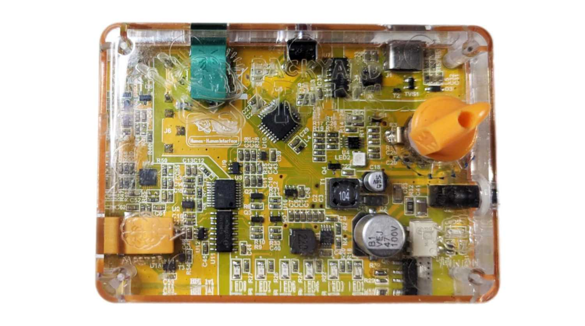
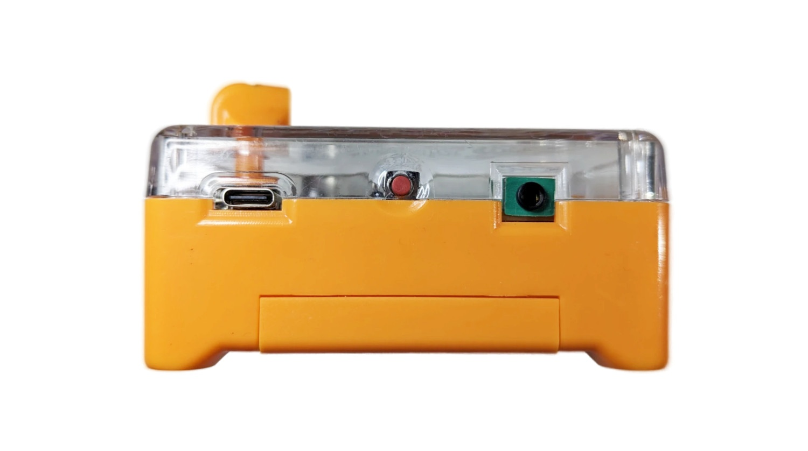
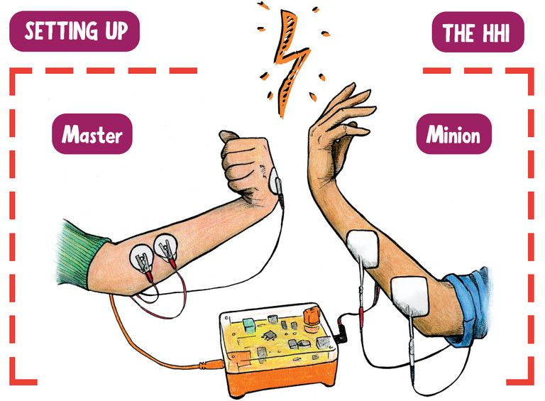
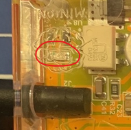

# Human-Human Interface

The Human-Human Interface (HHI) records electrical activity from one person's muscles and uses that signal to trigger electrical stimulation of another person's muscles.

The person producing the muscle signal is called the **Controller** and connects to the port labeled **Master**. The person receiving the stimulation is called the **Minion** and connects to the port labeled **Minion**.

The HHI does not directly record brain activity. It records electromyography (EMG) signals produced when the Controller activates their muscles. These signals can also be recorded and analyzed using the [Spike Recorder app](../../software/spike-recorder/).

## Kit Contents

The Human-Human Interface kit includes:

- 1 HHI device
- 1 non-rechargeable 9 V battery
- 1 orange EMG recording cable
- 1 black stimulation cable
- 50 EMG electrode patches
- 4 square stimulation electrode patches
- 1 USB cable

## Safety

:::warning Important Safety Information

- Both participants must understand the procedure and consent before beginning.
- Turn the HHI off before attaching, removing, or repositioning stimulation electrodes.
- Always begin with the stimulation intensity at its lowest setting.
- Increase the intensity slowly and in small increments.
- Stop immediately if stimulation becomes painful or uncomfortable.
- Never place stimulation electrodes across the chest, throat, neck, or head.
- Do not use damaged cables, electrodes, or equipment.
- Use the HHI only as described in these instructions.

:::

## Getting Started

[Download the HHI Quick-Start Guide](./HHIInsert1.pdf)

## Setting Up the HHI

### Controller Setup

The Controller produces the EMG signal that triggers stimulation.

1. Make sure the HHI is turned off.
2. Insert the battery according to the polarity indicator inside the battery compartment.
3. Place two EMG electrode patches on the lower inner forearm, over the forearm flexor muscles.
4. Place a third EMG electrode patch on the back of the hand. This electrode acts as the ground.
5. Connect the two red clips of the orange cable to the electrode patches on the forearm.
6. Connect the black clip to the electrode patch on the back of the hand.
7. Plug the orange cable into the orange jack labeled **Master** on the HHI device.
8. Locate the Power/Intensity knob on the HHI. Turn the knob clockwise until you hear a click, indicating that the device is on.
9. Ask the Controller to flex their forearm muscles. The LED bar on the front of the HHI should illuminate from green toward red as the strength of the EMG signal increases.

A strong muscle contraction should illuminate the red LED. If it does not, check the electrode placement and adjust the sensitivity.

### Minion Setup

The Minion receives electrical stimulation from the HHI.

1. Turn off the HHI before connecting the Minion.
2. Place two square stimulation electrodes across the ulnar nerve on the back of the forearm, just below the elbow, as shown in the setup image. Adjust the placement slightly if necessary.
3. Attach the black and red connectors of the stimulation cable to the two square electrodes, following the orientation shown in the setup image.
4. Plug the stimulation cable into the black jack labeled **Minion** on the HHI.
5. Ask the Minion to keep their arm relaxed, with the elbow bent at approximately 90 degrees.
6. Make sure the Power/Intensity knob is set to its lowest position. Turn on the HHI.
7. Ask the Controller to flex strongly enough to illuminate the red LED and cross the stimulation threshold.
8. Slowly turn the Power/Intensity knob clockwise until the Minion feels stimulation or their hand begins to move.

Increase the intensity only if the Minion is comfortable. If stimulation can be felt but no movement occurs, turn off the HHI and slightly reposition the stimulation electrodes before trying again.

## Sensitivity Button

The Sensitivity button on the back of the HHI controls how strong the Controller's EMG signal must be before stimulation is triggered.

The active sensitivity setting is displayed on the LED bar. Each press moves the setting one step. After the highest setting, the device cycles back to the green setting.

The green setting is the most sensitive and requires less muscle activity to trigger stimulation. Settings farther toward the red end of the LED bar require a stronger EMG signal.

Adjusting the sensitivity allows the HHI to detect signals produced by different movements, such as flexing the entire forearm or moving a single finger.

## Intensity Dial

The Power/Intensity knob functions as both the on/off switch and the stimulation-intensity control.

The knob is in the **OFF** position when it points toward the upper-right corner of the HHI. Turning the knob clockwise produces an audible click, indicating that the device has turned on. The Power LED should turn green.

Continue turning the knob clockwise to increase the strength of the stimulation sent to the Minion.

:::warning

Do not increase the intensity in large increments. Test the stimulation after every small adjustment.

:::

To decrease the stimulation strength, turn the knob counterclockwise toward the **OFF** position.

## Battery Replacement

The Power LED also indicates the battery level:

- **Green:** The battery is working and the HHI is ready to use.
- **Solid red:** The battery should be replaced. Stimulation is disabled until a new battery is inserted.

Use only a **9 V non-rechargeable battery**. Rechargeable batteries are not recommended for use with the HHI.

## Recording with Spike Recorder

The HHI can send the Controller's EMG signal to the [Spike Recorder app](../../software/spike-recorder/) through USB.

1. Connect the HHI to the computer using the USB cable.
2. Turn on the HHI.
3. Open Spike Recorder.
4. Allow up to 30 seconds for the device to be detected.
5. Flex the Controller's forearm and confirm that an EMG waveform appears.

If the HHI is not detected, disconnect and reconnect the USB cable, restart Spike Recorder, and review the Spike Recorder USB troubleshooting instructions.

## Technical Specifications

| Specification | Value |
| --- | --- |
| Maximum sampling rate | 10 kHz |
| Number of recording channels | 1 |
| Sample resolution | 10-bit |
| Frequency range | 20 Hz-2 kHz |
| Power supply | 9 V non-rechargeable battery |
| Approximate battery life | 8 hours |
| Communication | USB 2.0 |
| Output voltage | 95 V |
| Stimulation current | 0-30 mA |
| Stimulation type | Biphasic |

[Download the HHI Technical Schematic, Version 1.01](https://backyardbrains.com/products/files/HHI2_Schematics_V1.01.pdf)

## Experiments

- [Neural Signal Pathways: Human-to-Human Control](https://backyardbrains.com/pages/experiment-neural-signal-pathways-human-to-human-control)
- [Does Controlling a Neuroprosthetic Require Movement?](https://backyardbrains.com/pages/experiment-does-controlling-a-neuroprosthetic-require-movement)
- [Active vs. Passive Movements for Control Signals](https://backyardbrains.com/pages/experiment-do-motor-action-potentials-require-the-brain)

## Troubleshooting

**The HHI Does Not Detect the Controller's EMG Signal**
- Confirm that the orange cable is fully inserted into the port labeled **Master**.
- Confirm that both red clips are connected to the forearm electrodes.
- Confirm that the black ground clip is connected to the electrode on the back of the hand.
- Ask the Controller to relax and then flex the forearm firmly.
- Reposition the forearm electrodes over the muscle if the LED bar does not respond.
- Adjust the sensitivity using the button on the back of the HHI.

**Spike Recorder Does Not Detect the HHI**
- Confirm that the HHI is turned on.
- Disconnect and reconnect the USB cable.
- Try a different USB port.
- Allow up to 30 seconds for the device to connect.
- Restart Spike Recorder.
- Try a different data-capable USB cable.

**The EMG Signal Is Visible, but the Minion Does Not Feel Stimulation**
1. Confirm that the black stimulation cable is fully inserted into the port labeled **Minion**.
2. Confirm that the Controller's muscle contraction illuminates the red LED.
3. Slowly increase the intensity using the Power/Intensity knob.
4. Confirm that LED 5 is illuminated. Stimulation occurs only while LED 5 is on.
5. If LED 5 remains on continuously for approximately 4-5 seconds, it will turn off automatically. Turn the HHI off and then on again before continuing.
6. If stimulation is felt but no movement occurs, turn off the HHI and slightly reposition the stimulation electrodes.

## Testing the Trigger Signal Without EMG Electrodes

You can test the trigger signal independently without using EMG electrode patches.
1. Turn the HHI off and set the intensity to its lowest position.
2. Plug the orange cable into the port labeled **Master**.
3. Clip all three alligator clips together.
4. Turn on the HHI.
5. Disconnect one of the red clips.

LED 5 should turn on. Avoid touching the exposed metal parts of the clips while performing this test.