# Reaction Timer #

:::warning
Please Note: Requires a Human SpikerBox and a USB connection to an Android device, Mac, PC Desktop or iPhone/iPad with USB-C connector. Not compatible with iPhones or iPads with lightning connectors
:::

## Getting started

Reaction Timer is a great little extension device for your Human SpikerBox and a fun way to measure your reaction time to external stimuli like light and sound. This guide explains how to properly connect the Reaction Timer with your Human SpikerBox and perform some basic time analysis.

## Setting up the Reaction Timer

Now, let's get started by connecting the Reaction Timer to your Human SpikerBox and then connecting the Human SpikerBox to your PC or Mac using a USB cable, as shown below.

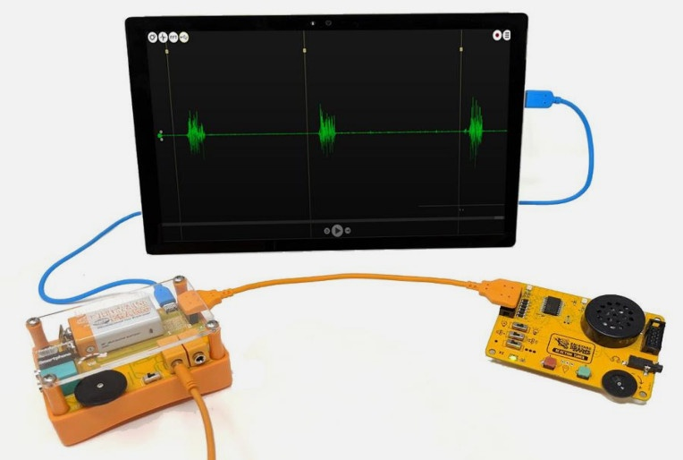

### Steps on setting up the Reaction Timer

1. **Connect the Reaction Timer**  
   Connect the Reaction Timer to the Human SpikerBox using the **Orange Expansion Cable**.  

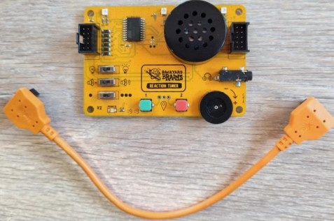

2. **Hook an arm up to the Human SpikerBox!**  
   The two red clips attach to the stickers on the user's forearm, and the one black clip attaches to the sticker on the back of the user's hand.

3. **Turn on and test your devices!**  
   Open the SpikeRecorder app and check that your PC recognizes the Human SpikerBox. A USB symbol should appear in the upper left corner. Clicking it confirms your gear is connected and ready to send input from both the Human SpikerBox and Reaction Timer.

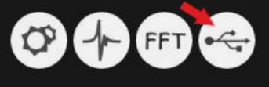

4. **Test the Reaction Timer**  
   Ensure the **Light** and **Tone** switches are in the **ON** position and the **Random** switch is in the **OFF** position. Then press the first button on your board. You should hear a sound, see an LED light up, and a tick mark should appear in Spike Recorder at the exact moment you pressed the button.

For additional details, check out our [Experiments page: Clock the Inner Working of the Brain](https://backyardbrains.com/experiments/MuscleReactionTime).

## Reactions of the Reaction Timer

By now, you may have noticed that there are multiple button settings on the Reaction Timer for various experiments. Here’s what each setting does and how Spike Recorder identifies them:

1. **Basic Setting (Out-of-the-box)**  

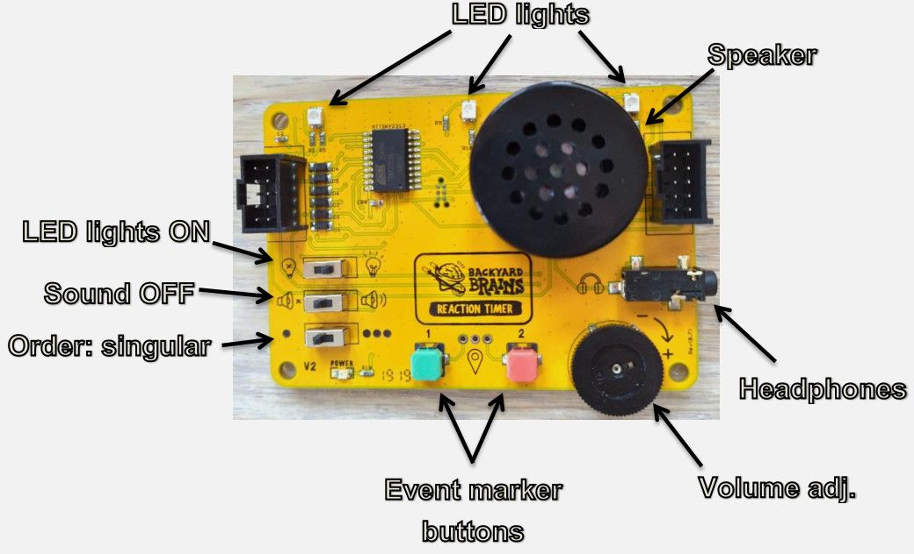

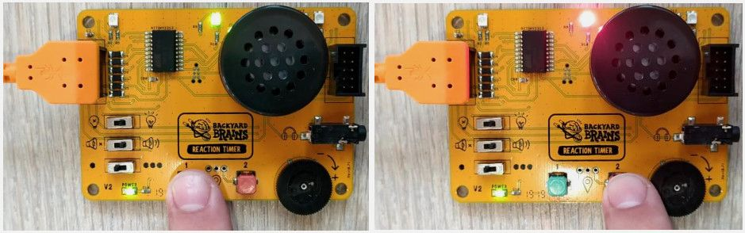

   - **Red Button:** When pressed, the middle LED flashes red, and Spike Recorder marks the event with a red marker labeled **2**.

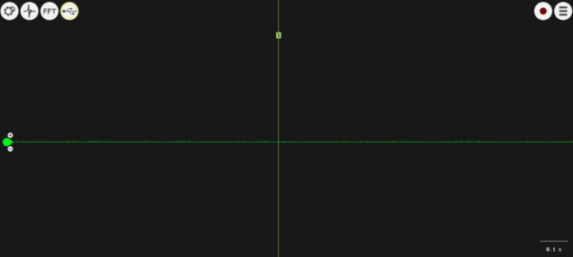

   - **Green Button:** When pressed, the middle LED flashes green, and Spike Recorder marks the event with a green marker labeled **1**.

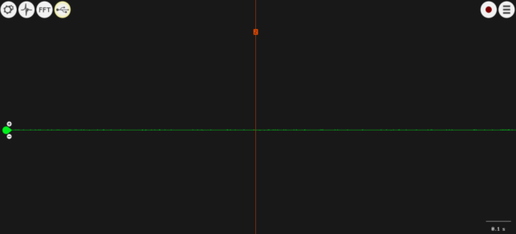

2. **Second Setting**  

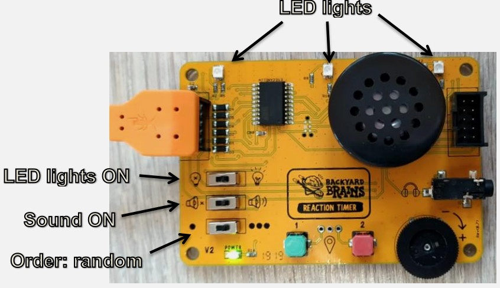

   This setting provides both visual and sound stimuli simultaneously.
   - **Green Button:** Two event markers appear: **1** (green light) and **3** (sound beep).

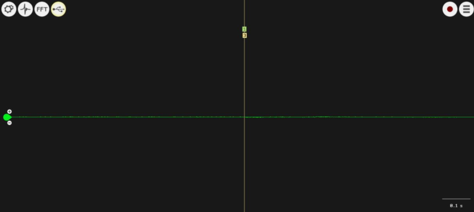

   - **Red Button:** Two event markers appear: **2** (red light) and **4** (different sound beep).

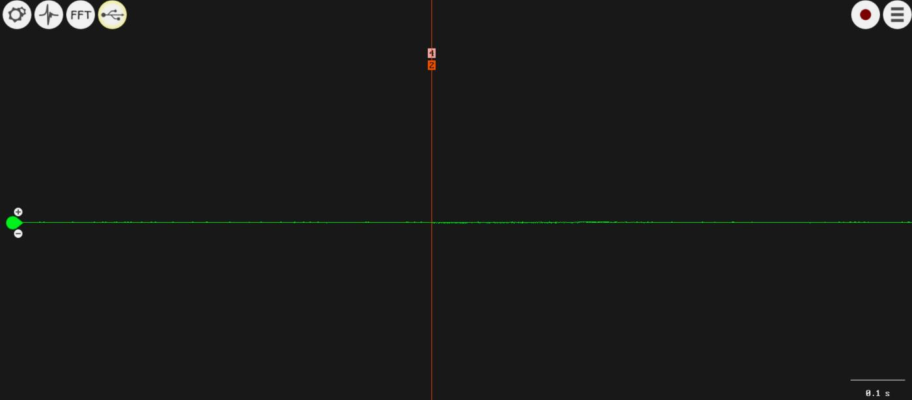

   > **Note:** Although these pairs of event markers may seem to be placed at the same moment, there is a time difference of approximately 0.4–0.5 ms between them.

3. **Third Setting**

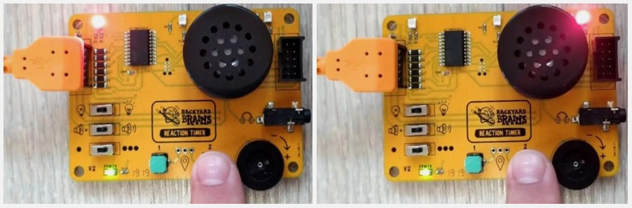

   - **Red Button:** Pressing it causes one of three red LEDs to flash randomly.

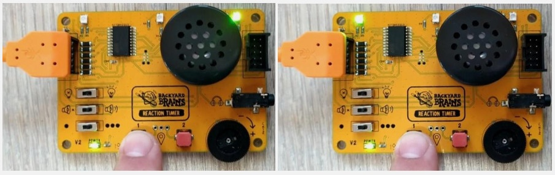

   - **Green Button:** Pressing it causes one of three green LEDs to flash randomly.

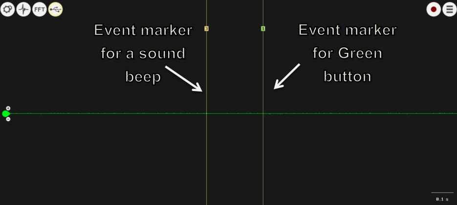

   - Additionally, pressing the Red button triggers a different sound beep with the same random delay.

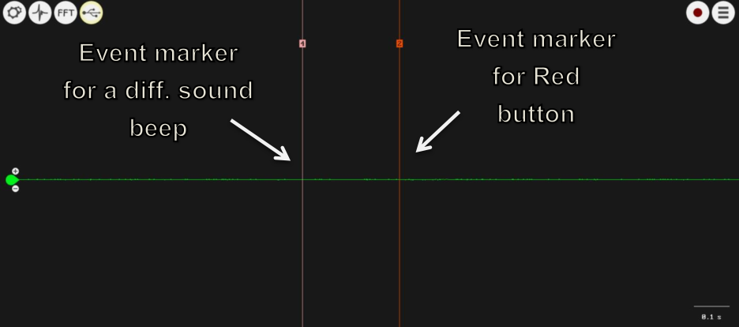

4. **Fourth Setting**  

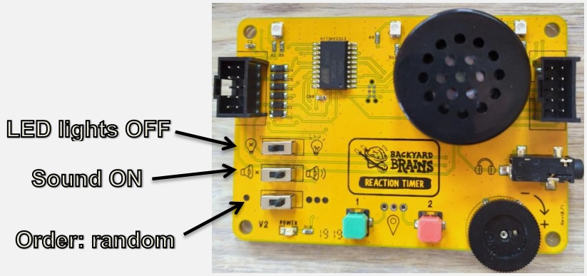

   Only sound beeps are used in this setting.
   - In Spike Recorder, only **Event Marker 3** (Green button) or **Event Marker 4** (Red button) will appear.
   
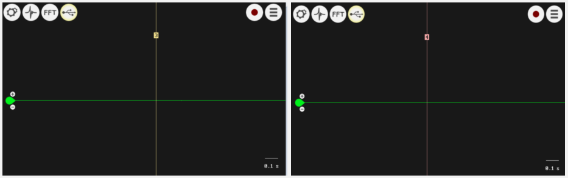

   > **Note:** The order of LED light flashes is irrelevant in this setting since the LEDs remain off.

## Finding your Reaction Time Data

After recording your reaction time data, Spike Recorder generates two files:
- A raw audio recording of your EMG data with reaction time.
- A `.txt` file that logs your reaction times.

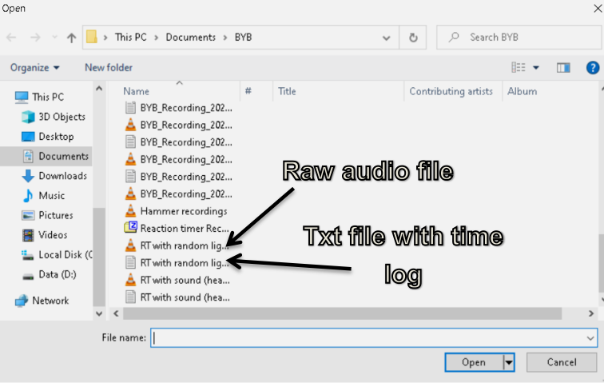

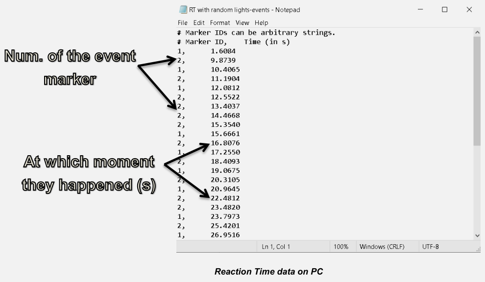

**File Locations:**
- **PC:** `Documents > BYB`
- **Android:** `Internal storage > BackyardBrains`
- **Mac:** `/Users/<your username>/Music/Spike Recorder/`

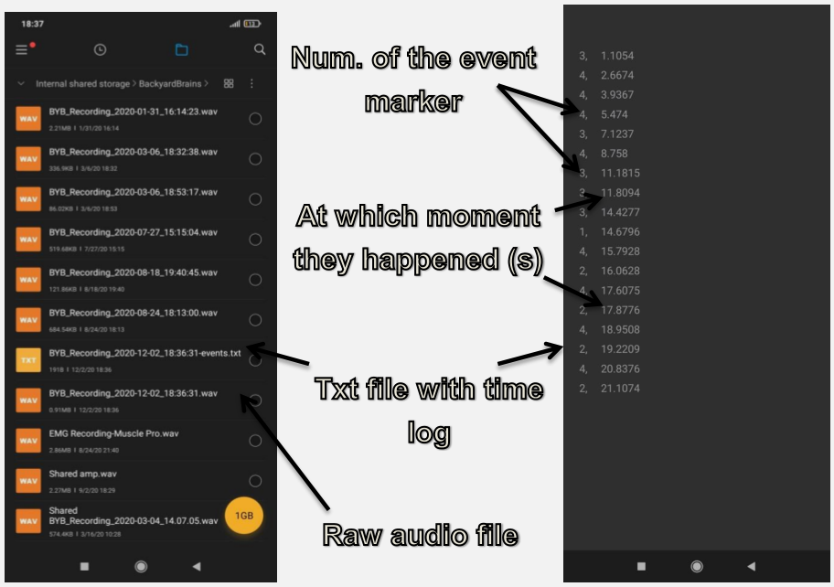

When you open the Reaction Time file (raw audio) directly in Spike Recorder on Android, it will automatically integrate the event markers into your recording.

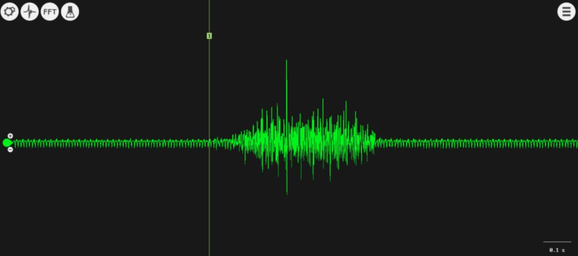

## Quantifying your Reaction Time Data

After loading your Reaction Time data in Spike Recorder, follow these steps to determine your reaction speed:

1. **Identify the Markers:**  
   Examples might look like:
   - *Single-channel recording:*  

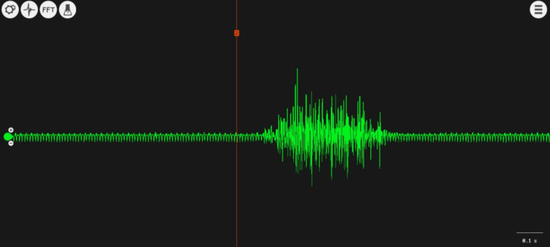

   - *Two-channel recording:*  

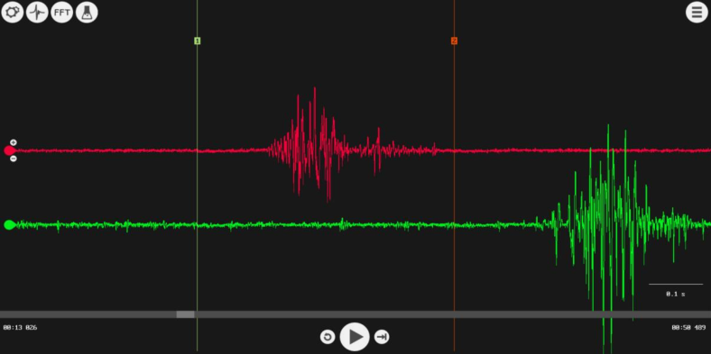

2. **Select the Time Interval:**  
   Click (or right-click on a laptop) and drag to select the area between the event marker and the beginning of your muscle reaction/EMG signal.  
   On Android, long-press the tick mark and drag to the start of the flex.

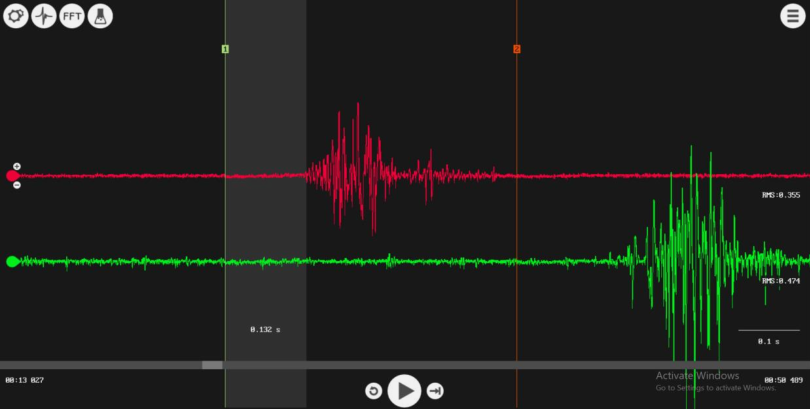

The time shown in the selected gray area represents how long it took your muscles to respond to the stimulus. With this data, you can calculate the average reaction time and standard deviation. Be sure to record your findings for your Reaction Time experiment.

Happy experimenting!
