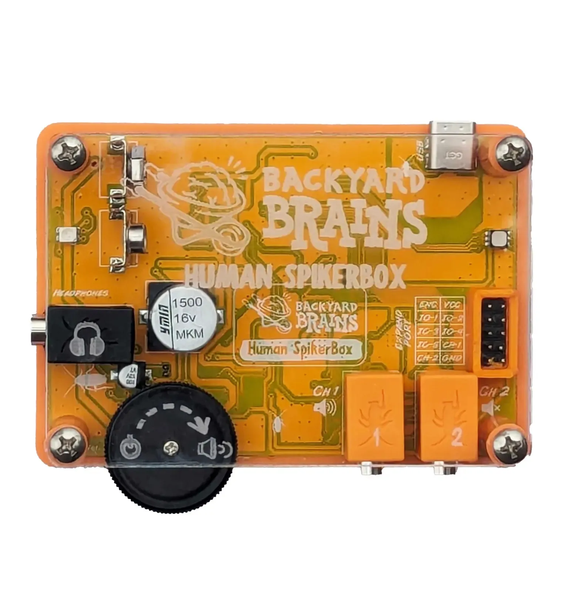
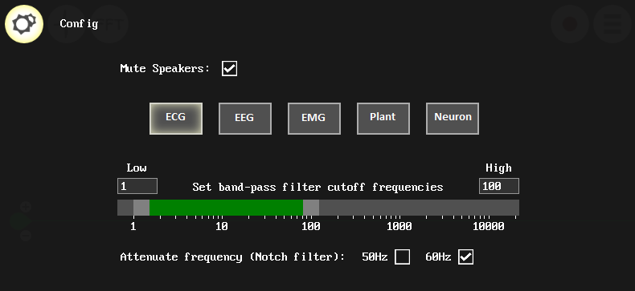

# Human SpikerBox

*Figure 1. Diagram of the Human SpikerBox Setup*

The Human SpikerBox kit is a versatile, user-friendly device designed for recording and analyzing electrical activity from muscles (EMG), heart (EKG), brain (EEG), and eyes (EOG). With this tool, students and enthusiasts can perform a variety of human physiology experiments to observe bioelectric phenomena in real time.

## Getting Started with the Human SpikerBox ##

To begin, choose the type of experiment you'd like to perform and gather the necessary materials. Below are setup instructions for basic recordings, including EMG, EEG, and ECG. For advanced applications, check out [our experiment pages](#experiments).

### Recording Muscle Activity (EMG) ###

1. **Electrode Placement**: Place two patch electrodes on each end of the target muscle (for example, on the forearm).
   - Attach a red lead from the orange cable to each electrode.  
   - For grounding, place a third electrode on the back of your hand and connect the black lead from the orange cable to this ground electrode.
   
2. **Connection**: Plug the orange cable into one of the channels on the Human SpikerBox. The left channel provides an audio output.

*Figure 2. Example of forearm EMG setup, showing electrode placement*

### Recording Brainwaves (EEG) ###

1. **Headband Setup**: Position the headband with metal electrodes around the top of your head.
   - Apply electrode gel to the flat metal contacts to enhance conductivity.  
   - Adjust the band so it sits securely under the jaw, with the electrodes aligned over the Pz and P4 regions of your scalp (refer to the image below for placement).
   
2. **Ground Electrode**: Place a patch electrode on the bony part behind your ear as a ground.
   - Connect each red lead from the orange cable to one of the headband's electrodes.  
   - Clip the black lead onto the ground electrode behind your ear.
   
3. **Connection**: Plug the orange cable into one of the channels on the SpikerBox.

This setup is designed for a [P300 experiment](https://backyardbrains.com/experiments/p300). For other EEG applications, see the BYB [experiments page](#experiments).

  
*Figure 3. EEG electrode setup for P300 experiment*

You can also experiment with [other electrode placements](https://en.wikipedia.org/wiki/10%E2%80%9320_system_(EEG))

### Recording Heart Activity (ECG/EKG) ###

1. **Electrode Placement**: Attach patch electrodes to the inner wrists, with an additional electrode on the back of the hand for grounding.
   - Connect each red lead from the orange cable to the wrist electrodes and the black lead to the ground electrode.
   
2. **Connection**: Plug the orange cable into a channel on the SpikerBox.

For additional ECG configurations, refer to the BYB [experiments page](#experiments).

### Setting Up for Recording ###

1. **Power On**: Insert a 9V battery into the Human SpikerBox and power it by turning the black dial, which also controls speaker volume.
2. **Device Connection**: Use the USB-C cable provided to connect the device to your computer or mobile device. iOS devices with a lightning connector will require This Cable, which is sold separately.
3. **Recording Software**: Open [SpikeRecorder](https://backyardbrains.com/products/spikerecorder) and wait for the device to connect. Adjust the filter settings by selecting the type of signal that you are trying to record.  

## Technical Specifications ##

The Human SpikerBox is engineered for high-quality physiological signal recording, making it a powerful tool for both educational and research purposes.

| **Category** | **Specification** |
|--------------|--------------------|
| Sampling Rate | 10 kHz (2 channels) |
| Frequency Range | 0.15–2000 Hz |
| Gain (High-Pass Filter above 70 Hz) | 850x |
| Gain (High-Pass Filter below 70 Hz) | 3250x |
| Output | USB-C, Headphone/Smartphone, 2 Analog Out pins |
| Inputs | 2x [Orange Cables](https://backyardbrains.com/products/muscleElectrodeCable), 5x Digital Ins or 3x Digital Ins/2x Analog Ins |
| CMRR | >140 dB |
| Differential Input Impedance | 10 GΩ |
| Common Mode Input Impedance | 5 GΩ |

> **Note**: Connecting to iOS with a lightning port requires a USB-C to Lightning cable (sold separately).

USB connection is highly advised, as connecting via the Green Smartphone Cable only transfers data from Channel 1. Low-frequency signals (such as EEG, EOG, and ECG) will be filtered out by the sound card of the phone or computer when using this method.

## Experiments ##

With the Human SpikerBox, you can dive into various hands-on experiments:

- Discover the function of [agonist and antagonist muscle pairs](https://backyardbrains.com/experiments/musclespikerboxpro).
- Compare [Patellar Reflex](https://backyardbrains.com/experiments/Musclekneejerk) with [Reaction Time](https://backyardbrains.com/experiments/MusclReactionTime).
- Locate [a single motor unit](https://backyardbrains.com/experiments/MuscleSingleunit).
- Explore muscle recruitment by [monitoring jaw activity while chewing](https://backyardbrains.com/experiments/Musclechewing).

## Expansion Options ##

The SpikerBox's expansion port offers the possibility to broaden its functionality by adding devices such as:

- **Reaction Timer**: For measuring reaction times in various experiments.
- **Reflex Hammer**: Ideal for studies involving reflexes and muscle response.
- **Game Controller**: Allows integration with software-controlled tasks and games.

## Troubleshooting ##

For common troubleshooting steps, see the [General Troubleshooting Guide](../../index.md#troubleshooting). 

---
