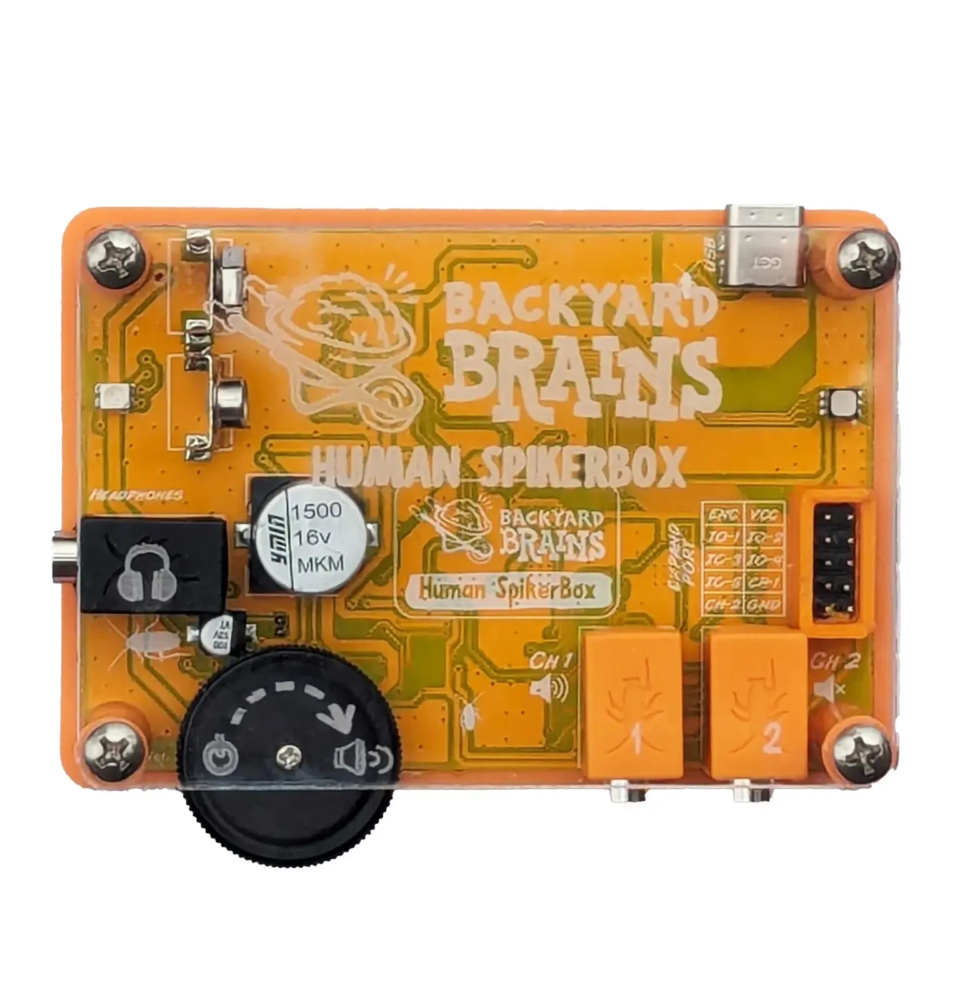
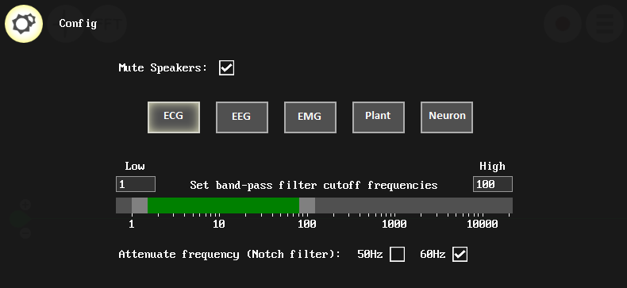
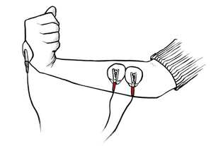
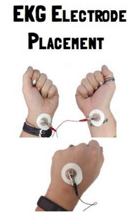
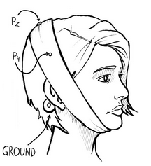

# Human SpikerBox

*Figure 1. Human SpikerBox setup.*

The Human SpikerBox is a two-channel bioamplifier for viewing and recording signals associated with muscle activity (EMG), heart activity (ECG/EKG), brain activity (EEG), and eye movement (EOG). Connect it to Spike Recorder to view these signals in real time and save them for analysis.

:::caution Safety
The Human SpikerBox is intended for education and experimentation, not medical diagnosis or treatment. Do not place electrodes on broken or irritated skin. Stop the experiment if a participant experiences discomfort. Minors should use the device under adult supervision.
:::

## Before You Begin

You will need:

- A Human SpikerBox
- A 9 V battery
- An orange electrode cable
- Three patch electrodes
- A USB-C data cable
- A computer or compatible mobile device
- [Spike Recorder](https://docs.backyardbrains.com/software/spike-recorder/)
- An EEG headband and electrode gel for EEG experiments

## Setting Up the Human SpikerBox

1. **Install Spike Recorder:** Download and open [Spike Recorder](https://docs.backyardbrains.com/software/spike-recorder/) on your computer or mobile device.
2. **Insert the battery:** Install a 9 V battery in the Human SpikerBox.
3. **Turn on the device:** Turn the black dial clockwise until it clicks. The dial also controls the built-in speaker volume.
4. **Connect the Human SpikerBox:** Use a USB-C data cable to connect it to your computer or mobile device.
5. **Confirm the connection:** Wait for the device or USB button to appear in Spike Recorder.
6. **Select your signal:** In the filter settings, choose the type of signal you want to record.

*Figure 2. Signal and filter settings in Spike Recorder.*

:::note Connection Options
Connect the Human SpikerBox using a USB-C data cable. This connection supports both recording channels and low-frequency signals such as ECG, EEG, and EOG.

Devices with a Lightning port require a compatible USB-C-to-Lightning data cable, sold separately.
:::

## Choose What to Record

### Muscle Activity (EMG)

1. **Place the recording electrodes:** Place two patch electrodes along the target muscle, following the orientation shown below. For example, place them along the length of a forearm muscle.
2. **Connect the recording leads:** Attach one red lead from the orange cable to each electrode.
3. **Place the reference electrode:** Place a third patch electrode on the back of the hand and connect the black lead to it.
4. **Connect the cable:** Plug the orange cable into either channel on the Human SpikerBox.

*Figure 3. Example electrode placement for recording forearm EMG.*

### Heart Activity (ECG/EKG)

1. **Place the recording electrodes:** Attach one patch electrode to the inside of each wrist.
2. **Connect the recording leads:** Attach one red lead from the orange cable to each wrist electrode.
3. **Place the reference electrode:** Place a third electrode on the back of the hand and connect the black lead to it.
4. **Connect the cable:** Plug the orange cable into either channel on the Human SpikerBox.
5. **Select the ECG filter:** Choose ECG in the Spike Recorder filter settings.

Remain still during the recording. Arm and hand movements can produce artifacts that obscure the ECG signal.

*Figure 4. Example electrode placement for recording ECG from the wrists.*

### Brain Activity (EEG)

EEG signals are much smaller than EMG and ECG signals. Good electrode contact, minimal movement, and a low-noise environment are especially important.

1. **Position the headband:** Place the EEG headband over the top of the head and secure it comfortably under the jaw.
2. **Position the contacts:** Align the metal contacts over the P4 and Pz regions of the scalp, as shown below.
3. **Apply electrode gel:** Add a small amount of electrode gel between each metal contact and the scalp.
4. **Place the reference electrode:** Place a patch electrode over the mastoid bone behind the ear.
5. **Connect the leads:** Attach the two red leads to the headband electrodes and the black lead to the electrode behind the ear.
6. **Connect the cable:** Plug the orange cable into either channel on the Human SpikerBox.
7. **Select the EEG filter:** Choose EEG in the Spike Recorder filter settings.

Keep the participant relaxed and still. Movement of the jaw, forehead, eyes, or head can create signals much larger than the EEG signal.

If the recording is noisy, unplug the laptop charger and move away from power supplies, fluorescent lights, and other sources of electrical interference.

*Figure 5. EEG electrode placement over P4 and Pz.*

This placement can be used for parietal EEG recordings, including experiments based on the P300 paradigm. BYB’s [legacy P300 experiment guide](https://docs.backyardbrains.com/retired/experiments/p300/) was written for older hardware, so use the Human SpikerBox connection instructions on this page.

For background on standardized EEG positions, see the [international 10–20 electrode-placement system](https://en.wikipedia.org/wiki/10%E2%80%9320_system_(EEG)).

### Eye Movement (EOG)

EOG measures changes in electrical potential associated with eye movement.

1. **Place the recording electrodes:**
   - To record horizontal eye movement, place one electrode near the outer corner of each eye.
   - To record vertical eye movement and blinks, place one electrode above and one below the same eye.
2. **Place the reference electrode:** Place a third patch electrode over the mastoid bone behind the ear.
3. **Connect the leads:** Attach the red leads to the two recording electrodes and the black lead to the reference electrode.
4. **Connect the cable:** Plug the orange cable into either channel on the Human SpikerBox.
5. **Select the EOG filter:** Choose EOG in the Spike Recorder filter settings.

Ask the participant to keep their head still while looking left and right or up and down. Head and facial-muscle movements can create artifacts.

## Experiments

Some of the following experiment guides were written for earlier SpikerBox hardware. When using them with the Human SpikerBox, follow the connection and software instructions on this page.

### Muscle Activity

- [Agonist and antagonist muscle pairs](https://backyardbrains.com/experiments/musclespikerboxpro)
- [The patellar reflex](https://backyardbrains.com/experiments/Musclekneejerk)
- [Visual-motor reaction time](https://backyardbrains.com/experiments/MusclReactionTime)
- [Finding a single motor unit](https://backyardbrains.com/experiments/MuscleSingleunit)
- [Muscle recruitment while chewing](https://backyardbrains.com/experiments/Musclechewing)

### Heart Activity

- [Heart action potentials—legacy guide](https://docs.backyardbrains.com/retired/experiments/heartrate/)

### Brain Activity

- [Recording alpha waves—legacy guide](https://docs.backyardbrains.com/retired/experiments/eeg/)
- [P300 and the oddball task—legacy guide](https://docs.backyardbrains.com/retired/experiments/p300/)

### Eye Movement

- [Eye potentials and EOG—legacy guide](https://docs.backyardbrains.com/retired/experiments/EOG/)

## Expansion Modules

Use the Human SpikerBox expansion port to add:

- [**Reaction Timer**](https://docs.backyardbrains.com/human/human-spikerbox/expansions/reaction-timer/): Present light and sound stimuli and measure reaction time.
- [**Reflex Hammer**](https://docs.backyardbrains.com/human/human-spikerbox/expansions/reflex-hammer/): Mark the moment of impact during reflex experiments.
- [**Game Controller**](https://docs.backyardbrains.com/human/human-spikerbox/expansions/game-controller/): Convert physiological signals into controls for computer games.

See the [Expansion Modules overview](https://docs.backyardbrains.com/human/human-spikerbox/expansions/) for technical information and compatibility requirements.

## Troubleshooting

If you cannot see a signal:

1. Confirm that the Human SpikerBox is turned on.
2. Make sure the USB cable supports data transfer, not only charging.
3. Check that Spike Recorder is using the Human SpikerBox rather than the device’s built-in microphone.
4. Confirm that all electrodes and cable connections are secure.
5. Improve electrode contact and keep the electrode leads still.
6. Unplug the laptop charger if the signal contains strong electrical noise.
7. Confirm that the correct signal filter is selected.

For additional help, see the [Spike Recorder Troubleshooting Guide](https://docs.backyardbrains.com/software/spike-recorder/troubleshooting/).

## Technical Specifications

| **Category** | **Specification** |
|---|---|
| Sampling rate | 10 kHz, two channels |
| Frequency range | 0.15–2,000 Hz |
| Gain with high-pass filter above 70 Hz | 850× |
| Gain with high-pass filter below 70 Hz | 3,250× |
| Signal inputs | Two analog channels using orange electrode cables |
| Expansion inputs | Five digital inputs, or three digital inputs and two analog inputs |
| Outputs | USB-C, headphone/smartphone output, and two analog output pins |
| CMRR | >140 dB |
| Differential input impedance | 10 GΩ |
| Common-mode input impedance | 5 GΩ |

---