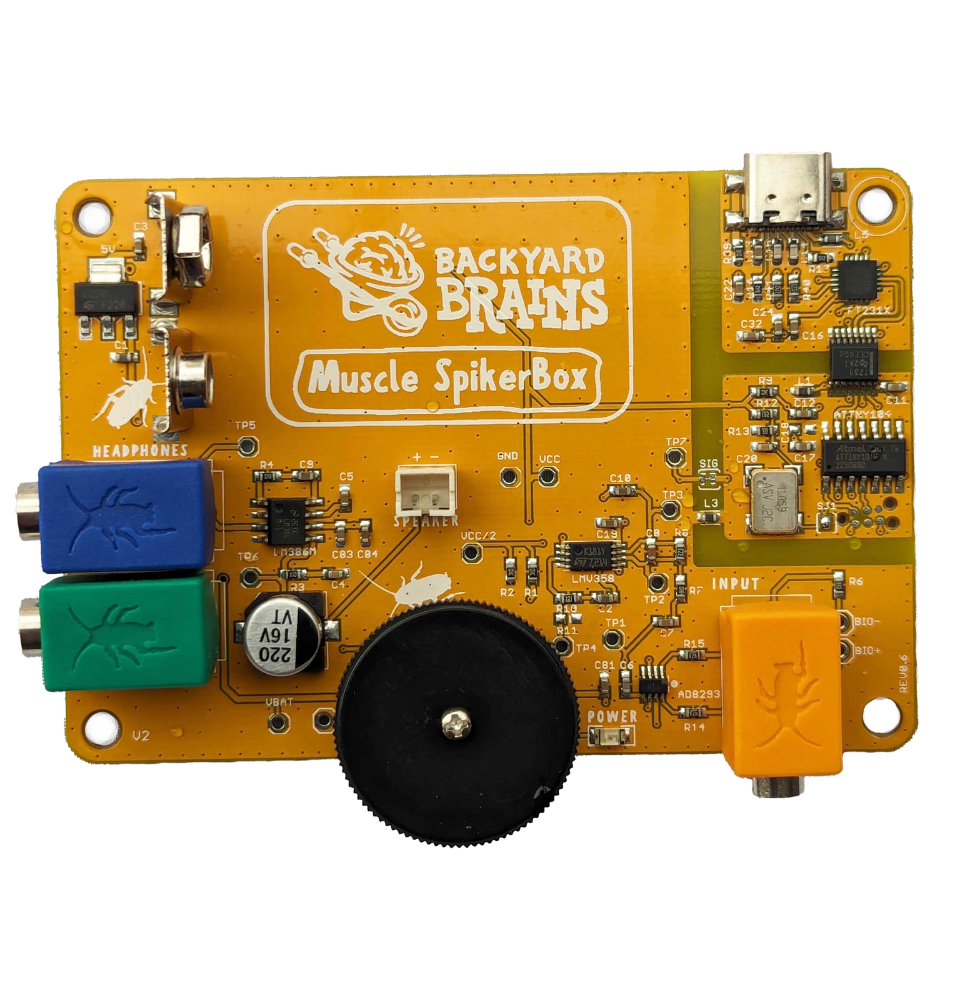
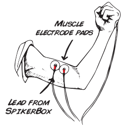
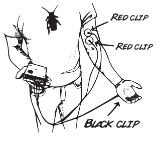
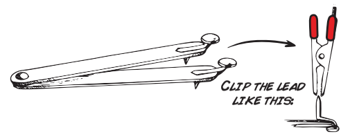
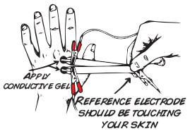
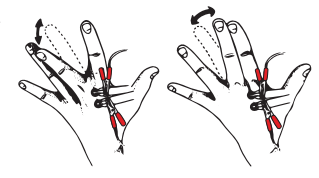
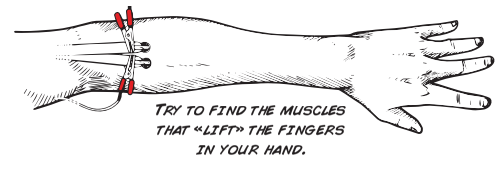

# Muscle SpikerBox #

The Muscle Spikerbox is designed to non-invasively detect electrical activity in human muscles using simple skin surface electrodes. It can be used to record and analyze EMG signals, when connected to our [Spike Recorder App](../../software/SpikeRecorder/). 

## Getting Started ##

Below are some basic setup steps for recording ECG and EEG, for more advanced aplications, check out [our experiment pages](#experiments)

### Bicep Recording

Remove the sticky backing from your muscle pads, and place these surface electrodes on two sides of your bicep.

Hook up the Muscle SpikerBox leads (two red alligator clips) to the two surface electrodes on your bicep.

Place the reference electrode (black) anywhere on the body. You can stick the electrode pad on the back of your hand.

Turn on the Muscle SpikerBox and listen for changes in activity. Do you notice a difference when you flex your muscle?

### Muscle Action Potentials

Attach both red clips to brass fasteners on either side of your "Popsicle stick" small motor electrode.

Place the electrodes on the back of your hand between the knuckles as shown:

Turn on your Muscle SpikerBox and move your middle finger like this:

Now try the other small muscles: arm, leg or face?  
Don't forget to use gel!

You can also record and analize your EMG by connecting to our [Spike Recorder software](../../software/SpikeRecorder/)

## Technical Specifications ##

|||
|---|---|
|Frequency range | 300Hz-1300Hz|
|Gain|880x|
|Output|Green Smartphone Cable, Blue Laptop Cable|
|Inputs|1x [Orange Cable](https://backyardbrains.com/products/muscleElectrodeCable)|

## Experiments ##
[Getting Started with Electromyograms (EMGs)](https://backyardbrains.com/experiments/emgspikerbox)\
[Muscle Contraction and Fatigue](https://backyardbrains.com/experiments/fatigue)\
[Muscle Action Potentials](https://backyardbrains.com/experiments/muscleActionPotential)\
[Modeling Muscle Fatigue](https://backyardbrains.com/experiments/rateoffatigue)\
[Muscle Recruitment During Chewing (Candy + Neuroscience)](https://backyardbrains.com/experiments/Musclechewing)
