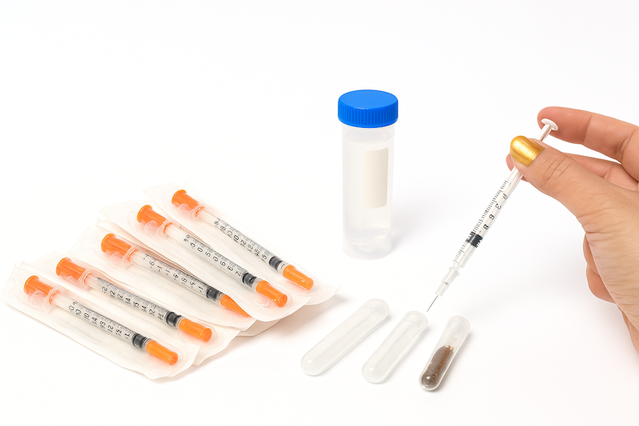
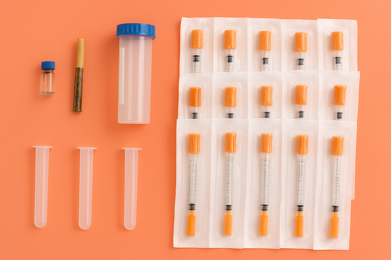

# Neuropharmacology Kit #

## Introduction 
The Neuropharmacology Kit is a practical add-on for the Neuron SpikerBox, designed to enhance students’ understanding of synapse function (excitatory and inhibitory) and neuropharmacology. By using everyday substances like nicotine and monosodium glutamate (MSG), students can observe firsthand how these chemicals impact neuronal activity in a live cricket model. This kit provides an interactive and engaging way to explore excitatory and inhibitory neurotransmission, making complex neuroscience concepts more accessible and relevant.

# Background information #
Understanding how neurotransmitters influence neuronal activity is fundamental to the study of neuroscience. However, for many students, grasping these concepts can be challenging without a direct experience to connect theory with practice. The Neuropharmacology Kit allows students to explore the impossibly tiny synapse in a hands-on way, offering a practical approach to understanding how excitatory and inhibitory neurotransmitters affect neuronal behavior.

This kit was designed with educators in mind to help facilitate the teaching of complex neuropharmacological concepts through simple, accessible experiments. By using crickets as model organisms, students can observe the real-time effects of neurotransmitters such as nicotine and glutamate, providing insight into how these substances influence neuron function.

## How many should I order for my classroom? ## 
The kit is designed for up to five student groups, with enough syringes and solution to deliver a control and two neuro-active agents (Glutamate and Nicotine). 

## What comes in the Neuropharmacology Kit? ##

Each kit comes with pre-tested amount dilutions of neuro-active agents to make the neuropharmacology labs a success.  Add the saline to 3 falcon tubes and mix in the neuro-active agents to two of them... and your ready to go!

| Item | Amount |
|----------|----------|
| MSG | 0.1g|
| Tobacco | 0.75g |
| Syringes | 15 |
| 10ml Tubes | 3 |
| Saline Solution | 25mL |

## Safety and Ethics

The Neuropharmacology Kit uses common household products—cigarette tobacco and MSG—to provide students with relatable insights into real-world neuropharmacology. To ensure safety, cigarettes included in the kit have been split open prior to shipping, rendering them unusable as tobacco products. This step complies with regulations set by the State of Michigan and promotes a safe classroom environment.

While pure nicotine can be hazardous, the nicotine solution prepared from diluted cigarette tobacco poses minimal risk when handled responsibly. Always supervise students closely during preparation and handling of solutions, and remind them to practice careful hygiene, such as washing hands after experiments.

### Ethical Treatment of Crickets
The welfare of the crickets is important and should be respected throughout the experiment. Ensure minimal discomfort by gently cooling the crickets in the freezer for a short, controlled time. Handle them carefully and use only as many crickets as needed to effectively demonstrate the educational concepts.

Most crickets fully recover after the experiment and can be safely released back into their environment. If crickets do not recover, ensure they are disposed of humanely and respectfully. Engage students in discussions about ethical considerations when using living organisms in scientific experiments, reinforcing the importance of empathy, responsibility, and respectful treatment of animals.

# Instructions 

##  Preparations

### Nicotine Solution (requires overnight soaking)

1. Place the cigarette tobaccointo a 10 mL falcon tube.
2. Fill the tube with saline up to the 10 mL mark.
3. Shake the tube to mix the saline and tobacco.
3. Let it soak overnight to extract the nicotine.  

### MSG Solution 

1. Fill a tube with saline up to the 10 mL mark (MSG is already in the tube for your convenience).
2. Shake the tube until the MSG is completely dissolved.

### Control Solution

1.	Take an empty 10 mL tube.
2.	Fill it with saline up to the 10 mL mark.

### Preparing the syringes

For each group, you will need 3 syringes.  One for the nicotine solution, one for the MSG solution, and one for the control solution. You do not need to inject too much of these solutions into the cricket (0.03 ml - thats 1/3 of the smallest marker on the syringe). Take about 0.1ml of each 3 solutions into 3 different syringes for each group. Mark with writing or colored tape to identify each of the solutions.  

You are now ready to start your experiments!