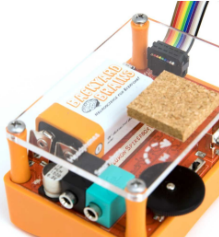

# Neuron SpikerBox

The Neuron SpikerBox pro is a dual channel bio bioamplifier that allows you to hear and see real-time electrical "spikes", or action potentials, of live neurons in invertebrates. It can be used to record and analyze action potentials, when connected to our [Spike Recorder App](../../software/SpikeRecorder/). 

## Getting Started ##

Below are some basic setup steps for recording action potentials, for more advanced aplications, check out [our experiment pages](#experiments)

!(.img/2.png)

Decide what Neuron SpikerBox Pro experiment you are doing and what materials you will need.  
Pictured here are options for experiments with an earthworm (how fast are action potentials?) and a  cockroach leg (how do neurons encode information?).

The Neuron SpikerBox Pro features two channels, with a switch to toggle between channel audio outputs.  

The white electrode is used for any single channel recordings, and it has a black grounding pin that is shared between both channels. The red electrode can be used to add another channel. 

Pin the recording electrodes into your prep according to your experiment.

Power the Neuron SpikerBox Pro on with a 9V battery, and turn on the black knob at the front of the SpikerBox. This also controls the volume.

Plug the USB cable into the USB port on the back of the board to connect. Alternatively you can also use the green smartphone cable. [click here for more details about connecting](../../software/spike-recorder/)

Open SpikeRecorder on your device.

Stimulate the neurons by poking or blowing. See, hear, and record the live firing of action potentials! What will you discover?

FYI: The black jack next to the smartphone output is audio out, for connecting an external speaker. The digital pins next to the USB port on the back is an [expansion port](./expansions/). Use an external cable to add channels, event markers, and plug in your own inventions!

## Technical Specifications ##

|||
|---|---|
|Sampling Rate |10k (2ch)|
|Frequency Range |220-3100hz|
|Max Sound Level |104 SPL|
|Neuron Signal SNR |30dB|
|Battery Life |4hr at Full Volume, 18 hr Recording|
|Output |USB Micro, Headphones, Smartphone, 2 Analog Out|
|Inputs |2x Neuron Cables, 5x Digital Ins or 3x Digital Ins/2x Analog Ins|
|Electrical Safety |Type BF (Body Floating)|

[Technical schematic](https://backyardbrains.com/products/files/Neuron.Spikerbox.Pro.V1.pdf)

## Experiments ##
Aside from all the experiments that you can do with a Neuron SpikerBox classic, you can also do the following experiments:

[How fast are action potentials?](https://backyardbrains.com/experiments/NeuronSpikerBoxPro)

[How do neurons encode information?](https://backyardbrains.com/experiments/ratecoding)

[What is the effect of temperature on neurons?](https://backyardbrains.com/experiments/WormTemperature)

[Does the size of the axon change the speed?](https://backyardbrains.com/experiments/wormstretch)

## Troubleshooting ##

Check out the [General Troubleshooting steps](../../index.md#troubleshooting)

After connecting to spike recorder, let's ensure that we are picking up the signal from the board by quickly touching the electrode connector with your finger and afterward clap or snap near the device running Spike Recorder. You should see the graph change when touching the connector, but not when there is background audio.

The Neuron SpikerBoxes are especially sensitive to electrical noise, so taking steps to minimize it is a good idea. (Plug out any chargers from both the wall and device running spike recorder, make sure to stay away from flourecent lights are a few examples)
