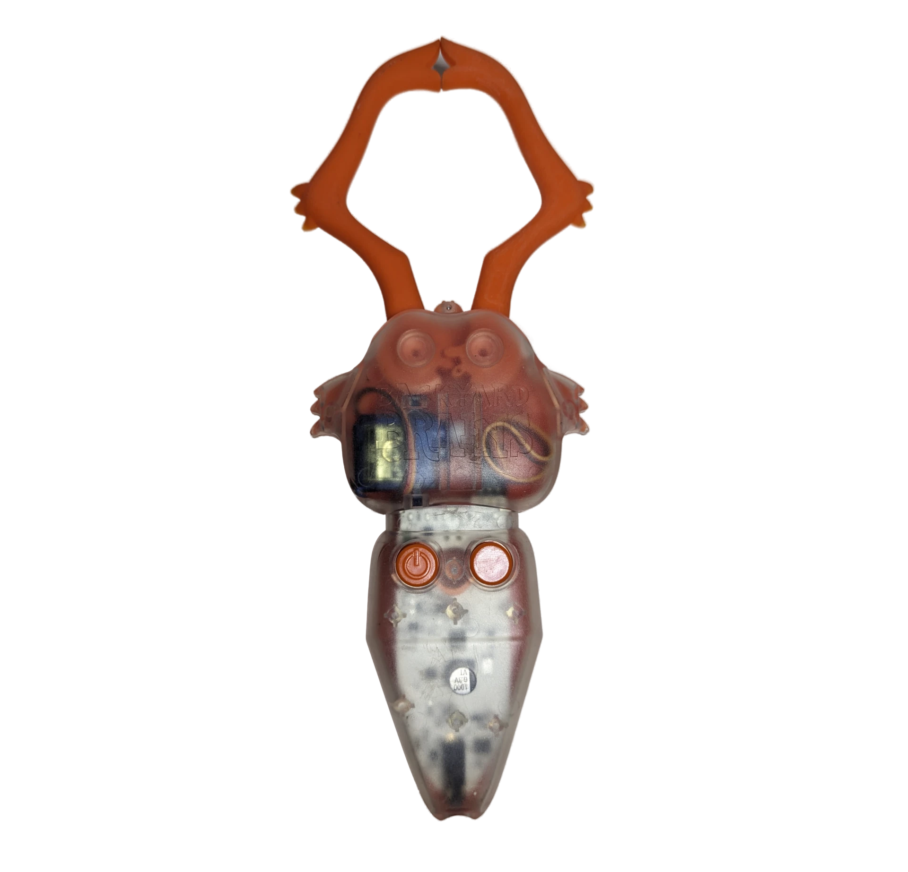

# The Claw #

The Claw is a motorized gripper that helps develop human-machine interfaces. A brain-machine interface (BMI) allows the nervous system to directly communicate with a device using neural activity. These interfaces amplify electrical signals from neurons, process them, and send commands to an external device. BMIs are useful in robotics and machinery and can also help people with sensory or motor impairments.

## Getting Started ##

[PDF instructions](./Claw_Insert.pdf)

### Battery installation ###

Locate the battery compartment door underneath. Slide the door downwards to open, locate the positive and negative indicator of the battery polarity and place the battery into the compartment accordingly.  
Don't put the battery in with the plastic wrap still on, as it may get stuck in the compartment.

### Electrode placement ###

Place two muscle electrode pads on your forearm muscle and one on the back of your hand, as shown in the picture.  
You can also choose a different location to place the electrodes, such as the bicep or the top of the forearm, but make sure to always have a single electrode on the back of your hand to ground the signal.  
Connect yourself to the orange cable by clipping the two red clips onto the forearm electrode pads, and the black clip onto the pad on the back of your hand.  
Then, simply plug the end of the orange cable into the input jack at the end of the Claw’s base (opposite of the pincers).

### The Claw’s buttons ###

Using the hand without electrodes, hold the claw with the clear side facing up.  
There are two buttons on the Claw: one controls power and the other sets the starting position of the pincers into either an open or closed position.  
To power the Claw on and off, press the left button with the power symbol once.  
The LED bar above the buttons should flash, and the pincers will move to their starting position.  
A single green LED will flash every few seconds, indicating that the Claw is powered up.   

To toggle between an open and closed starting position, simply press the right button once.
The pincers should move to their new positions right away.

### Operating the Claw ###

After you’re hooked up to the Claw via the orange cable, turn the Claw ON.  
Flex your forearm muscles and watch the Claw spring to action! As soon as your muscles are flexed, the Claw’s LED lights should light up green, yellow, and red while you flex.
At the same time, the pincers will move, opening or closing, depending on original position.

## Technical Specifications ##

|||
|---|---|
|Sampling Rate (Internal) |	10k|
|Frequency Range |	100Hz – 1kHz|
|Power supply |	9V battery|
|Battery life |	8 hr|
|Auto Shut-Off |	after 10 m idle|
|Control Buttons |1. On/Off, 2.Open/Close on EMG|

[Technical Schematic](https://backyardbrains.com/products/files/theClawV1.pdf)

## Troubleshooting ##

Make sure that your electrode placement is correct, and try using another new battery.

If the LEDs change in response to flexing your muscle, but the claw doesn't move, let's put in a new battery and try pressing the Open/Close button. 
If the claw still doesn't move send us an email at hello@backyardbrains.com or give us a call at  +1 (855) GET-SPIKES (855-438-7745) 