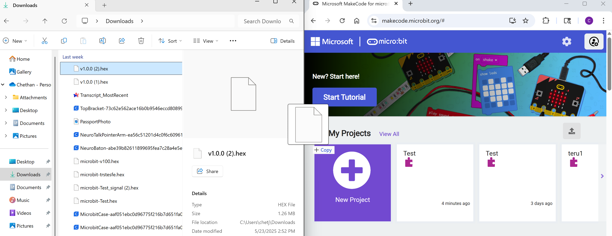
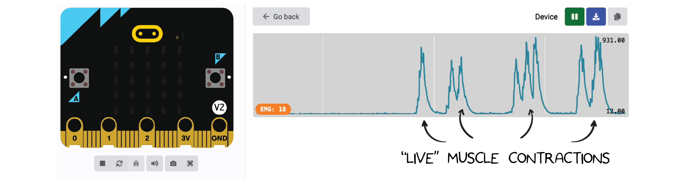
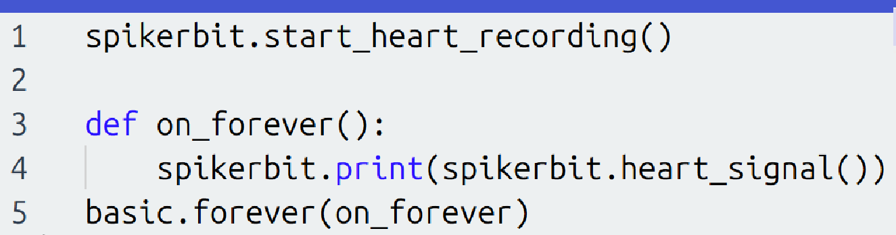
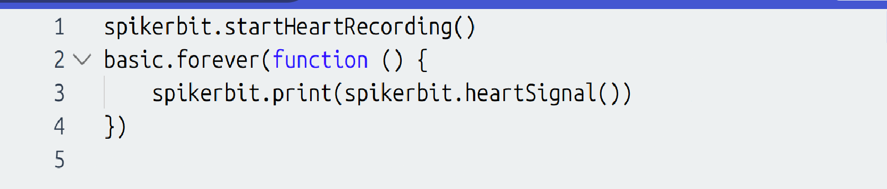

# Getting Started with Spiker:bit Block Programming #

## Overview ##

In this example, we will read in the EMG (Electromyography) and ECG signal (Electrocardiography or EKG) from the Spiker:bit and display it on the micro:bit.  You will need a Spiker:bit with a micro:bit connected to the front slot, some large motor electrodes, and a USB and electrode cable.

## Software Setup ##
We will use the [Make Code editor](https://makecode.microbit.org/) developed by Microsoft for micro:bit to program our Brain Machine Interfaces. There are a few other editors available, but we'll cover those and their differences in "Getting Started with Python". <!--For now, navigate to the Make Code website and click on the "New Project" button. 
 -->

If you want to access our extension in early, please vist our [download our Hex file via Github](https://github.com/BackyardBrains/pxt-spikerbit/releases/tag/v1.0.0). When you've download it, please drag and drop the hex file into micro:bit. A new project will be created, and you will see the micro:bit, code block palette, and a workspace.  You can add blocks to the project by dragging them from the center section to the workspace on the right. 

<!--Soon, our Spikerbit Extension will be available in Make Code. From there, you'll got to Make Code Editor > Extensions > Import and upload the hex file there. 
 -->

Now, you're ready to start programming!

## Read an EMG Signal ##

We will start by using our EMG signal via the "muscle power signal" variable. Variables store information in your code so you can easily access it in other places. Our extension creates an EMG variable that reads in from your Spikerbit to hold the values coming in from the EMG Signal. 

To use our variable in a new project, drag the "start muscle recording" variable block into the "on start" block. This is a one time operation that setups up the necessary background code so micro:bit can read from spiker:bit. Then, you'll drag into the muscle This is the main block where we will develop our project. This is already setup via the hex file download.    

Then, we can do some logic. For our experiment, we can drag in the "if else" block from logic as well as a less than operator. We can compare the muscle power signal to a low value ( usually 50 will do ), and from the "Basic" section drage out 2 show icon blocks. We can change the LED display by clicking the arrow next to the show icon ( a heart and skull were picked for this demo. That's it for the coding!  Once complete, you can download the file by pressing the Download button.  

## Connecting Muscles to Read an EMG Signal ##

Now that the Spikerbit is ready, we need a muscle to record from. Place 2 Large Motor Electrodes over the particular muscle you are recording from.  We tend to use the forearm as it is an easy movement to make while testing and performing your BMI. 

Place the electrode stickers *along* the muscle you want to read and connect the 2 red alligator leads.  You can place the black ground clip on a sticker behind your hand. This is good spot as we do not expect to see a lot of muscle activity on the hand.  This keeps the recordings quiet.

Once the program is downloaded, you can click on "Show Data".  This will plot the variables we are sending over serial in realtime!

Note that here the EMG signal moves from a value of around 0 to a value around 1000 when flexed. (See values on the right side of the graph).  This range will become important as you start to use this signal within your project.  

From here, you can use standard micro:bit code to make the EMG signal do something more interesting.  You can make the micro:bit play a sound when the signal is above a certain threshold, or you can make the micro:bit move a motor when the signal is below a certain threshold.  The possibilities are endless!  

## Connecting for ECG ##

Speaking of those possibilities, our second step could be repurposing this code for ECG signals! To do this, we'll add some new electrode placement. The two recommendations stem from "Einthoven's triangle", a commonly taught electrode placement guide in biomedical classes. For the following example, we placed a ground electrode on the back of the left hand and a positive electrode right beneath the palms on the insides of both arms. We're also going to connect the alligator clips with the positive on the right side, the negative on the left arm, and the black cable on the back of the hand.

You'll also want to make sure that the second switch on the Spiker:bit is set to the "ECG" setting, as otherwise you'll get a different signal. Finally, you can change the graph name in quotes from EMG to EKG or ECG, whichever you prefer. This is just a cosmetic change to the graph's title. After that, you'll be all set! Our code is still reading in the analog input, pin 1 is still out source, and the serial write function won't change.  

Here's the new code:

Here's what the signal will look like once you're successful:

Be careful though, if the polarity is swaped your spikes will go in the opposite direction:

## Side Note - MicroPython and JavaScript Editor in MakeCode ##

You can alternatively code in MicroPython or JavaScript from the MakeCode editor. This can be accessed via the mode switch towards the top of the micro:bit editor.

For this demo project, the block code converted into micropython looks like this:

and JavaScript looks like this:

A word of caution: sometimes, the code you write in Micropython and JavaScript will not properly load or be converted to block code, as switching back and forth between the tabs might accidentally clear all of your hard written code. We recommend saving this code in a separte document after writing a length MicroPython or JavaScript file to prevent this. 

# Sample Projects #
  
To get you started, we have provided some sample projects.  You can download these and try them out.  You can also modify them to see how they work.  We will be regularly updating the projects to include new features and make them more interesting.  You can find the projects in the [Projects](../Projects) section. 
