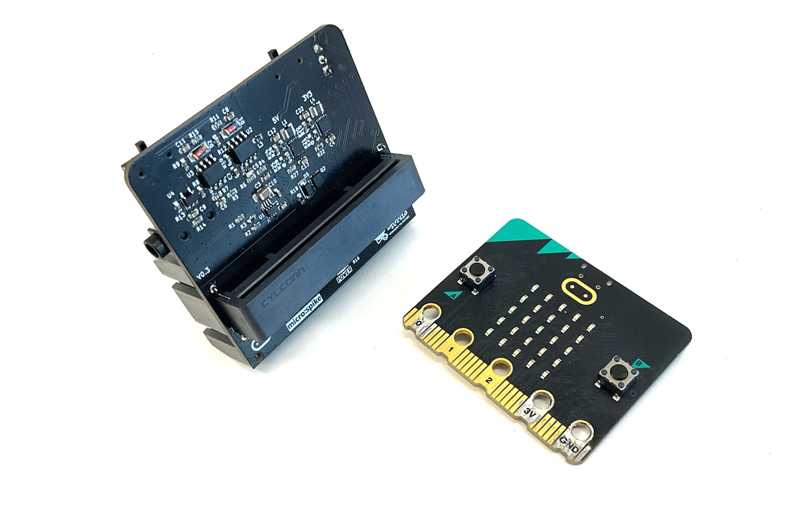
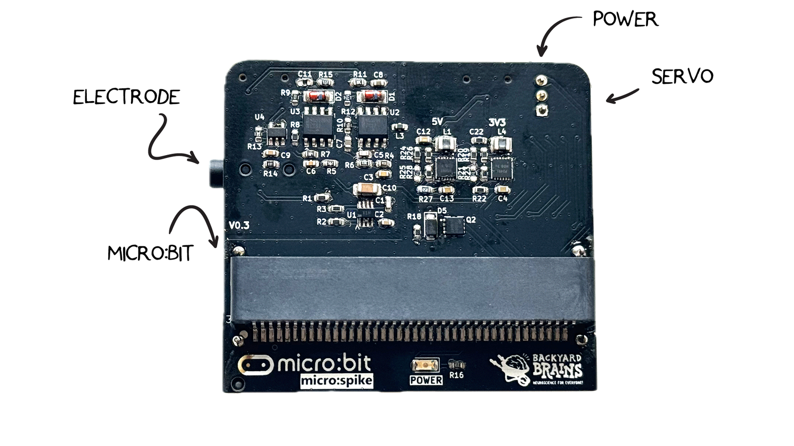
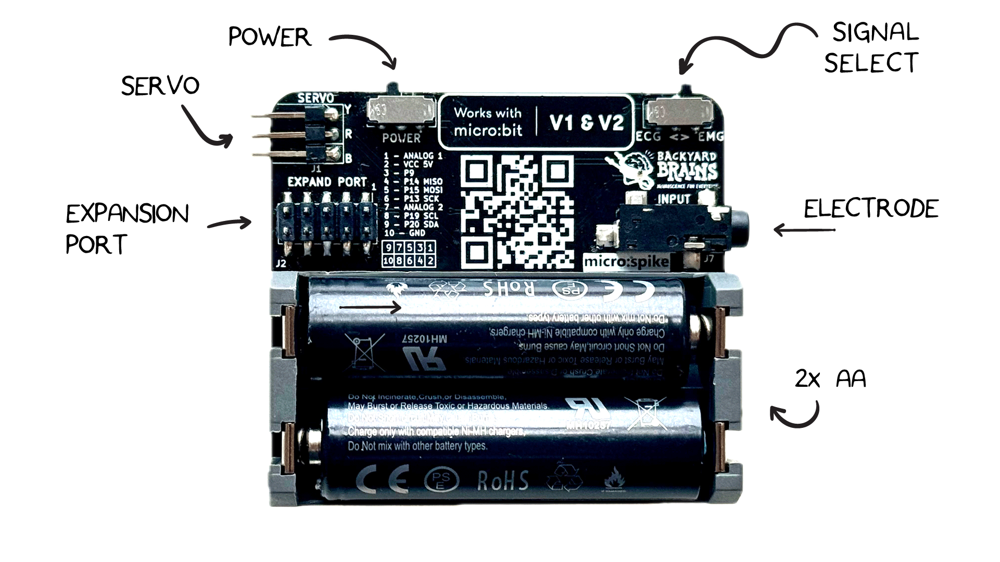
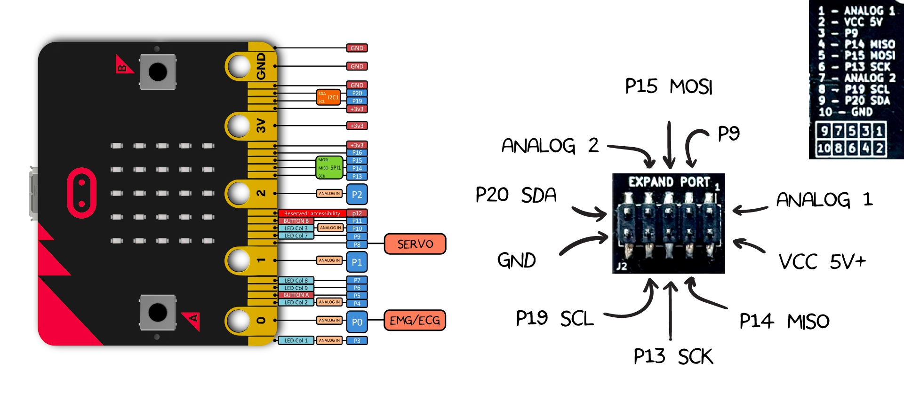
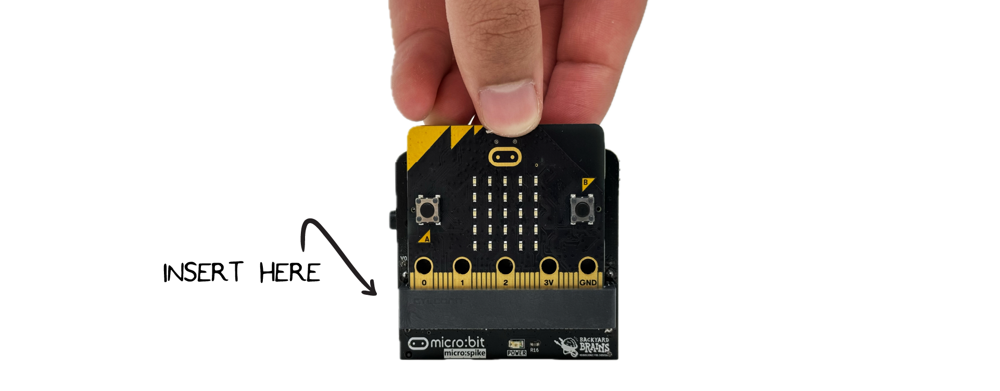
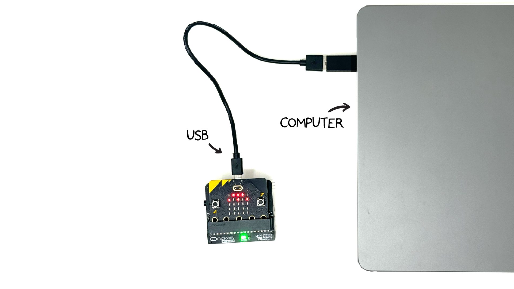
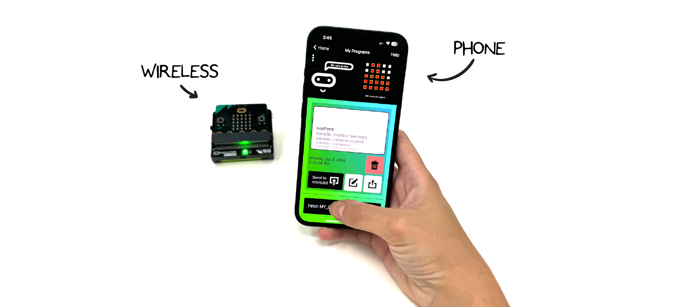

# The Spiker:bit #

## What is the Spiker:bit? ## 
The Spiker:bit allows you to develop DIY Brain Machine Interfaces (BMI) or sometimes called Brain Computer Interfaces (BCI).  A BMI is a computers that interfaces directly with the electrical signals of your body. The Spiker:bit has a port to connect to a micro:bit (computer), and a port to record from your body.  

## Technical Specifications ## 

| | |
|---|---|
| Power source | 2x AA Battery |
| Recording Modes| EMG, ECG |
|Outputs| 1x Servo, 1x Expansion Port|
|Inputs| 1x [Orange Electrode Cable](https://backyardbrains.com/products/muscle-electrode-cable)|

<!-- Couldn't find the schematic metioned, feel free to remove this comment when the schematics added [Download schematic PDF](./ ) -->

## Hardware Overview ## 
The Spiker:bit has a slot that accepts a V1 or V2 micro:bit.  The electrode required for recording is our orange cable with 3 leads (2 recording electrodes and a ground). 

You can select between EMG (Muscle) or EKG (Heart) on the Signal Select switch.  A Servo controller is provided on PIN 8. There is also an expansion port on the bottom to get clean access to additional pins for your project. 

## Pin Out ##

## What Will You Need? ##

To get started, you will need:

* 3x BYB Large Muscle Electrodes
* 1x BYB Orange Electrode Cable
* 1x Spiker:bit
* 1x micro:bit

Connect the micro:bit to the front slot on the Spiker:bit.  Be sure that the LEDs are facing outwards. Connect the orange cable to the electrode on the Spiker:bit side port.  

Connect the USB cable from your computer to the micro:bit. 

Or download the micro:bit app on the App Store and program wirelessly. 

## Experiments and Tutorials ## 

You are now ready to start programming your Spiker:bit! For our tutorials, take a look at the [Getting Started with Block Programming](./block/index.md) or [Getting Started with Python](./python/index.md). To see how this can be used in a real-world project, take a look at the [DIY Hand Neuroprosthetic](./projects/neuro-hand/index.md) page. 

