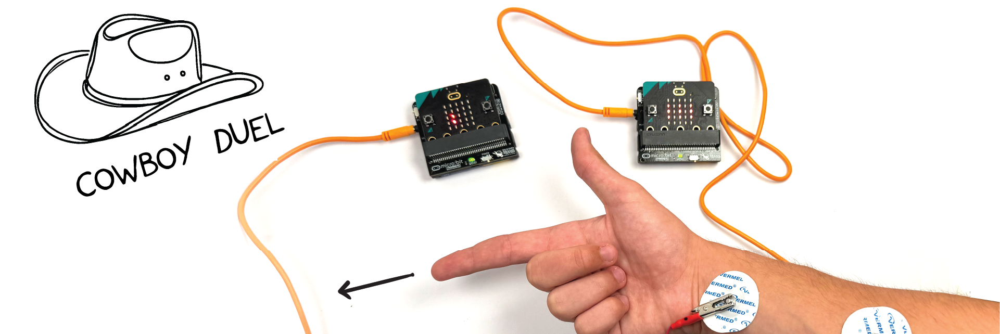
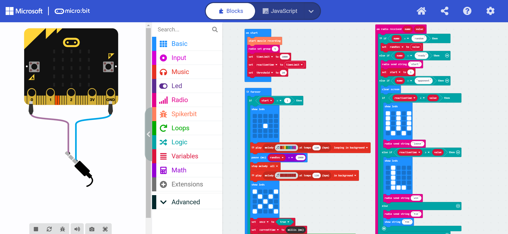
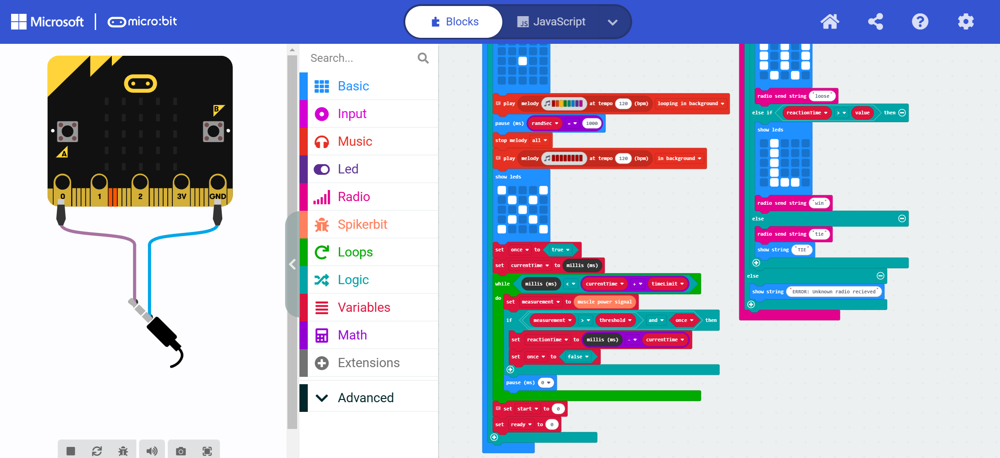
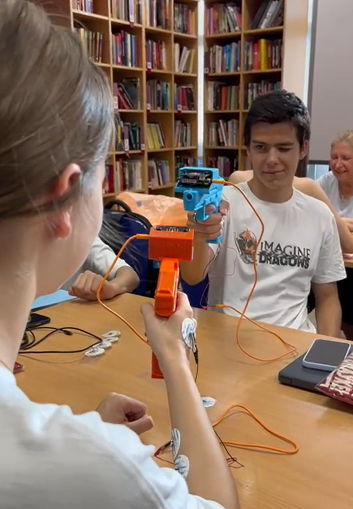
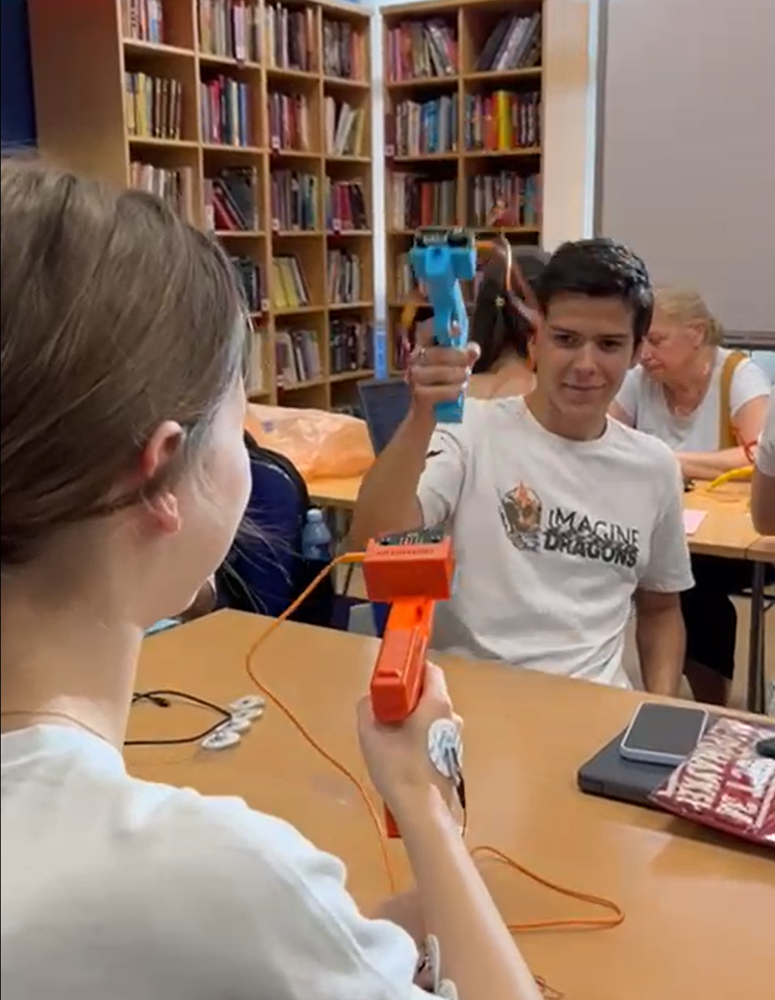

# Cowboy Duel #


|     |       |
|--------------|--------------
| Inventor     | Petar Barlov            
| micro:bit IDE     | MakeCode Editor 
| Best Location     | Makerspace

#### Difficulty ####

|     |       |
|--------------|--------------
| Hardware     | Easy          
| Software     | Hard


#### Special Requirement ####
|     |       |
|--------------|--------------
| 3D Printer   | Recommended

## Project Overview ##
As a kid, I always enjoyed cowboy movies; they were thrilling. I even got to play some high-quality cowboy games (“Red Dead
Redemption”, for example). My favorite moment was always the standoff when two cowboys dueled at high noon.

One thing that disappointed me is, when I talk to others about it,
nobody in Serbia seems to know anything about cowboys at all. So, I decided to make a project based on cowboys and show them what they have been missing.

## Build Instruction ##
There are no specific build instruction for this project. However, if you would like, you can print the toy pistol using 3D printer. You could install the STL file from [here](./NeuroGlock.stl).

## Code ##
There are three main parts to this program: player 1 side and player 2 side

The 'on logo pressed' and on 'start' blocks represents the ready system. First, it sets all variables to 0 and the radio group (server) to 5. It also has a variable “Random” which is a timer for the
beginning phase. When the logo is pressed, it sets the “Ready” variable to 1
(or to 0 if it’s already 1) and sends values “Ready” and “Random” to the
receiver. 

When a player 2 receives the variables, it equalizes the
“Random” value and it checks whether the other player is ready, and it
begins the game with the “Start” variable.

The forever block represents the main game operation. Firstly, it checks whether the “Start”
the variable is “activated” (equal to 1), it displays a dot and starts playing the
suspense melody. Then, it waits the “Random” amount of time and plays the sound signal to move on to action phase.

Detail operating instruction is provided next section.

import Tabs from '@theme/Tabs';
import TabItem from '@theme/TabItem';

### Player 1 code ###

<Tabs>
  <TabItem value="Block" label="Block Code">


  

  

  </TabItem>

  <TabItem value="Python" label="Python" default>

  ```py title="Cowboy Duel"
  def on_received_string(receivedString):
      global start
      if receivedString == "start":
          start = 1
      if receivedString == "win":
          basic.clear_screen()
          basic.show_leds("""
              # . # . #
              # . # . #
              # . # . #
              # . # . #
              . # . # .
              """)
      if receivedString == "loose":
          basic.clear_screen()
          basic.show_leds("""
              . # . . .
              . # . . .
              . # . . .
              . # . . .
              . # # # .
              """)
      if receivedString == "tie":
          basic.clear_screen()
          basic.show_string("TIE")
  radio.on_received_string(on_received_string)

  # Start Game by touching the sensor

  def on_logo_pressed():
      global ready
      # Preventing from interaput during the game
      if not (ready):
          basic.show_icon(IconNames.YES)
          ready = 1
          radio.send_value("random", randSec)
          radio.send_value("ready", ready)
      else:
          basic.clear_screen()
          ready = 0
  input.on_logo_event(TouchButtonEvent.PRESSED, on_logo_pressed)

  measurement = 0
  currentTime = 0
  once = False
  randSec = 0
  start = 0
  ready = 0
  spikerbit.start_muscle_recording()
  radio.set_group(5)
  ready = 0
  start = 0
  randSec = Math.round(randint(5, 10))
  timeLimit = 3000
  reactionTime = timeLimit
  threshold = 20
  # When 'start' changed to 1, game starts

  def on_forever():
      global once, currentTime, measurement, reactionTime, start, ready
      if start == 1:
          basic.show_leds("""
              . . . . .
              . . . . .
              . . # . .
              . . . . .
              . . . . .
              """)
          # Playing music for randSecised time (syched with opponent)
          music.play(music.string_playable("C5 B A G F E D C ", 120),
              music.PlaybackMode.LOOPING_IN_BACKGROUND)
          basic.pause(randSec * 1000)
          music.stop_melody(MelodyStopOptions.ALL)
          # Triger the sound for shooting
          music.play(music.string_playable("C5 C5 C5 C5 C5 C5 C5 C5 ", 120),
              music.PlaybackMode.IN_BACKGROUND)
          basic.show_leds("""
              # . . . #
              . # . # .
              . . # . .
              . # . # .
              # . . . #
              """)
          once = True
          currentTime = control.millis()
          while control.millis() < currentTime + timeLimit:
              measurement = spikerbit.muscle_power_signal()
              if measurement > threshold and once:
                  reactionTime = control.millis() - currentTime
                  once = False
              basic.pause(0)
          radio.send_value("opponent", reactionTime)
          # Stop the game
          start = 0
          ready = 0
  basic.forever(on_forever)
  ```
  </TabItem>

  <TabItem value="Js" label="Js">

  ```py title="Cowboy Duel" 
  radio.onReceivedString(function on_received_string(receivedString: string) {
      
      if (receivedString == "start") {
          start = 1
      }
      
      if (receivedString == "win") {
          basic.clearScreen()
          basic.showLeds(`
              # . # . #
              # . # . #
              # . # . #
              # . # . #
              . # . # .
              `)
      }
      
      if (receivedString == "loose") {
          basic.clearScreen()
          basic.showLeds(`
              . # . . .
              . # . . .
              . # . . .
              . # . . .
              . # # # .
              `)
      }
      
      if (receivedString == "tie") {
          basic.clearScreen()
          basic.showString("TIE")
      }
      
  })
  //  Start Game by touching the sensor
  input.onLogoEvent(TouchButtonEvent.Pressed, function on_logo_pressed() {
      
      //  Preventing from interaput during the game
      if (!ready) {
          basic.showIcon(IconNames.Yes)
          ready = 1
          radio.sendValue("random", randSec)
          radio.sendValue("ready", ready)
      } else {
          basic.clearScreen()
          ready = 0
      }
      
  })
  let measurement = 0
  let currentTime = 0
  let once = false
  let randSec = 0
  let start = 0
  let ready = 0
  spikerbit.startMuscleRecording()
  radio.setGroup(5)
  ready = 0
  start = 0
  randSec = Math.round(randint(5, 10))
  let timeLimit = 3000
  let reactionTime = timeLimit
  let threshold = 20
  //  When 'start' changed to 1, game starts
  basic.forever(function on_forever() {
      
      if (start == 1) {
          basic.showLeds(`
              . . . . .
              . . . . .
              . . # . .
              . . . . .
              . . . . .
              `)
          //  Playing music for randSecised time (syched with opponent)
          music.play(music.stringPlayable("C5 B A G F E D C ", 120), music.PlaybackMode.LoopingInBackground)
          basic.pause(randSec * 1000)
          music.stopMelody(MelodyStopOptions.All)
          //  Triger the sound for shooting
          music.play(music.stringPlayable("C5 C5 C5 C5 C5 C5 C5 C5 ", 120), music.PlaybackMode.InBackground)
          basic.showLeds(`
              # . . . #
              . # . # .
              . . # . .
              . # . # .
              # . . . #
              `)
          once = true
          currentTime = control.millis()
          while (control.millis() < currentTime + timeLimit) {
              measurement = spikerbit.musclePowerSignal()
              if (measurement > threshold && once) {
                  reactionTime = control.millis() - currentTime
                  once = false
              }
              
              basic.pause(0)
          }
          radio.sendValue("opponent", reactionTime)
          //  Stop the game
          start = 0
          ready = 0
      }
      
  })
  ```
  </TabItem>
</Tabs>

### Player 2 code ###

<Tabs>
  <TabItem value="Block" label="Block Code">

  

  

  </TabItem>

  <TabItem value="Python" label="Python" default>

  ```py title="Cowboy Duel"
  def on_received_value(name, value):
      global randSec, start
      # Checking both reaction time
      # Then show and send the result
      if name == "random":
          randSec = value
      elif name == "ready":
          radio.send_string("start")
          start = 1
      elif name == "opponent":
          basic.clear_screen()
          if reactionTime < value:
              basic.show_leds("""
                  # . # . #
                  # . # . #
                  # . # . #
                  # . # . #
                  . # . # .
                  """)
              radio.send_string("loose")
          elif reactionTime > value:
              basic.show_leds("""
                  . # . . .
                  . # . . .
                  . # . . .
                  . # . . .
                  . # # # .
                  """)
              radio.send_string("win")
          else:
              radio.send_string("tie")
              basic.show_string("TIE")
      else:
          basic.show_string("ERROR: Unknown radio recieved")

  radio.on_received_value(on_received_value)

  ready = 0
  measurement = 0
  currentTime = 0
  once = False
  start = 0
  randSec = 0
  reactionTime = 0
  spikerbit.start_muscle_recording()
  radio.set_group(5)
  timeLimit = 3000
  reactionTime = timeLimit
  threshold = 20
  # When 'start' changed to 1, game starts

  def on_forever():
      global once, currentTime, measurement, reactionTime, start, ready
      if start == 1:
          basic.show_leds("""
              . . . . .
              . . . . .
              . . # . .
              . . . . .
              . . . . .
              """)
          # Playing music for randomised time (syched with opponent)
          music.play(music.string_playable("C5 B A G F E D C ", 120),
              music.PlaybackMode.LOOPING_IN_BACKGROUND)
          basic.pause(randSec * 1000)
          music.stop_melody(MelodyStopOptions.ALL)
          # Triger the sound for shooting
          music.play(music.string_playable("C5 C5 C5 C5 C5 C5 C5 C5 ", 120),
              music.PlaybackMode.IN_BACKGROUND)
          basic.show_leds("""
              # . . . #
              . # . # .
              . . # . .
              . # . # .
              # . . . #
              """)
          once = True
          currentTime = control.millis()
          while control.millis() < currentTime + timeLimit:
              measurement = spikerbit.muscle_power_signal()
              if measurement > threshold and once:
                  reactionTime = control.millis() - currentTime
                  once = False
              basic.pause(0)
          # Stop the game
          start = 0
          ready = 0
  basic.forever(on_forever)

  ```
  </TabItem>

  <TabItem value="Js" label="Js">

  ```py title="Cowboy Duel"
  radio.onReceivedValue(function on_received_value(name: string, value: number) {
      
      //  Checking both reaction time
      //  Then show and send the result
      if (name == "random") {
          randSec = value
      } else if (name == "ready") {
          radio.sendString("start")
          start = 1
      } else if (name == "opponent") {
          basic.clearScreen()
          if (reactionTime < value) {
              basic.showLeds(`
                  # . # . #
                  # . # . #
                  # . # . #
                  # . # . #
                  . # . # .
                  `)
              radio.sendString("loose")
          } else if (reactionTime > value) {
              basic.showLeds(`
                  . # . . .
                  . # . . .
                  . # . . .
                  . # . . .
                  . # # # .
                  `)
              radio.sendString("win")
          } else {
              radio.sendString("tie")
              basic.showString("TIE")
          }
          
      } else {
          basic.showString("ERROR: Unknown radio recieved")
      }
      
  })
  let ready = 0
  let measurement = 0
  let currentTime = 0
  let once = false
  let start = 0
  let randSec = 0
  let reactionTime = 0
  spikerbit.startMuscleRecording()
  radio.setGroup(5)
  let timeLimit = 3000
  reactionTime = timeLimit
  let threshold = 20
  //  When 'start' changed to 1, game starts
  basic.forever(function on_forever() {
      
      if (start == 1) {
          basic.showLeds(`
              . . . . .
              . . . . .
              . . # . .
              . . . . .
              . . . . .
              `)
          //  Playing music for randomised time (syched with opponent)
          music.play(music.stringPlayable("C5 B A G F E D C ", 120), music.PlaybackMode.LoopingInBackground)
          basic.pause(randSec * 1000)
          music.stopMelody(MelodyStopOptions.All)
          //  Triger the sound for shooting
          music.play(music.stringPlayable("C5 C5 C5 C5 C5 C5 C5 C5 ", 120), music.PlaybackMode.InBackground)
          basic.showLeds(`
              # . . . #
              . # . # .
              . . # . .
              . # . # .
              # . . . #
              `)
          once = true
          currentTime = control.millis()
          while (control.millis() < currentTime + timeLimit) {
              measurement = spikerbit.musclePowerSignal()
              if (measurement > threshold && once) {
                  reactionTime = control.millis() - currentTime
                  once = false
              }
              
              basic.pause(0)
          }
          //  Stop the game
          start = 0
          ready = 0
      }
      
  })

  ```
  </TabItem>
</Tabs>

## Operating Instructions ##
To begin with, place ground electrode back of hand, and two other electrodes inner muscle of forearm.

Now, the question is how does “Cowboy Duel” work? Here is the order of
operation:
1. Ready system- Before the game starts, both players confirm
they are ready. Then player 1 press the golden
logo on the micro:bit. The LED display will show a checkmark when
pressed properly.
2. Beginning phase- After both players confirm they are ready, the
display will show a dot and the beginning phase starts. Suspenseful
music will start playing and all you need to do is focus and wait for
the sound signal.
3. Sound signal- After a certain amount of time (between 5 and 20
seconds) a sound signal will play and the display will show “X”, which is a
sign to shoot.
4. Action phase- After the sound signal, players point
the gun at the other player and press the trigger as hard as possible;
so that the proper muscle motion would occur and detected by EMG. The player that “shoots” first will
see a “W” on their display (winner), and others will see an “L” (loser).
“Cowboy Duel” went through a major design change. At first, it was meant
to be just a micro:bit held in one hand, and the other hand would be finger guns. This could be much more fun, so I added a 3D-printed gun with a micro:bit on top.




