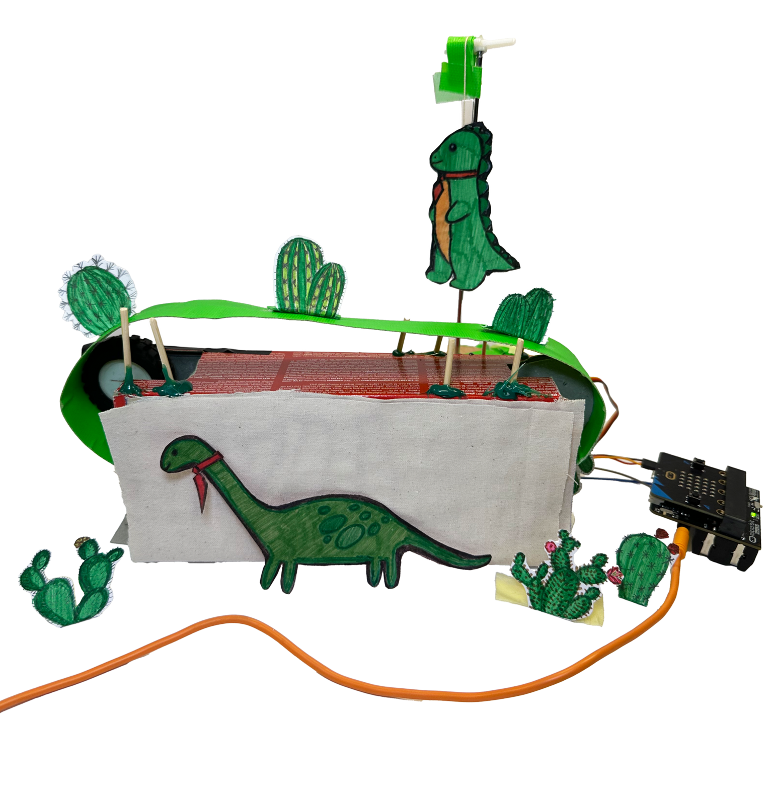

# Dino Jump Game


|     |       |
|--------------|--------------
| Inventor     | Anastasija Matić, Elena Andjelković, and Milan Tomić          
| micro:bit IDE     | Python Editor
| Best Location     | Classroom

## Project Overview
We always thought that the Chrome Dino game was pretty cool. Playing it as kids, all of us competed for the highest score. Our project is a Chrome Dino game made physical. The dinosaur jumps when the person who is controlling it jumps. We have a track with cactuses that moves. 
The goal of the game is to jump over the cactuses and help the dino to stay alive. This project shows the users that you can connect their bodies to interactive machines.
Although relatively simple, the game is extremely fun and cool.

## Materials needed
- 1x Micro:Bit and Spiker:bit
- 1x Servo motor
- 1x EMG Signal Cable
- 3x Electrodes
- 1x An old biscuit box ( Plasma if you're in Serbia )
- 1x roll of duct tape
- 1x String, roughly 12 inches worth
- 5x toothpicks
- 1x Paper and cardboard
- 1x A small metal rod / other axle for a pulley-like system

## Code explanation:
Making the code for this project was fairly simple and straight forward. We first assign the “val” which is going to be the value of the signal read from the electrodes. We then assign the threshold to 250, the threshold can be changed if the electrodes are placed elsewhere. Afterwards, we check If the analog value exceeds the threshold of 250, and if it does the servo is set to 180 degrees, making the dinosaur jump (grounded = 0). If the value is below or equal to the threshold, the servo is set to 13 degrees, keeping the dinosaur on the ground (grounded = 1). Below is the python file for micro:bit's makecode.
```
val = 0
threshold = 250
cactus = True
grounded = 1
while True:
    val = pins.analog_read_pin(AnalogPin.P0)
    serial.write_value("x", val)
    if val > threshold:
        pins.servo_write_pin(AnalogPin.P8, 180)
        grounded = 0
    else:
        pins.servo_write_pin(AnalogPin.P8, 13)
        grounded = 1
```
## Future Work 
These can all be done in the future for your own projects:

Function for the death of the dinosaur
  If the dinosaur is grounded at a certain predefined time frame (which is defined according to the speed of the track rotation and the distance of cactuses), the track stops moving.

Score counting:
  After a certain timeframe, the score increases by one, this function also stops when the dinosaur dies.

All models could be made using a 3D printer, making the game smoother and more professional.
