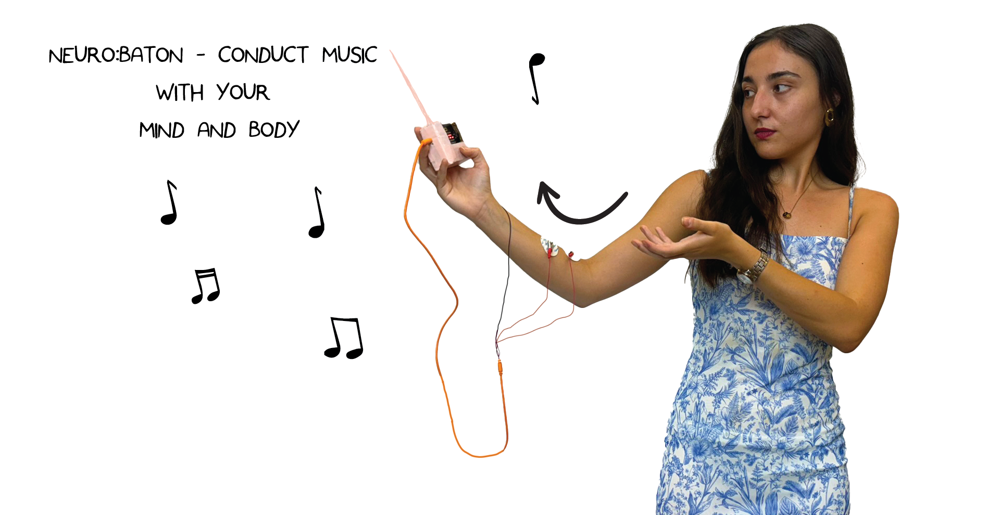
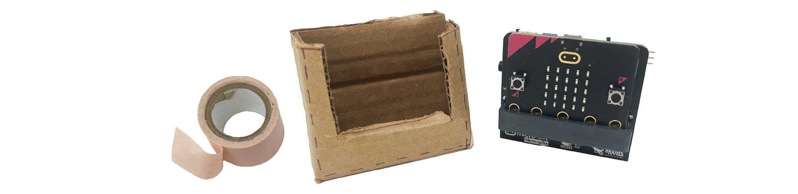
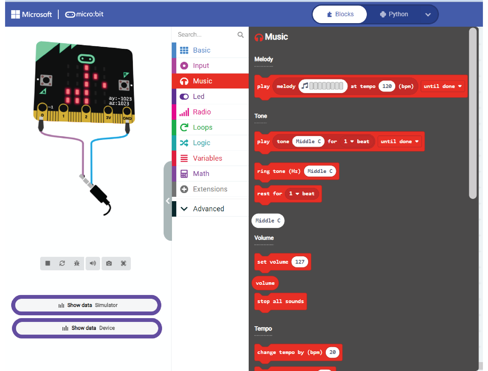
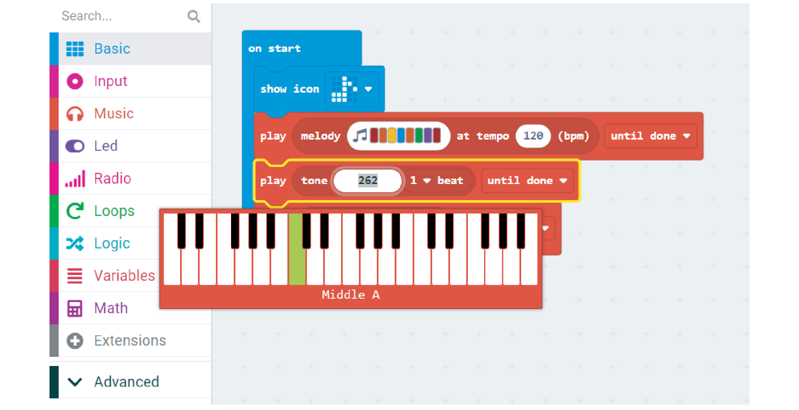
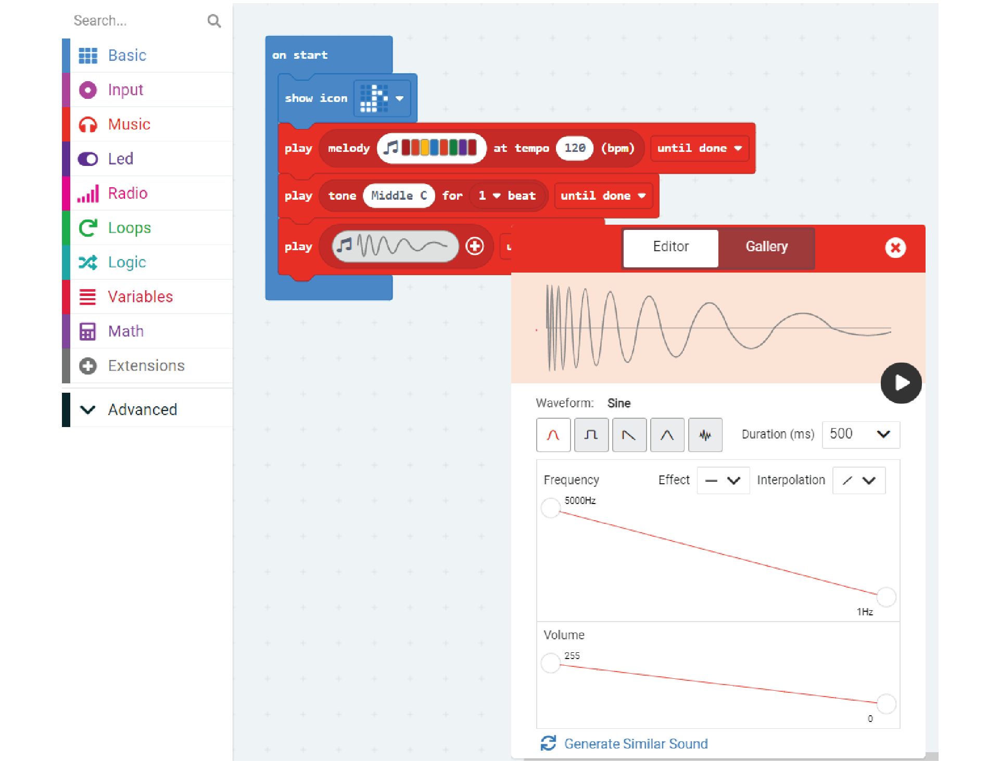
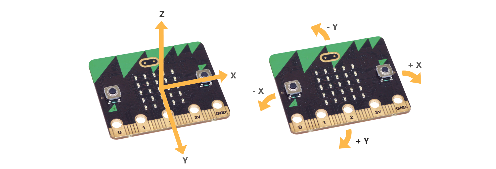
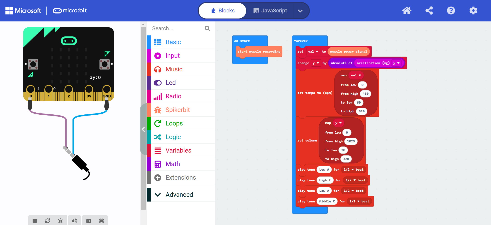

# Neuro:baton #




|               |                 |
| ------------- | --------------- |
| Inventor      | Sofia Andrikou  |
| Micro:Bit IDE | MakeCode Editor |
| Best Location | Classroom       |

#### Difficulty ####

|          |     |
| -------- | --- |
| Hardware | Easy |
| Software | Easy |


#### Special Requirement ####
|            |             |
| ---------- | ----------- |
| 3D printer | Recommended |


## Project Overview ##
Welcome to the Neuro:baton, the only device where you can conduct your own symphony with EMG!  These instructions will guide you through the process of building and programming your baton, harnessing the power of your movements and EMG signals to orchestrate beautiful melodies. Let's dive in and unleash your inner conductor!

## Build Instructions ##

### Materials ###


- 1x spiker:bit kit (spiker:bit, 3x electrodes, and 1x orange cable)
- 1x micro:bit
- cardboard
- paper
- pen
- tape

Grab a cardboard sheet and use the provided template to cut out the shape of the base of your NeuroBaton. 

### 1. Cut out ###


Print out a PDF of our [baton outline](./nc_baton_trace.pdf) and trace it on the cardboard (include the dotted lines).


Then cut ir out with scissors.

### 2. Fold and Decorate the Baton Holder ###



Fold up the cardboard to first snuggly around the micro:bit.  Then add some tape to the top to hold it in place, and give it some character. 

### 3. 3D Print and Final Assembly ###


What makes a conductors baton is the baton!  So we will 3D print the baton and place it on top of the base.  You can download the [STL File for 3D printing your own baton here](./NeuroBaton.stl).  

You can firmly secure with glue or tape, or leave it a bit loosey-gooesy for a more dynamic feel. 
 
Let your creativity flow as you decorate it with colors, patterns, or anything that reflects your musical personality!  

Once you're ready, let it rest while we delve into the exciting world of music creation!

## Code ##

Now that your baton is built, we need to to produce music. With Microbit's many options, the possibilities for musical exploration are endless. Let's explore how you can program your baton's brain to create and control captivating melodies.

### 1. Select Your Music ###
Choose between Music, Melody, or Synthesize to kickstart your composition journey.



You have the freedom to craft a DJ board melody:


compose a piano-based piece:



or explore the ethereal sounds of sine waveforms:



Additionally, Microbit provides a library of pre-made musical compositions for your convenience.

### 2. Define Your Controls ###

A skilled conductor controls an entire orchestra with simple hand and baton gestures.  We can do the same for the neuro:baton, but now we can be more creative with how we can control music.  Whether it's through buttons, accelerometer or the magic of EMG signals, the choice is yours!

In this example, we’ll use the strength of our muscles' EMG to control the music's tempo, and use vertical movements to adjust the volume.  Let's see how it works, exactly.

#### Muscle EMG for Tempo: ####

We'll use an EMG (electromyogram) connected to your forearm muscles.  For more information on how to connect the Spiker:bit to your muscles, see [Getting Started with Block](https://docs.backyardbrains.com/Engineering/NeuroBit/Block/) under "Connecting Muscles to Read an EMG Signal".  The forearm was chosen as these muscles get activating when conducting.

When you flex your muscles to raise the baton, the EMG increases. By reading the EMG values into a variable, we can use it to control the tempo of the music.

#### Motion for Volume: ####

The micro:bit has a built in accelerometer, which is a sensor that detects movement and orientation. We'll utilize the vertical (up and down) motion of your neuro:baton to control the volume.  Given the orientation of the baton in your hand, the Y axis responds well to raising and lowering the baton in the air (similar to a conductor).  We will therefor use that to increase the volume and down to decrease it.

 

By combining these two inputs, you'll have dynamic control over your musical performance, making you a true maestro with the neuro:baton!

Here's how you read in your EMG and y axis variables on your microbit:

The last 2 serial blocks allow communication to the host which allows us to see the EMG and Y variables in real time.  You should check what the values are as we will use these numbers to control.  Most of your time will be spent adjusting the program to respond to the right values in these signals.  It is always important to see how the signals appear when you are using the baton.  Below is a trace of 2 variables during the conducting of a song.

### 3. Putting it all together ###

The code below encapsulates the essence of neuro:baton, mapping EMG signals and accelerometer data to tempo and volume control.  In a while loop, we will add the ability to update the music based on our control variables.  Add the music to the bottom, and adjust the volume and tempo on each pass through the loop. 

Another cool feature you can add is the ability to stop all the music by turning your neuro:baton upside down, just like when a conductor signals to the orchestra to pause. Similar to how we use the y-axis for volume control, we can add a z-axis variable and use it to stop all melodies. All that needs to be done is to see how the z variable behaves when you perform that action.

import Tabs from '@theme/Tabs';
import TabItem from '@theme/TabItem';

<Tabs>
  <TabItem value="Block" label="Block Code">

  

  </TabItem>

  <TabItem value="Python" label="Python" default>

  ```py title="NeuroBaton"
  y = 0
  val = 0
  spikerbit.start_muscle_recording()

  def on_forever():
      global val, y
      val = spikerbit.muscle_power_signal()
      y += abs(input.acceleration(Dimension.Y))
      music.set_tempo(pins.map(val, 0, 430, 60, 320))
      music.set_volume(pins.map(y, 0, 1023, 20, 320))
      music.play_tone(220, music.beat(BeatFraction.HALF))
      music.play_tone(659, music.beat(BeatFraction.HALF))
      music.play_tone(220, music.beat(BeatFraction.HALF))
      music.play_tone(262, music.beat(BeatFraction.HALF))
  basic.forever(on_forever)
  
  ```
  </TabItem>

  <TabItem value="Js" label="Js">

  ```py title="NeuroBaton"
  let y = 0
  let val = 0
  spikerbit.startMuscleRecording()
  basic.forever(function () {
      val = spikerbit.musclePowerSignal()
      y += Math.abs(input.acceleration(Dimension.Y))
      music.setTempo(pins.map(
      val,
      0,
      430,
      60,
      320
      ))
      music.setVolume(pins.map(
      y,
      0,
      1023,
      20,
      320
      ))
      music.playTone(220, music.beat(BeatFraction.Half))
      music.playTone(659, music.beat(BeatFraction.Half))
      music.playTone(220, music.beat(BeatFraction.Half))
      music.playTone(262, music.beat(BeatFraction.Half))
  })

  ```
  </TabItem>
</Tabs>

## Operating Instructions ##

Now it is time for your big performance.  Unplug from the computer and turn it on to start the music!  Flex your wrist muscles to dictate the tempo and add dynamic flair to your performance.  The more you flex your muscles, the faster the music goes!  This can be done from either the hand that holds the baton, or from your free hand... regardless the power of EMG is at your fingertips!

Lift your baton up to creating crescendos and lower to provide diminuendos with graceful movements.

With a flick of your wrist, you can pause the music or reignite the symphony, just like a conductor commanding an orchestra. Don't panic, move your NeuroBaton facing up again and the music will restart!


### Customize and Make it Your Own! 

You can customize your experience by incorporating features like DJ board melodies, piano-based compositions, or even experimental sine waveform sounds. Use the buttons to switch the music in realtime.  Let your imagination soar!

You can even explore some more innovative ideas like using other body signals for control.  Here is a short list of possibilities:

#### Heartbeat Drumming Experience
Use EKG (Electrocardiogram) signals to synchronize your heartbeat with rhythmic drumbeats, turning your neuro:baton into a heart-powered percussion instrument.

#### Dance Choreography Integration
Combine the art of dance with music by mapping specific dance moves to trigger different musical elements. Imagine choreographing a routine where each step or gesture influences the melody, rhythm, or even lighting effects for a multimedia performance.

#### Gesture-Based Composition
Create a library of hand gestures or body movements, each assigned to a musical note, chord, or sound effect. By interpreting these gestures in real-time, you can compose music on the fly, turning any space into a symphonic playground.

#### Interactive Storytelling
Transform your NeuroBaton into a narrative device, where each movement advances the storyline through sound effects, voiceovers, or musical cues. Invite participants to engage in immersive storytelling experiences, where their actions shape the unfolding narrative.

####  Collaborative Jam Sessions
Connect multiple NeuroBaton devices wirelessly to facilitate collaborative jam sessions among friends, family, or even strangers. Each participant can control different musical layers or instruments, fostering creativity, teamwork, and spontaneous musical exploration.

Share your creations with fellow music enthusiasts, collaborate on projects, and inspire others to embark on their own musical journeys with neuro:baton.

## Conclusion ##
Congratulations on embarking on this exhilarating musical adventure with neuro:baton! With the power of technology and the artistry of your movements, the world of music is yours to conduct. Let the symphony begin!

