#  Neuro:Talk #


|     |       |
|--------------|--------------
| Inventor     | 	Masha Kosanovic and Nadja
| micro:bit IDE     | MakeCode Editor
| Best Used    | Makerspace 

#### Difficulty ####

|     |       |
|--------------|--------------
| Hardware     | Medium           
| Software     | Hard


#### Special Requirement ####
|     |       |
|--------------|--------------
| SG90 Micro Servo  | Required
| 3D printer | Required
| Glue Gun | Recommended

## Project Overview ##
**Welcome to Neuro:Talk, Your Gateway to Expressive Communication Through ASL!**

These instructions will guide you through the process of building and programming your Neuro:Talk device, which takes Electromyography (EMG) signals from American Sign Language (ASL) gestures, converts them into Morse code, and displays the output via tones, an LED display, and a rotating pointer on a servo and cup. Let's dive in and explore this unique method of communication!

## Build Instructions ##

### Materials ###
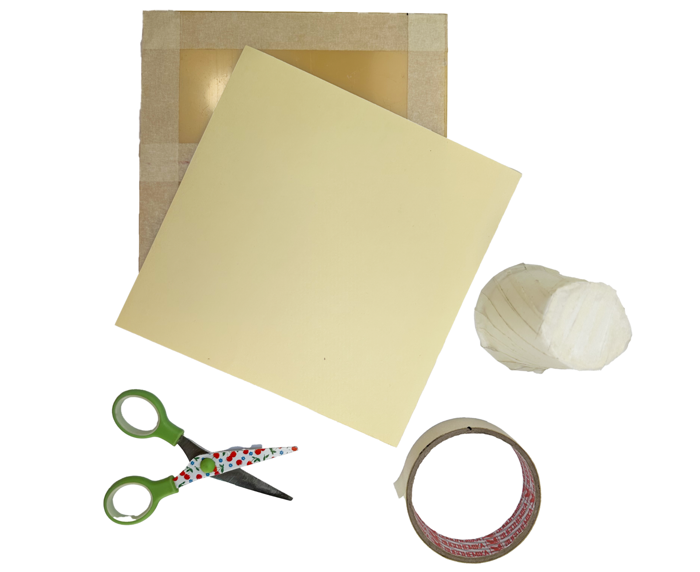

- 2x spiker:bit kit (spiker:bit, 3x electrodes, and 1x orange cable)
- 2x micro:bit
- 1x servo motor
- 1x cup (for the rotating pointer)
- 1x cardboard, tape, and scissors for housing
- (Stick and glue gun not shown)

### 1. Start by grabbing the cup and tape ###
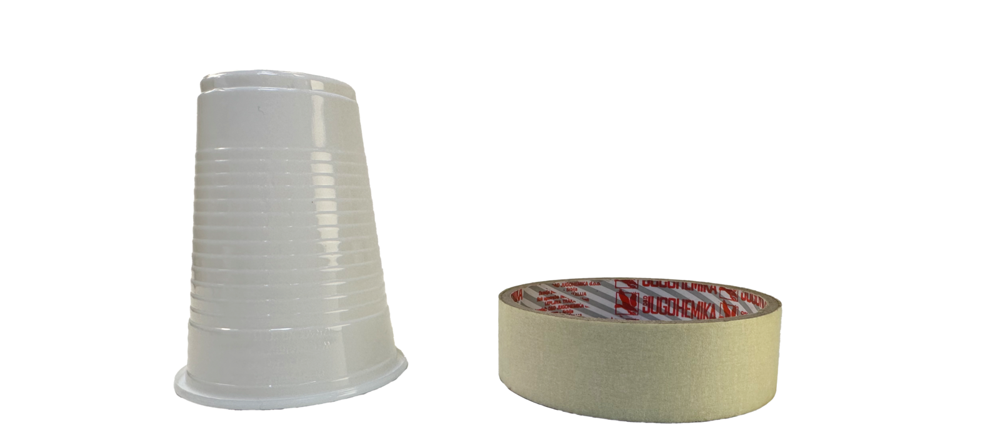

### 2. Tape the cup for improved grip, this will matter when we attach the servo ###
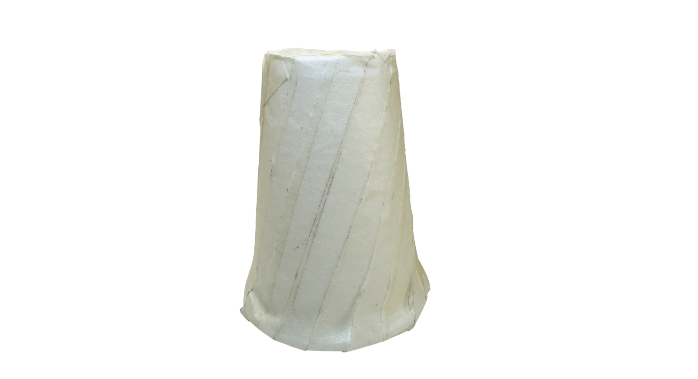

### 3. Tape the cup onto the piece of paper ###
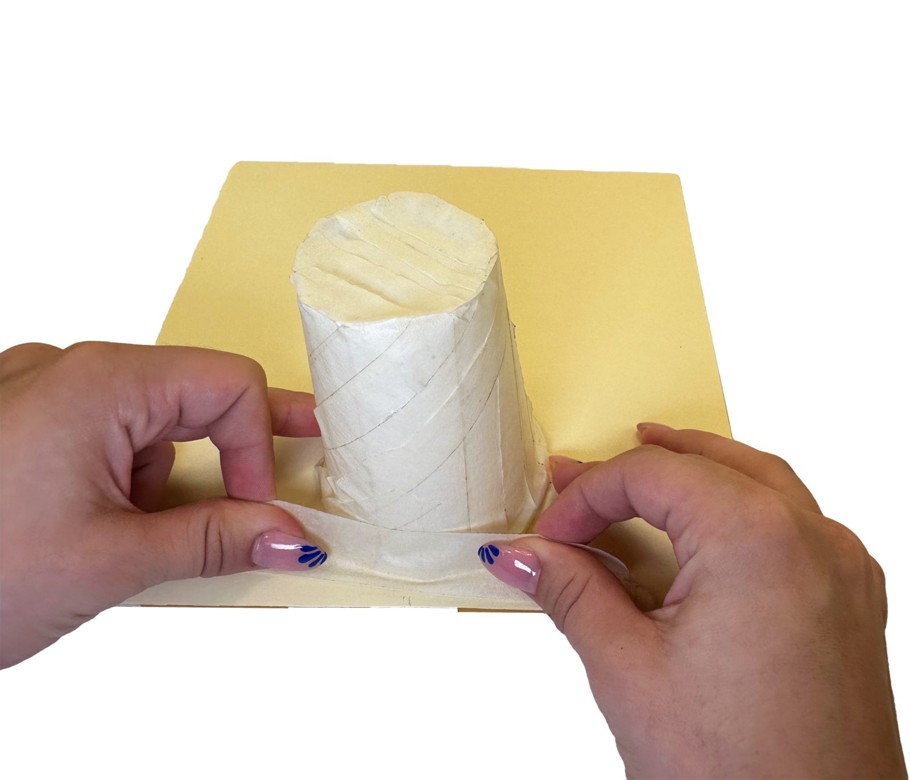

### 4. Now grab the stick, in this case it's a 3D printed part. Apply glue from a glue gun to where the servo hat will connect ###
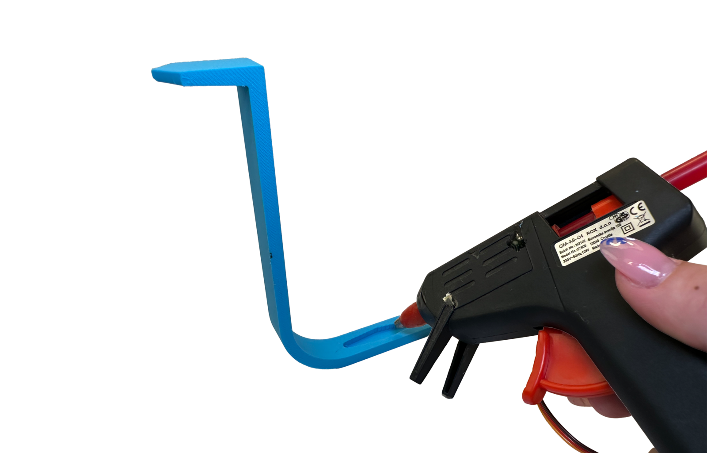

You can download the [stl file](./NeuroTalkPointerArm.stl) for 3D printing part from here.

### 5. Attach the servo to the stick. The servo should then be connected to the micro:bit ###
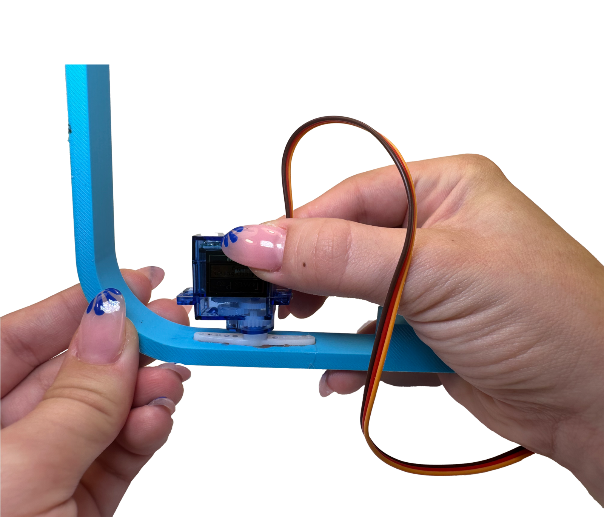
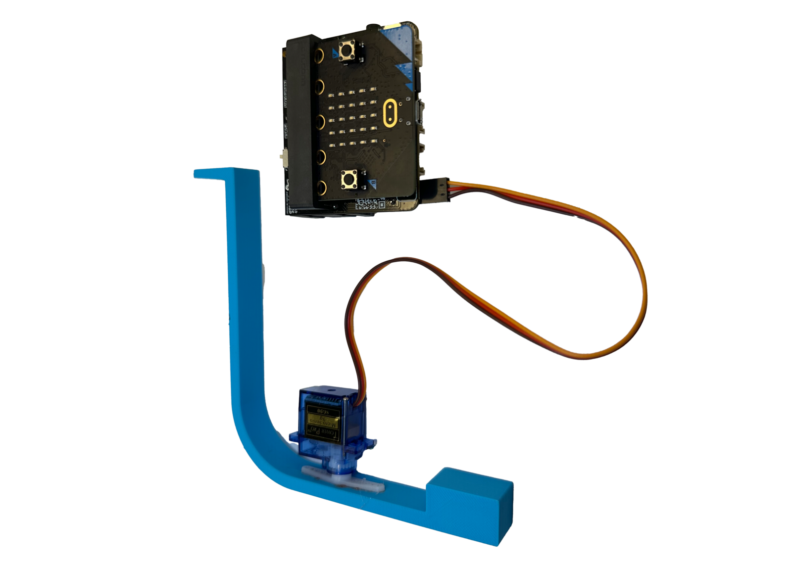

### 6. Apply glue from the glue gun onto the tape cup and then place the servo onto the tape cup ###
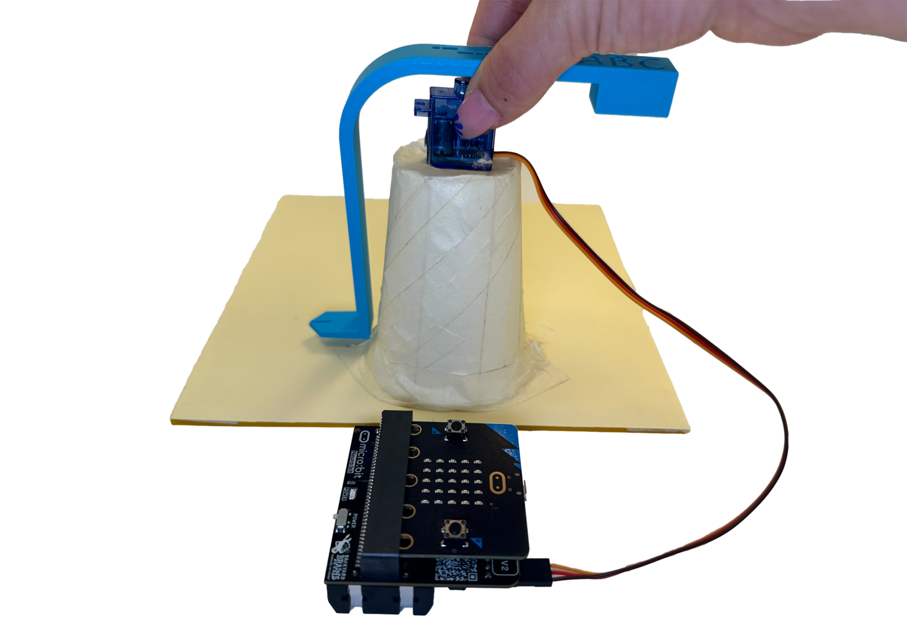

### 7.  Add a 0, letters, and a space matching your letter array. This is best done by running the code and having the servo move through the array ###
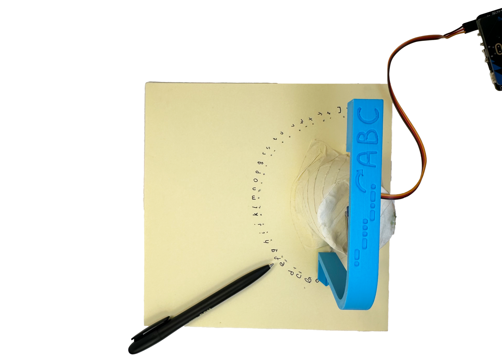


## Code ##
Now that your device is assembled, it's time to program it to decode ASL gestures into Morse code and display it.
This code is split into two parts, send and receive. This first chunk is sending ( it looks long, but most of that is due to the arrays for alphabet and morse code ).

The program calibrates hand movies for dots and dashes, converts these into letters, and then controls a servo to select the letters chosen. This information is communicated from micro:bit to micro:bit via the radio command.

import Tabs from '@theme/Tabs';
import TabItem from '@theme/TabItem';

### Sender (Morse code) code ###

<Tabs>
  <TabItem value="Block" label="Block Code">

  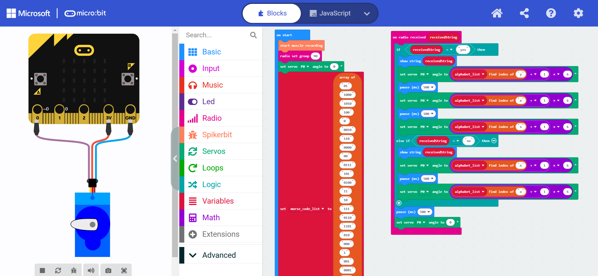

  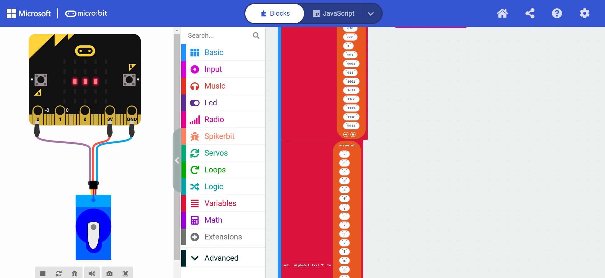

  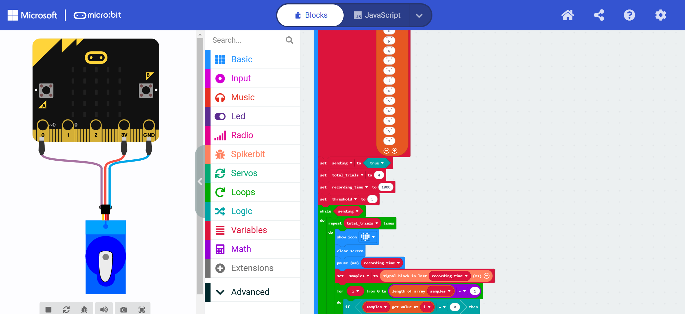

  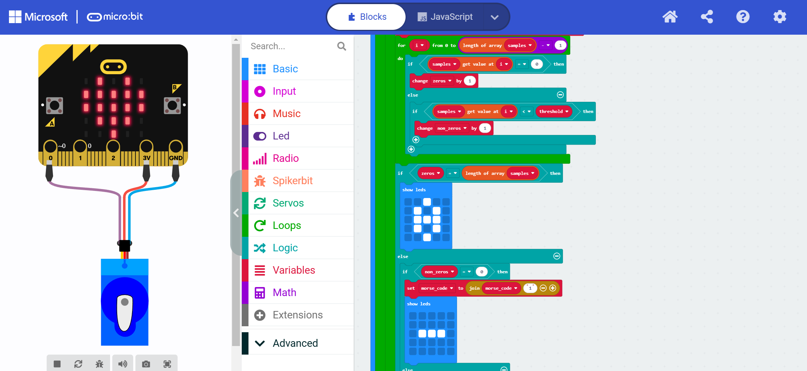

  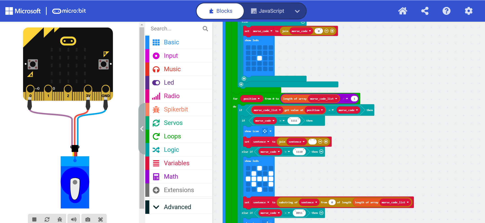

  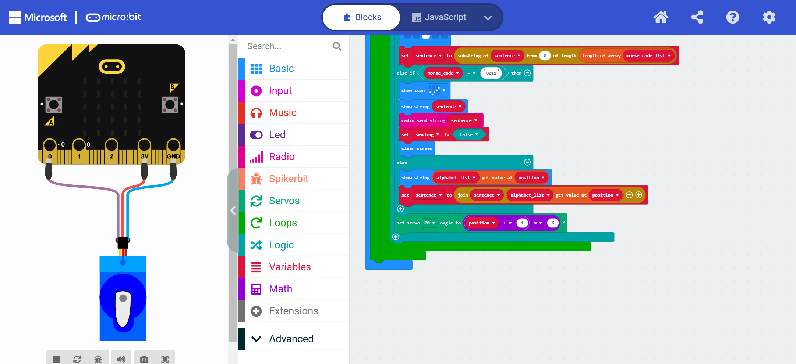

  </TabItem>

  <TabItem value="Python" label="Python" default>

  ```py title="NeuroTalk"
    def on_received_string(receivedString):
        if receivedString == "yes":
            basic.show_string(receivedString)
            servos.P0.set_angle((alphabet_list.index_of("y") + 1) * 6)
            basic.pause(500)
            servos.P0.set_angle((alphabet_list.index_of("e") + 1) * 6)
            basic.pause(500)
            servos.P0.set_angle((alphabet_list.index_of("s") + 1) * 6)
        elif receivedString == "no":
            basic.show_string(receivedString)
            servos.P0.set_angle((alphabet_list.index_of("n") + 1) * 6)
            basic.pause(500)
            servos.P0.set_angle((alphabet_list.index_of("o") + 1) * 6)
        basic.pause(500)
        servos.P0.set_angle(0)
    radio.on_received_string(on_received_string)

    sentence = ""
    samples: List[number] = []
    spikerbit.start_muscle_recording()
    radio.set_group(90)
    servos.P0.set_angle(0)
    morse_code_list = ["01",
        "1000",
        "1010",
        "100",
        "0",
        "0010",
        "110",
        "0000",
        "00",
        "0111",
        "101",
        "0100",
        "11",
        "10",
        "111",
        "0110",
        "1101",
        "010",
        "000",
        "1",
        "001",
        "0001",
        "011",
        "1001",
        "1011",
        "1100",
        "1111",
        "1110",
        "0011"]
    alphabet_list = ["a",
        "b",
        "c",
        "d",
        "e",
        "f",
        "g",
        "h",
        "i",
        "j",
        "k",
        "l",
        "m",
        "n",
        "o",
        "p",
        "q",
        "r",
        "s",
        "t",
        "u",
        "v",
        "w",
        "x",
        "y",
        "z"]
    sending = True
    total_trials = 4
    recording_time = 1000
    threshold = 5
    while sending:
        morse_code = ""
        for index in range(total_trials):
            basic.show_icon(IconNames.HEART)
            basic.clear_screen()
            basic.pause(recording_time)
            samples = spikerbit.signal_block(recording_time)
            non_zeros = 0
            zeros = 0
            i = 0
            while i <= len(samples) - 1:
                if samples[i] == 0:
                    zeros += 1
                else:
                    if samples[i] < threshold:
                        non_zeros += 1
                i += 1
            if zeros == len(samples):
                basic.show_leds("""
                    . . # . .
                    . # . # .
                    . # # # .
                    . # . # .
                    . . # . .
                    """)
            else:
                if non_zeros == 0:
                    morse_code = "" + morse_code + "1"
                    basic.show_leds("""
                        . . . . .
                        . . . . .
                        . # # # .
                        . . . . .
                        . . . . .
                        """)
                else:
                    morse_code = "" + morse_code + "0"
                    basic.show_leds("""
                        . . . . .
                        . . . . .
                        . . # . .
                        . . . . .
                        . . . . .
                        """)
        position = 0
        while position <= len(morse_code_list) - 1:
            if morse_code_list[position] == morse_code:
                if morse_code == "1111":
                    basic.show_icon(IconNames.SMALL_DIAMOND)
                    sentence = "" + sentence + " "
                elif morse_code == "1110":
                    basic.show_leds("""
                        . . # . .
                        . # . . #
                        # # # # #
                        . # . . #
                        . . # . .
                        """)
                    sentence = sentence.substr(0, len(morse_code_list))
                elif morse_code == "0011":
                    basic.show_icon(IconNames.YES)
                    basic.show_string(sentence)
                    radio.send_string(sentence)
                    sending = False
                    basic.clear_screen()
                else:
                    basic.show_string("" + (alphabet_list[position]))
                    sentence = "" + sentence + alphabet_list[position]
                servos.P0.set_angle((position + 1) * 6)
            position += 1
  ```
  </TabItem>

  <TabItem value="Js" label="Js">

  ```py title="NeuroTalk"
    radio.onReceivedString(function (receivedString) {
        if (receivedString == "yes") {
            basic.showString(receivedString)
            servos.P0.setAngle((alphabet_list.indexOf("y") + 1) * 6)
            basic.pause(500)
            servos.P0.setAngle((alphabet_list.indexOf("e") + 1) * 6)
            basic.pause(500)
            servos.P0.setAngle((alphabet_list.indexOf("s") + 1) * 6)
        } else if (receivedString == "no") {
            basic.showString(receivedString)
            servos.P0.setAngle((alphabet_list.indexOf("n") + 1) * 6)
            basic.pause(500)
            servos.P0.setAngle((alphabet_list.indexOf("o") + 1) * 6)
        }
        basic.pause(500)
        servos.P0.setAngle(0)
    })
    let sentence = ""
    let samples: number[] = []
    spikerbit.startMuscleRecording()
    radio.setGroup(90)
    servos.P0.setAngle(0)
    let morse_code_list = [
    "01",
    "1000",
    "1010",
    "100",
    "0",
    "0010",
    "110",
    "0000",
    "00",
    "0111",
    "101",
    "0100",
    "11",
    "10",
    "111",
    "0110",
    "1101",
    "010",
    "000",
    "1",
    "001",
    "0001",
    "011",
    "1001",
    "1011",
    "1100",
    "1111",
    "1110",
    "0011"
    ]
    let alphabet_list = [
    "a",
    "b",
    "c",
    "d",
    "e",
    "f",
    "g",
    "h",
    "i",
    "j",
    "k",
    "l",
    "m",
    "n",
    "o",
    "p",
    "q",
    "r",
    "s",
    "t",
    "u",
    "v",
    "w",
    "x",
    "y",
    "z"
    ]
    let sending = true
    let total_trials = 4
    let recording_time = 1000
    let threshold = 5
    while (sending) {
        let morse_code = ""
        for (let index = 0; index < total_trials; index++) {
            basic.showIcon(IconNames.Heart)
            basic.clearScreen()
            basic.pause(recording_time)
            samples = spikerbit.signalBlock(recording_time)
            let non_zeros = 0
            let zeros = 0
            for (let i = 0; i <= samples.length - 1; i++) {
                if (samples[i] == 0) {
                    zeros += 1
                } 
                else {
                    if (samples[i] < threshold) {
                        non_zeros += 1
                    }
                }
            }
            if (zeros == samples.length) {
                basic.showLeds(`
                    . . # . .
                    . # . # .
                    . # # # .
                    . # . # .
                    . . # . .
                    `)
            } else {
                if (non_zeros == 0) {
                    morse_code = "" + morse_code + "1"
                    basic.showLeds(`
                        . . . . .
                        . . . . .
                        . # # # .
                        . . . . .
                        . . . . .
                        `)
                } else {
                    morse_code = "" + morse_code + "0"
                    basic.showLeds(`
                        . . . . .
                        . . . . .
                        . . # . .
                        . . . . .
                        . . . . .
                        `)
                }
            }
        }
        for (let position = 0; position <= morse_code_list.length - 1; position++) {
            if (morse_code_list[position] == morse_code) {
                if (morse_code == "1111") {
                    basic.showIcon(IconNames.SmallDiamond)
                    sentence = "" + sentence + " "
                } else if (morse_code == "1110") {
                    basic.showLeds(`
                    . . # . .
                    . # . . #
                    # # # # #
                    . # . . #
                    . . # . .
                    `)
                    sentence = sentence.substr(0, morse_code_list.length)
                } else if (morse_code == "0011") {
                    basic.showIcon(IconNames.Yes)
                    basic.showString(sentence)
                    radio.sendString(sentence)
                    sending = false
                    basic.clearScreen()
                } else {
                    basic.showString("" + (alphabet_list[position]))
                    sentence = "" + sentence + alphabet_list[position]
                }
                servos.P0.setAngle((position + 1)  * 6)
            }
        }
    }
  ```
  </TabItem>
</Tabs>

### Receiver (Hand sign) code ###
<Tabs>
  <TabItem value="Block" label="Block Code">

  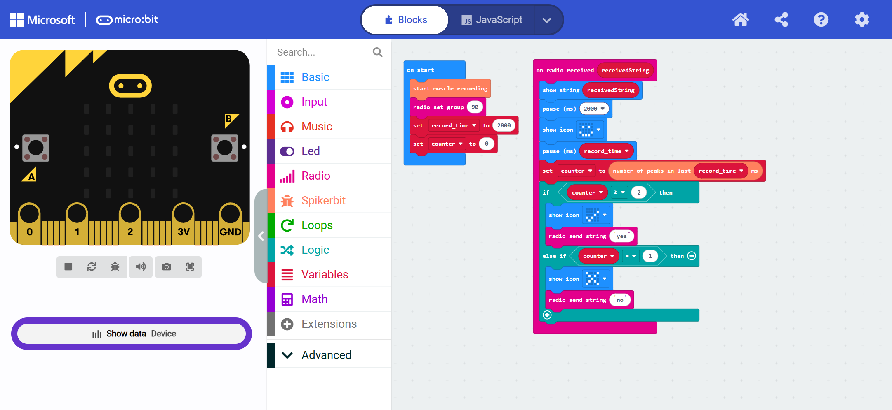

  </TabItem>

  <TabItem value="Python" label="Python" default>

  ```py title="NeuroTalk"
    def on_received_string(receivedString):
        global counter
        basic.show_string(receivedString)
        basic.pause(2000)
        basic.show_icon(IconNames.HAPPY)
        basic.pause(record_time)
        counter = spikerbit.num_peaks_in_last(record_time)
        if counter >= 2:
            basic.show_icon(IconNames.YES)
            radio.send_string("yes")
        elif counter == 1:
            basic.show_icon(IconNames.NO)
            radio.send_string("no")
    radio.on_received_string(on_received_string)

    counter = 0
    record_time = 0
    spikerbit.start_muscle_recording()
    radio.set_group(90)
    record_time = 2000
    counter = 0

  ```
  </TabItem>

  <TabItem value="Js" label="Js">

  ```py title="NeuroTalk"
    radio.onReceivedString(function (receivedString) {
        basic.showString(receivedString)
        basic.pause(2000)
        basic.showIcon(IconNames.Happy)
        basic.pause(record_time)
        counter = spikerbit.numPeaksInLast(record_time)
        if (counter >= 2) {
            basic.showIcon(IconNames.Yes)
            radio.sendString("yes")
        } else if (counter == 1) {
            basic.showIcon(IconNames.No)
            radio.sendString("no")
        }
    })
    let counter = 0
    let record_time = 0
    spikerbit.startMuscleRecording()
    radio.setGroup(90)
    record_time = 2000
    counter = 0

  ```
  </TabItem>
</Tabs>

## Operating Instructions ##
Now that your device is ready, it's time to use it!

1. Power On: Turn on both spiker:bit devices.
2. Input Morse Code: Every second after you see the "Heart" displayed on the screen "type” the Morse code you want to send using the proper arm movement. If the code length is shorter than four characters, ensure you “type” an “empty  code” at the end to complete the sequence.
3. Send Command: After entering your message, use the “send command” to transmit it to the receiver.
4. Receive the Code: The receiver (second micro:bit) should receive the sender’s message if everything is set up correctly.
5. Respond: The receiver should respond by performing a “yes” or “no” action as demonstrated in the accompanying [video](https://www.youtube.com/watch?v=zKDPRl7Vv0I).
6. Verify Response: The sender should confirm that the correct response was received from the receiver.

### Understanding correct arm movement - Morse Code ###
In this project, there are three different morse code you can perform

- Dot: Flexing the arm once.
- Dash: Tightening the arm.
- Empty: Do nothing

:::tip
The system uses International Standard Morse Code for the alphabet only. Use [this](https://en.wikipedia.org/wiki/Morse_code) as a reference to choose each code

### Special Commands -Morse Code ### 
For this project, some specific codes allow special actions:

    ---- (dash, dash, dash, dash): Add a space.

    ---• (dash, dash, dash, dot): Delete the last character.

    ••-- (dot, dot, dash, dash): Send the combined message.

### Practice Makes Perfect ###
As you practice using the Neuro:Talk, you'll become more adept at controlling the output, ensuring that your ASL gestures are accurately represented.


### Customizing Your Neuro:Talk Device (Future Work) ###
You can further enhance your device with additional features:

#### Multiple Output Modes ####
- **Visual Mode:** Use the LED display for quiet environments.
- **Auditory Mode:** Use the buzzer for audible communication.
- **Kinetic Mode:** Use the rotating pointer for a more tactile feedback option.

#### Advanced EMG Mapping ####
- Explore more complex ASL gestures and map them to longer Morse code sequences.
- Integrate additional sensors for more nuanced control and feedback.

<!-- ## Conclusion
Congratulations on building and programming your Neuro:Talk device! By translating ASL gestures into Morse code, you've created a unique bridge between physical expression and digital communication. Keep exploring, customizing, and sharing your innovations with the world! -->
