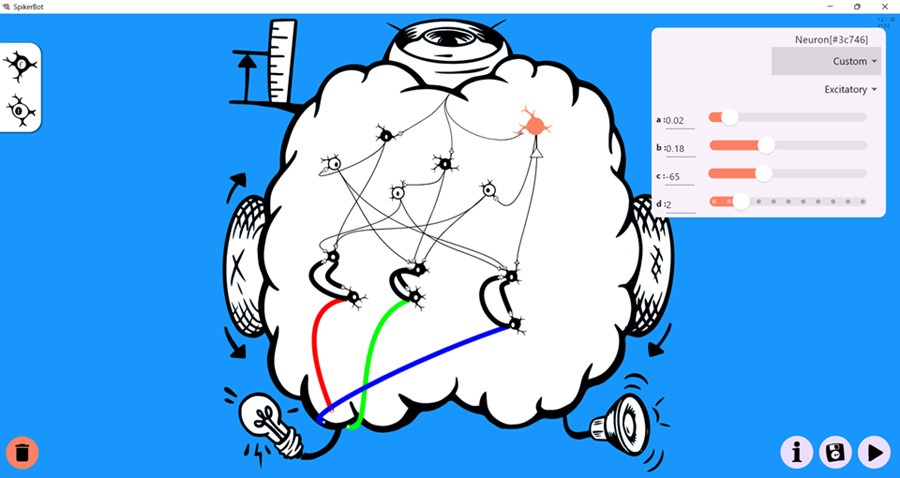
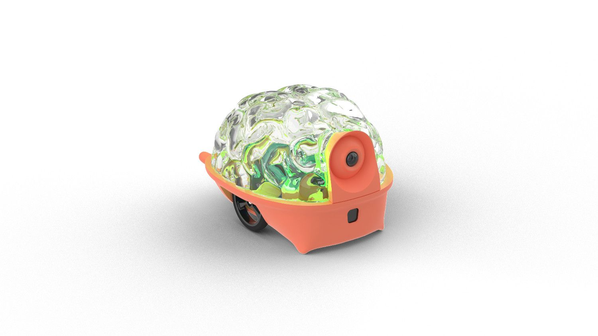
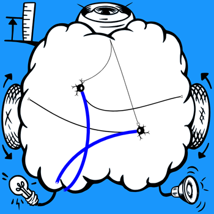
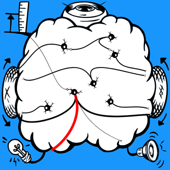
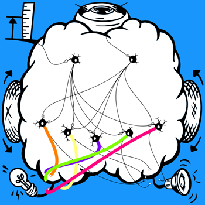
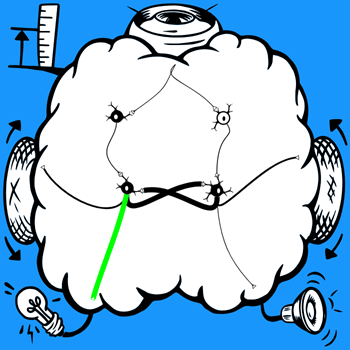
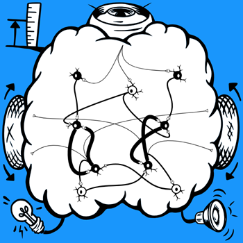
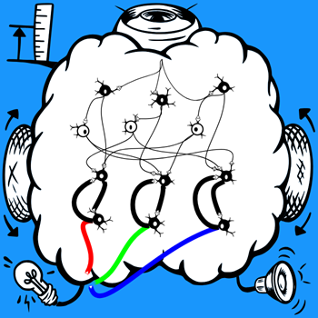

# SpikerBot (Pre-Release)

SpikerBot combines a brain design studio with a palm-sized neurorobot, letting learners assemble spiking neural circuits into brain models that see, hear, move, blink, and beep.

**Built for classrooms.** SpikerBot translates complex brain science into an affordable, hands-on robot that lets students model neural circuits, see neural activity drive behavior, and build skills that underpin modern neurotechnology, nervous system medicine, and neuromorphic AI. A comprehensive Educator Guide is [available here](https://docs.google.com/document/d/1oXikyqRCtVB5v14tVTGo33vpU35DI2Epp3mq0EWGmEI).

---

## Get the App

[Download the SpikerBot App](https://robot.backyardbrains.com) — available for Windows, macOS, iOS, Android, and Chrome OS.

When the app opens, you’ll see a brain-shaped canvas. Drag **black (excitatory)** or **white (inhibitory)** neurons onto the canvas, wire them up, and press **Play** to run the network.

---

### Design Mode

---

### Live Mode

---

## Hardware at a Glance

SpikerBot is powered by an ESP32-S3 microcontroller with Wi-Fi and Bluetooth, running on four AA batteries. Its sensor suite includes:

- 320 × 240 forward-facing RGB camera  
- Microphone (mono, 8-bit PCM)  
- Infrared distance sensor (~1 m range)  

Output devices include:

- Two differential drive motors (left and right wheels)  
- Four independently addressable RGB LEDs  
- PWM tone speaker with PCM audio playback  

The robot communicates wirelessly with the app via 2.4 GHz Wi-Fi for real-time control.

| Sensor / Effector     | Specification                          |
|----------------------|--------------------------------------|
| **RGB Camera**       | 320 × 240 px, forward-facing          |
| **Distance Sensor**  | Infrared (IR), approx. 1 meter range  |
| **Microphone**       | Mono, 8-bit PCM stream                 |
| **Motors**           | Differential drive (left/right wheels)|
| **RGB LEDs**         | Four individually programmable LEDs    |
| **Speaker**          | PWM tone + PCM audio output            |
| **MCU**              | ESP32-S3 dual-core with Wi-Fi + BLE   |
| **Power**            | 4 × AA batteries                       |

The ESP32 handles all sensing and actuation, while the neural simulation runs on your paired device and sends commands to the robot in real time.

---

## Getting Started

1. **Power On:** Flip the switch located on the underside of the robot.  
2. **Connect:** On your computer or tablet, connect to the robot’s Wi-Fi network (SSID printed on the robot).  
3. **Wait:** The robot’s LEDs will turn **green** when ready.  
4. **Launch the App:** Open the SpikerBot app, load or build a brain, and press **Play** to start controlling the robot.

---

## Inside the App

The SpikerBot App provides an interactive workspace shaped like a brain where you design **embodied** spiking neural networks.  

- **Drag & Drop:** Add excitatory (black) or inhibitory (white) neurons onto the canvas.  
- **Connect:** Draw synaptic connections by dragging from neuron outputs (axon handles) to neuron inputs or effectors.  
- **Tune:** Click any neuron to adjust properties such as firing type (Quiet, Burst, Custom) and polarity (Excitatory/Inhibitory).  
- **Play:** Run the network and watch your robot respond in real time.  
- **Save:** Brain designs can be saved or loaded in a portable JSON .brain format for sharing or further editing.

Neurons fire discrete spikes simulated by the biologically inspired Izhikevich model. Synapse weights (1-100) set connection strength: weights over ~25 ensure reliable activation; weights near 90+ create persistent feedback loops (similar to short-term memory).

  

---

## Neural Circuit Building Blocks

Common neural circuit motifs you’ll use include:

* **Reflex Arc:** Direct sensor-to-effector connection producing simple stimulus-response behavior.  
* **Crossed Circuit:** Connects left sensor to right motor and vice versa, enabling turning behaviors.  
* **Synaptic Integration:** Multiple weak inputs (e.g. synapse strength ≤15) converge on a neuron that fires only when inputs coincide.  
* **Recurrent Excitation:** Strong feedback loops (e.g. synapse strength ≥90) maintain neuron activity beyond the initial stimulus.  
* **Lateral Inhibition:** Competing neurons inhibit each other, enabling decision-making by allowing only one behavior at a time.

  

---

## How to Design Brains

1. **Define:** Specify the desired robot behavior in observable terms.  
2. **Decompose:** Break the behavior into smaller sub-tasks.  
3. **Draft:** Build neural circuits (motifs) corresponding to each sub-task.  
4. **Inhibit:** Use inhibitory neurons to prevent conflicting behaviors.  
5. **Test and Refine:** Observe robot behavior, identify issues, and iteratively improve your network.

---

## Brain Library

### Starter Pack

Kickstart your SpikerBot exploration with pre‑configured example brains:

1. **Download** the [Starter Pack](./static/brains/brains.zip).  
2. **Unzip** the contents into your local `Documents/SpikerBot/text` directory.  
3. **Load** them in the app via the Load / disk icon, then choose any `.brain` file to run instantly.

---

### Example Brains

**Brain: Go To Blue**
- **Neurons:** 2 (Excitatory)
- **Circuits/Motifs:** Crossed Circuit / Braitenberg Vehicle
- **Behavior:** Approaches a colored object (e.g., blue).
- **How it works:** This brain uses two quiet, excitatory neurons configured as sensory neurons. Each neuron is tuned to detect the color blue in one half of the visual field (left or right). The circuit is crossed: the left sensor neuron activates the right motor, and the right sensor neuron activates the left motor. This simple but powerful design, known as a Braitenberg Vehicle, causes the robot to automatically turn toward and approach the blue stimulus.

- **Download:** [go2blue@@@@@@1759956138247953.brain](./static/brains/go2blue@@@@@@1759956138247953.brain) (save to `Documents/SpikerBot/text`)

---

**Brain: Explorer**
- **Neurons:** 7 (Excitatory)
- **Circuits/Motifs:** Central Pattern Generator
- **Behavior:** Explores autonomously and wanders without getting stuck.
- **How it works:** This brain uses six spontaneously active ("bursting") neurons that fire at random intervals to activate the motors, creating a wandering movement. A separate, seventh quiet neuron is configured as a distance detector. When the robot gets too close to an object, this neuron strongly activates backward movement, allowing the robot to avoid getting stuck.
- **Download:** [explorer@@@@@@1759956215207504.brain](./static/brains/explorer@@@@@@1759956215207504.brain) (save to `Documents/SpikerBot/text`)

---

**Brain: Greet Nearby People**
- **Neurons:** 7 (Excitatory)
- **Circuits/Motifs:** Synaptic Integration, Object Classification
- **Behavior:** Blinks lights and beeps, but only when it detects a person at a medium distance.
- **How it works:** This brain solves a complex detection problem using synaptic integration. Two quiet sensory neurons are created: one that fires when it detects a "person" and another that fires when an object is at a "medium distance". Both of these neurons connect to five output neurons that control the LEDs and speaker. The key is that the synaptic weights from the sensory neurons are set to be very weak (e.g., a weight of 15). Because a single weak input isn't enough to make a neuron fire, the output neurons will only activate when they receive signals from both sensory neurons at the same time. This makes the robot respond only when a person is nearby.
- **Download:** [greetnearbypeople@@@@@@1761145457770009.brain](./static/brains/greetnearbypeople@@@@@@1761145457770009.brain) (save to `Documents/SpikerBot/text`)

---

**Brain: Go-NoGo**
- **Neurons:** 4 (3 Excitatory, 1 Inhibitory)
- **Circuits/Motifs:** Recurrent Excitation (Feedback Loop)Behavior/What it does: The robot starts moving forward when it sees a "go" signal (green) and continues to move even after the signal is gone. It stops moving when it sees a "stop" signal (red).
- **How it works:** This brain is built in three parts:
1) The Memory Loop: Two excitatory neurons are connected in a strong positive feedback loop, strongly activating each other. To sustain this activity, their synaptic weights must be very high (e.g., >=90). These neurons are connected to the forward motors.
2) The 'Go' Trigger: A third excitatory sensory neuron detects green. It sends an activation signal to the memory loop, "flipping the switch" on.
3) The 'Stop' Trigger: A fourth, inhibitory sensory neuron detects red. When activated, it silences the neurons in the memory loop, breaking the feedback cycle and stopping the robot.
- **Download:** [gonogo@@@@@@1761237975410720.brain](./static/brains/gonogo@@@@@@1761237975410720.brain) (save to `Documents/SpikerBot/text`)

---

**Brain: Left Or Right**
- **Neurons:** 9 (6 Excitatory, 3 Inhibitory)
- **Circuits/Motifs: Recurrent Excitation, Lateral Inhibition
- **Behavior:** Makes a "winner-take-all" decision between two conflicting commands and stops with a third. Seeing green makes it spin left; seeing blue makes it spin right. Seeing red stops all movement.
- **How it works:** This brain demonstrates how to manage multiple actions using three key motifs:
Recurrent Excitation: It contains two independent recurrent excitatory circuits (like in Lesson 2) that act as "memory" for an action. Circuit A is activated by a green-detecting sensor to make the robot turn left, while Circuit B is activated by a blue-detecting sensor to turn right.
Lateral Inhibition: To force a "winner-take-all" decision, the circuits are wired to compete. Circuit A activates an inhibitory neuron that targets and silences Circuit B, and Circuit B does the reverse. This ensures only one of the two "turn" commands can be active at a time.
Inhibitory "Stop" Signal: A third, inhibitory sensory neuron detects red and is wired to silence both recurrent circuits, stopping all movement.
- **Download:** [leftorright@@@@@@1760105706777562.brain](./static/brains/leftorright@@@@@@1760105706777562.brain) (save to `Documents/SpikerBot/text`)

---

**Brain: Chameleon**
- **Neurons:** 12 (9 excitatory, 3 inhibitory)
- **Circuits/Motifs:** Recurrent Excitation, Lateral Inhibition
- **Behavior/What it does:** Reproduces the last observed color
- **How it works:** There are three recurrent excitatory circuits. Each is activated by a color and makes the LED shine that same. Each circuit also inhibits all the other circuits.
- **Download:** [chameleon@@@@@@1760105193131480.brain](./static/brains/chameleon@@@@@@1760105193131480.brain) (save to `Documents/SpikerBot/text`)

---

## Troubleshooting

| Symptom                 | Suggested Fix                                               |
|-------------------------|-------------------------------------------------------------|
| Robot silent or immobile | Check power and battery status.                              |
| Wi-Fi won’t connect      | Toggle Play in app, confirm SSID, wait for LEDs to turn green. |
| No movement             | Ensure wheels are attached properly and unobstructed.       |
| Color mis-detection      | Improve lighting conditions and check camera view.          |

---

