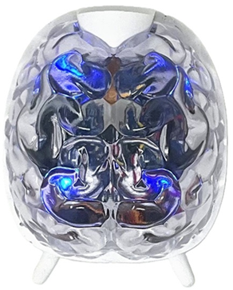

# SpikerBot (Pre-Release)

SpikerBot combines a brain design studio with a palm‑sized neurorobot, letting learners assemble spiking neural circuits into brain models that see, hear, move, blink, and beep.

> **Built for classrooms.** SpikerBot translates complex brain science into an affordable, hands‑on robot that lets students *model neural circuits, see neural activity drive behaviour, and build skills that underpin modern neurotechnology, nervous system medicine and neuromorphic AI.*

---

## Get the App

[Download the SpikerBot App](https://robot.backyardbrains.com) — Windows, macOS, iOS, Android, and Chrome.

When the app opens you’ll see a brain‑shaped canvas. Drag **black (excitatory)** or **white (inhibitory)** neurons, wire them up, and press **Play** to run the network.

---

**Design Mode (Paused)**
 

---

**Live Brain Mode**
 

---

## Hardware at a Glance

| Sensor / Effector    | Spec                                  |
|----------------------|---------------------------------------|
| **RGB Camera**       | 320 × 240 px, forward‑facing          |
| **Distance Sensor**  | IR, ≈ 1 m range                       |
| **Microphone**       | Mono, 8‑bit PCM stream               |
| **Motors**           | Differential, fwd/back on L & R       |
| **RGB LEDs**         | Four addressable                      |
| **Speaker**          | PWM tone + PCM                        |
| **MCU**              | ESP32‑S3 (Wi‑Fi + BLE)                |
| **Power**            | 4 × AA                                  |

The ESP32 handles sensing and actuation; neural simulation runs in the app over 2.4 GHz Wi‑Fi.

---

## Getting Started

1. **Power on** – flip the underside switch.  
2. **Connect** – join the Wi‑Fi SSID printed on the robot.  
3. **Wait** – LEDs turn **green** when ready.  
4. **Launch the App**, load or build a brain, press **Play**.

---

## Inside the App

* **Drag & Drop** neurons into the workspace.  
* **Connect** using the triangular axon handle.  
* **Tune** neuron type (Quiet, Burst, Custom) and polarity (Excite, Inhibit).  
* **Play** – spikes animate; the robot responds. (If the robot stays green and immobile, click **Pause** then **Play** to reset the Wi‑Fi link).

Under the hood SpikerBot uses the *Izhikevich* model. Synapse weights 1‑100 set strength: > 25 is reliable; > 90 forms persistent loops akin to short‑term memory.  
*(**Synapse weight guide:** 1‑10 “Whisper”, 11‑24 “Nudge”, 25‑50 “Reliable”, 51‑90 “Strong”, 91‑100 “Lock‑in”.)*

---

## Neural‑Circuit Building Blocks

* **Reflex Arc** – sensor drives effector directly.  
* **Crossed Circuit** – left sensor to right motor (steering).  
* **Synaptic Integration** – weak converging inputs act as a coincidence detector (< 10).
* **Recurrent Excitation** – strong feedback (> 90) stores state.  

* **Mutual Inhibition** – competing loops enable decisions.  

---

## How to Design Brains

1. **Define** an observable goal.  
2. **Decompose** into functional subtasks.  
3. **Draft** a motif for each task.  
4. **Use Inhibition** to resolve conflicts.  
5. **Test → Refine** using spikes and behavior.

---

## Brain Library

### Starter Pack

[Download the starter set of example brains](./static/brains/all-brains.zip) – six ready‑to‑run `.brain` files in one ZIP.  
Unzip into **`Documents/SpikerBot/text`** and choose **File → Load** inside the app.

---

### New Brains

---

#### Tracker — Retinotopic Smooth Pursuit

* **Connectome:** 17 neurons (all excitatory) · 8 synapses  
* **What it does:** Keeps a moving green object centered by mapping nine horizontal retinal zones to graded left/right motor speeds, yielding smooth pursuit rather than lurchy zig‑zagging.
* **How it works:** Tracker contains a retinotopic map representing 9 distinct horizontal positions of a visual target (green). Each position triggers a contralateral movement proportional to its distance from the center. This makes the robot’s orienting response smoother than a classical 2-neuron "[Braitenberg vehicle](https://en.wikipedia.org/wiki/Braitenberg_vehicle)". The brain illustrates how to scale motor output proportional to the eccentricity of a stimulus in the visual field, mimicking *population coding* in the vertebrate oculomotor system.
* **Concept links:** Bridges to *proportional–derivative* control in robotics, and to cerebellar deficits where pursuit becomes saccadic (e.g., in spinocerebellar ataxia). Also an intro to continuous‑valued representations used in deep‑RL visual‑servo agents.

* [Download this brain as a .brain file](./static/brains/Tracker@@@@@@1746208384489279.brain)

---

#### Two‑Mood Pet - Bistable Model Demo
 
* **Connectome:** 30 neurons (25 excitatory / 5 inhibitory) · 49 synapses  
* **How it works:** TwoMoodPet has two "moods" - Curious and Sleepy - controlled by two mutually inhibitory recurrent circuits, a neural motif analogous to the *sleep–wake switch* between the ventrolateral pre‑optic nucleus and arousal centers in the human hypothalamus. When curious, TwoMoodPet explores autonomously, and if it encounters colorful objects, it inhibits exploration and approaches the color instead. When sleepy, TwoMoodPet produces a pulsing blue light and occasional low tone (snoring). If its distance sensor is activated, it stops sleeping, blinks red, beeps angrily, and moves away until it finds an undisturbed place to sleep. Seeing a coffee cup makes TwoMoodPet curious; seeing a sofa makes it sleepy. This brain illustrates how distinct, clearly recognizable behaviors can be achieved and hosted in the same brain.  
* **Concept links:** Great springboard to talk about *bistability* in neuroscience (e.g., epileptic focus, Parkinsonian on/off states) and how similar latching circuits appear in robotics as finite‑state machines.

* [Download this brain as a .brain file](./static/brains/TwoMoodPet@@@@@@1746977028089230.brain)

---

## Troubleshooting

| Symptom                | Fix                                                                    |
|------------------------|------------------------------------------------------------------------|
| **Robot silent / immobile** | Check power & batteries.                                              |
| **Wi‑Fi won’t connect**     | Toggle **Play** in the app; confirm SSID; wait for LEDs → green.     |
| **No movement**            | Ensure wheels are seated.                                             |
| **Color mis‑detect**       | Improve lighting; inspect camera feed.                                |

---

### Next Steps

* Tweak synapse weights - feel how reliability and memory emerge.  
* Combine circuits to craft your own brain - then share it back!
