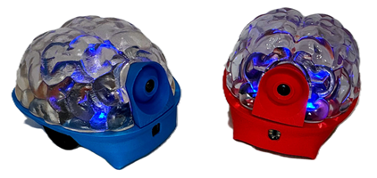
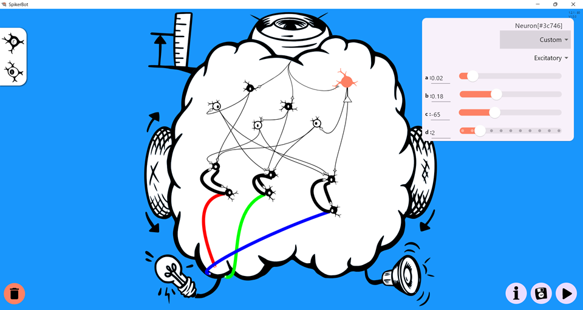
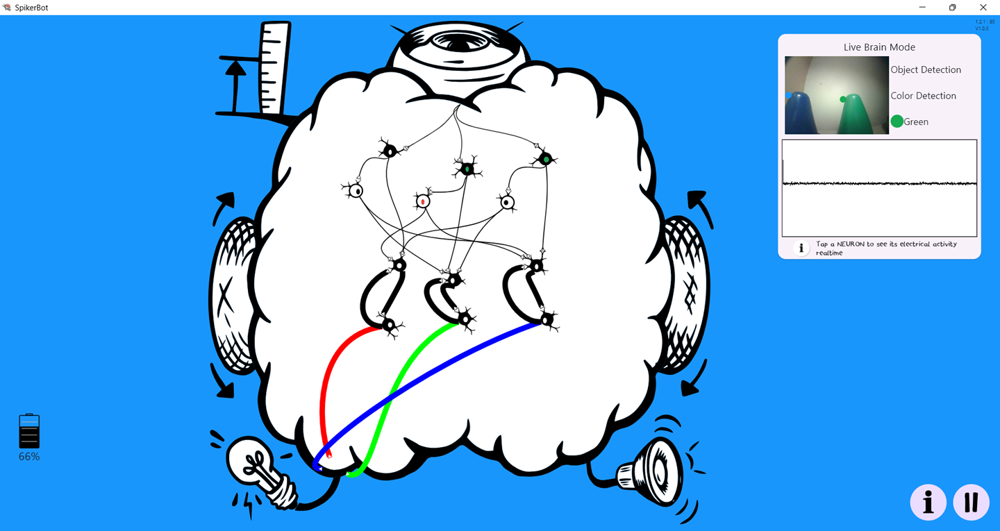
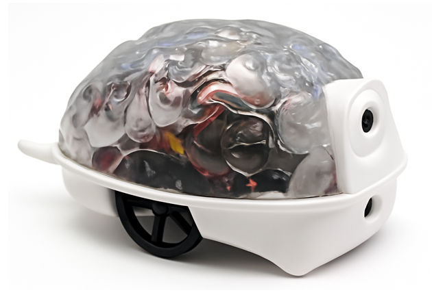
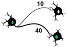
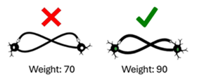
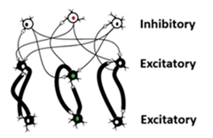
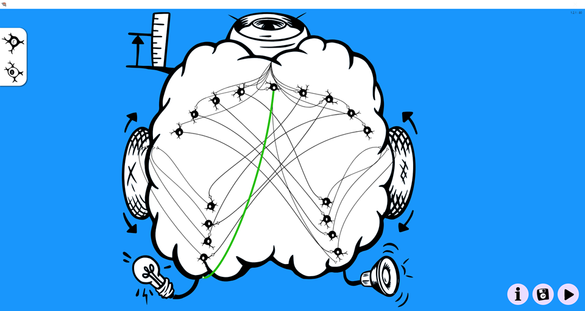
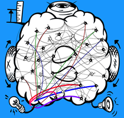

# SpikerBot (Pre-Release)

SpikerBot combines a brain design studio with a palm-sized neurorobot, letting learners assemble spiking neural circuits into brain models that see, hear, move, blink, and beep.

> **Built for classrooms.** SpikerBot translates complex brain science into an affordable, hands-on robot that lets students *model neural circuits, see neural activity drive behavior, and build skills* that underpin modern neurotechnology, nervous system medicine, and neuromorphic AI.

---

## Get the App

[Download the SpikerBot App](https://robot.backyardbrains.com) — available for Windows, macOS, iOS, Android, and Chrome OS.

When the app opens, you’ll see a brain-shaped canvas. Drag **black (excitatory)** or **white (inhibitory)** neurons onto the canvas, wire them up, and press **Play** to run the network.

---

### Design Mode (Paused)

---

### Live Brain Mode

---

## Hardware at a Glance

SpikerBot is powered by an ESP32-S3 microcontroller with Wi-Fi and Bluetooth, running on four AA batteries. Its sensor suite includes:

- 320 × 240 forward-facing RGB camera  
- Microphone (mono, 8-bit PCM)  
- Infrared distance sensor (~1 m range)  

Output devices include:

- Two differential drive motors (left and right wheels)  
- Four independently addressable RGB LEDs  
- PWM tone speaker with PCM audio playback  

The robot communicates wirelessly with the app via 2.4 GHz Wi-Fi for real-time control.

| Sensor / Effector     | Specification                          |
|----------------------|--------------------------------------|
| **RGB Camera**       | 320 × 240 px, forward-facing          |
| **Distance Sensor**  | Infrared (IR), approx. 1 meter range  |
| **Microphone**       | Mono, 8-bit PCM stream                 |
| **Motors**           | Differential drive (left/right wheels)|
| **RGB LEDs**         | Four individually programmable LEDs    |
| **Speaker**          | PWM tone + PCM audio output            |
| **MCU**              | ESP32-S3 dual-core with Wi-Fi + BLE   |
| **Power**            | 4 × AA batteries                       |

The ESP32 handles all sensing and actuation, while the neural simulation runs on your paired device and sends commands to the robot in real time.

---

## Getting Started

1. **Power On:** Flip the switch located on the underside of the robot.  
2. **Connect:** On your computer or tablet, connect to the robot’s Wi-Fi network (SSID printed on the robot).  
3. **Wait:** The robot’s LEDs will turn **green** when ready.  
4. **Launch the App:** Open the SpikerBot app, load or build a brain, and press **Play** to start controlling the robot.

---

## Inside the App

The SpikerBot App provides an interactive workspace shaped like a brain where you design **embodied** spiking neural networks.  

- **Drag & Drop:** Add excitatory (black) or inhibitory (white) neurons onto the canvas.  
- **Connect:** Draw synaptic connections by dragging from neuron outputs (axon handles) to neuron inputs or effectors.  
- **Tune:** Click any neuron to adjust properties such as firing type (Quiet, Burst, Custom) and polarity (Excitatory/Inhibitory).  
- **Play:** Run the network and watch your robot respond in real time.  
- **Save:** Brain designs can be saved or loaded in a portable JSON .brain format for sharing or further editing.

Neurons fire discrete spikes simulated by the biologically inspired Izhikevich model. Synapse weights (1-100) set connection strength: weights over ~25 ensure reliable activation; weights near 90+ create persistent feedback loops (similar to short-term memory).

  

---

## Neural Circuit Building Blocks

Common neural circuit motifs you’ll use include:

* **Reflex Arc:** Direct sensor-to-effector connection producing simple stimulus-response behavior.  
* **Crossed Circuit:** Connects left sensor to right motor and vice versa, enabling turning behaviors.  
* **Synaptic Integration:** Multiple weak inputs converge on a neuron that fires only when inputs coincide.  
* **Recurrent Excitation:** Feedback loops maintain neuron activity beyond the initial stimulus.  
* **Mutual Inhibition:** Competing neurons inhibit each other, enabling decision-making by allowing only one behavior at a time.

  

---

## How to Design Brains

1. **Define:** Specify the desired robot behavior in observable terms.  
2. **Decompose:** Break the behavior into smaller sub-tasks.  
3. **Draft:** Build neural circuits (motifs) corresponding to each sub-task.  
4. **Inhibit:** Use inhibitory neurons to prevent conflicting behaviors.  
5. **Test and Refine:** Observe robot behavior, identify issues, and iteratively improve your network.

---

## Brain Library

### Starter Pack

Kickstart your SpikerBot exploration with six pre‑configured example brains:

1. **Download** the [Starter Pack (all-brains.zip)](./static/brains/all-brains.zip).  
2. **Unzip** the contents into your local `Documents/SpikerBot/text` directory.  
3. **Load** them in the app via **File → Load**, then choose any `.brain` file to run instantly.

---

### Featured Example Brains

#### Tracker — Retinotopic Smooth Pursuit

- **Neurons:** 17 (all excitatory)  
- **Function:** Keeps a moving green object centered by mapping nine horizontal “retinal” zones to differential wheel speeds, producing smooth, continuous tracking rather than zig-zag turns.  
- **Download:** [Tracker.brain](./static/brains/Tracker@@@@@@1746208384489279.brain)

---

#### Two-Mood Pet — Bistable State Model

- **Neurons:** 30 (25 excitatory, 5 inhibitory)  
- **Function:** Simulates two behavioral “moods” (Curious vs. Sleepy) using mutually inhibitory recurrent loops, illustrating rapid state switching akin to biological sleep–wake mechanisms.  
- **Download:** [Two-Mood Pet.brain](./static/brains/TwoMoodPet@@@@@@1746977028089230.brain)

---

## Troubleshooting

| Symptom                 | Suggested Fix                                               |
|-------------------------|-------------------------------------------------------------|
| Robot silent or immobile | Check power and battery status.                              |
| Wi-Fi won’t connect      | Toggle Play in app, confirm SSID, wait for LEDs to turn green. |
| No movement             | Ensure wheels are attached properly and unobstructed.       |
| Color mis-detection      | Improve lighting conditions and check camera view.          |

---

## Next Steps

- Experiment with synapse weights to feel the emergence of reliable and memory-like behaviors.  
- Combine neural circuits to build custom brains, then share your creations with the community!

