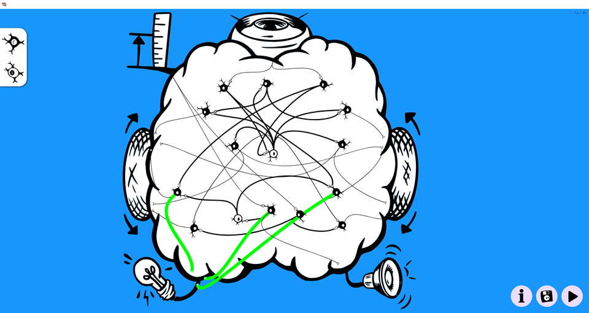
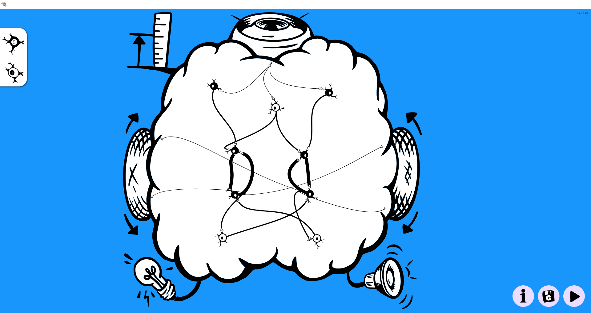

# SpikerBot

SpikerBot is an educational robot **and** a browser‑based app that together let you design, simulate, and deploy spiking‑neural‑network “brains” in the real world.  
Use the app to build networks; the robot brings them to life.

---

## Get the App

[Download the SpikerBot App](https://robot.backyardbrains.com) for Windows, macOS, iOS, Android, and Chrome.  
When it starts, you’ll see a brain‑shaped workspace where you can drag **black (excitatory)** or **white (inhibitory)** neurons, connect them, and press **Play** to run the network.

---

## Hardware at a Glance

| Sensor / Effector | Details |
|-------------------|---------|
| **RGB Camera**    | 320 × 240 pixels, forward‑facing |
| **Distance Sensor** | Infra‑red, up to ≈ 1 m |
| **Microphone**    | Mono, 8‑bit PCM stream |
| **Motors**        | Differential drive, fwd/back on L & R |
| **RGB LEDs**      | Four individually addressable |
| **Speaker**       | PWM‑driven tone & PCM playback |
| **MCU**           | ESP32‑S3 (Wi‑Fi + BLE) |
| **Power**         | 4 × AA batteries |

The ESP32 handles sensing and actuation while the heavy neural simulation runs in the app over 2.4 GHz Wi‑Fi.

---

## Getting Started

1. **Power on** – flip the switch underneath.  
2. **Connect** – join the Wi‑Fi network printed on the robot.  
3. **Wait** – LEDs turn **green** when the link is ready.  
4. **Launch the App** and press **Play** to stream your brain.

---

## Inside the App

* **Drag & Drop** neurons from the toolbar into the workspace.  
* **Connect** them by pulling the small triangle under each neuron to a target.  
* **Tune** neuron type (quiet, burst, custom) and polarity (excite/inhibit).  
* **Press Play** – the network spikes, the robot moves.

Neurons use the biologically inspired *Izhikevich* model; synapse weights 1‑100 control connection strength. Weights above 25 reliably activate targets, while weights above 90 create persistent activity that functions like short‑term memory.

---

## Neural‑Circuit Building Blocks

* **Reflex Arc** – stimulus directly activates an effector.  
* **Crossed Circuit** – left sensor drives right motor (and vice versa) for steering.  
* **Synaptic Integration** – weak converging inputs act as a coincidence detector (< 10).  
* **Recurrent Excitation** – strong feedback (> 90) stores state.  
* **Mutual Inhibition** – competing circuits enable decisions.

  

---

## How to Design Brains

1. **Define** the goal in observable terms.  
2. **Decompose** into functional sub‑tasks (e.g., “detect obstacle”).  
3. **Draft** a circuit motif for each task.  
4. **Use Inhibition** to arbitrate between conflicting outputs.  
5. **Test → Refine**, watching both spikes and robot behavior.

---

## Brain Library

Download a starter set of brains, then drop the `.brain` files into `Documents/SpikerBot/text`:

[Download All Brains](./static/brains/all-brains.zip)

---

**Find Green**

*Download:* [`search_green_v1@@@@@@1742661415644459.brain`](./static/brains/Find-Green@@@@@@1745279789457094.brain)

This brain contains **10 neurons** (9 excitatory / 1 inhibitory) and **11 synapses**. Probable function: **Exploratory / composite**.

The brain explores until it finds something green.

---

**Two Mood Pet**

*Download:* [`TwoMoodPet@@@@@@1746977028089230.brain`](./static/brains/Two-Mood-Pet@@@@@@1746977028089230.brain)

This brain contains **30 neurons** (25 excitatory / 5 inhibitory) and **49 synapses**. Probable function: **Persistent / memory loop**. 

TwoMoodPet has two “moods” — Curious and Sleepy — controlled by two mutually inhibitory recurrent circuits. When curious, TwoMoodPet explores autonomously, and if it encounters colorful objects, it inhibits exploration and approaches the color instead. When sleepy, TwoMoodPet produces a pulsing blue light and occasional low tone (snoring). If its distance sensor is activated, it stops sleeping, blinks red, beeps angrily, and moves away until it finds an undisturbed place to sleep. Seeing a coffee cup makes TwoMoodPet curious; seeing a sofa makes it sleepy. This brain illustrates how distinct, clearly recognizable behaviors can be achieved and hosted in the same brain. Create new personalities by combining other moods (playful, hungry...).

---

**Left or Right**

*Download:* [`leftright_v2@@@@@@1742658981614537.brain`](./static/brains/Left-Or-Right@@@@@@1746975758682269.brain)

This brain contains **6 neurons** (4 excitatory / 2 inhibitory) and **8 synapses**. 

The brain starts turning left if it sees green and right if it sees blue. Stops turning if it sees red. Change the stimuli the brain responds to, and its outputs, to adapt it to its environment.

---

**Tracker**

*Download:* [`Tracker@@@@@@1746208384489279.brain`](./static/brains/Tracker@@@@@@1746208384489279.brain)

This brain contains **17 neurons** (17 excitatory / 0 inhibitory) and **8 synapses**.

Tracker contains a retinotopic map representing 9 distinct horizontal positions of a visual target (green). Each position triggers a contralateral movement proportional to its distance from the center. This makes the robot’s orienting response smoother and more effective than our usual 2‑neuron Braitenberg vehicle. The brain illustrates what’s possible with graded rather than binary neural responses to sensory input.

---

## Troubleshooting

| Symptom | Fix |
|---------|-----|
| **Robot silent / immobile** | Verify power and battery charge. |
| **Wi‑Fi won’t connect** | Pause ↔ Play in the app; confirm SSID and wait for LEDs → green. |
| **No movement** | Check wheels/tires are seated |
| **Camera mis‑detects colors** | Improve lighting; inspect the live feed in the app. |

---

### Next Steps

* Tweak synapse weights to feel how reliability and memory emerge.  
* Combine building blocks to create *your* behavior – then share it back!

