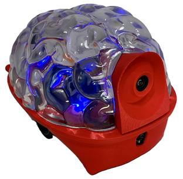

# SpikerBot (Pre-Release)

SpikerBot combines a brain design studio with a palm-sized neurorobot, letting learners assemble spiking neural circuits into brain models that see, hear, move, blink, and beep.

> **Built for classrooms.** SpikerBot translates complex brain science into an affordable, hands-on robot that lets students *model neural circuits, see neural activity drive behavior, and build skills* that underpin modern neurotechnology, nervous system medicine, and neuromorphic AI.

---

## Get the App

[Download the SpikerBot App](https://robot.backyardbrains.com) — available for Windows, macOS, iOS, Android, and Chrome OS.

When the app opens, you’ll see a brain-shaped canvas. Drag **black (excitatory)** or **white (inhibitory)** neurons onto the canvas, wire them up, and press **Play** to run the network.

---

### Design Mode

---

### Live Mode

---

## Hardware at a Glance

SpikerBot is powered by an ESP32-S3 microcontroller with Wi-Fi and Bluetooth, running on four AA batteries. Its sensor suite includes:

- 320 × 240 forward-facing RGB camera  
- Microphone (mono, 8-bit PCM)  
- Infrared distance sensor (~1 m range)  

Output devices include:

- Two differential drive motors (left and right wheels)  
- Four independently addressable RGB LEDs  
- PWM tone speaker with PCM audio playback  

The robot communicates wirelessly with the app via 2.4 GHz Wi-Fi for real-time control.

| Sensor / Effector     | Specification                          |
|----------------------|--------------------------------------|
| **RGB Camera**       | 320 × 240 px, forward-facing          |
| **Distance Sensor**  | Infrared (IR), approx. 1 meter range  |
| **Microphone**       | Mono, 8-bit PCM stream                 |
| **Motors**           | Differential drive (left/right wheels)|
| **RGB LEDs**         | Four individually programmable LEDs    |
| **Speaker**          | PWM tone + PCM audio output            |
| **MCU**              | ESP32-S3 dual-core with Wi-Fi + BLE   |
| **Power**            | 4 × AA batteries                       |

The ESP32 handles all sensing and actuation, while the neural simulation runs on your paired device and sends commands to the robot in real time.

---

## Getting Started

1. **Power On:** Flip the switch located on the underside of the robot.  
2. **Connect:** On your computer or tablet, connect to the robot’s Wi-Fi network (SSID printed on the robot).  
3. **Wait:** The robot’s LEDs will turn **green** when ready.  
4. **Launch the App:** Open the SpikerBot app, load or build a brain, and press **Play** to start controlling the robot.

---

## Inside the App

The SpikerBot App provides an interactive workspace shaped like a brain where you design **embodied** spiking neural networks.  

- **Drag & Drop:** Add excitatory (black) or inhibitory (white) neurons onto the canvas.  
- **Connect:** Draw synaptic connections by dragging from neuron outputs (axon handles) to neuron inputs or effectors.  
- **Tune:** Click any neuron to adjust properties such as firing type (Quiet, Burst, Custom) and polarity (Excitatory/Inhibitory).  
- **Play:** Run the network and watch your robot respond in real time.  
- **Save:** Brain designs can be saved or loaded in a portable JSON .brain format for sharing or further editing.

Neurons fire discrete spikes simulated by the biologically inspired Izhikevich model. Synapse weights (1-100) set connection strength: weights over ~25 ensure reliable activation; weights near 90+ create persistent feedback loops (similar to short-term memory).

  

---

## Neural Circuit Building Blocks

Common neural circuit motifs you’ll use include:

* **Reflex Arc:** Direct sensor-to-effector connection producing simple stimulus-response behavior.  
* **Crossed Circuit:** Connects left sensor to right motor and vice versa, enabling turning behaviors.  
* **Synaptic Integration:** Multiple weak inputs converge on a neuron that fires only when inputs coincide.  
* **Recurrent Excitation:** Feedback loops maintain neuron activity beyond the initial stimulus.  
* **Lateral Inhibition:** Competing neurons inhibit each other, enabling decision-making by allowing only one behavior at a time.

  

---

## How to Design Brains

1. **Define:** Specify the desired robot behavior in observable terms.  
2. **Decompose:** Break the behavior into smaller sub-tasks.  
3. **Draft:** Build neural circuits (motifs) corresponding to each sub-task.  
4. **Inhibit:** Use inhibitory neurons to prevent conflicting behaviors.  
5. **Test and Refine:** Observe robot behavior, identify issues, and iteratively improve your network.

---

## Brain Library

### Starter Pack

Kickstart your SpikerBot exploration with six pre‑configured example brains:

1. **Download** the [Starter Pack (brains.zip)](./static/brains/brains.zip).  
2. **Unzip** the contents into your local `Documents/SpikerBot/text` directory.  
3. **Load** them in the app via the Load / disk icon, then choose any `.brain` file to run instantly.

---

### Example Brains

#### **Go2blue** - detects and approaches blue 

- **Neurons:** 2 (excitatory)  
- **Circuits/Motifs:** Crossed Circuit / Braitenberg Vehicle
- **Behavior/What it does:** Approaches blue objects
- **How it works:** Two quiet neurons respond to the target (blue) appearing to the left or right, and immediately drive the wheel on the opposite side forward.
- **Download:** [go2blue@@@@@@1759956138247953.brain](./static/brains/go2blue@@@@@@1759956138247953.brain) (save to `Documents/SpikerBot/text`)

---

#### **Explorer** - explores autonomously without getting stuck

- **Neurons:** 7 (6 excitatory, 1 inhibitory)
- **Circuits/Motifs:** Central Pattern Generator
- **Behavior/What it does:** Explores environments without getting stuck
- **How it works:** Six bursting neurons activate the motors at random intervals. A single quiet neuron senses distance and dives backward movement.
- **Download:** [explorer@@@@@@1759956215207504.brain](./static/brains/explorer@@@@@@1759956215207504.brain) (save to `Documents/SpikerBot/text`)

---

#### **Greet Nearby People** - blinks and beeps at nearby people

- **Neurons:** 9 (7 excitatory)
- **Circuits/Motifs:** Synaptic Integration, Object Classification
- **Behavior/What it does:** Blinks and beeps if a person is detected at medium distance
- **How it works:** Two quiet neurons respond to medium distance and people, respectively. Both excite five quiet neurons with reduced synapse strength (15, as opposed to the default 25) which means both neurons have to be active at the same time to activate target neurons (this is called synaptic integration). The five quiet neurons produce different colors and sounds.
- **Download:** [greetnearbypeople@@@@@@1761145457770009.brain](./static/brains/greetnearbypeople@@@@@@1761145457770009.brain) (save to `Documents/SpikerBot/text`)

---

#### **Chameleon** - reproduces and maintains observed colors

- **Neurons:** 9 (6 excitatory, 3 inhibitory)
- **Circuits/Motifs:** Recurrent Excitation, Lateral Inhibition
- **Behavior/What it does:** Changes color depending on what color it last observed
- **How it works:** There are three circuits (pairs) of neurons that excite each other (recurrent excitation). Each circuit is triggered by a seeing a color, activates that color LEDs, and inhibits all other circuits.
- **Download:** [chameleon@@@@@@1760105193131480.brain](./static/brains/chameleon@@@@@@1760105193131480.brain) (save to `Documents/SpikerBot/text`)

---

#### LeftOrRight - Green = spin left; Blue = spin right; Red = Stop

- **Neurons:** 9 (6 excitatory, 3 inhibitory)
- **Circuits/Motifs:** Recurrent Excitation, Lateral Inhibition
- **Behavior/What it does:** Green spins it left, blue spins it right, red stops it
- **How it works:** There are two circuits (pairs) of neurons that excite eachother (recurrent excitation). Seeing green activates the left circuit, which makes the robot turn left. Seeing green activates the right circuit, which turns the robot to the right. Each circuit inhibits the other - otherwise their outputs would interfere. Seeing red inhibits both circuits, making the robot stop.
- **Download:** [leftorright@@@@@@1760105706777562.brain](./static/brains/leftorright@@@@@@1760105706777562.brain) (save to `Documents/SpikerBot/text`)

---

## Troubleshooting

| Symptom                 | Suggested Fix                                               |
|-------------------------|-------------------------------------------------------------|
| Robot silent or immobile | Check power and battery status.                              |
| Wi-Fi won’t connect      | Toggle Play in app, confirm SSID, wait for LEDs to turn green. |
| No movement             | Ensure wheels are attached properly and unobstructed.       |
| Color mis-detection      | Improve lighting conditions and check camera view.          |

---

