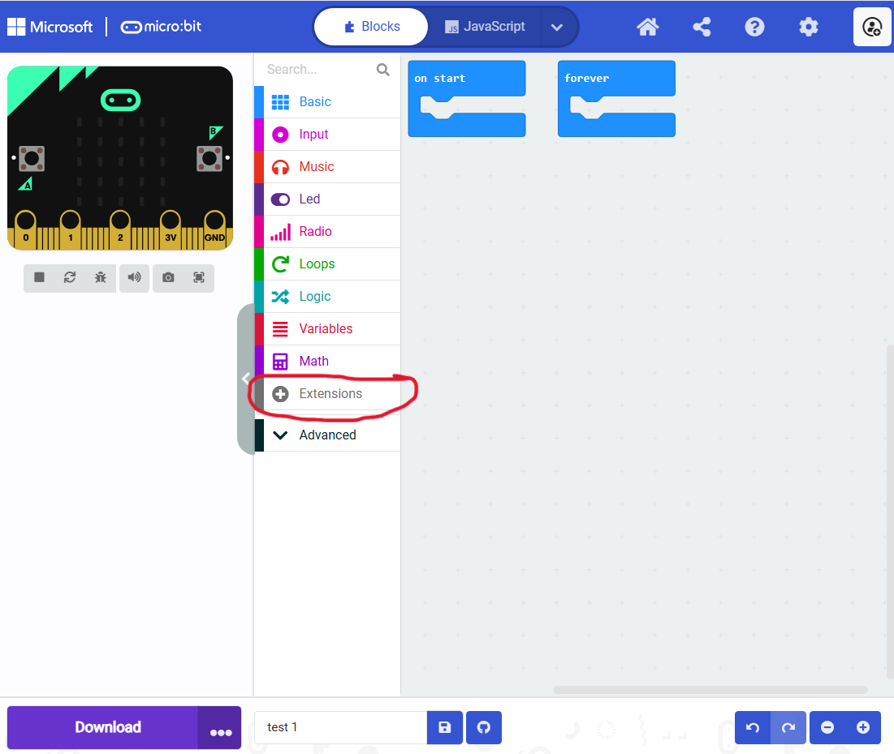
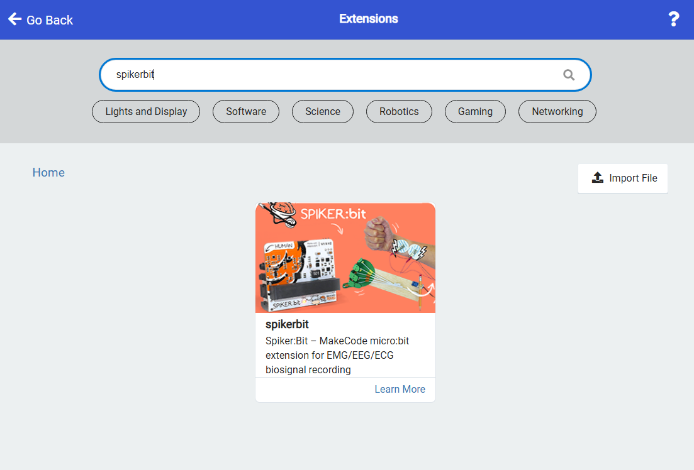
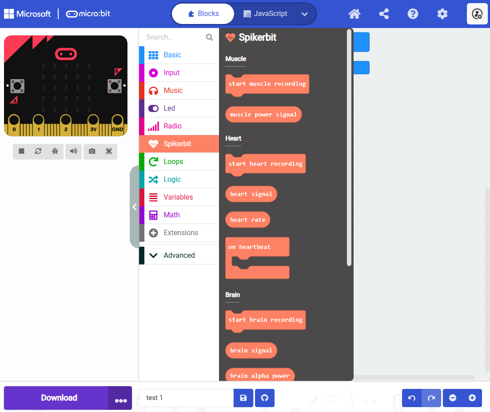

## Installing the Spiker:bit Extension in Microsoft MakeCode ##

We will use the **[Make Code editor](https://makecode.microbit.org/)**, developed by Microsoft for the **micro:bit**, to program our Brain-Machine Interfaces (BMIs). There are other editors available, but we will discuss those and their differences later in **"Getting Started with Python"**. 

Installing the **Spiker:bit** extension in the MakeCode editor is now easier than ever: **Backyard Brains** is officially listed in the MakeCode Extensions Library.
Follow these simple steps to add the **Spiker:bit extension** to your project.

- - -

## Step 1: Open the Extensions Menu

In the MakeCode editor, click on the **"Extensions"** button located in the toolbar.

---

## Step 2: Search for "spikerbit"

In the search bar, type **spikerbit**, then press **Enter**.  
The Spiker:bit extension should appear in the search results.

---

## Step 3: Add the Extension

Click on the **Spiker:bit** extension in the list to install it.  
Once added, it will appear in your editor alongside your other extensions.

---

## Step 4: Start Using Spiker:bit

You can now start using **Spiker:bit** blocks in your MakeCode project to record, control, and experiment with real biosignals.