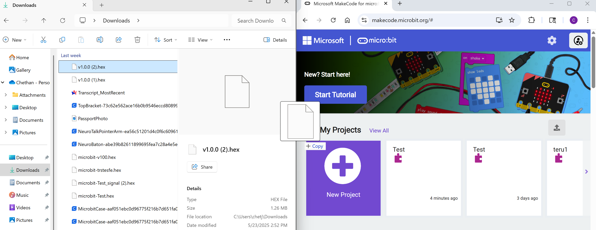
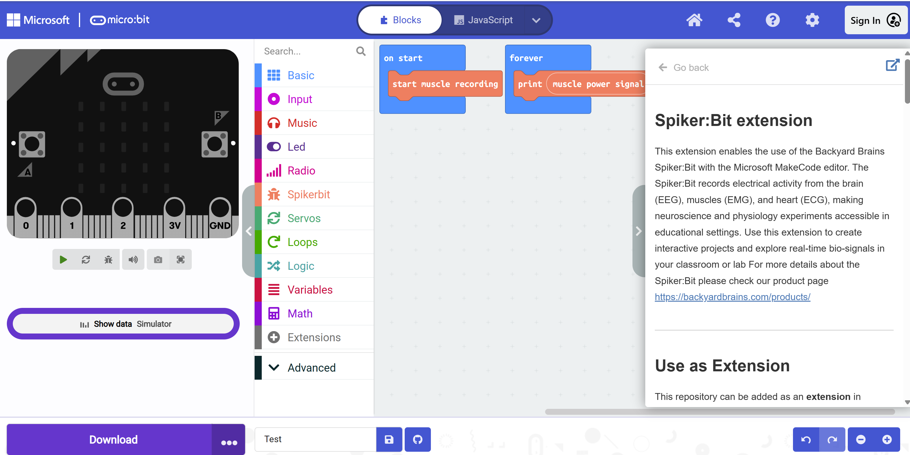

## Software Setup ##
We will use the [Make Code editor](https://makecode.microbit.org/) developed by Microsoft for micro:bit to program our Brain Machine Interfaces. There are a few other editors available, but we'll cover those and their differences in "Getting Started with Python". <!--For now, navigate to the Make Code website and click on the "New Project" button. 
 -->

If you want to access our extension in early, please vist our [download our Hex file via Github](https://github.com/BackyardBrains/pxt-spikerbit/releases). When you've download it, please drag and drop the hex file into micro:bit. A new project will be created, and you will see the micro:bit, code block palette, and a workspace.  You can add blocks to the project by dragging them from the center section to the workspace on the right. 

<!--Soon, our Spikerbit Extension will be available in Make Code. From there, you'll got to Make Code Editor > Extensions > Import and upload the hex file there. 
 -->

Now, you're ready to start programming!

