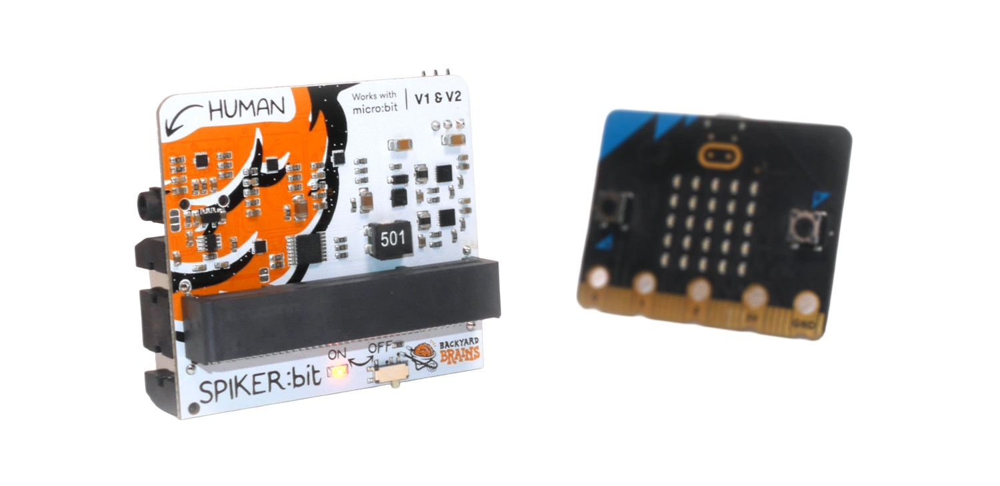
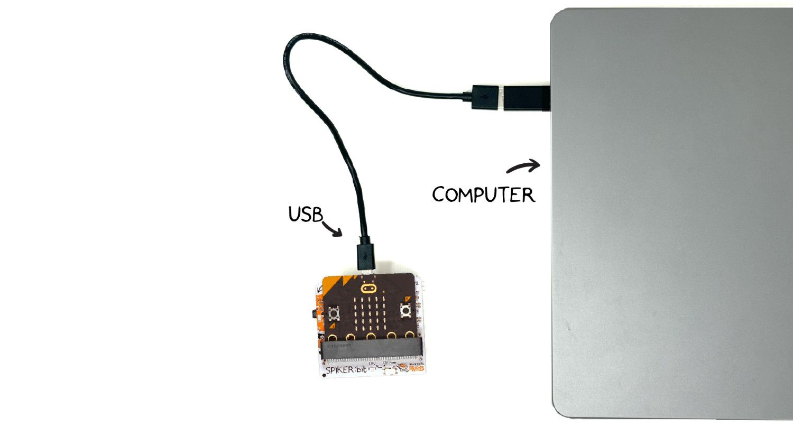
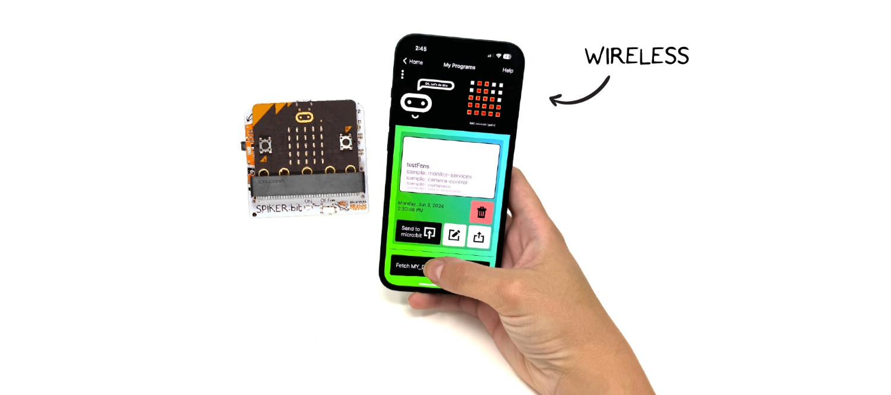

# The Spiker:bit #

## What is the Spiker:bit? ## 
The **Spiker:bit** is an expansion board for the **micro:bit** that allows you to develop DIY Brain Machine Interfaces (BMI), also known as Brain-Computer Interfaces (BCI).
A BMI is a computer that interfaces directly with the electrical signals of your body. The **Spiker:bit** has a port to connect to a **micro:bit** (computer) and a port to record **EMG (muscle)**, **ECG (heart)**, or **EEG (brain)** signals from your body.

## Technical Specifications ## 

| | |
|---|---|
| Power source | 2x AA Battery |
| Recording Modes| EMG, ECG |
|Outputs| 1x Servo, 1x Expansion Port|
|Inputs| 1x [Orange Electrode Cable](https://backyardbrains.com/products/muscle-electrode-cable)|

[Download schematic PDF](./Spikerbit_Schematics.pdf)

---

## Hardware Overview ## 

The **Spiker:bit** is designed for simple interfacing with both **micro:bit V1** and **V2** boards via an **edge connector slot**.

To record **body signals**, use the **orange Backyard Brains electrode cable** with three leads, **two for recording** and **one for ground**.

Software manages **signal type selection**, allowing you to toggle between **EMG (muscle)**, **ECG (heart)**, or **EEG (brain)** modes **without needing physical switches**.

---

### **Additional hardware components:**

- **Servo output** on **PIN 0** for actuator control  
- **Expansion port** located on the underside, exposing **GPIO pins** for prototyping and higher-level integrations  
-  **[Grove connectors](https://wiki.seeedstudio.com/Grove_System/)** (digital, serial, and analog) for quickly adding more **sensors** and **modules** to your experiments

## Pin Out ##

---

## Getting Started ##

To begin using your **Spiker:bit**, gather the following materials:

- 3× BYB Large Muscle Electrodes  
- 1× BYB Orange Electrode Cable  
- 1× Spiker:bit  
- 1× micro:bit  

### Step 1: Connect the micro:bit

Insert the **micro:bit** into the front slot on the **Spiker:bit**. Make sure the LEDs on the micro:bit are facing outward.Then, connect the **orange electrode cable** to the electrode port on the side of the **Spiker:bit**.

### Step 2: Power and Program
Connect the **USB cable** from your computer to the **micro:bit** to power it and upload your code.  

Alternatively, you can program the micro:bit **wirelessly** using the micro:bit app, available on the App Store or Google Play.

---

## Experiments and Tutorials
To get started, you'll first need to install the **Spiker:bit Extension**. 
Here's how:

Follow the official instructions to install the Spiker:bit extension on you **[Make Code editor](https://makecode.microbit.org/)**:
- [Spiker:bit Extension Setup](https://docs.backyardbrains.com/neuroengineering/spikerbit/extension).

Once you have the extension installed, you’re all set to begin programming your **Spiker:bit!** You can dive into our tutorials to explore both **Block Programming** and **Python**:

Explore our tutorials to learn both **Block Programming** and **Python**: 
- [Getting Started with Block Programming](./block/index.md) or
- [Getting Started with Python](./python/index.md).

To see how this can be applied in a real-world project, check out our [DIY Hand Neuroprosthetic](./projects/neuro-hand/index.md) experiment.
