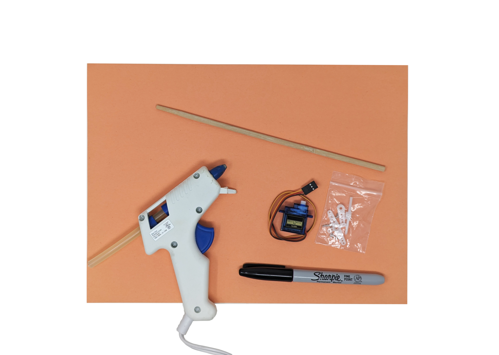
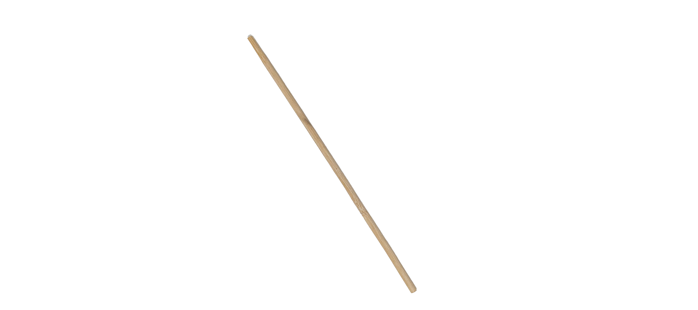
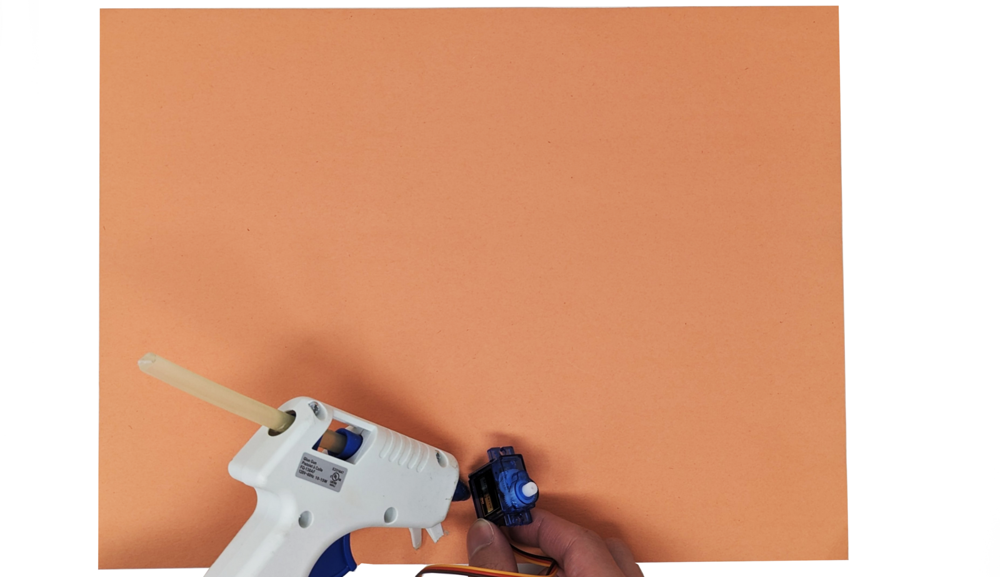
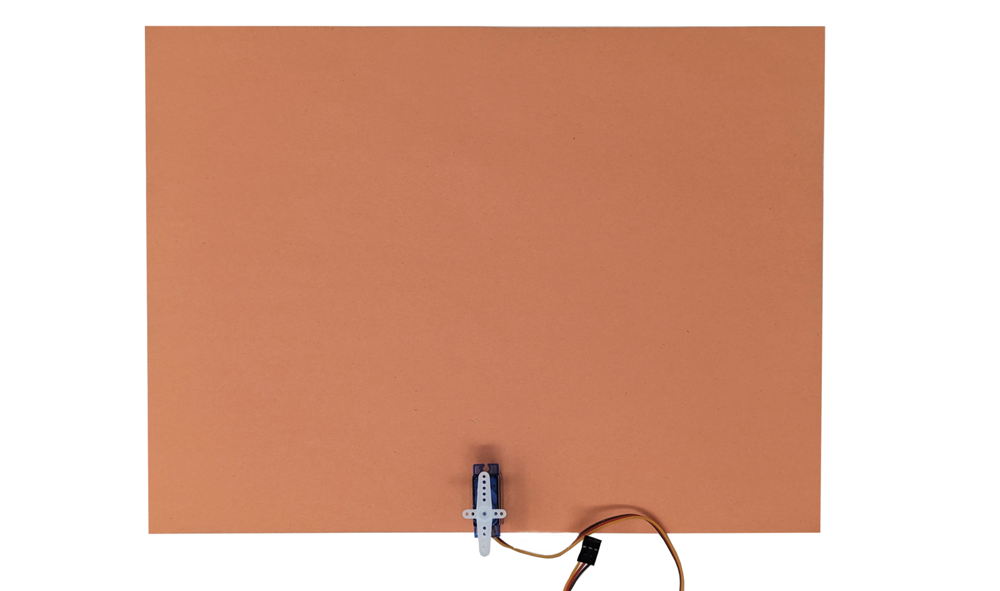
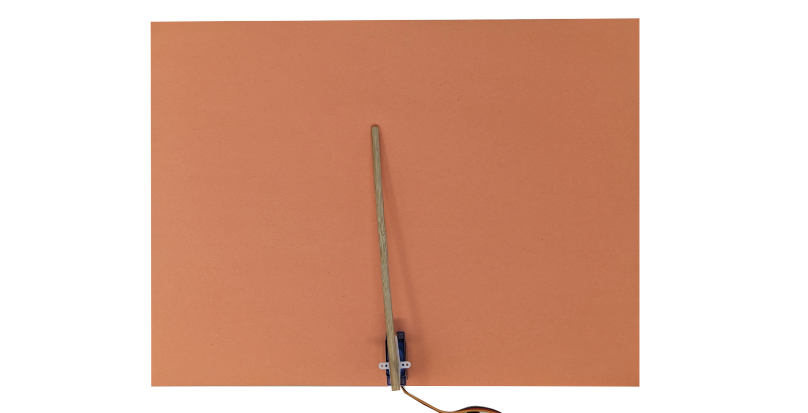
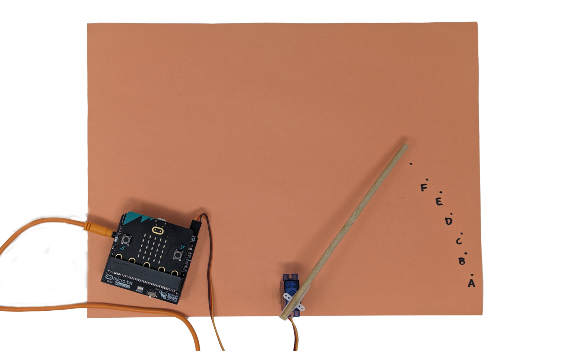
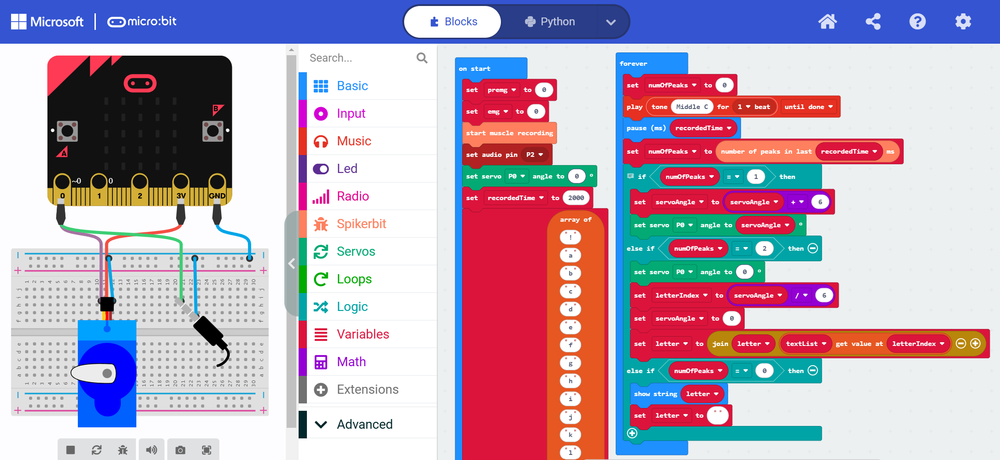
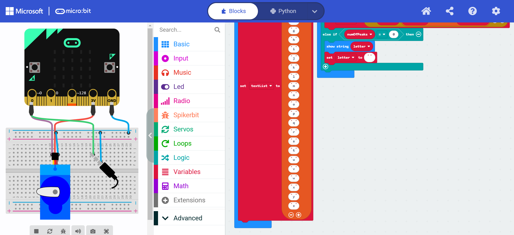

# The MyoTyper #


|     |       |
|--------------|--------------
| Inventor     | Lana Novicic
| micro:bit IDE     | MakeCode Editor
| Best Location     | Classroom   

#### Difficulty ####

|     |       |
|--------------|--------------
| Hardware     | Easy           
| Software     | Medium


#### Special Requirement ####
|     |       |
|--------------|--------------
| SG90 Micro Servo   | Required
| Glue Gun | Recommended

## Project Overview ##
Myotyper is a keyboard that uses EMG technology. Write only by flexing your muscles! It
could be hooked up to your leg so you could write without using your arms.

## Build Instructions ##

### Materials ###


- 1x spiker:bit kit (spiker:bit, 3x electrodes, and 1x orange cable)
- 1x micro:bit
- 1x servo kit
- 1x glue gun (or tape)
- 1x colored paper
- 1x pen
- 1x clock hand (wood stick)

### 1. Choosing strew material ###


Choose something you will use a clock hand. It could be a straw, part of a three
branch or you can 3D print it! (just make sure it&#39;s lightweight).

### 2. Glue servo to paper ###


Take a sheet of colored paper and servo motor. Glue the motor to the paper as shown
in the picture.

### 3. Attach attachment to servo ###


Grab attachment from the bag came with servo kit (any one of them is okay to use). 
Then attach it on top of the servo. No need to screw.

### 4. Glue clock hand ###


Place the attachment onto servo. Then, glue the clock hand (wood stick) to the 
servo hat to align it with the servo motor attachment.

### 5. Write letter ##


Write the code and come back when you're done. Flex your muscles once to move the
clock hand and simultaneously write the letters as you move it.

## Code ##

<!-- 1. Set the threshold to 450. Make a variable (here: a) that will count the times the
threshold was passed. By setting the variable time to millis we marked the beginning
of a time frame. You can also add a play sound block and set it to beep every 2
seconds, to know when to move.
2. Add the while loop and set it like in the code. This allows us to make a time period of
2 seconds that will keep repeating forever. Set the emg to analog read pin 0 (reading
emg from electrodes). the variable a is set to change by 1 only when the EMG has
passed the threshold, but the previous EMG hasn’t.
3. Next, tell the program to move the clock hand to the starting point “on start”. Then make a list and set it to an array of letters. Make
sure you leave the first spot empty (or add some sign).
4. Now we have to assign a role to a different number of muscle contractions. If the
muscle is contracted once the clock hand will move by 6 degrees. We add the
variable _1click that will increase by 6 every time the clock hand moves.
5. If the muscle is contracted twice the clock hand will move to the beginning. The
variable _2click will equal the number of movements (var _1click / 6). Now we just
find the letter that has the same value in the array and add it to the variable letter.
6. Lastly we set that if the variable a remains 0 within the timeframe the micro:bit will
display the words we wrote. -->

Below is the completed code in micro:bit.

import Tabs from '@theme/Tabs';
import TabItem from '@theme/TabItem';

<Tabs>
  <TabItem value="Block" label="Block Code">

  

  

  </TabItem>

  <TabItem value="Python" label="Python" default>

  ```py title="MyoTyper"
  letter = ""
  letterIndex = 0
  servoAngle = 0
  numOfPeaks = 0
  premg = 0
  emg = 0
  spikerbit.start_muscle_recording()
  pins.set_audio_pin(DigitalPin.P2)
  servos.P0.set_angle(0)
  recordedTime = 2000
  textList = ["!",
      "a",
      "b",
      "c",
      "d",
      "e",
      "f",
      "g",
      "h",
      "i",
      "j",
      "k",
      "l",
      "m",
      "n",
      "o",
      "p",
      "q",
      "r",
      "s",
      "t",
      "u",
      "v",
      "w",
      "x",
      "y",
      "z"]

  def on_forever():
      global numOfPeaks, servoAngle, letterIndex, letter
      numOfPeaks = 0
      music.play(music.tone_playable(262, music.beat(BeatFraction.WHOLE)),
          music.PlaybackMode.UNTIL_DONE)
      basic.pause(recordedTime)
      numOfPeaks = spikerbit.num_peaks_in_last(recordedTime)
      # 1. move up
      # 2. select
      # 0. show
      if numOfPeaks == 1:
          servoAngle = servoAngle + 6
          servos.P0.set_angle(servoAngle)
      elif numOfPeaks == 2:
          servos.P0.set_angle(0)
          letterIndex = servoAngle / 6
          servoAngle = 0
          letter = "" + letter + textList[letterIndex]
      elif numOfPeaks == 0:
          basic.show_string(letter)
          letter = ""
  basic.forever(on_forever)

  ```
  </TabItem>

  <TabItem value="Js" label="Js">

  ```py title="MyoTyper"
  let letter = ""
  let letterIndex = 0
  let servoAngle = 0
  let numOfPeaks = 0
  let premg = 0
  let emg = 0
  spikerbit.startMuscleRecording()
  pins.setAudioPin(DigitalPin.P2)
  servos.P0.setAngle(0)
  let recordedTime = 2000
  let textList = ["!", "a", "b", "c", "d", "e", "f", "g", "h", "i", "j", "k", "l", "m", "n", "o", "p", "q", "r", "s", "t", "u", "v", "w", "x", "y", "z"]
  basic.forever(function on_forever() {
      
      numOfPeaks = 0
      music.play(music.tonePlayable(262, music.beat(BeatFraction.Whole)), music.PlaybackMode.UntilDone)
      basic.pause(recordedTime)
      numOfPeaks = spikerbit.numPeaksInLast(recordedTime)
      //  1. move up
      //  2. select
      //  0. show
      if (numOfPeaks == 1) {
          servoAngle = servoAngle + 6
          servos.P0.setAngle(servoAngle)
      } else if (numOfPeaks == 2) {
          servos.P0.setAngle(0)
          letterIndex = servoAngle / 6
          servoAngle = 0
          letter = "" + letter + textList[letterIndex]
      } else if (numOfPeaks == 0) {
          basic.showString(letter)
          letter = ""
      }
      
  })

  ```
  </TabItem>
</Tabs>

## Operating Instructions ##
- Plug the motor cable into the Spiker:bit. Stick the electrodes to your arm
and connect them using the orange cable.
- Download the code onto the micro:bit and start it.
- Relax your arm and squeeze your muscles after every beep to change the letter.
- When you reach the letter you want to select squeeze twice. After each letter is
selected the clock hand will automatically go back to the beginning.
- To write out the word just relax your hand and wait a few seconds and the word
should appear on the micro:bit.

:::tip
- It takes a bit of time to get used to it but the beat helps in catching the rhythm
- You can also change/adjust the number of muscle contractions for different functions
however you like
