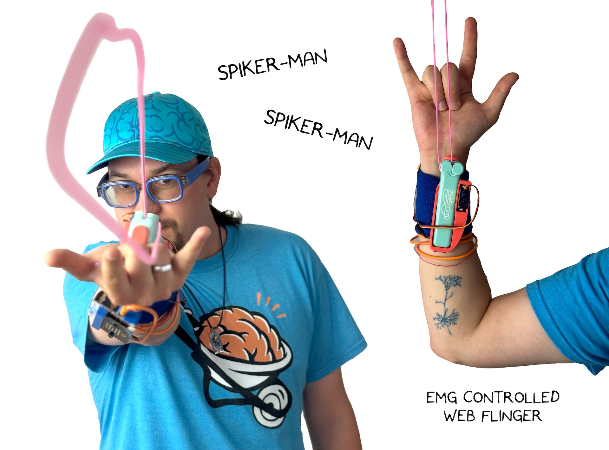
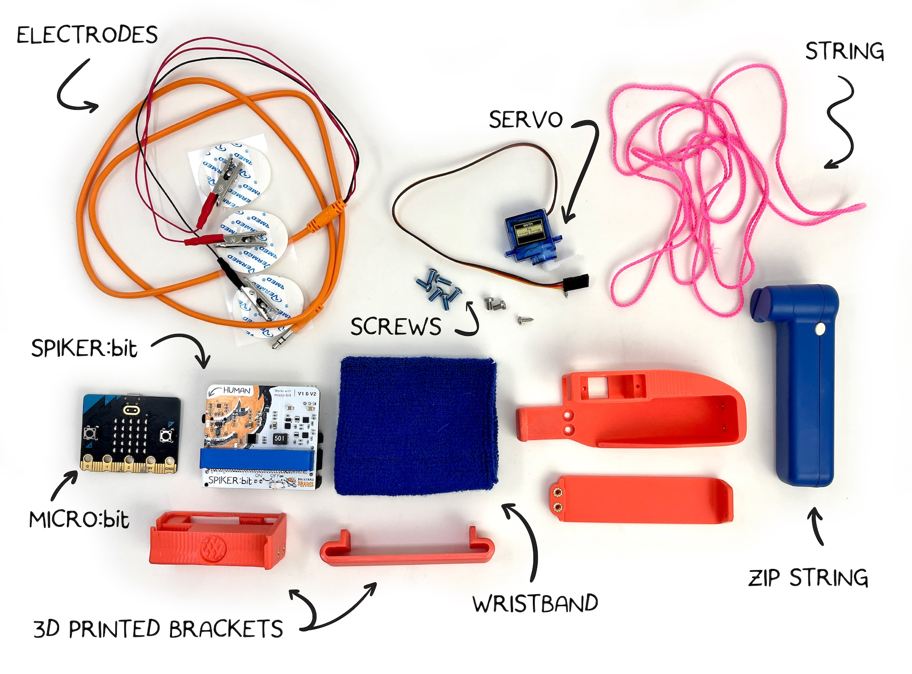
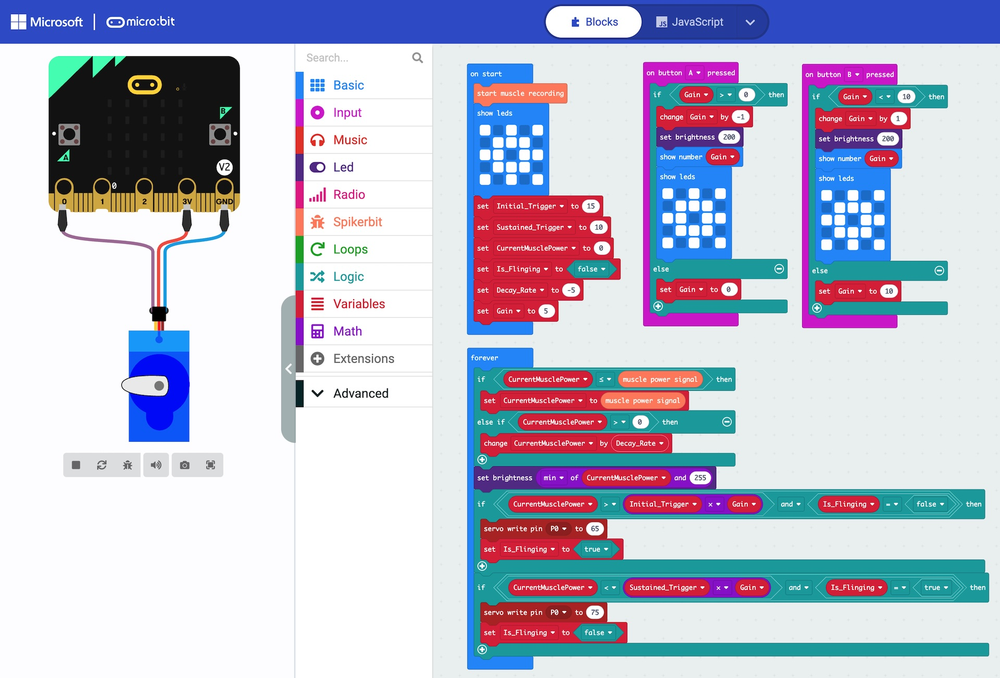
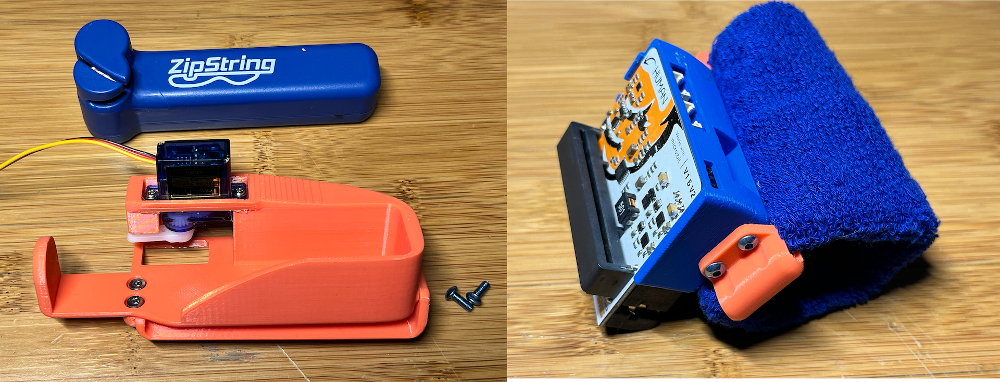
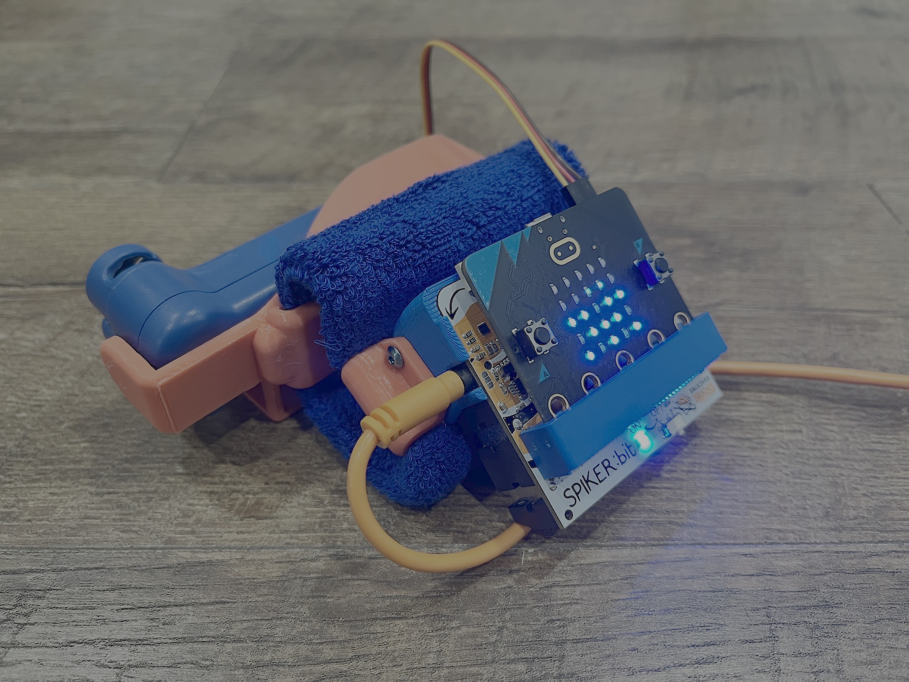
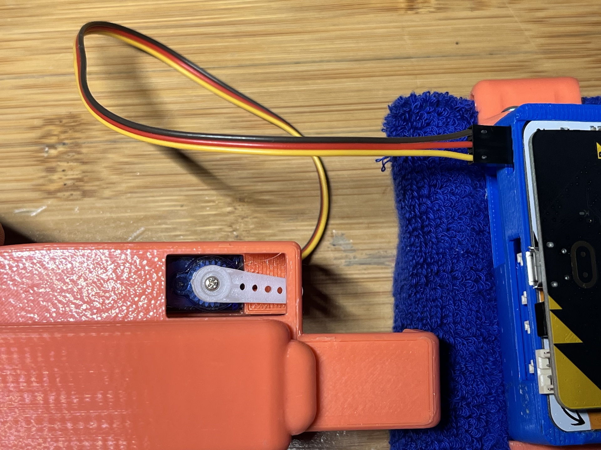

# Spiker-Man Web Flinger # 

import Tabs from '@theme/Tabs';
import TabItem from '@theme/TabItem';


*"Spiker-Man, Spiker-Man, does whatever a Spiker-Man can"*

Make your very own string-slinging device that shares startling similarities to a certain superhero!
|     |       |
|--------------|--------------
| Inventor     | Alex Hatch & Chethan Magnan          
| micro:bit IDE     | MakeCode / MicroPython
| Best Location     | Makerspace 

# 1. Materials Needed #
Pick which materials you'd like to use and order them directly, from Amazon, or your distributor of choice.

- Zip-String original: [we used this one](https://zipstring.com/products/zipstring) 
- Micro:Bit and Spiker:bit
- EMG Signal Cable with 3 Electrodes
- Wristband
- 3D printed Parts or a DIY enclosure



**Optional**
- 8x Heat-Set M3 Nuts
- 8x M3x8 Screws

3D-printed parts have both versions for heat setting and bolting on the wristband holders, or options with no hardware that may be less secure.

# 2. Code #
This project can be made much simpler, but we added logic to make the project more reliable.

On start, we initialize the muscle input, set the display to a web, and set up some variables.
- Initial Trigger: a value that must be overcome to start web flinging
- Sustained Trigger: lower than the initial trigger, the muscle must be relaxed below this point to stop the web
- Current Muscle Power: set to 0 on startup
- is Flinging: set to false on startup
- Decay Rate: how quickly the signal from your muscle will drop! larger numbers make it easier to sustain a web fling!
- Gain: an adjustable value to make the web flinger more or less sensitive.

In the main forever code block, we run through the logic. The first IF statements set up our fast attack, but slow decay. if our tracked Current Muscle Power signal is below the strength of our flex, we update it to match, but if our flex is weaker than the tracked Current Muscle Power signal, then we only allow it to decay slowly using the Decay Rate constant. Tweaking the Decay Rate in our on start routine will make it faster or slower to release the web flingers button.

We control the brightness of the LED screen to match our muscle activity, capping this at the maximum brightness of 255.

The next main code block in our forever loop controls the servo that pushes the button on the Zip-String! We first check to see if our tracked Current Muscle Signal is greater than the Initial Trigger value. if it is, and we are not currently flinging our web, we send a single command to set the servo angle to hit the button. 

You may need to adjust the servo angles for your particular setup to be successful in pressing, and releasing the button!

When our tracked Current Muscle Signal is below the Sustained Trigger value, we send a single command to the servo to release the Zip-String button. 

when you press the A and B buttons, you can increase or decrease how sensitive Spiker-man is to mucle signals. press B on the microbit to increment the threshold gain, making it harder to trigger our web flinger, and press A to make it easier. 

<Tabs>
  <TabItem value="BlockCode" label="Block Code" default>

  

  </TabItem>

  <TabItem value="Java" label="Java" >

  ```java title="Spiker-Man Controller"
  input.onButtonPressed(Button.A, function on_button_pressed_a() {
    
    if (Gain > 0) {
        Gain += -1
        led.setBrightness(200)
        basic.showNumber(Gain)
        basic.showLeds(`
            # . # . #
            . # # # .
            # # . # #
            . # # # .
            # . # . #
            `)
    } else {
        Gain = 0
    }
    
})
input.onButtonPressed(Button.B, function on_button_pressed_b() {
    
    if (Gain < 10) {
        Gain += 1
        led.setBrightness(200)
        basic.showNumber(Gain)
        basic.showLeds(`
            # . # . #
            . # # # .
            # # . # #
            . # # # .
            # . # . #
            `)
    } else {
        Gain = 10
    }
    
})
let Gain = 0
spikerbit.startMuscleRecording()
basic.showLeds(`
    # . # . #
    . # # # .
    # # . # #
    . # # # .
    # . # . #
    `)
let Is_Flinging = false
let CurrentMusclePower = 0
let Initial_Trigger = 15
let Sustained_Trigger = 10
let Decay_Rate = -5
Gain = 5
basic.forever(function on_forever() {
    
    if (CurrentMusclePower <= spikerbit.musclePowerSignal()) {
        CurrentMusclePower = spikerbit.musclePowerSignal()
    } else if (CurrentMusclePower > 0) {
        CurrentMusclePower += Decay_Rate
    }
    
    led.setBrightness(Math.min(CurrentMusclePower, 255))
    if (CurrentMusclePower > Initial_Trigger * Gain && Is_Flinging == false) {
        pins.servoWritePin(AnalogPin.P0, 65)
        Is_Flinging = true
    }
    
    if (CurrentMusclePower < Sustained_Trigger * Gain && Is_Flinging == true) {
        pins.servoWritePin(AnalogPin.P0, 75)
        Is_Flinging = false
    }
    
})

  ```
  </TabItem>

  <TabItem value="Python" label="Python" >

  ```py title="Spiker-Man Controller"
  def on_button_pressed_a():
    global Gain
    if Gain > 0:
        Gain += -1
        led.set_brightness(200)
        basic.show_number(Gain)
        basic.show_leds("""
            # . # . #
            . # # # .
            # # . # #
            . # # # .
            # . # . #
            """)
    else:
        Gain = 0
input.on_button_pressed(Button.A, on_button_pressed_a)

def on_button_pressed_b():
    global Gain
    if Gain < 10:
        Gain += 1
        led.set_brightness(200)
        basic.show_number(Gain)
        basic.show_leds("""
            # . # . #
            . # # # .
            # # . # #
            . # # # .
            # . # . #
            """)
    else:
        Gain = 10
input.on_button_pressed(Button.B, on_button_pressed_b)

Gain = 0
spikerbit.start_muscle_recording()
basic.show_leds("""
    # . # . #
    . # # # .
    # # . # #
    . # # # .
    # . # . #
    """)
Is_Flinging = False
CurrentMusclePower = 0
Initial_Trigger = 15
Sustained_Trigger = 10
Decay_Rate = -5
Gain = 5

def on_forever():
    global CurrentMusclePower, Is_Flinging
    if CurrentMusclePower <= spikerbit.muscle_power_signal():
        CurrentMusclePower = spikerbit.muscle_power_signal()
    else:
        if CurrentMusclePower > 0:
            CurrentMusclePower += Decay_Rate
    led.set_brightness(min(CurrentMusclePower, 255))
    if CurrentMusclePower > Initial_Trigger * Gain and Is_Flinging == False:
        pins.servo_write_pin(AnalogPin.P0, 65)
        Is_Flinging = True
    if CurrentMusclePower < Sustained_Trigger * Gain and Is_Flinging == True:
        pins.servo_write_pin(AnalogPin.P0, 75)
        Is_Flinging = False
basic.forever(on_forever)

  ```
  </TabItem>
</Tabs>

# 3. Hardware & Testing #

Make sure you Print out the STL files, customize the source, or create your own mounts from scratch with crafting supplies!

For the featured version, we use heat-press inserts and screws to lock in the accessories, but we recommend the screwless 3D prints here:

No Screws:

1. [Spikerbit Wrist Strap Mount](./SpikerBitWristCageScrewless.stl)  
2. [Zip-String Wrist Mount](./ZipStringCageScrewless.stl)  

Screw Version:

1. [Spikerbit Wrist Strap Mount with Heat-Set Nuts](./SpikerBitWristCageHeatSet.stl) or [Spikerbit Wrist Strap Mount with M3 Screw Holes](./SpikerBitWristCageM3SelfTap.stl)
2. [Spikerbit Wrist Strap Bracket](./SpikerBitWristCageBracket.stl)    
3. [Zip-String Wrist Mount with Heat-Set Nuts](./ZipStringCageHeatSet.stl)  
4. [Zip-String Wrist Mount Bracket with Heat-Set Nuts](./ZipStringCageWristBracket.stl) 

Source CAD:

1. [Spikerbit Wrist Mount Assembly](./SpikerbitCageSource.stp)
2. [Zip-String Wrist Mount Assembly](./ZipStringCageSource.stp)

For the screwless version, simply remove the support materials after printing and feed the wrist-strap through the open areas of the bands, and you are nearly there!

If using heat set inserts, you will need to install these these before assembly.

Putting the pieces into the 3D-printed cases will look like this:



You are now just about ready to rock! First we need to make sure that the servo is positioned properly. Make sure that the servo can rotate in both directions, you will need to modify the two servo angles in the code to match the on and off position for the Zip-String button, and this will require some experimenation of values. Alternatively, you can simply install the servo without the 'horn', power on the microbit with the servo connected and code uploaded, and then install the servo horn in this position:


We recommend testing without the zip string in place first, and adding it in when you are confident. the Zip-String module is held in with friction, so it is all non destructive!

Finally, plug in your electrodes, strap on the gadget, and you are ready to sling webs!


