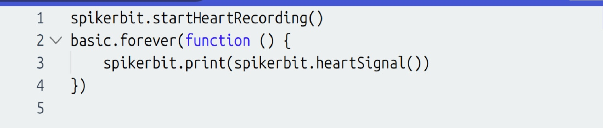
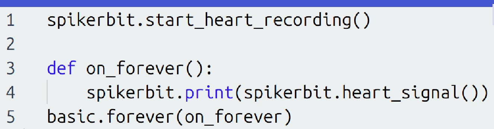
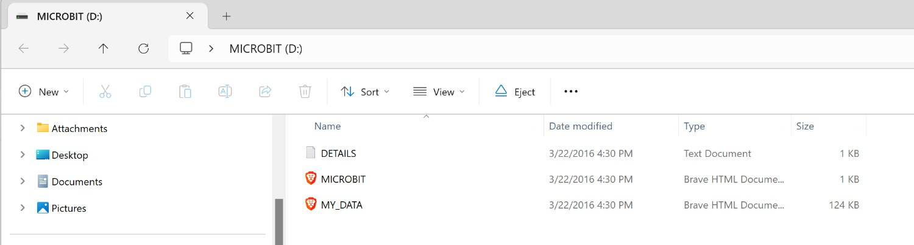
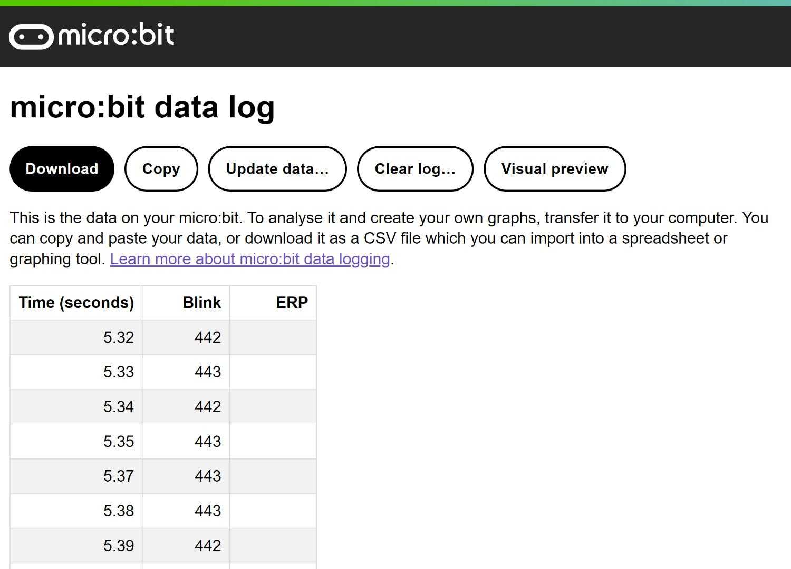
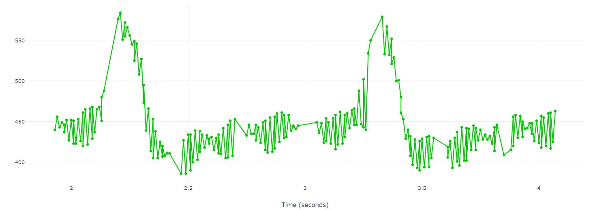

# Text-Based Programming (Python & JavaScript)

## Overview

While [**Blocks**](https://docs.backyardbrains.com/neuroengineering/spikerbit/block) are excellent for starting out, **the Spiker:bit** also supports text-based coding via **MicroPython** and **JavaScript**. These languages are ideal for students ready to move toward professional-level software development and advanced data analysis.

## Choosing Your Editor

[**The MakeCode editor**](https://makecode.microbit.org/#) allows you to toggle between **Blocks**, **JavaScript**, and **Python** using the tabs at the top of the interface. Each offers different advantages depending on whether you want visual feedback or professional-grade coding flexibility.
<div style={{ textAlign: 'center' }}>

</div>
> **Note**: Converting complex text-based code back to the Block editor may not always work correctly and can cause data loss. Always save a separate copy of your text code before switching modes.

|_**Editor**_ | **Makecode**  | **Python** |
| --- | --- | --- |
| _Language_ |Block, Micro Python, JavaScript  | Python  |
| _Pros_ | Better Libraries and documentation<br/>Easier to see other projects from the community<br/>Real time serial or data output| Stronger as a base language<br/>Uses actual Python syntax<br/>Better for long term data analysis  |
| _Cons_ | Odd naming conventions<br/>Heavily constrained by block code  | Limited Libraries<br/>No real time data output   | 

## JavaScript (MakeCode)

**JavaScript** is the underlying language of **MakeCode**. This is the best choice for users who want to see the direct text equivalent of their logic blocks.

<div style={{ textAlign: 'center' }}>

</div>
>(Code snippet showing heart signal recording in JavaScript)

## Python Options

Coding your project in **Python** gives you a choice of editors:

1. [**The MakeCode editor**](https://makecode.microbit.org/#): This editor can toggle between **Block code** and **Python**. This is great for learning the structure and logic of **Python** as you can switch back and forth between your Block Code and **Python**. Changes to one development language will sync to the other. You will also be able to visually see your data inside the same editor in real time. This functionality comes at a slight cost: it does not support a full implementation of **Python**.
<div style={{ textAlign: 'center' }}>
 
</div>
>(Code snippet showing heart signal recording in MakeCode Editor Python)

2. [**BBC micro:bit Python Editor**](https://python.microbit.org/v/3/reference): If you want to use actual Python functions and syntax, you should head to the **BBC micro:bit Python Editor**. This has fewer features but gives you more flexibility.

## Python Editor Example: Read EOG Signal into a Variable

In this example, we will place two recording electrodes over the eye and attempt to record an **Electrooculogram (EOG)**, a measurement of the electrical activity of the eye.


Since **the EOG** signal is sent to Pin 1 on **the micro:bit**, we can read a sample using the following code:

```py title="The Most Basic Python BMI Code"
from microbit import *

# Code in a 'while True:' loop repeats forever
while True:
  EOG =  pin1.read_analog() 
```
>Calling the **read_analog()** method will take a sample of the EOG signal each time; the variable EOG is now reading in that signal on each loop.

## See the EOG Signal ##

A good way to start using *EOG** is to see what the signal looks like. To do this, we will send the data from the micro:bit to the host computer. Add a command that sends the EOG data to the computer over the serial port:

```py title="Python Logging Code for Real Time Viewing"
from microbit import *
import log
log.set_labels('EOG')
# Code in a 'while True:' loop repeats forever
while True:
    EOG =  pin1.read_analog()
    log.add({'EOG':EOG})
```

**The micro:bit** will now function like a hard drive or an SD card: it will save these data values into a **.csv** file into a log. Navigate to **the micro:bit drive** and open the **My data** document. This will then take you to **the micro:bit data log page** which can do basic graphical analysis, interact with the log, and copy the data for more extensive analysis in **Excel** or any other data platform.







## Next Steps

These same principles can be applied to control motors, trigger sounds, or interface with other hardware. For more advanced applications and project ideas, please explore the **Spiker:bit Projects** section of our website.