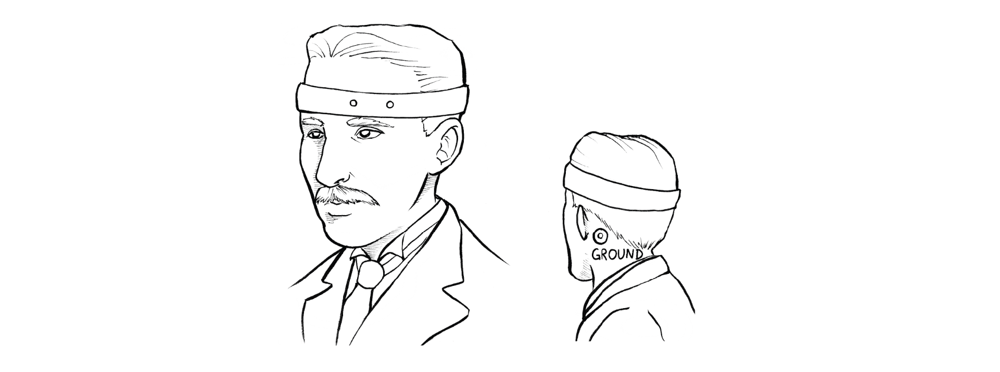

# Getting Started with Spiker:bit Python Programming 

## Overview

Python is a programming language that can be used with the Spiker:bit to easily develop Brain Machine Interfaces. It is a powerful language, easy to learn, and a great way to get started with Spiker:bit.

## Software Set-up 

Coding your project in Python gives you a choice of editors. The first is to use the [Microsoft MakeCode](https://makecode.microbit.org/) editor that can toggle between Block Code and Python. This is great for learning the structure and logic of Python as you can switch back and forth between your Block Code and Python. Changes to one development language will sync to the other. You will also be able to visually see your data inside the same editor in real time. This functionality comes at a slight cost: it does not support a full implementation of Python. So if you want to use actual Python functions and syntax, you should head to the [BBC micro:bit Python Editor](https://python.microbit.org/v/3/ideas). This has fewer features but gives you more flexibility.

|_**Editor**_ | **Makecode**  | Python |
| --- | --- | --- |
| _Language_ |Block, Micro Python, JavaScript  | Python  |
| _Pros_ | Better Libraries and documentation<br/>Easier to see other projects from the community<br/>Real time serial or data output| Stronger as a base language<br/>Uses actual Python syntax<br/>Better for long term data analysis  |
| _Cons_ | Odd naming conventions<br/>Heavily constrained by block code  | Limited Libraries<br/>No real time data output   |

Creating a project here will open with the micro:bit library already imported and the "forever" loop in place.

```py title="Hello Heart!"
from microbit import *

# Code in a 'while True:' loop repeats forever
while True:
  display.show(Image.HEART)
  sleep(1000)
  display.scroll('Hello')
```
You can start by deleting the code inside the while loop so we can add our own instructions. 

## Read EOG Signal into a Variable ## 

In this example, we will place two recording electrodes over the eye and will attempt to record an Electrooculogram (EOG). An EOG is a measurement of the electrical activity of the eye. You can place the two recording electrodes around the eye, and the black ground lead behind the ear.



We will create a variable to store information in your code so you can easily access it. Since the EOG signal is sent to Pin 1 on the micro:bit, we can read in a sample using the following code.

```py title="The Most Basic Python BMI Code"
from microbit import *

# Code in a 'while True:' loop repeats forever
while True:
  EOG =  pin1.read_analog() 
```
Calling the "read_analog()" method will take a sample of the EOG signal each time. Congrats! That's it! The variable *EOG* is now reading in the EOG signal on each loop!

## See the EOG Signal ##

A good way to start using EOG is to see what the signal looks like. To do this, we will send the data from the micro:bit to the host computer. Add a command that sends the EOG data to the computer over the serial port:

```py title="Python Logging Code for Real Time Viewing"
from microbit import *
import log
log.set_labels('EOG')
# Code in a 'while True:' loop repeats forever
while True:
    EOG =  pin1.read_analog()
    log.add({'EOG':EOG})
```

The micro:bit will now function like a hard drive or an SD card: it will save these data values into a .csv file into a log. Navigate to the Micro:bit drive and open the "my data" document. This will then take you to a micro:bit data log page which can do basic graphical analysis, interact with the log, and copy the data for more extensive analysis in Excel or any other data platform.


