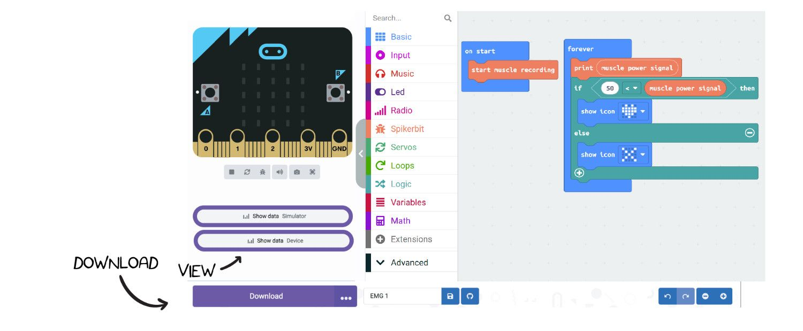
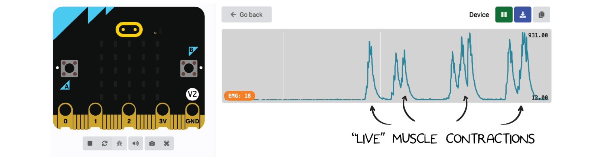
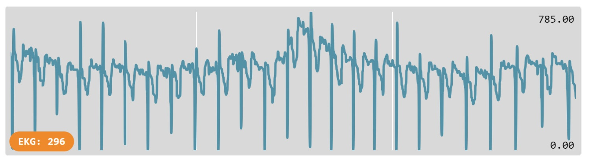

# Getting Started with Spiker:bit Block Programming #

## Overview ##

In this guide, you’ll learn how to use your **Spiker:bit** and **micro:bit** to read **muscle (EMG)** and **heart (ECG/EKG)** signals and display them right on your micro:bit!

**You’ll need:**

- 1x Spiker:bit + 1x micro:bit (inserted into the Spiker:bit front slot)
- 3x BYB Large Muscle Electrodes
- 1x BYB Orange Electrode Cable
- 1x USB Cable

---

##  Reading a Muscle Signal (EMG)

The EMG signal measures the **electrical activity in your muscles**.  
The Spiker:bit automatically creates a variable called **`muscle power signal`** that stores this information so you can use it in your code.

### Step 1: Start the Muscle Recording

1. Open the **MakeCode editor**.  
2. Drag the block **“start muscle recording”** into the **“on start”** block.  
   - This sets up the micro:bit to communicate with the Spiker:bit.  
   - You only need to do this **once per project**.

### Step 2: Add Some Logic

1. From the **Logic** section, drag an **“if else”** block.  
2. Add a **“less than”** operator inside the condition.  
3. Compare the `muscle power signal` to a small number (like **10**) 

> **Note:** The muscle activation threshold (default: 10) can be adjusted based on individual reflex strength, electrodes placements, and muscle choice. Use a lower value for weaker signals and a higher one for stronger contractions.
4. From **Basic**, drag two **“show icon”** blocks:  
   -  Show a heart icon for rest  
   -  Show X icon for flex   

- - -

## Connecting Muscles to Read an EMG Signal ##

Once your Spiker:Bit is powered and ready, it’s time to connect it to a muscle and see your own electrical activity in action!

Connect **two large motor electrodes** along a target muscle, the **forearm** works best for clear, easy-to-control signals. Clip the **two red leads** to these electrodes, and attach the **black ground** to an electrode behind your hand to keep the signal clean.   

Once the program is loaded, open **Show Data** to view your EMG signal in real time. Relaxed muscles stay near **0**, and a firm flex can rise to around **1000**, that’s your muscle’s electrical activity being measured live! 

Use this range to adjust your **activation threshold** (default: **10**), set it lower for weaker signals and higher for stronger contractions. Finding the right value helps your readings stay stable and responsive.  

Now you can use standard **micro:bit code** to make your EMG signal do something fun, play a **sound**, move a **motor**, or trigger **lights** whenever you flex. Your body’s electricity becomes your new **controller**! The possibilities are endless!  

- - -

## Reading a Heart Signal ECG ##

The Spiker:bit can also record ECG signals. This requires a different electrode placement and a minor modification to the code.

### Step 1: Electrode Placement for ECG

A common placement for a simple ECG reading (based on Einthoven's triangle) is:

1.  Ground (Black Clip): Back of the left hand or wrist.
2.  Positive (Red Clip): Inside of the right wrist or forearm.
3.  Negative (Other Red Clip): Inside of the left wrist or forearm.

### Step 2: Update the Code

1. Return to your MakeCode project.
2. In the on start block, replace start muscle recording with the **`start heart recording`** (ECG) block.
3. In the forever loop, replace the muscle power signal variable with the heartbeat signal (ECG) variable.
4. Download this new program to your micro:bit.

Open the "Show Data (Device)" graph. With the electrodes properly placed, you should now see a regular, rhythmic spike corresponding to your heartbeat.

Here's what the signal will look like once you're successful:

> **Troubleshooting Note:** If the spikes appear **inverted (pointing down)**, the **signal polarity** is reversed.  
> To fix this, **swap the two red alligator clips** on your wrists.

## Note on  MicroPython and JavaScript Editors

The MakeCode editor also supports text-based coding. You can toggle between 
**Blocks**, **JavaScript**, and **MicroPython** using the tabs at the top of the editor.

For this demo project, the block code converted into MicroPython looks like this:

and JavaScript looks like this:

> **Caution:** Converting complex **text-based code** (JavaScript or MicroPython) back to the **Block editor** may not always work correctly and can cause **data loss**.  
> It’s best to **save a separate copy** of your text-based code before switching modes.

# Next Steps #

This guide covers the fundamentals of reading EMG and ECG signals. These same principles can be applied to control motors, trigger sounds, or interface with other hardware. For more advanced applications and project ideas, please explore the projects section of our website.